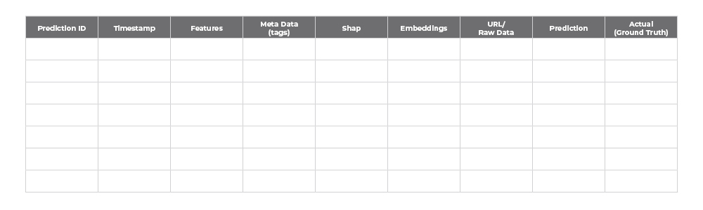
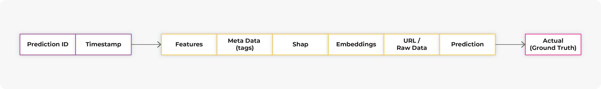
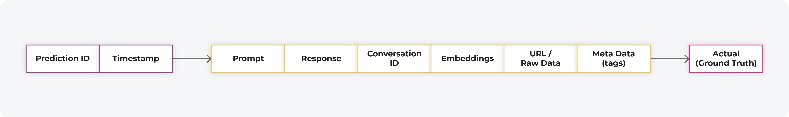
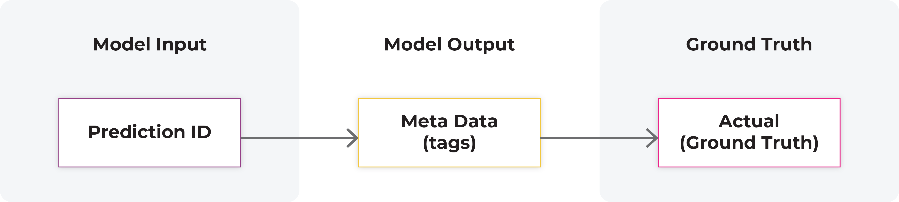
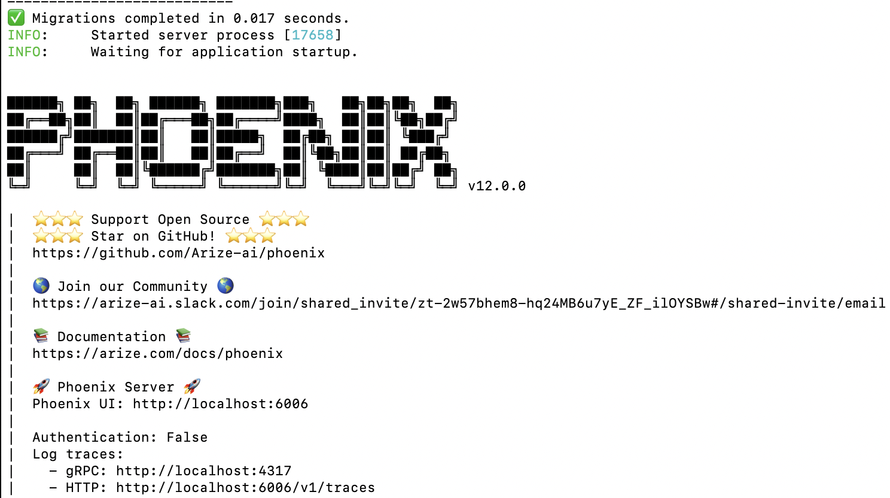

# Open Inference

## Overview

The open inference data format is designed to provide an open interoperable data format for model inference files. Our goal is for modern ML systems, such as model servers and ML Observability platforms, to interface with each other using a common data format.\

The goal of this is to define a specification for production inference logs that can be used on top of many file formats including Parquet, Avro, CSV and JSON. It will also support future formats such as Lance.

<figure><figcaption>
<strong>Inference Table in Inference Store</strong>
</figcaption></figure>

An inference store is a common approach to store model inferences, normally stored in a data lake or data warehouse.&#x20;

### Model Types Covered

**NLP**

* Text Generative - Prompt and Response
* Text Classification
*   NER Span Categorization

    ****

**Tabular:**

* Regression
* Classification&#x20;
* Classification + Score
* Multi-Classification
* Ranking&#x20;
* Multi-Output/Label
* Time Series Forecasting

**CV**

* Classification
* Bounding Box
*   Segmentation

### Inferences Overview&#x20;

In an inference store the prediction ID is a unique identifier for a model prediction event. The prediction ID defines the inputs to the model, model outputs, latently linked ground truth (actuals), meta data (tags) and model internals (embeddings and/or SHAP).&#x20;

In this section we will review a flat (non nested structure) prediction event, the following sections will cover how to handle nested structures.

<figure><figcaption>
Prediction Inference Event Data
</figcaption></figure>

<figure><figcaption>
LLM Inference Data
</figcaption></figure>

A prediction event can represent a prompt response pair for LLMs where the conversation ID maintains the thread of conversation.&#x20;

\

<figure><figcaption>
Core Model Inference Data
</figcaption></figure>

The core components of an inference event are the:

* Model input (features/prompt)
* Model output (prediction/response)
* Ground truth (actuals or latent actuals)
* Model ID
* Model Version
* Environment&#x20;
* Conversation ID

Additional data that may be contained include:

* Metadata&#x20;
* SHAP values&#x20;
* Embeddings&#x20;
* Raw links to data&#x20;
* Bounding boxes

The fundamental storage unit in an inference store is an inference event. These events are stored in groups that are logically separated by model ID, model version and environment.

<figure><figcaption>
Model Data and Version
</figcaption></figure>

Environment describes where the model is running for example we use environments of training, validation/test and production to describe different places you run a model.&#x20;

\
The production environment is commonly a streaming-like environment. It is streaming in the sense that a production dataset has no beginning or end. The data can be added to it continuously. In most production use cases data is added in small mini batches or real time event-by-event.

The training and validation environments are commonly used to send data in batches. These batches define a group of data for analysis purposes. It’s common in validation/test and training to have the timestamp be optional. &#x20;

**Note**: historical backtesting data comparisons on time series data can require non-runtime settings for timestamp use for training and validation

The model ID is a unique human readable identifier for a model within a workspace - it completely separates the model data between logical instances.&#x20;

The model version is a logical separator for metrics and analysis used to look at different builds of a model. A model version can capture common changes such as weight updates and feature additions.

### Ground Truth&#x20;

Unlike Infra observability, the inference store needs some mutability. There needs to be some way in which ground truth is added or updated for a prediction event.&#x20;

Ground truth is required in the data in order to analyze performance metrics such as precision, recall, AUC, LogLoss, and Accuracy.

Latent ground truth data may need to be “joined” to a prediction ID to enable performance visualization. In Phoenix, the library requires ground truth to be pre-joined to prediction data. In an ML Observability system such as Arize the joining of ground truth is typically done by the system itself.

<figure><figcaption>
Latent Ground Truth
</figcaption></figure>

The above image shows a common use case in ML Observability in which latent ground truth is received by a system and linked back to the original prediction based on a prediction ID.

<figure><figcaption>
Latent MetaData (Tags)
</figcaption></figure>

In addition to ground truth, latent metadata is also required to be linked to a prediction ID. Latent metadata can be critical to analyze model results using additional data tags linked to the original prediction ID.

Examples of Metadata (Tags):

* Loan default amount&#x20;
* Loan status&#x20;
* Revenue from conversion or click
* Server region&#x20;

### Nested Predictions (Flattening Hierarchy)

Images bounding box, NLP NER, and Image segmentation

The above picture shows how a nested set of detections can occur for a single image in the prediction body with bounding boxes within the image itself.&#x20;

A model may have multiple inputs with different embeddings and images for each generating a prediction class. An example might be an insurance claim event with multiple images and a single prediction estimate for the claim.

The above prediction shows hierarchical data. The current version of Phoenix is designed to ingest a flat structure so teams will need to flatten the above hierarchy. An example of flattening is below.

<figure><figcaption>
Hierarchical Data Flattened
</figcaption></figure>

The example above shows an exploded representation of the hierarchical data. \<todo fix, once team reviews approach internally>

### Examples: Supported Schemas&#x20;

#### NLP - LLM Generative/Summarization/Translation

#### NLP - Classification   &#x20;

#### Regression

<figure><figcaption></figcaption></figure>

#### Classification

<figure><figcaption></figcaption></figure>

#### &#x20;Classification + Score

#### Ranking

<figure><figcaption></figcaption></figure>

#### CV - Classification&#x20;

####

