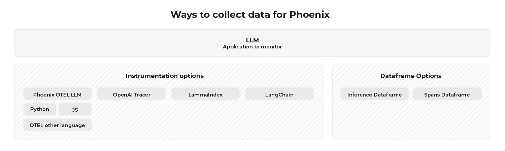
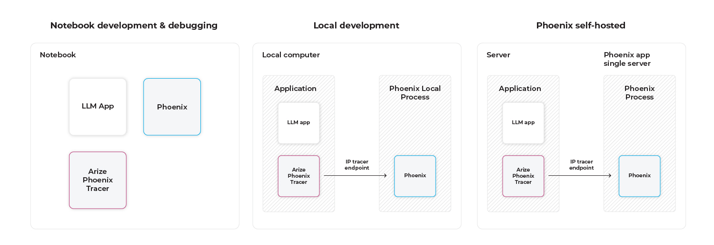

# Deploying Phoenix

Phoenix's notebook-first approach to observability makes it a great tool to utilize during experimentation and pre-production. However at some point you are going to want to ship your application to production and continue to monitor your application as it runs.&#x20;

Phoenix is made up of two components that can be deployed independently:

* **Trace Instrumentation**: These are a set of plugins that can be added to your application's startup process. These plugins (known as instrumentations) automatically collect spans for your application and export them for collection and visualization. For phoenix, all the instrumentors are managed via a single repository called [OpenInference](https://github.com/Arize-ai/openinference)
* **Trace Collector (e.g. the Phoenix Server)**: The Phoenix server acts as a trace collector and application that helps you troubleshoot your application in real time.

In order to run Phoenix tracing in production, you will have to follow these following steps:\


1. Convert your notebook application to run on a server
2. Add [OpenInference](https://github.com/Arize-ai/openinference) Instrumentation to your server&#x20;
3. Run the Phoenix server
4. Point your tracing instrumentation to the phoenix server

<figure><figcaption></figcaption></figure>

The above instrumentation options determine how the data is collected from the LLM tracers.&#x20;

<figure><figcaption></figcaption></figure>

* **Notebook** - Runs locally from a Colab, Jupyter, SageMaker, or Databricks notebook. Data is collected using the tracer and is passed through in memory objects so no need for IP configuration. &#x20;
* **Local Computer** - Runs locally on computer and connects to LLM tracer through IP socket.
* **Self Hosted & Cloud** - The tracer and the Phoenix server run in different locations and connect through IP socket.

_**Tracer:**_

The endpoint can be set through either an environment variable:


```python
import os

#On the Phoenix Tracer Set Collecter Endpoint to App Server of Phoenix
os.envoron["PHOENIX_COLLECTOR_ENDPOINT"] = "https://my-phoenix.io"// 
```


The endpoint can also be set through code:

```python
from phoenix.trace.tracer import Tracer
from phoenix.trace.exporter import HttpExporter
from phoenix.trace.openai.instrumentor import OpenAIInstrumentor


tracer = Tracer(exporter=HttpExporter(endpoint="https://my-phoenix.io"))
OpenAIInstrumentor(tracer).instrument()
```


Phoenix data is currently not persisted. Phoenix will support persisted data in all deployment options "very" shortly.


_**Application Server:**_

The application server is started by (need phoenix in your python path):

```python
python3 -m phoenix.server.main serve
```

```
🌍 To view the Phoenix app in your browser, visit https://<URL>:port
📺 To view the Phoenix app in a notebook, run `px.active_session().view()`
📖 For more information on how to use Phoenix, check out https://docs.arize.com/phoenix
```

Use the "https://\<URL>:port" as the endpoint variable
