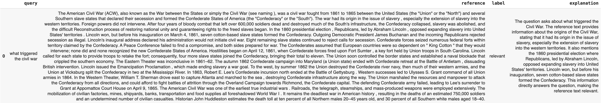

# Evals With Explanations


See "Classifications with Explanations Section"


It can be hard to understand in many cases why an LLM responds in a specific way. The explanation feature of Phoneix allows you to get a Eval output and an explanation from the LLM at the same time. We have found this incredibly useful for debugging LLM Evals.

<pre class="language-python"><code class="lang-python">from phoenix.experimental.evals import (
    RAG_RELEVANCY_PROMPT_RAILS_MAP,
    RAG_RELEVANCY_PROMPT_TEMPLATE,
    OpenAIModel,
    download_benchmark_dataset,
    llm_classify,
)

model = OpenAIModel(
    model_name="gpt-4",
    temperature=0.0,
)

#The rails is used to hold the output to specific values based on the template
#It will remove text such as ",,," or "..."
#Will ensure the binary value expected from the template is returned
rails = list(RAG_RELEVANCY_PROMPT_RAILS_MAP.values())
relevance_classifications = llm_classify(
    dataframe=df,
    template=RAG_RELEVANCY_PROMPT_TEMPLATE,
    model=model,
    rails=rails,
    <a data-footnote-ref href="#user-content-fn-1">provide_explanation=True</a>
)
#relevance_classifications is a Dataframe with columns 'label' and 'explanation'
</code></pre>

The flag above can be set with any of the templates or your own custom templates. The example below is from a relevance Evaluation.&#x20;

<figure><figcaption></figcaption></figure>

[^1]: set to get an explanation out
