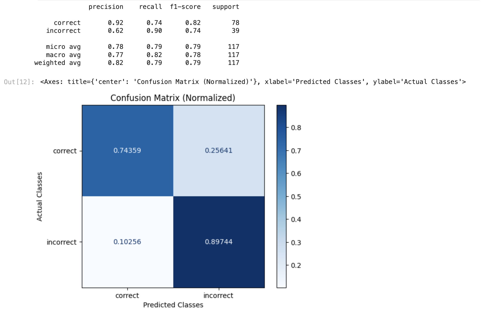
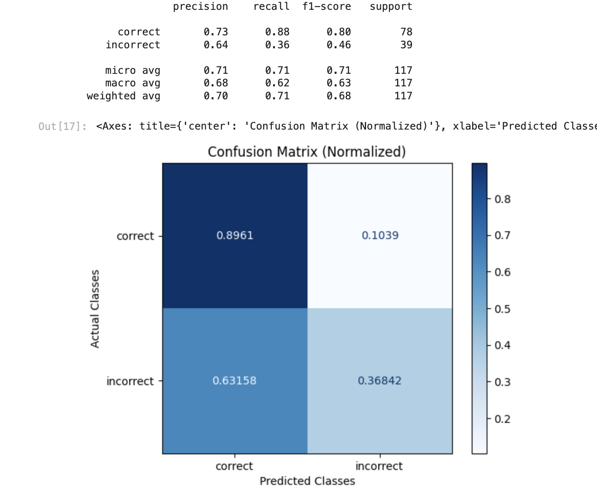

# AI vs Human (Groundtruth)



A workflow we see for high quality RAG deployments is generating a golden dataset of questions and a high quality set of answers. These can be in the range of 100-200 but provide a strong check for the AI generated answers. This Eval checks that the human ground truth matches the AI generated answer. Its designed to catch missing data in "half" answers and differences of substance.

#### Example Human vs AI on Arize Docs:

_**Question:**_

What Evals are supported for LLMs on generative models?

_**Human:**_

Arize supports a suite of Evals available from the Phoenix Evals library, they include both pre-tested Evals and the ability to configure cusotm Evals. Some of the pre-tested LLM Evals are listed below:

Retrieval Relevance, Question and Answer, Toxicity, Human Groundtruth vs AI, Citation Reference Link Relevancy, Code Readability, Code Execution, Hallucination Detection and Summarizaiton

**AI:**

Arize supports LLM Evals.

**Eval:**

Incorrect

**Explanation of Eval:**

The AI answer is very brief and lacks the specific details that are present in the human ground truth answer. While the AI answer is not incorrect in stating that Arize supports LLM Evals, it fails to mention the specific types of Evals that are supported, such as Retrieval Relevance, Question and Answer, Toxicity, Human Groundtruth vs AI, Citation Reference Link Relevancy, Code Readability, Hallucination Detection, and Summarization. Therefore, the AI answer does not fully capture the substance of the human answer.

Overview of template:

```python
print(HUMAN_VS_AI_PROMPT_TEMPLATE)

You are comparing a human ground truth answer from an expert to an answer from an AI model.
Your goal is to determine if the AI answer correctly matches, in substance, the human answer.
    [BEGIN DATA]
    ************
    [Question]: {question}
    ************
    [Human Ground Truth Answer]: {correct_answer}
    ************
    [AI Answer]: {ai_generated_answer}
    ************
    [END DATA]
Compare the AI answer to the human ground truth answer, if the AI correctly answers the question,
then the AI answer is "correct". If the AI answer is longer but contains the main idea of the
Human answer please answer "correct". If the AI answer divergences or does not contain the main
idea of the human answer, please answer "incorrect".
```

#### How to run Eval:

```python
from phoenix.evals import (
    HUMAN_VS_AI_PROMPT_RAILS_MAP,
    HUMAN_VS_AI_PROMPT_TEMPLATE,
    OpenAIModel,
    llm_classify,
)

model = OpenAIModel(
    model_name="gpt-4",
    temperature=0.0,
)

# The rails is used to hold the output to specific values based on the template
# It will remove text such as ",,," or "..."
# Will ensure the binary value expected from the template is returned
rails = list(HUMAN_VS_AI_PROMPT_RAILS_MAP.values())
relevance_classifications = llm_classify(
    dataframe=df,
    template=HUMAN_VS_AI_PROMPT_TEMPLATE,
    model=model,
    rails=rails,
    verbose=False,
    provide_explanation=True
)
```

### Benchmark Results:

**GPT-4 Results**

<figure><figcaption></figcaption></figure>

#### GPT 3.5:

<figure><figcaption></figcaption></figure>

#### GPT 4 turbo:

<figure><figcaption></figcaption></figure>


|           | GPT-4                                  | GPT-4 Turbo                            | Gemini Pro                             |
| --------- | -------------------------------------- | -------------------------------------- | -------------------------------------- |
| Precision | <mark style="color:green;">0.92</mark> | <mark style="color:green;">0.87</mark> | <mark style="color:green;">0.78</mark> |
| Recall    | <mark style="color:green;">0.74</mark> | <mark style="color:green;">0.69</mark> | <mark style="color:green;">0.87</mark> |
| F1        | <mark style="color:green;">0.82</mark> | <mark style="color:green;">0.77</mark> | <mark style="color:green;">0.82</mark> |

