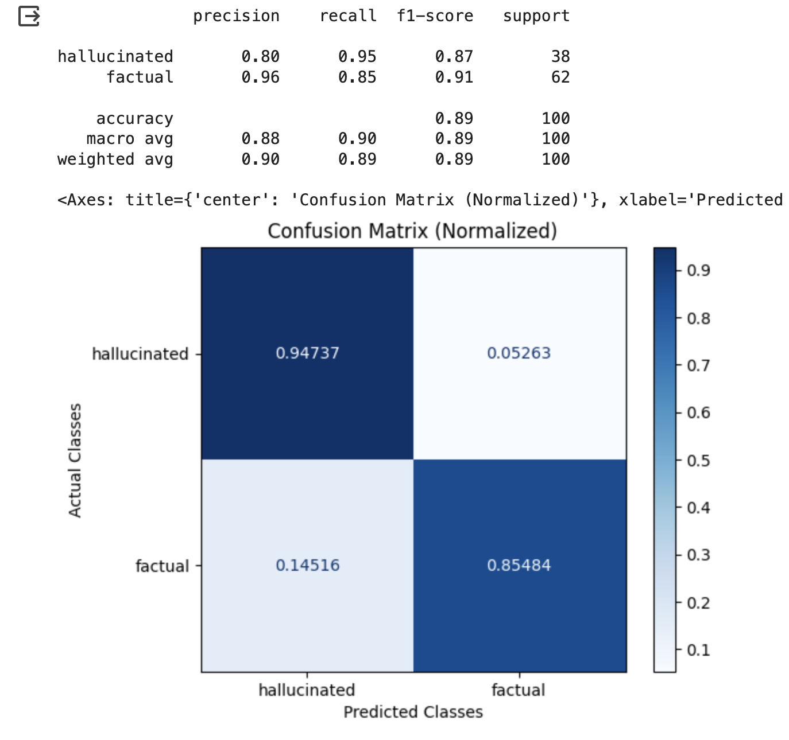
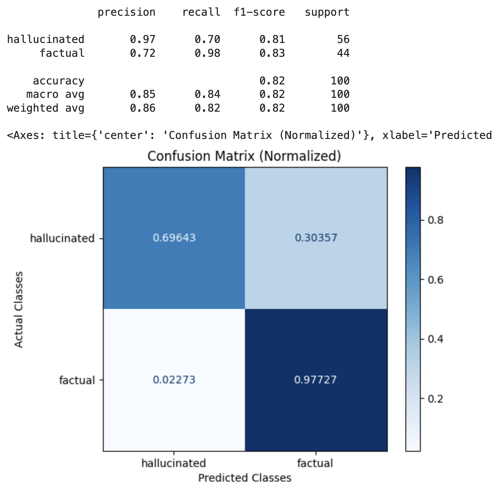

# Hallucinations

## When To Use Hallucination Eval Template

This LLM Eval detects if the output of a model is a hallucination based on contextual data.

This Eval is specifically designed to detect hallucinations in generated answers from private or retrieved data. The Eval detects if an AI answer to a question is a hallucination based on the reference data used to generate the answer.


This Eval is designed to check for hallucinations on private data, on data that is fed into the context window from retrieval.

It is NOT designed to check hallucinations on what the LLM was trained on. It is not useful for random public fact hallucinations "What was Michael Jordan's birthday?"

It is useful for hallucinations in RAG systems


## Hallucination Eval Template

```
In this task, you will be presented with a query, a reference text and an answer. The answer is
generated to the question based on the reference text. The answer may contain false information. You
must use the reference text to determine if the answer to the question contains false information,
if the answer is a hallucination of facts. Your objective is to determine whether the answer text
contains factual information and is not a hallucination. A 'hallucination' refers to
an answer that is not based on the reference text or assumes information that is not available in
the reference text. Your response should be a single word: either "factual" or "hallucinated", and
it should not include any other text or characters. "hallucinated" indicates that the answer
provides factually inaccurate information to the query based on the reference text. "factual"
indicates that the answer to the question is correct relative to the reference text, and does not
contain made up information. Please read the query and reference text carefully before determining
your response.

    # Query: {query}
    # Reference text: {reference}
    # Answer: {response}
    Is the answer above factual or hallucinated based on the query and reference text?
```


We are continually iterating our templates, view the most up-to-date template on GitHub. Last updated on 10/12/2023


## Benchmark Results

#### GPT-4 Results

<figure><figcaption><p>Scikit GPT-4</p></figcaption></figure>

#### GPT-3.5 Results

<figure><figcaption></figcaption></figure>

#### Claud v2 Results

<figure><figcaption></figcaption></figure>

#### GPT-4 Turbo

<figure><figcaption></figcaption></figure>

## How To Run the Eval

```python
from phoenix.evals import (
    HALLUCINATION_PROMPT_RAILS_MAP,
    HALLUCINATION_PROMPT_TEMPLATE,
    OpenAIModel,
    download_benchmark_dataset,
    llm_classify,
)

model = OpenAIModel(
    model_name="gpt-4",
    temperature=0.0,
)

#The rails is used to hold the output to specific values based on the template
#It will remove text such as ",,," or "..."
#Will ensure the binary value expected from the template is returned 
rails = list(HALLUCINATION_PROMPT_RAILS_MAP.values())
hallucination_classifications = llm_classify(
    dataframe=df, 
    template=HALLUCINATION_PROMPT_TEMPLATE, 
    model=model, 
    rails=rails,
    provide_explanation=True, #optional to generate explanations for the value produced by the eval LLM
)

```

The above Eval shows how to the the hallucination template for Eval detection.

<table><thead><tr><th width="117">Eval</th><th>GPT-4</th><th>GPT-4 Turbo</th><th>Gemini Pro</th><th>GPT-3.5</th><th>GPT-3.5-turbo-instruct</th><th>Palm 2 (Text Bison)</th><th>Claude V2</th></tr></thead><tbody><tr><td>Precision</td><td><mark style="color:green;">0.93</mark></td><td><mark style="color:green;">0.97</mark></td><td><mark style="color:green;">0.89</mark></td><td><mark style="color:green;">0.89</mark></td><td><mark style="color:green;">0.89</mark></td><td><mark style="color:red;">1</mark></td><td><mark style="color:green;">0.80</mark></td></tr><tr><td>Recall</td><td><mark style="color:green;">0.72</mark></td><td><mark style="color:green;">0.70</mark></td><td><mark style="color:green;">0.53</mark></td><td><mark style="color:green;">0.65</mark></td><td><mark style="color:green;">0.80</mark></td><td><mark style="color:red;">0.44</mark></td><td><mark style="color:green;">0.95</mark></td></tr><tr><td>F1</td><td><mark style="color:green;">0.82</mark></td><td><mark style="color:green;">0.81</mark></td><td><mark style="color:green;">0.67</mark></td><td><mark style="color:green;">0.75</mark></td><td><mark style="color:green;">0.84</mark></td><td><mark style="color:red;">0.61</mark></td><td><mark style="color:green;">0.87</mark></td></tr></tbody></table>

| Throughput  | GPT-4   | GPT-4 Turbo | GPT-3.5 |
| ----------- | ------- | ----------- | ------- |
| 100 Samples | 105 sec | 58 Sec      | 52 Sec  |
