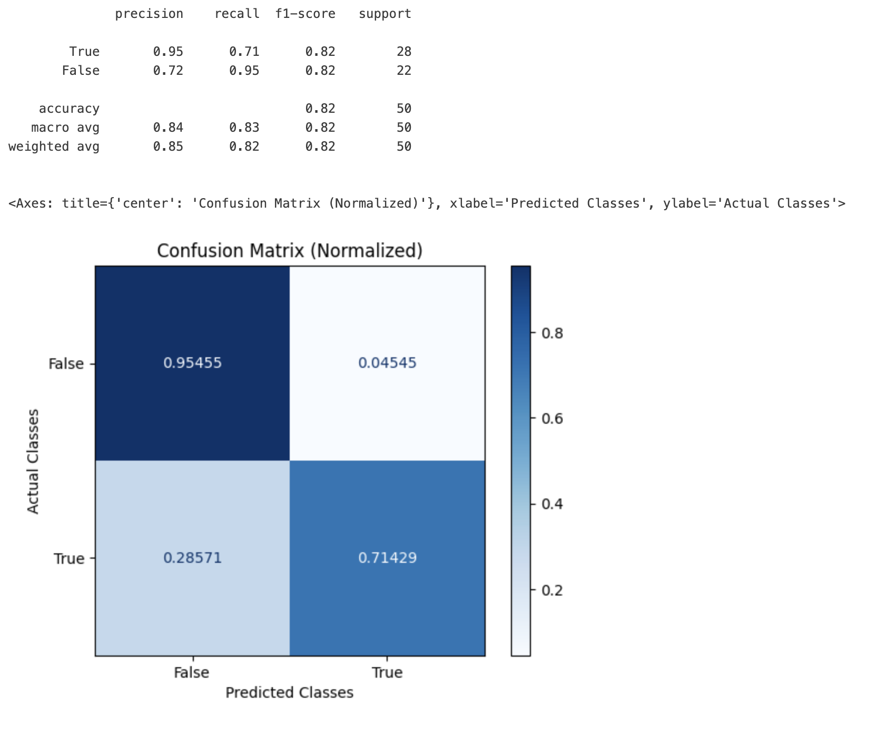

# SQL Generation Eval

SQL Generation is a common approach to using an LLM. In many cases the goal is to take a human description of the query and generate matching SQL to the human description.&#x20;

**Example of a Question:**\
How many artists have names longer than 10 characters?

**Example Query Generated:**

SELECT COUNT(ArtistId) \nFROM artists \nWHERE LENGTH(Name) > 10

The goal of the SQL generation Evaluation is to determine if the SQL generated is correct based on the question asked.&#x20;



```python

SQL Evaluation Prompt:
-----------------------
You are tasked with determining if the SQL generated appropiately answers a given 
instruction taking into account its generated query and response.

Data:
-----
- [Instruction]: {question}
  This section contains the specific task or problem that the sql query is intended 
  to solve.

- [Reference Query]: {query_gen}
  This is the sql query submitted for evaluation. Analyze it in the context of the 
  provided instruction.

- [Provided Response]: {response}
  This is the response and/or conclusions made after running the sql query through 
  the database

Evaluation:
-----------
Your response should be a single word: either "correct" or "incorrect".
You must assume that the db exists and that columns are appropiately named.
You must take into account the response as additional information to determine the 
correctness.
```

Example Code:

```python
rails = list(SQL_GEN_EVAL_PROMPT_RAILS_MAP.values())
model = OpenAIModel(
    model_name="gpt-4",
    temperature=0.0,
)
relevance_classifications = llm_classify(
    dataframe=df,
    template=SQL_GEN_EVAL_PROMPT_TEMPLATE,
    model=model,
    rails=rails,
    provide_explanation=True
)
```

Model Results:

<figure><figcaption></figcaption></figure>
