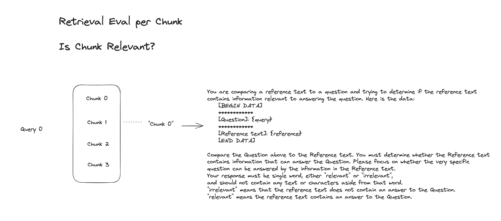

# Retrieval Evals on Document Chunks

Retrieval Evals are designed to evaluate the effectiveness of retrieval systems. The retrieval systems typically return list of chunks of length _k_ ordered by relevancy. The most common retrieval systems in the LLM ecosystem are vector DBs.&#x20;

<figure><figcaption></figcaption></figure>

The retrieval Eval is designed to asses the relevance of each chunk and its ability to answer the question. More information on the retrieval Eval can be found [here](running-pre-tested-evals/retrieval-rag-relevance.md)

<figure><figcaption></figcaption></figure>

The picture above shows a single query returning k=4 chunks as a list. The retrieval Eval runs across each chunk returning a value of relevance in a list highlighting its relevance for the specific chunk. Phoenix provides helper functions that take in a dataframe, with query column that has lists of chunks and produces a column that is a list of equal length with an Eval for each chunk.&#x20;
