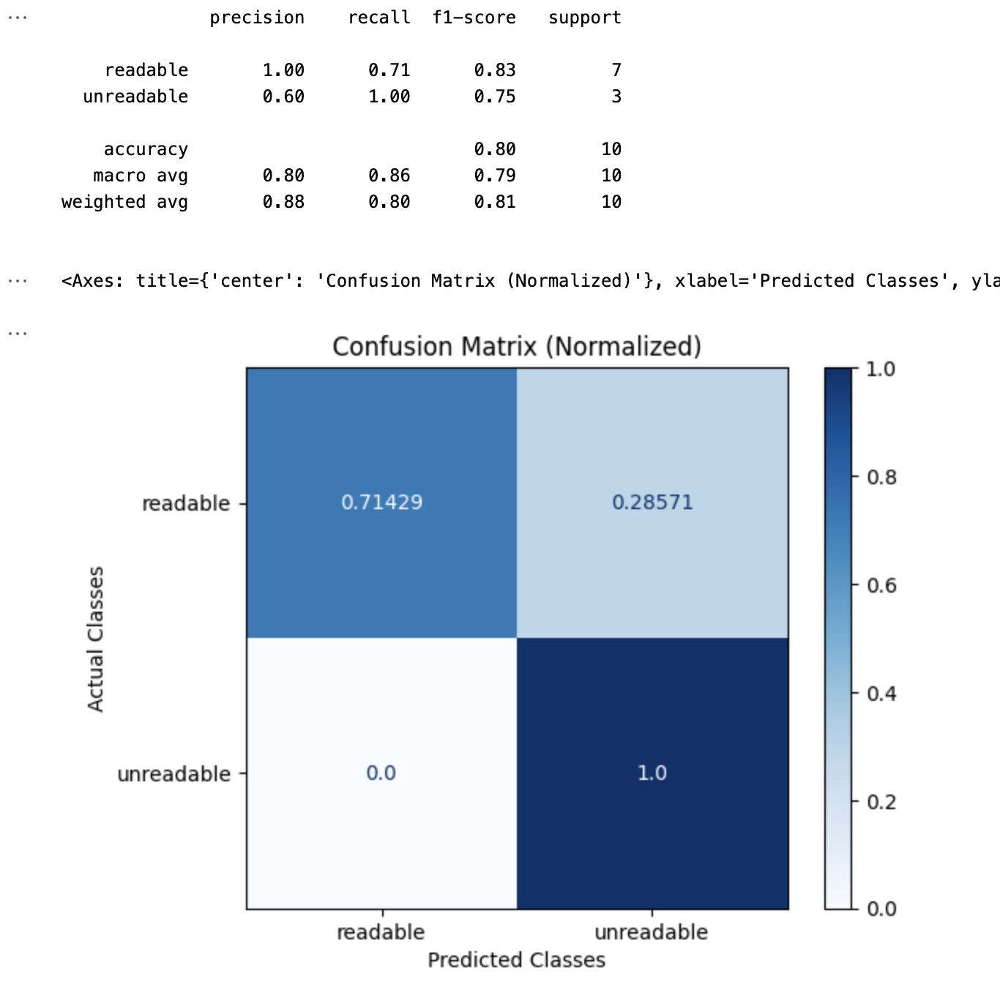

# Code Generation Eval

## When To Use Code Generation Eval Template

This Eval checks the correctness and readability of the code from a code generation process. The template variables are:

* **query:** The query is the coding question being asked
* **code**: The code is the code that was returned.

## Code Generation Eval Template


Try it out!


````
You are a stern but practical senior software engineer who cares a lot about simplicity and
readability of code. Can you review the following code that was written by another engineer?
Focus on readability of the code. Respond with "readable" if you think the code is readable,
or "unreadable" if the code is unreadable or needlessly complex for what it's trying
to accomplish.

ONLY respond with "readable" or "unreadable"

Task Assignment:
```
{query}
```

Implementation to Evaluate:
```
{code}
```
````


We are continually iterating our templates, view the most up-to-date template on GitHub. Last updated on 10/12/2023


## Benchmark Results

#### GPT-4 Results

<figure><figcaption></figcaption></figure>

#### GPT-3.5 Results

<figure><figcaption></figcaption></figure>

#### GPT-4 Turbo

<figure><figcaption></figcaption></figure>

## How To Run the Eval

```python
from phoenix.experimental.evals import (
    CODE_READABILITY_PROMPT_RAILS_MAP,
    CODE_READABILITY_PROMPT_TEMPLATE_STR,
    OpenAIModel,
    download_benchmark_dataset,
    llm_classify,
)

model = OpenAIModel(
    model_name="gpt-4",
    temperature=0.0,
)

#The rails is used to hold the output to specific values based on the template
#It will remove text such as ",,," or "..."
#Will ensure the binary value expected from the template is returned 
rails = list(CODE_READABILITY_PROMPT_RAILS_MAP.values())
readability_classifications = llm_classify(
    dataframe=df,
    template=CODE_READABILITY_PROMPT_TEMPLATE_STR,
    model=model,
    rails=rails,
)
```

The above shows how to use the code readability template.

<table><thead><tr><th>Code Eval</th><th>Palm 2 (Text Bison)</th><th>GPT-4 Turbo</th><th>Llama 7b (soon)</th><th data-hidden>GPT-4</th><th data-hidden>GPT-4</th><th data-hidden>GPT-3.5</th><th data-hidden>GPT-3.5-Instruct</th></tr></thead><tbody><tr><td>Precision</td><td><mark style="color:green;">0.77</mark></td><td><mark style="color:green;">1.0</mark></td><td></td><td><mark style="color:green;">0.93</mark></td><td><mark style="color:green;">0.93</mark></td><td><mark style="color:green;">0.76</mark></td><td><mark style="color:orange;">0.67</mark></td></tr><tr><td>Recall</td><td><mark style="color:green;">0.94</mark></td><td><mark style="color:green;">0.71</mark></td><td></td><td><mark style="color:green;">0.78</mark></td><td><mark style="color:green;">0.78</mark></td><td><mark style="color:green;">0.93</mark></td><td><mark style="color:green;">1</mark></td></tr><tr><td>F1</td><td><mark style="color:green;">0.85</mark></td><td><mark style="color:green;">0.83</mark></td><td></td><td><mark style="color:green;">0.85</mark></td><td><mark style="color:green;">0.85</mark></td><td><mark style="color:green;">0.85</mark></td><td><mark style="color:green;">0.81</mark></td></tr></tbody></table>

