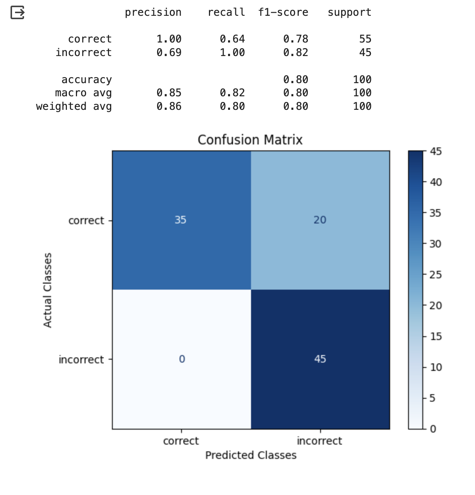

# Q\&A on Retrieved Data

## When To Use Q\&A Eval Template

This Eval evaluates whether a question was correctly answered by the system based on the retrieved data. In contrast to retrieval Evals that are checks on chunks of data returned, this check is a system level check of a correct Q\&A.

* **question**: This is the question the Q\&A system is running against
* **sampled\_answer**: This is the answer from the Q\&A system.
* **context**: This is the context to be used to answer the question, and is what Q\&A Eval must use to check the correct answer

## Q\&A Eval Template


Try it out!


```
You are given a question, an answer and reference text. You must determine whether the
given answer correctly answers the question based on the reference text. Here is the data:
    [BEGIN DATA]
    ************
    [Question]: {question}
    ************
    [Reference]: {context}
    ************
    [Answer]: {sampled_answer}
    [END DATA]
Your response must be a single word, either "correct" or "incorrect",
and should not contain any text or characters aside from that word.
"correct" means that the question is correctly and fully answered by the answer.
"incorrect" means that the question is not correctly or only partially answered by the
answer.
```


We are continually iterating our templates, view the most up-to-date template on GitHub. Last updated on 10/12/2023


## Benchmark Results

<table><thead><tr><th width="130">System</th><th width="156">Precision</th><th width="155">Recall</th><th width="151">F1-Score</th><th width="155">Support</th></tr></thead><tbody><tr><td>GPT 4</td><td>Relevant:<br>Irrelevant:</td><td>Relevant:<br>Irrelevant:</td><td>Relevant:<br>Irrelevant:</td><td>Relevant:<br>Irrelevant:</td></tr><tr><td>GPT 3.5</td><td>Relevant:<br>Irrelevant:</td><td>Relevant:<br>Irrelevant:</td><td>Relevant:<br>Irrelevant:</td><td>Relevant:<br>Irrelevant:</td></tr></tbody></table>

#### GPT-4 Results

<figure><figcaption></figcaption></figure>

#### GPT-3.5 Results

<figure><figcaption></figcaption></figure>

#### Claude V2 Results

<figure><figcaption></figcaption></figure>

## How To Run the Eval

```python
import phoenix.experimental.evals.templates.default_templates as templates
from phoenix.experimental.evals import (
    OpenAIModel,
    download_benchmark_dataset,
    llm_classify,
)

model = OpenAIModel(
    model_name="gpt-4",
    temperature=0.0,
)

#The rails fore the output to specific values of the template
#It will remove text such as ",,," or "...", anything not the
#binary value expected from the template
rails = list(templates.QA_PROMPT_RAILS_MAP.values())
Q_and_A_classifications = llm_classify(
    dataframe=df_sample,
    template=templates.QA_PROMPT_TEMPLATE_STR,
    model=model,
    rails=rails,
)
```

The above Eval uses the QA template for Q\&A analysis on retrieved data.

| Q\&A Eval | GPT-4 | GPT-3.5 | GPT-3.5-turbo-instruct | Palm (Text Bison) | Claude V2 |
| --------- | ----- | ------- | ---------------------- | ----------------- | --------- |
| Precision | 1     | 0.99    | 0.42                   | 1                 | 1.0       |
| Recall    | 0.92  | 0.83    | 1                      | 0.94              | 0.64      |
| Precision | 0.96  | 0.90    | 0.59                   | 0.97              | 0.78      |
