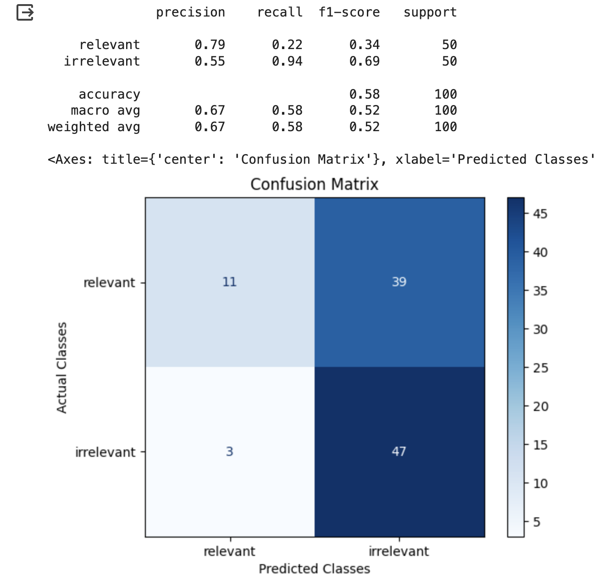

# Retrieval (RAG) Relevance

## When To Use RAG Eval Template

This Eval evaluates whether a retrieved chunk contains an answer to the query. It's extremely useful for evaluating retrieval systems.

## RAG Eval Template


Try it out!


```python
You are comparing a reference text to a question and trying to determine if the reference text
contains information relevant to answering the question. Here is the data:
    [BEGIN DATA]
    ************
    [Question]: {query}
    ************
    [Reference text]: {reference}
    [END DATA]

Compare the Question above to the Reference text. You must determine whether the Reference text
contains information that can answer the Question. Please focus on whether the very specific
question can be answered by the information in the Reference text.
Your response must be single word, either "relevant" or "irrelevant",
and should not contain any text or characters aside from that word.
"irrelevant" means that the reference text does not contain an answer to the Question.
"relevant" means the reference text contains an answer to the Question.
```


We are continually iterating our templates, view the most up-to-date template on GitHub. Last updated on 10/12/2023


## Benchmark Results

#### GPT-4 Result

<figure><figcaption><p>Scikit GPT-4</p></figcaption></figure>

#### GPT-3.5 Results

<figure><figcaption></figcaption></figure>

#### Claude V2 Results

<figure><figcaption></figcaption></figure>

## How To Run the Eval

<pre class="language-python"><code class="lang-python"><strong>from phoenix.experimental.evals import (
</strong>    RAG_RELEVANCY_PROMPT_RAILS_MAP,
    RAG_RELEVANCY_PROMPT_TEMPLATE_STR,
    OpenAIModel,
    download_benchmark_dataset,
    llm_classify,
)

model = OpenAIModel(
    model_name="gpt-4",
    temperature=0.0,
)

#The rails is used to hold the output to specific values based on the template
#It will remove text such as ",,," or "..."
#Will ensure the binary value expected from the template is returned
rails = list(RAG_RELEVANCY_PROMPT_RAILS_MAP.values())
relevance_classifications = llm_classify(
    dataframe=df,
    template=RAG_RELEVANCY_PROMPT_TEMPLATE_STR,
    model=model,
    rails=rails,
)
</code></pre>

The above runs the RAG relevancy LLM template against the dataframe df.

<table><thead><tr><th>RAG Eval</th><th>GPT-4</th><th>GPT-3.5</th><th>Palm (Text Bison)</th><th>Claude V2</th><th data-hidden>GPT-3.5-turbo-instruct</th></tr></thead><tbody><tr><td>Precision</td><td><mark style="color:green;">0.70</mark></td><td><mark style="color:red;">0.42</mark></td><td><mark style="color:red;">0.53</mark></td><td><mark style="color:red;">0.79</mark></td><td><mark style="color:red;">0.42</mark></td></tr><tr><td>Recall</td><td><mark style="color:green;">0.88</mark></td><td><mark style="color:red;">1.0</mark></td><td><mark style="color:red;">1</mark></td><td><mark style="color:red;">0.22</mark></td><td><mark style="color:red;">1</mark></td></tr><tr><td>F1</td><td><mark style="color:green;">0.78</mark></td><td><mark style="color:red;">0.59</mark></td><td><mark style="color:red;">0.69</mark></td><td><mark style="color:red;">0.34</mark></td><td><mark style="color:red;">0.59</mark></td></tr></tbody></table>

