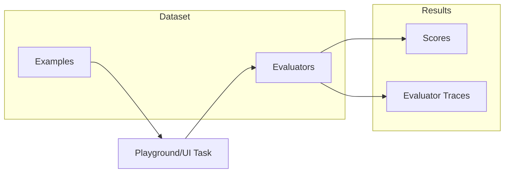

Dataset Evaluators are evaluators attached directly to a dataset that automatically run when you execute experiments from the Phoenix UI. They act as reusable test cases that validate task outputs every time you iterate on a prompt or model.

<Note>
Dataset evaluators currently run automatically only for experiments executed from the Phoenix UI (e.g., the Playground). For programmatic experiments, pass evaluators explicitly to `run_experiment`. See [Using Evaluators](/docs/phoenix/datasets-and-experiments/how-to-experiments/using-evaluators) for details.
</Note>

## Why Use Dataset Evaluators

When iterating on prompts in the Playground, dataset evaluators eliminate the need to manually configure evaluators each time. Attach them once to your dataset, and they run automatically on every experiment.

- **Consistent evaluation**: The same criteria applied every time you test
- **Faster iteration**: No setup required when running experiments from the UI
- **Built-in tracing**: Each evaluator captures traces for debugging and refinement

## Creating a Dataset Evaluator

1. Navigate to your dataset and click the **Evaluators** tab
2. Click **Add evaluator** and choose:
   - **LLM evaluator**: Use an LLM to judge outputs (e.g., correctness, relevance)
   - **Built-in code evaluator**: Use deterministic checks (e.g., exact match, regex, contains)
3. Configure the input mapping to connect evaluator variables to dataset fields
4. Test with an example, then save

## Evaluator Traces

Each dataset evaluator has its own project that captures traces. Use these traces to:

- Debug unexpected evaluation results
- Identify where your evaluator prompt needs refinement
- Track how evaluator behavior changes over time

Access traces from the **Traces** tab in any evaluator's detail page.

## Workflow

When you run an experiment from the Playground against a dataset with evaluators attached, scores are automatically recorded and evaluator traces are captured for debugging.
