```mermaid
flowchart LR
    subgraph Dataset["🗂️ Dataset"]
        direction TB
        Examples["Example 1, 2, ... N"]
        subgraph Example["Example"]
            Input["input"]
            Reference["output (reference)"]
            Metadata["metadata"]
        end
    end

    subgraph Task["⚙️ Task"]
        TaskLabel["LLM / Agent / App"]
    end

    TaskOutput(["output"])

    Eval["⚖️ Evaluator"]

    Score(["Score / Annotation"])

    Input --> Task
    Task --> TaskOutput
    TaskOutput --> Eval
    Reference -.-> Eval
    Input -.-> Eval
    Metadata -.-> Eval
    Eval --> Score

    style Dataset stroke:#e67e22,stroke-width:2px
    style Examples stroke:#f39c12,stroke-width:1px
    style Example stroke:#f39c12,stroke-width:1px
    style Task stroke:#2196f3,stroke-width:2px
    style TaskOutput stroke:#1976d2,stroke-width:2px
    style Eval stroke:#9c27b0,stroke-width:2px
    style Score stroke:#7b1fa2,stroke-width:2px
```

The velocity of AI application development is bottlenecked by quality evaluations because AI engineers are often faced with hard tradeoffs: which prompt or LLM best balances performance, latency, and cost. High quality evaluations are critical as they can help developers answer these types of questions with greater confidence.

## Datasets

Datasets are integral to evaluation. They are collections of examples that provide the `inputs` and, optionally, expected `reference` outputs for assessing your application. Datasets allow you to collect data from production, staging, evaluations, and even manually. The examples collected are used to run experiments and evaluations to track improvements to your prompt, LLM, or other parts of your LLM application.

## Experiments

In AI development, it's hard to understand how a change will affect performance. This breaks the dev flow, making iteration more guesswork than engineering.

Experiments and evaluations solve this, helping distill the indeterminism of LLMs into tangible feedback that helps you ship more reliable product.

Specifically, good evals help you:

* Understand whether an update is an improvement or a regression

* Drill down into good / bad examples

* Compare specific examples vs. prior runs

* Avoid guesswork

## Dataset Evaluators

When working with a dataset, you often want to curate a set of evaluators that validate task outputs against that dataset's examples. Dataset Evaluators serve as **test cases** that automatically score outputs when running experiments—forming an evaluation harness similar to a unit test suite.

For example, if your dataset contains examples for a Q&A task, you might attach evaluators that check:

- Does the output match the expected reference (exact match or similarity)?
- Does the output call the correct tool?
- Is the response free of hallucinations?
- Does the output follow the expected format?

When you run an experiment against a dataset, its associated evaluators run automatically, providing consistent and repeatable quality assessments. This allows you to iterate on prompts, models, or application logic with confidence—knowing that the same evaluation criteria are applied each time.

