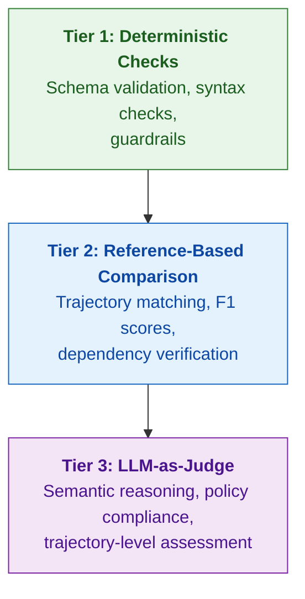

When a standalone LLM produces a bad output, you can usually trace the problem to the prompt, the model, or the data. Agent failures are different. An agent might select the wrong tool, pass it the right parameters, get back a valid result, and still fail the task — because it chose the tool based on a hallucinated premise three steps earlier.

This compounding nature makes agent evaluation fundamentally harder than model evaluation. You can't just check the final answer. You need evaluation strategies that operate at multiple levels: validating individual tool calls, assessing the trajectory as a whole, and judging whether the agent's reasoning held together across the entire interaction.

This page provides two things:

1. **A failure taxonomy** — a structured map of how agents fail, synthesized from academic research and production experience
2. **A tiered evaluation framework** — a practical approach for matching each failure mode to the right evaluation strategy

## Why Agent Evaluation Is Different

Traditional LLM evaluation assumes a stateless, single-turn interaction: a prompt goes in, a completion comes out, and you grade it. Agent evaluation breaks this model in several ways:

<CardGroup cols={2}>
  <Card title="Multi-step execution" icon="route">
    Agents take sequences of actions where each step depends on previous results. A correct final answer can mask a deeply flawed reasoning process, and a single early mistake can cascade through the entire trajectory.
  </Card>
  <Card title="Tool interaction" icon="wrench">
    Agents don't just generate text — they call external APIs, query databases, and modify system state. Evaluation must verify not just what the agent said, but what it *did* and whether those actions were correct and safe.
  </Card>
  <Card title="Non-determinism at scale" icon="dice">
    Running the same agent on the same task twice can produce different tool call sequences, different reasoning paths, and different outcomes. Evaluation must account for this inherent variance rather than treating it as noise.
  </Card>
  <Card title="Multiple valid paths" icon="code-branch">
    Unlike traditional QA where there's one right answer, agents often have many valid approaches to solving a task. Strict trajectory matching penalizes creative solutions; purely outcome-based evaluation misses dangerous process failures.
  </Card>
</CardGroup>

These differences mean that standard evaluation approaches — exact match, BLEU/ROUGE scores, even simple LLM-as-judge on the final answer — are insufficient for agents. You need a layered evaluation strategy that examines the agent's behavior at every level of granularity.

---

## Agent Failure Taxonomy

The taxonomy below consolidates findings from multiple research efforts into a unified, practitioner-friendly framework. It draws on analysis of thousands of failed agent trajectories across academic benchmarks and production systems, including work from "Where LLM Agents Fail and How They Can Learn From Failures" (AgentErrorBench), "When Agents Fail to Act" (tool invocation failures), "Why Do Multi-Agent LLM Systems Fail?" (MAST), and Microsoft's taxonomy of agentic AI failure modes.

Failures are organized into six categories that reflect the cognitive and operational stages of agent execution.

### Action Failures

Action failures occur when the agent attempts to interact with external tools or APIs. These are often the most visible failures because they produce immediate errors — but they can also be subtle, producing valid-looking results from incorrect operations.

| Failure Mode | Description | Example |
|---|---|---|
| **Wrong tool selection** | Agent chooses a semantically similar but incorrect tool | Using `search_products` instead of `lookup_order` to find an order by product name |
| **Hallucinated tool** | Agent invents a tool that doesn't exist in the available schema | Calling `cancel_and_refund` when only `cancel_order` and `process_refund` exist separately |
| **Wrong parameter values** | Correct tool, but with incorrect argument values | Passing a product ID where a customer ID is expected |
| **Missing parameters** | Required parameters omitted from the tool call | Calling `update_address` without specifying the new address |
| **Parameter type mismatch** | Arguments provided in the wrong data type | Passing `"42"` (string) for a parameter expecting `42` (integer) |
| **Malformed syntax** | Tool call doesn't conform to the expected format | Invalid JSON in the function call arguments |

Action failures are the most well-studied category because they're the easiest to detect with automated tooling. Schema validation catches malformed calls immediately; reference trajectories reveal wrong tool selections.

### Planning Failures

Planning failures happen before tool execution — in the agent's reasoning about *what to do* and *in what order*. These are harder to detect because the individual tool calls may each be valid; it's the sequence that's wrong.

| Failure Mode | Description | Example |
|---|---|---|
| **Wrong ordering** | Tools called in an order that violates logical dependencies | Trying to apply a discount before verifying the customer is eligible |
| **Missing dependency** | Agent skips a prerequisite step that a later action depends on | Attempting to ship an order without first confirming payment |
| **Incorrect decomposition** | Complex task broken into wrong sub-tasks | Decomposing "change my flight" into search + book new + cancel old, instead of using the modify endpoint |
| **Infeasible strategy** | Agent pursues an approach that cannot succeed given constraints | Planning to merge two separate orders when the system only supports single-order modifications |

### Reflection Failures

Reflection failures occur when the agent misinterprets its own progress or the results of its actions. These failures are particularly dangerous because the agent believes it's on track while actually diverging from the correct path.

| Failure Mode | Description | Example |
|---|---|---|
| **Progress misjudgment** | Incorrectly assessing how close it is to task completion | Declaring "order cancelled" after only initiating (not confirming) the cancellation |
| **Outcome misinterpretation** | Misunderstanding what a tool response means | Treating an API response of `{"status": "pending"}` as confirmation of success |
| **Tool output misinterpretation** | Extracting wrong information from a valid tool response | Reading the shipping address instead of the billing address from a customer record |
| **Causal misattribution** | Incorrectly linking causes to effects in the trajectory | Blaming a search failure on "no results" when the actual issue was a malformed query |

### Memory Failures

Memory failures involve the agent's ability to maintain, recall, and faithfully use information throughout a multi-step interaction.

| Failure Mode | Description | Example |
|---|---|---|
| **Hallucination** | Generating information not grounded in observations or tool outputs | Citing a return policy that doesn't exist in the retrieved documentation |
| **Retrieval failure** | Inability to access previously observed information | Forgetting the customer's order number mentioned earlier in the conversation |
| **Over-simplification** | Reducing complex information to the point of losing critical detail | Summarizing a multi-condition eligibility policy as simply "all customers qualify" |

Memory failures often serve as *root causes* for downstream action failures. Research from AgentErrorBench shows that hallucinations and retrieval failures are among the most common root causes — they produce flawed premises that propagate through planning into incorrect actions.

### System-Level Failures

System-level failures arise from the infrastructure and operational constraints of running agents, rather than from the agent's reasoning itself.

| Failure Mode | Description | Example |
|---|---|---|
| **Context window overflow** | Agent exceeds its context limit, losing early information | A long customer service conversation where the agent forgets the original complaint |
| **Cascading failure** | A single error propagates through subsequent decisions | One hallucinated product ID triggers a chain of lookups, pricing, and inventory checks on a nonexistent item |
| **Infinite loop** | Agent enters a cycle of repeated actions with no progress | Repeatedly calling the same search API with identical parameters after each failure |
| **Early termination** | Agent stops before the task is complete | Responding "Your order has been updated" after changing the shipping method but before confirming the change |

<Info>
  One documented case of an undetected infinite loop between agents escalated weekly costs from $127 to $47,000 over 11 days — highlighting the real-world impact of system-level failures that go unmonitored.
</Info>

### Safety & Security Failures

Safety and security failures involve the agent violating policies, permissions, or trust boundaries — failures that may produce "correct" task completion while breaking important constraints.

| Failure Mode | Description | Example |
|---|---|---|
| **Policy violation** | Agent breaks business rules or domain constraints | Issuing a refund above the authorized limit, or booking a flight on a blacklisted carrier |
| **Permission escalation** | Agent exceeds its intended access scope | Accessing administrative endpoints when operating with user-level credentials |
| **Prompt injection** | External input alters the agent's intended behavior | A malicious document in retrieved context that instructs the agent to ignore its system prompt |

Microsoft's taxonomy of failure modes in agentic AI emphasizes that safety and security failures are systematically underrepresented in academic benchmarks, despite being critical in production deployments. The tau-bench benchmark is a notable exception, testing agents against detailed policy constraints in airline and retail domains.

### Multi-Agent Failures

When multiple agents collaborate, a new class of failures emerges at the coordination layer — even when individual agents function correctly in isolation.

| Failure Mode | Description | Example |
|---|---|---|
| **Inter-agent misalignment** | Agents pursue conflicting strategies or have incompatible assumptions | A planning agent schedules a meeting while a resource agent has already deallocated the room |
| **Context loss across handoffs** | Information is dropped when control passes between agents | Customer's urgency flag is lost when the triage agent hands off to the resolution agent |
| **Conflicting instructions** | Agents receive contradictory directives from the orchestrator | One agent told to minimize cost while another is told to maximize speed, with no priority resolution |

These failure modes were catalogued by the MAST framework, which analyzed 1,600+ annotated traces across seven multi-agent system frameworks with high inter-annotator agreement (Cohen's kappa = 0.88).

---

## The Three-Tier Evaluation Framework

No single evaluation technique covers all agent failure modes. The taxonomy above reveals that failures span a spectrum from syntactic errors (malformed tool calls) to semantic errors (flawed reasoning) to emergent behaviors (cascading failures, coordination breakdowns). Effective agent evaluation requires a layered approach.

Each tier catches a different class of failures, and the tiers are designed to work together — with fast, cheap checks filtering out obvious errors before more expensive evaluation methods assess deeper issues.

### Tier 1: Deterministic & Structural Checks

**What it catches:** Action failures (malformed calls, hallucinated tools, parameter issues), system-level failures (loops, context overflow)

Deterministic checks are fast, cheap, and should run on every agent execution — in both development and production. They operate on the structure of the agent's actions without requiring any ground truth or LLM inference.

| Check | What It Validates | Failure Modes Caught |
|---|---|---|
| **Schema validation** | Tool names exist, required params present, types correct | Hallucinated tools, missing params, type mismatches |
| **Syntax validation** | Tool call arguments are well-formed | Malformed syntax |
| **Repetition detection** | No duplicate consecutive calls with identical arguments | Infinite loops, redundant calls |
| **Max-step guardrails** | Trajectory length within acceptable bounds | Infinite loops, runaway agents |
| **Token/cost monitoring** | Execution stays within budget constraints | Context overflow, runaway costs |
| **Permission boundary checks** | Actions stay within authorized scope | Permission escalation |

<Tip>
  Deterministic checks are your first line of defense. They're effectively free to run, catch the most egregious failures, and prevent wasted budget on LLM-based evaluation of obviously broken trajectories.
</Tip>

### Tier 2: Reference-Based Comparison

**What it catches:** Planning failures (wrong ordering, missing dependencies), action failures (wrong tool selection), efficiency issues (redundant calls)

Reference-based evaluation compares the agent's trajectory against a known-correct reference. This requires ground truth — either human-annotated golden trajectories or verified outputs from a production system — but provides objective, reproducible measurements.

| Metric | What It Measures | Failure Modes Caught |
|---|---|---|
| **Tool call F1** | Precision and recall of tool calls vs reference | Wrong tool selection, missing steps, redundant calls |
| **Trajectory match** | Whether the full sequence matches (strict, unordered, or subset) | Planning errors, wrong tool selection |
| **Dependency satisfaction** | Whether tool call ordering respects logical dependencies | Wrong ordering, missing prerequisites |
| **Edit distance** | Minimum edits to transform predicted trajectory into reference | Overall trajectory deviation |
| **Outcome comparison** | Final state matches expected outcome (e.g., database state) | Early termination, incorrect final actions |

Reference-based metrics work well for well-defined tasks with limited solution paths. For open-ended tasks where multiple valid approaches exist, they can be overly punitive — penalizing correct-but-different strategies.

<Note>
  When using trajectory matching, prefer unordered or subset matching modes over strict matching. Research consistently shows that agents find valid approaches that human annotators didn't anticipate — strict matching produces false negatives.
</Note>

### Tier 3: LLM-as-Judge Evaluation

**What it catches:** Reflection failures, memory failures, policy violations, cascading failures, reasoning quality

LLM-as-judge evaluation uses a separate language model to assess the agent's behavior against a rubric. It's the most flexible tier — capable of evaluating semantic reasoning, policy compliance, and nuanced trajectory quality — but also the most expensive and least deterministic.

| Approach | What It Evaluates | Best For |
|---|---|---|
| **Step-level judgment** | Was each individual tool call reasonable given the context? | Reflection failures, outcome misinterpretation |
| **Trajectory-level judgment** | Was the overall approach efficient and sound? | Planning quality, cascading failures |
| **Policy compliance** | Did the agent violate any domain-specific rules? | Safety failures, policy violations |
| **Reasoning assessment** | Was the agent's chain of thought logically coherent? | Memory failures, causal misattribution |
| **Outcome satisfaction** | Does the final result satisfy the user's original intent? | Early termination, goal drift |

When implementing LLM-as-judge evaluation for agents, several principles from both research and practice apply:

- **Grade outcomes, not paths.** As Anthropic's evaluation guidance emphasizes, agents frequently find valid approaches that evaluators didn't anticipate. Judge whether the agent achieved the goal, not whether it followed a specific sequence.
- **Isolate evaluation dimensions.** Use separate judge prompts for separate concerns (correctness, efficiency, safety) rather than asking a single judge to assess everything at once. This produces more reliable scores and more actionable diagnostics.
- **Calibrate against human labels.** LLM judges are themselves imperfect classifiers. Regularly measure your judge's agreement with human annotations using precision, recall, and F1 to ensure your evaluator is trustworthy. (See [Meta-Evaluation](/docs/phoenix/evaluation/agent-evaluation-framework/meta-evaluation) for a detailed methodology.)

---

## Mapping Failures to Evaluation Tiers

The following table provides a practical reference for mapping each failure mode to its most effective evaluation approach. Most failure modes can be partially detected by multiple tiers, but each has a *primary* tier where detection is most reliable and cost-effective.

| Failure Mode | Primary Tier | Evaluation Method |
|---|---|---|
| Hallucinated tool | **Tier 1** Deterministic | Tool name validation against schema |
| Malformed syntax | **Tier 1** Deterministic | JSON/AST syntax validation |
| Missing parameters | **Tier 1** Deterministic | Required parameter check |
| Type mismatch | **Tier 1** Deterministic | Parameter type validation |
| Infinite loop | **Tier 1** Deterministic | Repetition detection, max-step guardrail |
| Permission escalation | **Tier 1** Deterministic | Permission boundary check |
| Wrong tool selection | **Tier 2** Reference | Tool selection accuracy, tool call F1 |
| Wrong ordering | **Tier 2** Reference | Dependency satisfaction, edit distance |
| Missing dependency | **Tier 2** Reference | Dependency graph check |
| Redundant calls | **Tier 2** Reference | Trajectory length vs reference |
| Early termination | **Tier 2** Reference | Outcome comparison, progress rate |
| Wrong parameter values | **Tier 2** Reference | Argument correctness vs ground truth |
| Progress misjudgment | **Tier 3** LLM Judge | Step-level reasoning assessment |
| Outcome misinterpretation | **Tier 3** LLM Judge | Step-level judgment on tool responses |
| Tool output misinterpretation | **Tier 3** LLM Judge | Next-action evaluation after tool response |
| Hallucination | **Tier 3** LLM Judge | Faithfulness / grounding evaluation |
| Cascading failure | **Tier 3** LLM Judge | Root-cause analysis across trajectory |
| Policy violation | **Tier 3** LLM Judge | Rule-based checks + policy compliance judge |
| Causal misattribution | **Tier 3** LLM Judge | Reasoning chain assessment |
| Context loss (multi-agent) | **Tier 3** LLM Judge | Handoff quality evaluation |
| Inter-agent misalignment | **Tier 3** LLM Judge | Cross-agent goal consistency check |

---

## From Taxonomy to Practice

Understanding how agents fail is the first step. Building evaluation systems that catch these failures requires going further — addressing the inherent non-determinism of agent behavior, validating that your evaluators themselves are trustworthy, and ensuring that the format of data you feed to LLM judges doesn't silently bias their assessments.

The remaining pages in this guide cover these challenges:

<CardGroup cols={3}>
  <Card title="Reliability & Confidence" icon="arrows-rotate" href="/docs/phoenix/evaluation/agent-evaluation-framework/reliability-and-confidence">
    Why single-run evaluation is insufficient and how to use repetition to separate signal from noise.
  </Card>
  <Card title="Meta-Evaluation" icon="scale-balanced" href="/docs/phoenix/evaluation/agent-evaluation-framework/meta-evaluation">
    How to measure whether your LLM evaluators are actually trustworthy — and systematically improve them.
  </Card>
  <Card title="Input Format Sensitivity" icon="flask" href="/docs/phoenix/evaluation/agent-evaluation-framework/input-format-sensitivity">
    Original research on how data formatting impacts LLM judge accuracy.
  </Card>
</CardGroup>

---

## References

The failure taxonomy and evaluation framework in this page synthesize findings from the following research:

- **"Where LLM Agents Fail and How They Can Learn From Failures"** — Five-module failure taxonomy across 500+ failed trajectories (AgentErrorBench)
- **"When Agents Fail to Act"** — 12-category tool invocation error taxonomy across 1,980 test instances
- **"Why Do Multi-Agent LLM Systems Fail?" (MAST)** — 14 multi-agent failure modes from 1,600+ annotated traces
- **Microsoft: Taxonomy of Failure Modes in Agentic AI Systems** — Security and safety failure classification from red-teaming production agents
- **"Demystifying Evals for AI Agents" (Anthropic)** — Practical evaluation methodology and grader design principles
- **tau-bench** — Pass^k reliability metric and policy compliance evaluation in agent benchmarks
- **T-Eval** — Six-dimension decomposition of tool utilization capability
- **BFCL (Berkeley Function Calling Leaderboard)** — AST-based function call evaluation methodology
