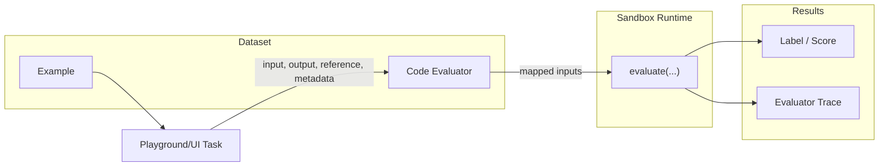

Code evaluators let you author a custom evaluation function in **Python** or **TypeScript** and attach it directly to a dataset. Phoenix stores the source, executes it server-side in a sandbox, and records labels and scores as annotations on each experiment run — the same way LLM evaluators do, but with deterministic code instead of a judge model.

Reach for a code evaluator when:

- The check is a rule, a parser, or a calculation — exact-match comparisons, regex checks, structural diffs, custom scoring formulas.
- You want a deterministic, repeatable score with no per-call model cost.
- An LLM judge would be slower, more expensive, or less reliable than just running the code.

<Info>
This page covers code evaluators authored **in the Phoenix UI** and run by Phoenix's sandbox runtimes. If you'd rather write evaluators locally and report scores with the `arize-phoenix-evals` SDK, see the [client-side code evaluators](/docs/phoenix/evaluation/how-to-evals/code-evaluators) guide.
</Info>

## How It Works



From authoring to results, you'll work through five steps:

1. **Create the evaluator** — From a dataset's **Evaluators** tab, choose **Add evaluator → Create new code evaluator**. Pick a language (Python or TypeScript) and a sandbox configuration.
2. **Write `evaluate(...)`** — The editor opens pre-populated with an `evaluate(...)` function. Its parameters become the evaluator's inputs.
3. **Configure output** — Declare whether the evaluator returns a continuous score (e.g. `0.0`–`1.0`) or a categorical label (e.g. `pass` / `fail`).
4. **Map inputs** — Bind each parameter to a path on the [evaluation parameters](/docs/phoenix/evaluation/server-evals/input-mapping#evaluation-parameters) (`input`, `output`, `reference`, `metadata`) or to a literal value.
5. **Test, save, run** — Dry-run the evaluator against a dataset example in the test panel, save it, then run an experiment. Scores land on every new run automatically.

## Authoring an Evaluator

### Function signature

The function name must be `evaluate`. Each parameter becomes a row in the input-mapping panel — you bind it to a path on the evaluation parameters or to a literal value.

<Tabs>
<Tab title="Python" icon="python">
```python
def evaluate(output, reference=None, input=None, metadata=None):
    matched = str(output).strip() == str(reference).strip()
    return {
        "label": "match" if matched else "mismatch",
        "score": 1.0 if matched else 0.0,
        "explanation": (
            "Output matches the reference."
            if matched
            else "Output does not match the reference."
        ),
    }
```
</Tab>
<Tab title="TypeScript" icon="js">
```typescript
function evaluate({ output, reference, input, metadata }: EvaluatorParams) {
  const matched = String(output).trim() === String(reference).trim();
  return {
    label: matched ? "match" : "mismatch",
    score: matched ? 1 : 0,
    explanation: matched
      ? "Output matches the reference."
      : "Output does not match the reference.",
  };
}
```
</Tab>
</Tabs>

`output`, `reference`, `input`, and `metadata` mirror the four [evaluation parameters](/docs/phoenix/evaluation/server-evals/input-mapping#evaluation-parameters), but the names aren't required. Rename them, drop the ones you don't use, or add new ones — the signature is the source of truth for what shows up in the input-mapping panel.

### Return shape

The function returns an object with three optional fields:

| Field | Type | Description |
|-------|------|-------------|
| `label` | string | The category (e.g. `"correct"`, `"fail"`). Required for categorical evaluators. |
| `score` | number | A numeric score. Required for continuous evaluators. Categorical evaluators can omit it — Phoenix fills it in from the configured label-to-score mapping. |
| `explanation` | string | Free-form text shown alongside the score. Useful for debugging surprising results. |

### Output configuration

Each evaluator declares one of two **output shapes**:

- **Continuous score** — A numeric value within a configurable range (default `0.0`–`1.0`). Use for similarity scores, distances, or any graded metric.
- **Categorical label** — A fixed set of labels, each mapped to a numeric score. The label your function returns must be one of the configured values.

You also pick an **optimization direction** (maximize vs. minimize) so Phoenix can render trends correctly in experiment comparisons.

## Sandbox Runtimes

Code evaluators always run inside a sandbox. When you create one, you pick from the sandbox configurations an administrator has provisioned under **Settings → Sandboxes** — Phoenix filters the list to configurations that match the language you chose.

The available backends are:

| Language | Backends |
|----------|----------|
| Python | WebAssembly (in-process), E2B, Daytona, Vercel Sandbox, Modal |
| TypeScript | Deno (in-process), Daytona, Vercel Sandbox |

**In-process** backends (WebAssembly, Deno) ship with Phoenix and need no credentials, so they're available immediately on self-hosted deployments. **Hosted** backends (E2B, Daytona, Vercel, Modal) run each invocation on a third-party provider's infrastructure, which buys stronger isolation, longer timeouts, package installation, and outbound network access. See [Sandbox Runtimes](/docs/phoenix/self-hosting/features/sandbox-runtimes) for the full capability matrix.

<Tip>
If your evaluator needs to install a package or call an external API, pick a hosted backend. The in-process runtimes are intentionally restricted.
</Tip>

## Examples

The pages below are copy-paste starting points for common evaluator patterns, grouped by how much infrastructure they need. Each one spells out the exact **sandbox configuration** — backend, dependencies, internet access, environment variables — to provision under **Settings → Sandboxes** before you save.

### Simple — pure code, in-process sandbox

No dependencies, no network. Runs in the bundled WebAssembly (Python) or Deno (TypeScript) sandboxes.

<CardGroup cols={2}>
  <Card title="JSON Match" icon="brackets-curly" href="/docs/phoenix/evaluation/server-evals/code-evaluators/json-match">
    Pass when the output and reference parse to the same JSON structure.
  </Card>
  <Card title="Regex Match" icon="asterisk" href="/docs/phoenix/evaluation/server-evals/code-evaluators/regex-match">
    Pass when the output matches a regular expression pattern.
  </Card>
</CardGroup>

### Medium — third-party library, hosted sandbox

Needs a third-party library — pip or npm — and sometimes outbound network access. Pick a hosted backend matching your language: Python on E2B / Daytona / Vercel / Modal, TypeScript on Daytona or Vercel.

<CardGroup cols={2}>
  <Card title="Embedding Distance" icon="vector-square" href="/docs/phoenix/evaluation/server-evals/code-evaluators/embedding-distance">
    Cosine similarity over OpenAI embeddings. Needs the `openai` package, internet access, and `OPENAI_API_KEY`.
  </Card>
  <Card title="scikit-learn" icon="flask" href="/docs/phoenix/evaluation/server-evals/code-evaluators/scikit-learn">
    Token-overlap similarity via `HashingVectorizer` and cosine. Offline — no network at run time.
  </Card>
</CardGroup>

### Advanced — multi-judgment evaluators

Patterns that combine multiple judgments — across axes, across LLM jurors, or across candidates.

<CardGroup cols={2}>
  <Card title="Pairwise Evaluator" icon="scale-balanced" href="/docs/phoenix/evaluation/server-evals/code-evaluators/pairwise">
    Blind LLM-judge `output` vs `reference` head-to-head, with randomized presentation order to mitigate position bias.
  </Card>
  <Card title="Composite Evaluator" icon="layer-group" href="/docs/phoenix/evaluation/server-evals/code-evaluators/composite">
    Blend several sub-scores (LLM judgments + code rules) into one weighted average, with a per-axis breakdown in the explanation.
  </Card>
  <Card title="LLM Jury" icon="gavel" href="/docs/phoenix/evaluation/server-evals/code-evaluators/llm-jury">
    Poll multiple LLMs (OpenAI, Anthropic, Google) on the same judgment and combine their verdicts with a weighted average.
  </Card>
</CardGroup>

## Versioning

Every time you save an evaluator's source, Phoenix creates a new **evaluator version** that executes for subsequent experiment runs. Older versions are retained so you can audit which code produced any historical score.

The evaluator's **name**, **description**, **output configuration**, **input mapping**, and **sandbox binding** live on the evaluator itself rather than on a version — editing those updates the evaluator in place without creating a new version.

## Testing Before You Save

The editor includes a **Test** panel that runs the current draft against a chosen dataset example. It shows the inputs Phoenix will pass to `evaluate(...)` after input mapping, the raw return value, and the parsed label/score/explanation. Use it to catch errors before saving — for example, to confirm that a path mapping resolves to a string rather than `None`, or that your function handles missing fields gracefully.

## Traceability

Like LLM evaluators, every code-evaluator execution emits an OpenTelemetry trace into a dedicated project. The trace captures the resolved inputs, the return value, any exception, and the sandbox call's latency — so when an annotation looks wrong, you can navigate from it directly to the execution that produced it.
