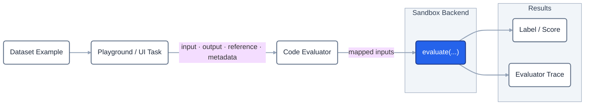
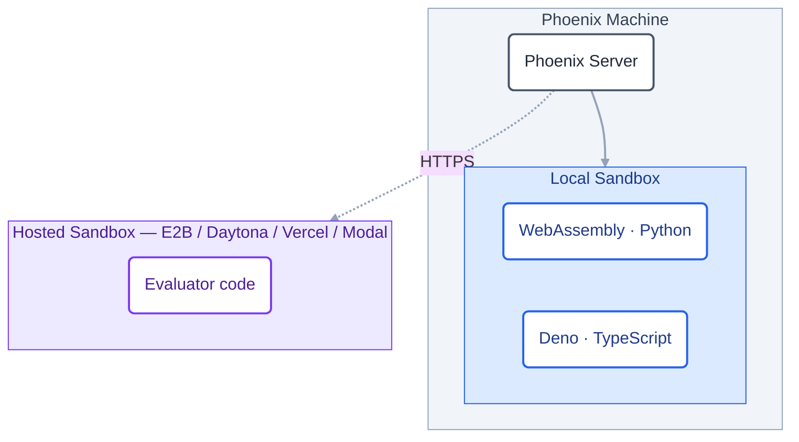

<video src="https://storage.googleapis.com/arize-phoenix-assets/assets/videos/sandboxes/code_evaluators_intro.mp4" width="100%" height="100%" style={{ display: 'block', objectFit: 'fill', backgroundColor: 'transparent' }} controls autoPlay muted loop />

Code evaluators let you author a custom evaluation function in **Python** or **TypeScript** and attach it directly to a dataset. Phoenix stores the source, executes it server-side in a sandbox, and records labels and scores as annotations on each experiment run — the same way LLM evaluators do, but with deterministic code instead of a judge model.

Reach for a code evaluator when you want full control over how the evaluation is built:

- Call third-party APIs or evaluation services, pull in your own libraries, or mix multiple LLMs inside a single judge.
- Compose custom logic — parsers, validators, scoring formulas, structural diffs — alongside any model calls you need.
- Craft the eval exactly the way you want it, without being constrained to a single built-in judge template.
- Run a deterministic, code-only path next to your LLM judges — repeatable scores with no per-call model cost.

<Info>
This page covers code evaluators authored **in the Phoenix UI** and run by Phoenix's sandbox backends. If you'd rather write evaluators locally and report scores with the `arize-phoenix-evals` SDK, see the [client-side code evaluators](/docs/phoenix/evaluation/how-to-evals/code-evaluators) guide.
</Info>

## How It Works



From authoring to results, you'll work through five steps:

1. **Create the evaluator** — From a dataset's **Evaluators** tab, choose **Add evaluator → Create new code evaluator**. Pick a language (Python or TypeScript) and a sandbox configuration. *(No sandbox configuration yet? Create one under [Settings → Sandboxes](/docs/phoenix/settings/sandboxes) — for local TypeScript, use the [Deno](/docs/phoenix/settings/sandboxes/deno) sandbox; for local Python, [WebAssembly](/docs/phoenix/settings/sandboxes/wasm).)*
2. **Write `evaluate(...)`** — The editor opens pre-populated with an `evaluate(...)` function. Its parameters become the evaluator's inputs.
3. **Configure the annotation** — Pick an optimization direction (maximize vs. minimize) and, optionally, a threshold for pass/fail coloring.
4. **Map inputs** — Bind each parameter to a path on the [evaluation parameters](/docs/phoenix/evaluation/server-evals/input-mapping#evaluation-parameters) (`input`, `output`, `reference`, `metadata`) or to a literal value.
5. **Test, save, run** — Dry-run the evaluator against a dataset example in the test panel, save it, then run an experiment. Scores land on every new run automatically.

Watch a full walkthrough of these steps end to end:

<video src="https://storage.googleapis.com/arize-assets/phoenix/assets/videos/code_evaluators.mp4" width="100%" height="100%" style={{ display: 'block', objectFit: 'fill', backgroundColor: 'transparent' }} controls />

## Authoring an Evaluator

### Function signature

The function name must be `evaluate`. Each parameter becomes a row in the input-mapping panel — you bind it to a path on the evaluation parameters or to a literal value.

<Tabs>
<Tab title="Python" icon="python">
```python
def evaluate(output, reference=None, input=None, metadata=None):
    matched = str(output).strip() == str(reference).strip()
    return {
        "label": "match" if matched else "mismatch",
        "score": 1.0 if matched else 0.0,
        "explanation": (
            "Output matches the reference."
            if matched
            else "Output does not match the reference."
        ),
    }
```
</Tab>
<Tab title="TypeScript" icon="js">
```typescript
function evaluate({ output, reference, input, metadata }: EvaluatorParams) {
  const matched = String(output).trim() === String(reference).trim();
  return {
    label: matched ? "match" : "mismatch",
    score: matched ? 1 : 0,
    explanation: matched
      ? "Output matches the reference."
      : "Output does not match the reference.",
  };
}
```
</Tab>
</Tabs>

`output`, `reference`, `input`, and `metadata` mirror the four [evaluation parameters](/docs/phoenix/evaluation/server-evals/input-mapping#evaluation-parameters), but the names aren't required. Rename them, drop the ones you don't use, or add new ones — the signature is the source of truth for what shows up in the input-mapping panel. When a parameter shares a name with one of the four evaluation parameters, Phoenix auto-binds it; otherwise you bind it explicitly in the panel to a path on the evaluation parameters or to a literal value.

### Return shape

The function returns an object with three optional fields:

| Field | Type | Description |
|-------|------|-------------|
| `label` | string | The category (e.g. `"correct"`, `"fail"`). Required for categorical evaluators. |
| `score` | number | A numeric score. Required for continuous evaluators. Categorical evaluators can omit it — Phoenix fills it in from the configured label-to-score mapping. |
| `explanation` | string | Free-form text shown alongside the score. Useful for debugging surprising results. |

### Annotation configuration

An evaluator's annotation config is descriptive — it tells Phoenix how to interpret whatever your function returns, not what shape it must produce.

- **Optimization direction** — `maximize` or `minimize`, used to render trends correctly in experiment comparisons.
- **Lower / upper bound** *(optional)* — The expected numeric range for scores. Used to normalize values for visualization.
- **Threshold** *(optional)* — A numeric cutoff that splits scores into pass/fail for threshold-pivoted coloring in result views. Leave it unset if pass/fail isn't meaningful for your metric.

## Sandbox Backends

Code evaluators always run inside a sandbox. When you create one, you pick from the sandbox configurations an administrator has provisioned under **Settings → Sandboxes** — Phoenix filters the list to configurations that match the language you chose.

The available backends are:

| Language | Backends |
|----------|----------|
| Python | WebAssembly (local), E2B, Daytona, Vercel Sandbox, Modal |
| TypeScript | Deno (local), Daytona, Vercel Sandbox |

Backends fall into two groups based on where the code actually runs:



**Local** backends (WebAssembly, Deno) ship with Phoenix and need no credentials, so they're available immediately on self-hosted deployments — but they only run **simple, self-contained code**: no environment variables, no network access, no installed packages. **Hosted** backends (E2B, Daytona, Vercel, Modal) run each invocation on a third-party provider's infrastructure, and are the only backends that support environment variables, outbound network access, and third-party dependencies. See [Sandbox Backends](/docs/phoenix/self-hosting/features/sandbox-runtimes) for the full capability matrix.

<Tip>
If your evaluator needs to read an environment variable, install a package, or call an external API, pick a hosted backend. The local backends are intentionally restricted to simple code evaluation.
</Tip>

The walkthrough below shows creating a Python code evaluator that runs on a Daytona sandbox — from picking the hosted backend through testing the evaluator against a dataset example.

<video src="https://storage.googleapis.com/arize-phoenix-assets/assets/videos/sandboxes/code_evaluator_on_daytona.mp4" width="100%" height="100%" style={{ display: 'block', objectFit: 'fill', backgroundColor: 'transparent' }} controls autoPlay muted loop />

## Versioning

Every time you save an evaluator's source, Phoenix creates a new **evaluator version** that executes for subsequent experiment runs. Older versions are retained so you can audit which code produced any historical score.

The evaluator's **name**, **description**, **annotation configuration**, **input mapping**, and **sandbox binding** live on the evaluator itself rather than on a version — editing those updates the evaluator in place without creating a new version.

## Testing Before You Save

The editor includes a **Test** panel that runs the current draft against a chosen dataset example. It shows the inputs Phoenix will pass to `evaluate(...)` after input mapping, the raw return value, and the parsed label/score/explanation. Use it to catch errors before saving — for example, to confirm that a path mapping resolves to a string rather than `None`, or that your function handles missing fields gracefully.

## Examples

Copy-paste starting points for common evaluator patterns. Each page spells out the exact **sandbox configuration** — backend, dependencies, internet access, environment variables — to provision under **Settings → Sandboxes** before you save.

<CardGroup cols={3}>
  <Card title="JSON Distance" icon="brackets-curly" href="/docs/phoenix/evaluation/server-evals/code-evaluators/json-distance">
    Count differing fields between output and a golden-dataset reference. Local sandbox.
  </Card>
  <Card title="Regex Match" icon="asterisk" href="/docs/phoenix/evaluation/server-evals/code-evaluators/regex-match">
    Pass when output matches a regular expression. Local sandbox.
  </Card>
  <Card title="Embedding Distance" icon="vector-square" href="/docs/phoenix/evaluation/server-evals/code-evaluators/embedding-distance">
    Cosine similarity over OpenAI embeddings. Needs `openai`, network, and `OPENAI_API_KEY`.
  </Card>
  <Card title="scikit-learn" icon="flask" href="/docs/phoenix/evaluation/server-evals/code-evaluators/scikit-learn">
    Token-overlap similarity via `HashingVectorizer` and cosine. Offline.
  </Card>
  <Card title="Pairwise Evaluator" icon="scale-balanced" href="/docs/phoenix/evaluation/server-evals/code-evaluators/pairwise">
    Blind LLM-judge `output` vs `reference` head-to-head with randomized order.
  </Card>
  <Card title="Composite Evaluator" icon="layer-group" href="/docs/phoenix/evaluation/server-evals/code-evaluators/composite">
    Blend sub-scores (LLM + code rules) into one weighted average with per-axis breakdown.
  </Card>
  <Card title="LLM Jury" icon="gavel" href="/docs/phoenix/evaluation/server-evals/code-evaluators/llm-jury">
    Poll multiple LLMs (OpenAI, Anthropic, Google) and combine verdicts with a weighted average.
  </Card>
</CardGroup>
