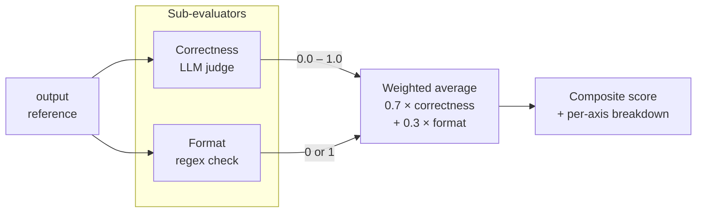

A **composite evaluator** runs several sub-checks against the same example and combines their scores into one number. Reach for it when "quality" depends on multiple aspects — correctness, format, conciseness, citations — and you want a single value to compare runs by, plus a breakdown to debug them.

The example below mixes:

- An **LLM judgment** for correctness, built with `arize-phoenix-evals` `ClassificationEvaluator`.
- A **deterministic code check** for format — a regex for a citation tag at the end of the answer.

The score is the weighted average; every sub-score and the LLM's reasoning land in the `explanation` so you can audit how the final number was built.



Each axis runs independently — some can be LLM-judged, others pure code — and their scores blend into one number you can rank runs by.

## Code

<Tabs>
<Tab title="Python" icon="python">
```python
import re

from phoenix.evals import LLM, ClassificationEvaluator

_llm = LLM(provider="openai", model="gpt-4o-mini")

_correctness = ClassificationEvaluator(
    name="correctness",
    llm=_llm,
    prompt_template=(
        "Is the answer factually correct given the reference?\n\n"
        "Reference: {reference}\n\nAnswer: {output}"
    ),
    choices={"correct": 1.0, "partially_correct": 0.5, "incorrect": 0.0},
)

# Format check: the answer should end with a citation tag like [src:1].
_CITATION = re.compile(r"\[src:\d+\]\s*$")

WEIGHTS = {"correctness": 0.7, "format": 0.3}


def evaluate(output, reference):
    if not output or not reference:
        return {
            "label": "missing",
            "score": 0.0,
            "explanation": "Missing output or reference.",
        }

    text = str(output)

    # Sub-score 1: LLM-judged correctness (one API call).
    correctness = _correctness.evaluate(
        {"output": text, "reference": str(reference)}
    )[0]
    correctness_score = correctness.score if correctness.score is not None else 0.0

    # Sub-score 2: deterministic format check (no API call).
    format_score = 1.0 if _CITATION.search(text) else 0.0

    sub_scores = {"correctness": correctness_score, "format": format_score}
    total_weight = sum(WEIGHTS.values())
    combined = sum(WEIGHTS[k] * sub_scores[k] for k in WEIGHTS) / total_weight

    breakdown = ", ".join(
        f"{k}={sub_scores[k]:.2f}×{WEIGHTS[k]:.2f}" for k in WEIGHTS
    )
    return {
        "score": combined,
        "explanation": (
            f"Composite={combined:.4f}; {breakdown}. "
            f"Correctness reason: {correctness.explanation or 'n/a'}"
        ),
    }
```

**Sandbox dependencies** — paste into the sandbox configuration's Dependencies field, one package per line:

```
arize-phoenix-evals
openai
```
</Tab>
<Tab title="TypeScript" icon="js">
```typescript
import { openai } from "@ai-sdk/openai";
import { createClassificationEvaluator } from "@arizeai/phoenix-evals";

const correctnessEval = createClassificationEvaluator({
  name: "correctness",
  model: openai("gpt-4o-mini"),
  promptTemplate:
    "Is the answer factually correct given the reference?\n\n" +
    "Reference: {{ reference }}\n\nAnswer: {{ output }}",
  choices: { correct: 1, partially_correct: 0.5, incorrect: 0 },
});

const CITATION = /\[src:\d+\]\s*$/;
const WEIGHTS: Record<string, number> = { correctness: 0.7, format: 0.3 };

async function evaluate({ output, reference }: EvaluatorParams) {
  if (!output || !reference) {
    return {
      label: "missing",
      score: 0,
      explanation: "Missing output or reference.",
    };
  }

  const text = String(output);

  // Sub-score 1: LLM-judged correctness (one API call).
  const correctness = await correctnessEval.evaluate({
    output: text,
    reference: String(reference),
  });
  const correctnessScore = correctness.score ?? 0;

  // Sub-score 2: deterministic format check (no API call).
  const formatScore = CITATION.test(text) ? 1 : 0;

  const subScores: Record<string, number> = {
    correctness: correctnessScore,
    format: formatScore,
  };
  const totalWeight = Object.values(WEIGHTS).reduce((a, b) => a + b, 0);
  const combined =
    Object.entries(WEIGHTS).reduce(
      (sum, [k, w]) => sum + w * (subScores[k] ?? 0),
      0
    ) / totalWeight;

  const breakdown = Object.entries(WEIGHTS)
    .map(([k, w]) => `${k}=${subScores[k].toFixed(2)}×${w.toFixed(2)}`)
    .join(", ");
  return {
    score: combined,
    explanation:
      `Composite=${combined.toFixed(4)}; ${breakdown}. ` +
      `Correctness reason: ${correctness.explanation ?? "n/a"}`,
  };
}
```

The Python prompt template uses f-string-style `{variable}` placeholders; the TypeScript variant uses Mustache-style `{{ variable }}` — that difference is in `arize-phoenix-evals` / `@arizeai/phoenix-evals` themselves, not in your evaluator.

**Sandbox dependencies** — paste into the sandbox configuration's Dependencies field, one package per line:

```
@arizeai/phoenix-evals
ai
@ai-sdk/openai
```
</Tab>
</Tabs>

## Input mapping

| Parameter | Bind to |
|-----------|---------|
| `output` | The model output to grade, usually `output`. |
| `reference` | The ground-truth answer, usually `reference`. |

If you add more sub-scores (e.g. a conciseness check that needs the original `input`), expose them as new parameters here.

## Output configuration

Continuous score in the range `0.0` to `1.0` (matches the choice scores you configured on each sub-evaluator). Optimization direction: **maximize**.

## Runtime requirements

| Setting | Value |
|---------|-------|
| Sandbox | A **hosted** backend that matches your language. Python: **E2B**, **Daytona — Python**, **Vercel Sandbox — Python**, or **Modal**. TypeScript: **Daytona — TypeScript** or **Vercel Sandbox — TypeScript** (the local Deno sandbox is `--no-npm` and cannot install the npm packages). |
| Dependencies | Python: `arize-phoenix-evals`, `openai`. TypeScript: `@arizeai/phoenix-evals`, `@ai-sdk/openai`, `ai`. |
| Internet access | **Required** — the LLM sub-score calls `api.openai.com`. |
| Environment variables | `OPENAI_API_KEY` — set as a **secret reference** to a key in [Settings → Secrets](/docs/phoenix/settings/secrets). |

<Warning>
`arize-phoenix-evals` pulls in `pydantic`, `httpx`, and the LLM provider SDKs you use. Cold-installing it can take 20–60s on a hosted sandbox — bump the configuration's **Timeout** accordingly, and re-use the same configuration across runs so the provider can warm-cache the environment.
</Warning>

## Variants

### Tune the weights or add more axes

The `WEIGHTS` dict is the only knob — push correctness toward `1.0` for a near-pure correctness signal, or add a third axis (e.g. `tone`, `length`, `safety`) by appending a new `ClassificationEvaluator` and another entry in the dict. Each new LLM-judged sub-score adds one more API call per example, so weigh latency and cost when stacking too many axes.

### All-code composite (no LLM)

If every sub-check is deterministic, drop `phoenix.evals` entirely — the evaluator runs in the in-process WebAssembly or Deno sandbox with no dependencies, no network, and no API key. Useful for cheap multi-rule checks: "has citation tag", "ends with period", "under 500 tokens".

### All-LLM composite (no code rules)

Replace the format regex with a second `ClassificationEvaluator` for `conciseness`, `tone`, or whatever other axis you care about. Every sub-score becomes a judge call, so latency and cost scale linearly with the number of axes.

## Related

- [LLM Jury](/docs/phoenix/evaluation/server-evals/code-evaluators/llm-jury) — instead of combining different *axes* of one judgment, combine the *same* judgment from multiple LLMs.
