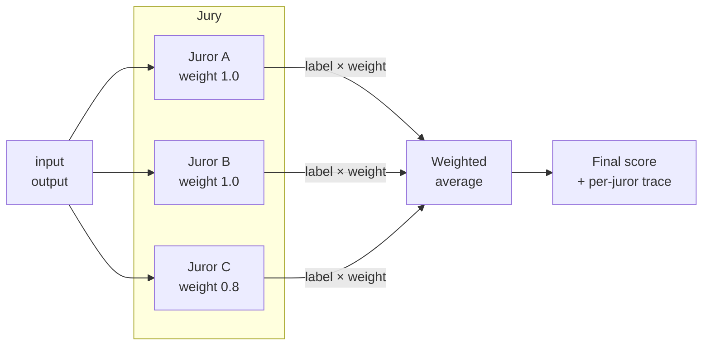

An **LLM jury** runs the same judgment through several LLMs — typically from different providers — and combines their verdicts. Each juror has a trust weight, the final score is the weighted average of the per-juror scores, and the per-juror labels (plus any errors) land in the `explanation` so you can audit who voted what.

The example below is **reference-free**: the jurors score the answer against the question alone, with no ground-truth label to compare against. This is the right pattern when you don't have labeled data — production traces, open-ended generation, or any task where the "correct" answer isn't a fixed string you can store in a dataset.

<Info>
**Reference-free vs. reference-based.** An evaluator is *reference-based* when it compares the output to a known-good answer stored alongside the example — that label is what makes a dataset a **golden dataset**, and metrics like [JSON Distance](/docs/phoenix/evaluation/server-evals/code-evaluators/json-distance) or the [Pairwise Evaluator](/docs/phoenix/evaluation/server-evals/code-evaluators/pairwise) rely on it. *Reference-free* evaluators skip that comparison and judge the output against the input alone (or against rubric criteria), which is what you have to do when no golden answer exists. To convert this example to reference-based, change the prompt to compare `output` against `reference` and bind the `reference` parameter in the input-mapping panel.
</Info>

Reach for an LLM jury when:

- One judge's biases or self-preference are skewing your scores and you want a more robust verdict.
- The output is high-stakes and the extra cost of N model calls is worth a more reliable score.
- You're benchmarking judge models against each other — the per-juror breakdown shows their agreement rate over the dataset.

The implementation uses `arize-phoenix-evals` / `@arizeai/phoenix-evals` to put every provider behind a uniform `ClassificationEvaluator` interface, so adding a juror is a one-liner.



Every juror sees the same prompt; their verdicts and weights combine into one score, and the per-juror labels (plus any errors) land in the explanation.

## Code

<Tabs>
<Tab title="Python" icon="python">
```python
from phoenix.evals import LLM, ClassificationEvaluator

_PROMPT = (
    "Does the answer correctly and completely address the question?\n\n"
    "Question: {input}\n\nAnswer: {output}"
)
_CHOICES = {"correct": 1.0, "partially_correct": 0.5, "incorrect": 0.0}


# Each juror: (LLM, weight). Weights reflect how much you trust each model.
_JURORS = [
    (LLM(provider="openai", model="gpt-4o-mini"), 1.0),
    (LLM(provider="anthropic", model="claude-haiku-4-5"), 1.0),
    (LLM(provider="google", model="gemini-2.5-flash"), 0.8),
]

_EVALUATORS = [
    (
        ClassificationEvaluator(
            name=f"jury_{llm.provider}",
            llm=llm,
            prompt_template=_PROMPT,
            choices=_CHOICES,
        ),
        weight,
    )
    for llm, weight in _JURORS
]


def evaluate(output, input):
    if not output or not input:
        return {
            "label": "missing",
            "score": 0.0,
            "explanation": "Missing input or output.",
        }

    inputs = {"input": str(input), "output": str(output)}
    weighted_sum = 0.0
    weight_total = 0.0
    parts = []

    for evaluator, weight in _EVALUATORS:
        try:
            result = evaluator.evaluate(inputs)[0]
        except Exception as exc:
            parts.append(f"{evaluator.name}=error:{exc.__class__.__name__}")
            continue

        score = result.score if result.score is not None else 0.0
        weighted_sum += weight * score
        weight_total += weight
        parts.append(
            f"{evaluator.name}({result.label or '?'})={score:.2f}×{weight:.1f}"
        )

    if weight_total == 0.0:
        return {
            "label": "invalid",
            "score": 0.0,
            "explanation": "All jurors errored. " + "; ".join(parts),
        }

    final_score = weighted_sum / weight_total
    return {
        "score": final_score,
        "explanation": f"Jury={final_score:.4f}; " + ", ".join(parts),
    }
```

**Sandbox dependencies** — paste into the sandbox configuration's Dependencies field, one package per line:

```
arize-phoenix-evals
openai
anthropic
google-genai
```
</Tab>
<Tab title="TypeScript" icon="js">
```typescript
import { anthropic } from "@ai-sdk/anthropic";
import { google } from "@ai-sdk/google";
import { openai } from "@ai-sdk/openai";
import {
  ClassificationEvaluator,
  createClassificationEvaluator,
} from "@arizeai/phoenix-evals";

const PROMPT =
  "Does the answer correctly and completely address the question?\n\n" +
  "Question: {{ input }}\n\nAnswer: {{ output }}";
const CHOICES = { correct: 1, partially_correct: 0.5, incorrect: 0 };

// Each juror: an evaluator + a trust weight.
const JURORS: Array<{
  evaluator: ClassificationEvaluator<{ input: string; output: string }>;
  weight: number;
  name: string;
}> = [
  {
    name: "openai",
    weight: 1.0,
    evaluator: createClassificationEvaluator({
      name: "jury_openai",
      model: openai("gpt-4o-mini"),
      promptTemplate: PROMPT,
      choices: CHOICES,
    }),
  },
  {
    name: "anthropic",
    weight: 1.0,
    evaluator: createClassificationEvaluator({
      name: "jury_anthropic",
      model: anthropic("claude-haiku-4-5"),
      promptTemplate: PROMPT,
      choices: CHOICES,
    }),
  },
  {
    name: "google",
    weight: 0.8,
    evaluator: createClassificationEvaluator({
      name: "jury_google",
      model: google("gemini-2.5-flash"),
      promptTemplate: PROMPT,
      choices: CHOICES,
    }),
  },
];

async function evaluate({ output, input }: EvaluatorParams) {
  if (!output || !input) {
    return {
      label: "missing",
      score: 0,
      explanation: "Missing input or output.",
    };
  }

  const inputs = { input: String(input), output: String(output) };

  // Fan out to all jurors in parallel — independent API calls.
  const settled = await Promise.allSettled(
    JURORS.map(({ evaluator }) => evaluator.evaluate(inputs))
  );

  let weightedSum = 0;
  let weightTotal = 0;
  const parts: string[] = [];

  settled.forEach((res, i) => {
    const { name, weight } = JURORS[i];
    if (res.status === "rejected") {
      parts.push(`${name}=error:${(res.reason as Error).name}`);
      return;
    }
    const score = res.value.score ?? 0;
    weightedSum += weight * score;
    weightTotal += weight;
    parts.push(
      `${name}(${res.value.label ?? "?"})=${score.toFixed(2)}×${weight.toFixed(1)}`
    );
  });

  if (weightTotal === 0) {
    return {
      label: "invalid",
      score: 0,
      explanation: `All jurors errored. ${parts.join("; ")}`,
    };
  }

  const finalScore = weightedSum / weightTotal;
  return {
    score: finalScore,
    explanation: `Jury=${finalScore.toFixed(4)}; ${parts.join(", ")}`,
  };
}
```

The TypeScript version fans out to all jurors in parallel with `Promise.allSettled`, so wall-clock latency is roughly the slowest single juror's call — not the sum. The Python version dispatches sequentially; if latency matters, submit each `evaluator.evaluate(...)` call to a `concurrent.futures.ThreadPoolExecutor` and gather the results.

**Sandbox dependencies** — paste into the sandbox configuration's Dependencies field, one package per line:

```
@arizeai/phoenix-evals
ai
@ai-sdk/openai
@ai-sdk/anthropic
@ai-sdk/google
```
</Tab>
</Tabs>

## Input mapping

| Parameter | Bind to |
|-----------|---------|
| `input` | The question (or prompt/task) the model was asked to answer, usually `input`. |
| `output` | The model output to grade, usually `output`. |

No `reference` is required — this is a reference-free judgment. If you do have labeled data and want to use it, add a `reference` parameter to the function signature, update the prompt to incorporate it, and bind it in the input-mapping panel.

## Output configuration

Continuous score in the range `0.0` to `1.0` (matches the weighted average of the configured choice scores). Optimization direction: **maximize**.

## Runtime requirements

| Setting | Value |
|---------|-------|
| Sandbox | A **hosted** backend that matches your language. Python: **E2B**, **Daytona — Python**, **Vercel Sandbox — Python**, or **Modal**. TypeScript: **Daytona — TypeScript** or **Vercel Sandbox — TypeScript** (the local Deno sandbox is `--no-npm` and cannot install npm packages). |
| Dependencies | Python: `arize-phoenix-evals`, `openai`, `anthropic`, `google-genai`. TypeScript: `@arizeai/phoenix-evals`, `ai`, `@ai-sdk/openai`, `@ai-sdk/anthropic`, `@ai-sdk/google`. |
| Internet access | **Required** — the sandbox must reach `api.openai.com`, `api.anthropic.com`, and `generativelanguage.googleapis.com`. |
| Environment variables | `OPENAI_API_KEY`, `ANTHROPIC_API_KEY`, `GOOGLE_GENERATIVE_AI_API_KEY` — set each as a **secret reference** to a key in [Settings → Secrets](/docs/phoenix/settings/secrets). Drop a juror entirely if you don't want to provision that provider's key. |

<Warning>
The jury makes **N API calls per example** — one per juror — and pays the full install cost for every provider SDK on cold start. `arize-phoenix-evals` alone pulls `pydantic` and `httpx`; each provider SDK adds another 10–40 MB. Bump the sandbox configuration's **Timeout** to comfortably cover N round-trips plus the install, and reuse the same configuration across runs so the provider can warm-cache it.

The model IDs above (`gpt-4o-mini`, `claude-haiku-4-5`, `gemini-2.5-flash`) are reasonable defaults at the time of writing — swap them for the latest stable IDs from the provider's docs.
</Warning>

## Variants

### Weighted majority vote (categorical jury)

Instead of averaging numeric scores, count votes per label and return whichever label wins by weight. Use this when downstream consumers want a discrete verdict (`correct` / `incorrect`) rather than a continuous score. The sketch below replaces the score-averaging block; the per-juror collection loop stays the same:

```python
votes: dict[str, float] = {}
for label, weight in juror_results:  # collected the same way as above
    votes[label] = votes.get(label, 0.0) + weight
winner = max(votes, key=votes.get) if votes else "invalid"
return {
    "label": winner,
    "score": _CHOICES.get(winner, 0.0),
    "explanation": f"Votes: {votes}",
}
```

### Agreement filter (high-confidence subset)

For training-data filtering, return a non-zero score only when **all** jurors agree — otherwise drop the example. Score collapses to `0` or `1`; label becomes `agreement` / `disagreement`.

## Related

- [Pairwise Evaluator](/docs/phoenix/evaluation/server-evals/code-evaluators/pairwise) — single LLM judging `output` head-to-head against a `reference` baseline (blinded to avoid position bias).
- [Composite Evaluator](/docs/phoenix/evaluation/server-evals/code-evaluators/composite) — combine different *axes* of judgment (from possibly different judges) into one score.
