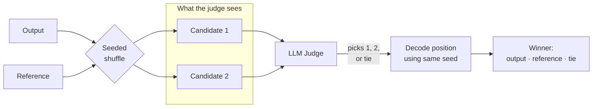

A **pairwise evaluator** puts the model `output` head-to-head against a `reference` answer and returns a winner (or a tie). Use it to benchmark a new prompt or model against a known-good baseline that's already in the dataset row.

The example below asks an LLM judge to pick the better candidate — but **blinds** the judge so it never sees which side is the model output and which is the reference. The presentation order is randomized per example using a seed derived from the inputs (so runs stay reproducible), and the judge's positional choice is decoded back to the original labels after the call. This mitigates LLM position bias — the tendency of judges to systematically prefer whichever response they see first.



The judge never sees which side is the model output and which is the reference — only "Candidate 1" and "Candidate 2". The seeded shuffle is deterministic per example, so the same inputs always produce the same presentation order.

## Code

<Tabs>
<Tab title="Python" icon="python">
```python
import hashlib
import json
import os

from openai import OpenAI

_MODEL = "gpt-4o-mini"
_client = OpenAI(api_key=os.environ["OPENAI_API_KEY"])

_SYSTEM_PROMPT = (
    "You are an impartial judge comparing two candidate responses. "
    "Decide which candidate is the better answer. "
    "Reply with strict JSON: "
    '{"winner": "1" | "2" | "tie", "reason": "<one-sentence justification>"}.'
)

_USER_TEMPLATE = """Candidate 1:
{first}

Candidate 2:
{second}"""


def _seeded_flip(*parts):
    """Return True if output and reference should be swapped before showing to the judge.

    Seed is derived deterministically from the inputs so two runs on the same
    example produce the same presentation order — important for reproducibility
    and for caching at the LLM layer.
    """
    digest = hashlib.sha256("|".join(parts).encode("utf-8")).hexdigest()
    return int(digest[:8], 16) % 2 == 1


def evaluate(output, reference):
    if not output or not reference:
        return {
            "label": "missing",
            "score": 0.0,
            "explanation": "Missing output or reference.",
        }

    flip = _seeded_flip(str(output), str(reference))
    first, second = (reference, output) if flip else (output, reference)

    response = _client.chat.completions.create(
        model=_MODEL,
        temperature=0,
        response_format={"type": "json_object"},
        messages=[
            {"role": "system", "content": _SYSTEM_PROMPT},
            {
                "role": "user",
                "content": _USER_TEMPLATE.format(first=first, second=second),
            },
        ],
    )

    try:
        parsed = json.loads(response.choices[0].message.content)
    except (json.JSONDecodeError, AttributeError, TypeError) as exc:
        return {
            "label": "invalid",
            "score": 0.0,
            "explanation": f"Failed to parse judge response: {exc}",
        }

    winner_position = str(parsed.get("winner", "")).strip()
    reason = str(parsed.get("reason", ""))[:300]

    # Decode position back to output / reference using the flip we applied.
    if winner_position == "tie":
        label = "tie"
    elif winner_position == "1":
        label = "reference" if flip else "output"
    elif winner_position == "2":
        label = "output" if flip else "reference"
    else:
        return {
            "label": "invalid",
            "score": 0.0,
            "explanation": (
                f"Judge returned unexpected winner {winner_position!r}; "
                f"expected '1', '2', or 'tie'."
            ),
        }

    score = {"output": 1.0, "reference": -1.0, "tie": 0.0}[label]
    output_position = "2" if flip else "1"
    return {
        "label": label,
        "score": score,
        "explanation": (
            f"Judge chose position {winner_position} "
            f"(output was shown as position {output_position}). {reason}"
        ),
    }
```

**Sandbox dependencies** — paste into the sandbox configuration's Dependencies field, one package per line:

```
openai
```
</Tab>
<Tab title="TypeScript" icon="js">
```typescript
import OpenAI from "openai";

const MODEL = "gpt-4o-mini";
const client = new OpenAI({ apiKey: process.env.OPENAI_API_KEY });

const SYSTEM_PROMPT =
  "You are an impartial judge comparing two candidate responses. " +
  "Decide which candidate is the better answer. " +
  "Reply with strict JSON: " +
  '{"winner": "1" | "2" | "tie", "reason": "<one-sentence justification>"}.';

function userPrompt(first: string, second: string): string {
  return `Candidate 1:\n${first}\n\nCandidate 2:\n${second}`;
}

// Deterministic per-example flip without external deps. Not cryptographically
// strong — just a stable, well-distributed seed so the order is reproducible.
function seededFlip(...parts: string[]): boolean {
  let hash = 5381;
  const input = parts.join("|");
  for (let i = 0; i < input.length; i++) {
    hash = ((hash << 5) + hash + input.charCodeAt(i)) | 0;
  }
  return (hash & 1) === 1;
}

async function evaluate({ output, reference }: EvaluatorParams) {
  if (!output || !reference) {
    return {
      label: "missing",
      score: 0,
      explanation: "Missing output or reference.",
    };
  }

  const flip = seededFlip(String(output), String(reference));
  const [first, second] = flip
    ? [String(reference), String(output)]
    : [String(output), String(reference)];

  const response = await client.chat.completions.create({
    model: MODEL,
    temperature: 0,
    response_format: { type: "json_object" },
    messages: [
      { role: "system", content: SYSTEM_PROMPT },
      { role: "user", content: userPrompt(first, second) },
    ],
  });

  let parsed: { winner?: unknown; reason?: unknown };
  try {
    parsed = JSON.parse(response.choices[0].message.content ?? "{}");
  } catch (err) {
    return {
      label: "invalid",
      score: 0,
      explanation: `Failed to parse judge response: ${(err as Error).message}`,
    };
  }

  const winnerPosition = String(parsed.winner ?? "").trim();
  const reason = String(parsed.reason ?? "").slice(0, 300);

  let label: "output" | "reference" | "tie";
  if (winnerPosition === "tie") {
    label = "tie";
  } else if (winnerPosition === "1") {
    label = flip ? "reference" : "output";
  } else if (winnerPosition === "2") {
    label = flip ? "output" : "reference";
  } else {
    return {
      label: "invalid",
      score: 0,
      explanation: `Judge returned unexpected winner ${JSON.stringify(
        winnerPosition
      )}; expected "1", "2", or "tie".`,
    };
  }

  const scoreMap: Record<typeof label, number> = {
    output: 1,
    reference: -1,
    tie: 0,
  };
  const outputPosition = flip ? "2" : "1";
  return {
    label,
    score: scoreMap[label],
    explanation:
      `Judge chose position ${winnerPosition} ` +
      `(output was shown as position ${outputPosition}). ${reason}`,
  };
}
```

The TypeScript version uses a small djb2-style string hash instead of SHA-256 to avoid a `node:crypto` import that may not resolve in every TS sandbox. It's not cryptographically strong — it doesn't need to be — but it's deterministic and well-distributed enough to balance presentation orders across the dataset.

**Sandbox dependencies** — paste into the sandbox configuration's Dependencies field, one package per line:

```
openai
```
</Tab>
</Tabs>

The `flip` decision is recorded in the explanation so you can audit the decoding from the trace.

## Input mapping

| Parameter | Bind to |
|-----------|---------|
| `output` | The model output you want to evaluate, usually `output`. |
| `reference` | The competing answer to compare against — typically the baseline or known-good response stored on the example, usually `reference`. |

## Output configuration

Categorical. The function returns its own numeric score along with the label, so configure these label-to-score mappings to match what it produces:

| Label | Score | Meaning |
|-------|-------|---------|
| `output` | `1.0` | The model output beats the reference. |
| `reference` | `-1.0` | The reference beats the model output. |
| `tie` | `0.0` | Judge could not separate them. |
| `missing` | `0.0` | One of the inputs was empty. |
| `invalid` | `0.0` | Judge returned malformed output. |

Optimization direction: **maximize** — you want `output` to win against the reference baseline.

## Runtime requirements

| Setting | Value |
|---------|-------|
| Sandbox | A **hosted** backend that matches your language. Python: **E2B**, **Daytona — Python**, **Vercel Sandbox — Python**, or **Modal**. TypeScript: **Daytona — TypeScript** or **Vercel Sandbox — TypeScript** (the local Deno sandbox is started with `--no-npm` and cannot install the `openai` package). |
| Dependencies | Python: `openai`. TypeScript: `openai` (npm). |
| Internet access | **Required** — toggle **Allow Internet Access** on. The sandbox must reach `api.openai.com`. |
| Environment variables | `OPENAI_API_KEY` — preferably set as a **secret reference** to a key in [Settings → Secrets](/docs/phoenix/settings/secrets). |

<Warning>
Each `evaluate(...)` call makes **one** chat-completion request against `gpt-4o-mini`. At scale:

- Raise the sandbox configuration's **Timeout** to comfortably cover the LLM round-trip plus a cold-start package install.
- Watch the judge's per-token cost — every pairwise prompt includes both the output and the reference, so token counts grow with output length.
- For high-stakes evaluations, see the **Swap-and-confirm** variant below. It doubles the cost but removes position bias on every example, instead of relying on randomized order to cancel it out in aggregate.
</Warning>

## Variants

### Swap-and-confirm (position-bias-free)

The blinding above randomizes order per example, so position bias cancels out in expectation — but any single example can still be biased. To remove it per-example, call the judge twice (once in each order) and only return a winner when both calls agree:

```python
def evaluate(output, reference):
    if not output or not reference:
        return {"label": "missing", "score": 0.0, "explanation": "Missing input."}

    def _ask(first, second):
        response = _client.chat.completions.create(
            model=_MODEL,
            temperature=0,
            response_format={"type": "json_object"},
            messages=[
                {"role": "system", "content": _SYSTEM_PROMPT},
                {
                    "role": "user",
                    "content": _USER_TEMPLATE.format(first=first, second=second),
                },
            ],
        )
        return json.loads(response.choices[0].message.content).get("winner")

    pick_or = _ask(output, reference)  # "1" = output, "2" = reference, "tie"
    pick_ro = _ask(reference, output)  # "1" = reference, "2" = output, "tie"

    # Translate both picks into output / reference / tie.
    vote_or = {"1": "output", "2": "reference", "tie": "tie"}.get(pick_or, "invalid")
    vote_ro = {"1": "reference", "2": "output", "tie": "tie"}.get(pick_ro, "invalid")

    if vote_or == vote_ro and vote_or in {"output", "reference", "tie"}:
        label = vote_or
    else:
        label = "tie"  # disagreement → call it a tie

    score = {"output": 1.0, "reference": -1.0, "tie": 0.0, "invalid": 0.0}[label]
    return {
        "label": label,
        "score": score,
        "explanation": (
            f"Order output,reference → {pick_or}; "
            f"order reference,output → {pick_ro}; final = {label}."
        ),
    }
```

Costs 2× the API calls, but each example's verdict is independent of the underlying model's position bias.

### Other directions

- **Multi-criterion judging** — ask the judge to score on several axes (correctness, conciseness, format) and combine the per-axis verdicts. Return a structured `explanation` so the trace shows the breakdown.
- **Embedding-based pairwise** — replace the LLM call with cosine similarity between `output` and `reference` using OpenAI embeddings or [scikit-learn](/docs/phoenix/evaluation/server-evals/code-evaluators/scikit-learn). Cheaper and deterministic, but it won't catch semantic equivalence the way an LLM judge can on free-text answers.
