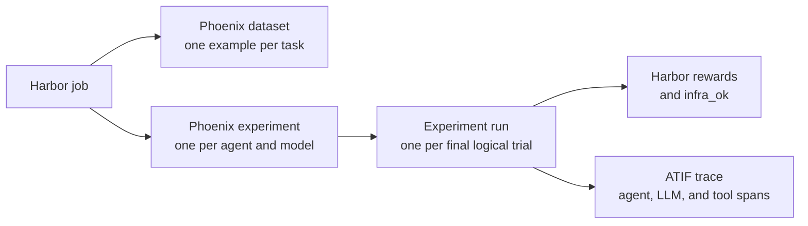

[Harbor](https://harborframework.com/) runs AI agents against tasks in sandboxed environments. Its Phoenix plugin records those jobs as versioned datasets and experiments. You can compare agents, models, and repetitions in Phoenix, then open the trace behind an individual score.

Harbor remains responsible for running agents and verifiers. Phoenix stores and displays the resulting tasks, runs, rewards, errors, and traces. The plugin does not rerun tasks or calculate a replacement reward.



## When to use the plugin

Use the plugin when Harbor runs your benchmark and you want to:

- compare agents or models over the same task set;
- track results across repeated benchmark jobs;
- separate behavioral scores from infrastructure failures;
- inspect an Agent Trajectory Interchange Format (ATIF) trace for a scored run; or
- keep completed results when a long job stops early.

Omit the plugin when you want a Harbor-only job. Selecting the plugin makes Phoenix recording part of the job contract. A setup or result-write failure stops the job instead of continuing with unrecorded trials.

<Info>
The integration requires Python 3.12 or newer, Harbor 0.21.0 or newer, and Phoenix server 15.0 or newer.
</Info>

## Install and run

Install the Phoenix client and Harbor in the same Python environment:

```bash
pip install "arize-phoenix-client[harbor]"
```

Set the connection to your Phoenix instance. Self-hosted Phoenix uses `http://localhost:6006` by default.

```bash
export PHOENIX_COLLECTOR_ENDPOINT=http://localhost:6006
export PHOENIX_API_KEY=your-api-key
```

You can omit `PHOENIX_API_KEY` when your instance does not require authentication. See [What is my Phoenix endpoint?](/docs/phoenix/resources/frequently-asked-questions/what-is-my-phoenix-endpoint) for hosted and self-hosted endpoint formats.

Add the plugin to a Harbor job:

```bash
harbor run \
  -d terminal-bench/terminal-bench-2 \
  -a terminus-2 \
  -m openai/gpt-5-mini \
  --plugin arize-phoenix \
  --yes
```

## What you'll see in Phoenix

At job start, the plugin creates or reuses a versioned dataset for the resolved task set. Each Harbor task becomes a dataset example, and each agent and model configuration gets its own experiment.

As each final logical trial finishes, Phoenix adds a run to the matching experiment. The run has Harbor's verifier rewards and an `infra_ok` evaluation. It also shows an error when Harbor recorded an exception and links to an ATIF trace when tracing succeeds.

<Tip>
Start with the default `atif` mode when your Harbor agent writes ATIF trajectories. It captures agent execution without adding tracing code or giving the sandbox network access to Phoenix.
</Tip>

## How Harbor data maps to Phoenix

| Harbor object | Phoenix object | Details |
| --- | --- | --- |
| Dataset | Dataset | The plugin synchronizes the complete resolved task set at job start. |
| Task | Dataset example | The input contains the task ID, name, instruction, and ordered step instructions. |
| Task digest | Example metadata | The digest covers the solution, environment, tests, and steps. |
| Agent and model | Experiment | Each distinct agent and model configuration gets its own experiment. |
| Planned task attempt | Repetition | Repetitions use stable, one-based numbers from the job plan. |
| Final logical trial | Experiment run | Physical retries keep the logical repetition number. The plugin records only the terminal attempt. |
| Verifier reward | Experiment evaluation | The plugin records each Harbor reward as a named CODE evaluation on the experiment run. |
| Trial or step exception | Run error | Errors are stored separately from behavioral rewards. |
| ATIF trajectory | Trace | One trial-level trace links to the experiment run when conversion succeeds. Multi-step trials include one span per attempted step. |

Each Harbor task becomes one dataset example, including a multi-step task. For a multi-step task, the example input also contains the ordered step names and instructions. Phoenix dataset examples have an empty reference `output` because Harbor verifies an environment state rather than a single reference response.

Each run output includes the Harbor trial ID, trial name, trial URI, and task name. It also includes Harbor's token totals and cost when the agent reports them. Task metadata keeps environment variable names but redacts their values.

### Dataset versions

The plugin uses the Harbor task ID as the stable example ID. It synchronizes the full task set each time a job starts.

- An unchanged task set reuses the current dataset version.
- Adding, removing, or changing a task creates a new dataset version.
- An experiment stays pinned to the dataset version used when the experiment was created.

The plugin infers a Phoenix dataset name for each supported single-source job. The inferred name depends on the Harbor task source:

| Harbor source | Phoenix dataset name |
| --- | --- |
| Named registry dataset | The selected dataset name |
| Published package | The selected `<organization>/<dataset>` name |
| Local dataset path | The resolved directory name |
| Repository dataset | The resolved registry metadata name |
| One direct task | `harbor-task/<task-name>` |

Provide `dataset=<name>` only when a job contains several direct tasks, which have no shared collection name, or when you want to customize the dataset's display name in Phoenix. Add this setting to the job's existing command:

```bash
--plugin-kwarg dataset=release-candidate-tasks
```

Use one task collection per job. The plugin rejects jobs that mix a configured dataset with direct tasks or include several configured datasets.

## Read scores correctly

Harbor tasks can use different verifiers, so the plugin keeps summary metrics separate from task-specific diagnostics. Phoenix does not run a second evaluator. The plugin stores the rewards returned by Harbor as experiment evaluations on each run.

| Phoenix evaluation | Coverage | Meaning |
| --- | --- | --- |
| `reward` | Runs whose final verifier emits a literal `reward` key | Harbor's conventional behavioral score. A score of `0` is a valid result, not an infrastructure error. |
| `infra_ok` | Every recorded run | `1` when Harbor records no trial or step exception, otherwise `0`. |
| `<reward_key>` | Runs whose final verifier emits that key | A trial-level reward or diagnostic in Harbor's original numeric scale. |
| `<step_name>.<reward_key>` | Runs whose step verifier emits that key | A step-level score for diagnosing multi-step tasks. |

A multi-step run can have verifier rewards and an exception at the same time. Phoenix keeps both: the reward remains available, while the run has an error and `infra_ok=0`.

Trial-level evaluations for a multi-step task include the resolved `multi_step_reward_strategy` in their metadata. Harbor uses `mean` when the task does not set a strategy; an explicit `final` value remains `final`. Step evaluations and `infra_ok` do not carry this metadata.

For comparisons, check `reward` coverage before calculating an aggregate. Then use `infra_ok` to separate agent behavior from broken environments, timeouts, or verifier failures. Step-level scores show where a multi-step task failed.

## Understand ATIF traces

ATIF is the default trace mode. The plugin reads saved trajectories after the final trial attempt, converts them to OpenInference spans, and uploads them to the experiment's Phoenix project. The sandbox does not need a Phoenix endpoint or Phoenix credentials.

One Harbor trial becomes one trace and one Phoenix session. A multi-step trial adds a span for each attempted step:

```text
harbor.trial <task>                  CHAIN
  harbor.step 1 <step name>          CHAIN, multi-step trials only
    <agent>                          AGENT
      turn 1                         AGENT, multi-turn trajectories only
        iteration 1                  CHAIN
          <model>                    LLM
          <tool>                     TOOL
            <subagent>               AGENT
```

Single-step trajectories attach directly to the `harbor.trial` root. Each multi-step `harbor.step` span records the step instruction, timing, exception status, and any verifier rewards. Its trajectories appear beneath it. This keeps an attempted step visible even when Harbor did not save a trajectory for that step.

Agent, model, and tool spans use their names from ATIF. Fresh agent operations use `iteration N`; context-management operations use `compaction N`; and other operational system steps use `system event N`. An agent step with `llm_call_count: 0` has no LLM span, but it still keeps its operation and tool spans. Continuation roots use `<agent> (continuation N)`. Referenced subagents attach to the matching tool call when `source_call_id` proves that relationship, or to the referencing operation when it does not.

The converter supports ATIF v1.0 through v1.7. It reconstructs LLM inputs from ATIF messages and marks them with `metadata.atif.input_source = "reconstructed"`; it does not parse provider-native message formats. User and system prompts and copied context contribute to those inputs without creating duplicate execution spans. An observation becomes a tool result only when its `source_call_id` matches the call. Multiple results for one call remain in order. Unmatched step observations stay on the operation span, while unassigned feedback remains structured in the reconstructed input without an invented message role or tool association. Structured text and image parts remain in serialized messages, but the plugin does not read or upload media bytes. ATIF v1.8 audio fields are not supported.

Only LLM spans carry `llm.*` attributes. The converter keeps trajectory-level `final_metrics` on the agent root so Phoenix does not count the same tokens twice. It maps producer-specific cache-write and reasoning token counts when they are present.

ATIF timestamps describe events rather than complete operation durations. The plugin uses request timings only when it can map every measurement to one LLM step. It leaves ambiguous LLM and tool durations at zero instead of inventing timing or concurrency.

Trace discovery and conversion are best-effort. If the agent does not save a valid trajectory, the plugin logs a warning and records the run and evaluations without a trace. A successful Phoenix run is immutable, so replay cannot add a missing trace link later.

Use `trace_mode=null` when the agent has no ATIF output or when you do not want traces:

```bash
harbor run \
  -p ./tasks/customer-support \
  -a your-agent \
  -m your-provider/your-model \
  --plugin arize-phoenix \
  --plugin-kwarg trace_mode=null \
  --yes
```

<Note>
Live OpenTelemetry Protocol (OTLP) support is deferred to a follow-up. This release accepts `atif` or `null`, and does not link live OpenTelemetry traces from Harbor agents to experiment runs.
</Note>

## Name experiments

The default experiment name is:

```text
{job.name} · {agent.name} · {agent.model}
```

For a job with one agent configuration, set an exact display name:

```bash
--plugin-kwarg experiment_name=release-candidate
```

For a job with several agent configurations, use a template:

```bash
--plugin-kwarg 'experiment_name_template={dataset.name} · {agent.name} · {agent.model}'
```

Available fields are `{job.name}`, `{job.id}`, `{dataset.name}`, `{agent.name}`, `{agent.model}`, and `{agent.short_digest}`.

Agent names do not need to be unique. Two agents with the same name but different effective configurations each get an experiment. If their templates render the same experiment name, the plugin appends the short agent configuration digest to distinguish them.

Experiment display names do not define identity. The plugin identifies an experiment by the Harbor job ID and the effective agent configuration. Use a new Harbor job for a new benchmark execution, even when you want to reuse the same display name.

## Configure the plugin

Pass settings with Harbor's `--plugin-kwarg` option.

| Setting | Default | Use |
| --- | --- | --- |
| `dataset` | Inferred from Harbor | Override the Phoenix dataset name. Required for several direct tasks. |
| `endpoint` | `PHOENIX_COLLECTOR_ENDPOINT` | Override the Phoenix base endpoint for this job. |
| `api_key` | `PHOENIX_API_KEY` | Override the Phoenix API key. Prefer the environment variable so the key does not enter shell history. |
| `trace_mode` | `atif` | Use `atif`, or pass `null` to disable tracing. |
| `experiment_name` | Unset | Set one exact name. Valid only for a job with one agent configuration. |
| `experiment_name_template` | `{job.name} · {agent.name} · {agent.model}` | Name one experiment per agent configuration. |

## Resume and failure behavior

The plugin writes each trial when it reaches its final state. This gives you live progress and preserves completed runs when the job stops.

On resume or replay, the plugin recovers the matching experiment, reuses matching successful runs, retries failed runs, and upserts their evaluations. If another Harbor job created a newer version of the shared dataset, the recovered experiment remains pinned to its original version. Deterministic task, run, and trace identities prevent duplicate records during sequential ingestion.

Run only one process for a given Harbor job. Experiment recovery is not atomic across multiple ingesters.

The plugin handles failures as follows:

- Phoenix setup failures stop the job before Harbor spends trial compute.
- Run or evaluation write failures stop the job. Records from completed trials remain in Phoenix and Harbor keeps its terminal results for resume.
- Missing or invalid ATIF data does not stop the job. The run remains available without a trace.

## Current limits

The plugin does not support:

- [Harbor regrade jobs](https://harborframework.com/docs/run-jobs/regrade), which run a new verifier against recorded agent work;
- post-hoc import of a finished job;
- live OTLP trace linkage, which is deferred to a follow-up;
- several configured datasets in one job;
- a mixture of configured datasets and direct tasks; or
- concurrent ingestion of the same Harbor job.

For Harbor task, dataset, agent, and job configuration, see the [Harbor documentation](https://harborframework.com/docs/).

## Give a coding agent Harbor context

Install the `phoenix-harbor` skill when a coding agent will configure or interpret the integration:

```bash
npx skills add Arize-ai/phoenix --skill phoenix-harbor
```

For example:

```text
Use the phoenix-harbor skill to add Phoenix recording to this Harbor benchmark. Keep ATIF tracing enabled and explain how I should compare behavioral reward with infra_ok.
```

See [Coding agents](/docs/phoenix/integrations/developer-tools/coding-agents#skills) for supported agents and installation options.
