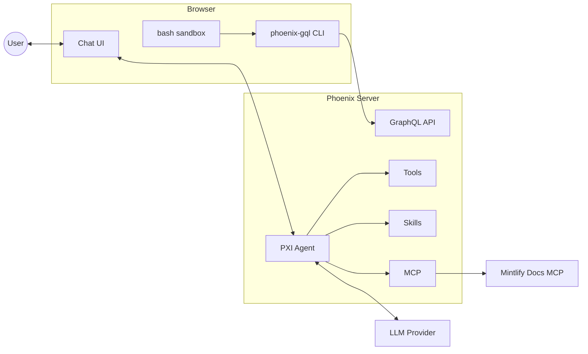

<Frame>
  
</Frame>

<Warning>
PXI is in **beta**. It can and will make mistakes, its behavior may change
between releases, and it should be used with care — especially on production
data. Review the [Privacy and observability](#privacy-and-observability) and
[Safety](#safety) sections before turning it on.
</Warning>

## What PXI is

PXI (pronounced *"pixie"*) is an agent that lives inside the Phoenix UI. It
sees what you are looking at — the current project, span, trace, time range, or
playground prompt — and can take action on your behalf:

- Navigate to traces, filter spans, and adjust the active time range.
- Read, edit, and clone playground prompt instances.
- Investigate failures using the built-in **debug trace** skill.
- Run sandboxed bash commands for ad-hoc analysis.
- Look up Phoenix documentation and, when the model supports it, search the web.

PXI is grounded in your current context. The tools it can call change depending
on the page you are on, so suggestions on a trace page differ from suggestions
in the prompt playground.

## When to use it

- **Triaging failures** — ask PXI to inspect a failing trace and propose what
  went wrong.
- **Building a filter** — describe what you want to see and let PXI set the
  spans filter and time range.
- **Iterating on a prompt** — have PXI propose edits to a playground prompt
  instance, then review and accept the diff.
- **Onboarding** — ask product questions and let PXI pull answers from the
  Phoenix docs.

PXI is not a replacement for evals, experiments, or human review. It is a
faster way to move through the product and a starting point for investigation.

## Enabling PXI

PXI is **off by default**. To turn it on, set the following environment
variable on the Phoenix server and restart:

```bash
PHOENIX_DANGEROUSLY_ENABLE_AGENTS=true
```

<Note>
The `DANGEROUSLY_` prefix is intentional. Enabling PXI gives an LLM the ability
to read Phoenix data the signed-in user can already see, and to call tools that
modify UI state. Only enable it in environments where that trade-off is
acceptable.
</Note>

PXI needs a model to talk to. Configure credentials for at least one provider
via environment variables or Phoenix secrets:

- `OPENAI_API_KEY`
- `ANTHROPIC_API_KEY`
- `GEMINI_API_KEY`
- AWS Bedrock credentials
- Or a custom provider configured under **Settings → Models**.

### Use a recommended model

PXI relies heavily on **tool calling** — almost every action it takes is a
tool call (set a filter, edit a prompt, read a span, run a debug skill). Models
that are weak at tool use will produce broken sessions, even if they handle
free-form chat well.

We curate a short list of models that PXI has been validated against. **Pick
one of these unless you have a specific reason not to:**

- **Anthropic** — `claude-opus-4-6`, `claude-sonnet-4-6`
- **OpenAI** — `gpt-5.5`, `gpt-5.4`, `gpt-5.4-mini`
- **Google** — `gemini-3.1-pro-preview`, `gemini-3.5-flash`

Other built-in or custom-provider models can be selected from the model menu,
but they are untested with PXI and may fail to invoke tools correctly. If you
swap in a non-curated model, expect rougher behavior.

The first time a user opens PXI they are shown a consent gate that explains
what gets recorded and where it is sent. Acknowledging the gate enables the
chat surface for that user.

## How it works

PXI is modeled after a **coding agent** — the same shape as Claude Code,
Cursor, or Codex — but pointed at Phoenix instead of a code editor. It has:

- A **harness of tools** for taking action in the product (set the time range,
  apply a spans filter, read a span, edit a playground prompt, render
  generative UI, ask the user a question).
- An **MCP server** that exposes the Phoenix docs to the agent — served by
  Mintlify, the same provider that hosts the public Phoenix documentation —
  so PXI can look up product behavior the same way a coding agent looks up
  library docs.
- **Skills** — reusable, multi-step playbooks for common investigations. The
  first built-in skill is `debug_trace`, which walks a failing trace and
  proposes root causes.
- A **sandboxed bash tool** for running ad-hoc queries, scripting against the
  Phoenix API, and storing intermediate files inside the agent's working
  directory.

PXI is split between the Phoenix server and the browser:

- The **server** owns everything the model sees — tool definitions, system
  prompt, skills, and capability guidance. This is the source of truth for
  what PXI can do.
- The **browser** executes tool calls that need to touch the page (filters,
  navigation, prompt edits) and dispatches server-side tools through the data
  stream.

Capabilities are gated by **context**. PXI only advertises a tool when the
required Phoenix UI context is present — for example, the prompt-edit tool is
only offered while you are on a playground page with a selected prompt. This
keeps the model from offering actions that cannot succeed on the page you are
viewing.

### Architecture



The browser owns the chat UI and a sandboxed **bash** environment. Inside that
sandbox, PXI uses the **phoenix-gql** CLI to query the Phoenix **GraphQL API**
on the server, the same authenticated endpoint a logged-in user hits from the
UI. The server hosts the PXI agent along with its model-facing surface —
**tools**, **skills**, and an **MCP** client — and calls your LLM provider
with your API key. The only external dependency is the Mintlify-hosted
Phoenix docs MCP, reached through the server's MCP client.

### Runs entirely on your Phoenix

PXI runs **inside the Phoenix process you are already running**. Concretely:

- Tool calls execute against your Phoenix server and your data — no separate
  Arize service is involved.
- The LLM behind PXI is **your model provider**, called with **your API key**
  (OpenAI, Anthropic, Google, Bedrock, or a custom provider you configured).
  Arize is not in the request path.
- Documentation lookups go to the **Mintlify-hosted Phoenix docs MCP server**,
  the same public docs surface you can read in a browser. It serves docs only.
- Arize receives PXI session traces **only if you explicitly opt in** under
  **Settings → Agents** ("Share PXI session traces with the team improving
  PXI"), and that opt-in is only available when a remote collector has been
  configured for your instance. If you never enable it, Arize never sees your
  traces, prompts, or tool outputs.

## Privacy and observability

Every PXI conversation is captured as a Phoenix trace. By default these traces
are written to a dedicated PXI project in the Phoenix instance you are using —
no data leaves your deployment.

From **Settings → Agents** you can:

- Turn local PXI tracing on or off.
- Opt into sharing PXI session traces with the team building PXI (only
  available when a remote collector is configured).

Tool inputs and outputs are recorded on the corresponding spans, which makes it
easy to audit what PXI did during a session and to evaluate PXI the same way
you evaluate any other agent in Phoenix.

## Safety

PXI is a beta feature. Keep these limits in mind:

- **Verify before you act.** PXI can apply filters, edit prompts, and run
  bash. Review proposed changes — especially prompt edits — before accepting
  them.
- **Don't point it at sensitive production data without controls.** PXI sees
  whatever the signed-in user can see. Use it against scoped projects or
  staging data while it is in beta.
- **Treat outputs as suggestions.** PXI hallucinates, especially on long
  traces or unfamiliar frameworks.

## Feedback

PXI is early and we are actively looking for improvements and ideas. If you
have feedback, run into a rough edge, or want to suggest new capabilities,
please open an issue or start a discussion on
[GitHub](https://github.com/Arize-ai/phoenix). We read everything.
