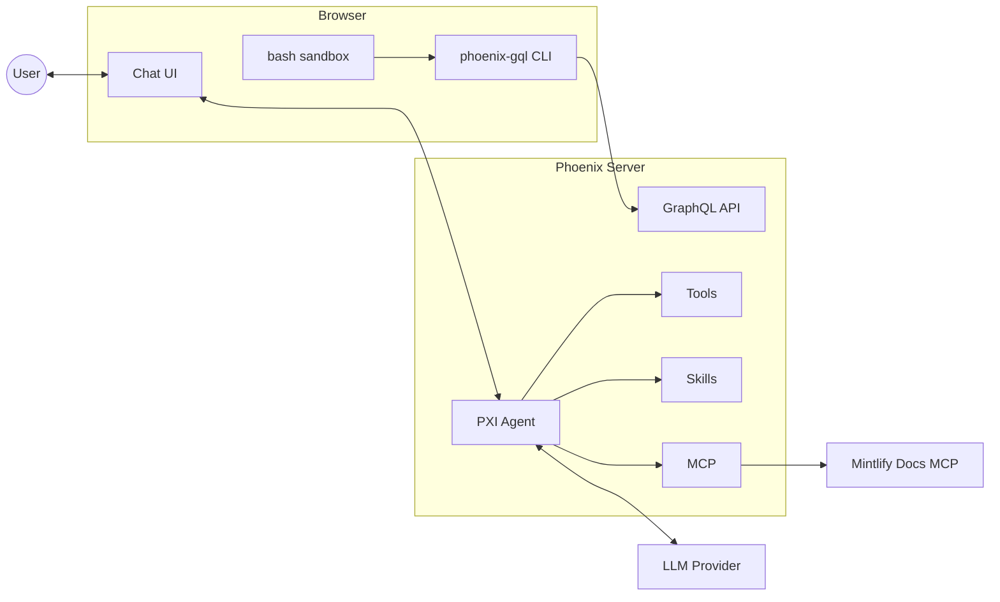

<Frame>
  
</Frame>

<Warning>
PXI is in **beta**. It can and will make mistakes, its behavior may change
between releases, and it should be used with care — especially on production
data. Review the [Privacy and observability](#privacy-and-observability) and
[Safety](#safety) sections before turning it on.
</Warning>

## What PXI is

PXI (pronounced *"pixie"*) is an agent built into Phoenix. It sees what you
are looking at and acts on your behalf:

- **Drives the product.** PXI navigates, filters, and pivots through your
  Phoenix data the same way you would — only faster.
- **Iterates with you on prompts and traces.** It reads, edits, and explores
  prompts, spans, and traces directly in context.
- **Investigates failures.** Built-in skills walk failing traces and propose
  root causes instead of leaving you to grep through spans.
- **Reasons over your data.** A sandboxed runtime lets PXI query your
  Phoenix instance to answer questions evals and dashboards cannot.
- **Knows the product.** Phoenix's own documentation is wired in as a
  first-class source, so answers are grounded rather than guessed.

Because PXI is grounded in your current context, what it can do adapts to the
page you are on — its capabilities on a trace are different from its
capabilities in the prompt playground.

## When to use it

- **Debugging.** Hand off a failing trace and get a root-cause hypothesis,
  not a list of spans to read.
- **Exploring data.** Describe the view you want and let PXI set up the
  filters, time range, and pivots.
- **Sharpening prompts.** Co-iterate on playground prompts with diffs you
  review before anything lands.
- **Learning Phoenix.** Ask product questions and get answers grounded in
  the live docs, not in training-data folklore.

PXI accelerates the loop you already run. Evals, experiments, and human
review still belong at the end of it — PXI just gets you there faster.

## Access and settings

PXI is **on by default**. Access is controlled in three layers:

- **Deployment setting.** To turn PXI off for the whole deployment, set the
  following environment variable on the Phoenix server and restart:

  ```bash
  PHOENIX_DISABLE_AGENT_ASSISTANT=true
  ```

- **System settings.** Administrators can open **Settings → Assistant →
  System settings** and turn **Assistant access** off for everyone using the
  Phoenix instance. This does not require a restart.
- **Personal settings.** Each user can open **Settings → Assistant →
  Personal settings** and turn **Use assistant** off for their browser.

<Note>
PXI gives an LLM the ability to read Phoenix data the signed-in user can
already see, and to call tools that modify UI state. If that trade-off is
not acceptable for your deployment, disable PXI with
`PHOENIX_DISABLE_AGENT_ASSISTANT=true`.
</Note>

The old `PHOENIX_DANGEROUSLY_ENABLE_AGENTS` opt-in flag is no longer used.

PXI needs a model to talk to. Configure credentials for at least one provider
via environment variables or Phoenix secrets:

- `OPENAI_API_KEY`
- `ANTHROPIC_API_KEY`
- `GEMINI_API_KEY`
- AWS Bedrock credentials
- Or a custom provider configured under **Settings → Models**.

### Use a recommended model

PXI relies heavily on **tool calling** — almost every action it takes is a
tool call (set a filter, edit a prompt, read a span, run a debug skill). Models
that are weak at tool use will produce broken sessions, even if they handle
free-form chat well.

We curate a short list of models that PXI has been validated against. **Pick
one of these unless you have a specific reason not to:**

- **Anthropic** — `claude-opus-4-6`, `claude-sonnet-4-6`
- **OpenAI** — `gpt-5.5`, `gpt-5.4`, `gpt-5.4-mini`
- **Google** — `gemini-3.1-pro-preview`, `gemini-3.5-flash`

Other built-in or custom-provider models can be selected from the model menu,
but they are untested with PXI and may fail to invoke tools correctly. If you
swap in a non-curated model, expect rougher behavior.

The first time a user opens PXI, they are shown a consent gate that asks them
to review the available assistant session trace settings. Acknowledging the
gate enables the chat surface for that browser; it does not override system
settings.

## How it works

PXI is modeled after a **coding agent** — the same shape as Claude Code,
Cursor, or Codex — but pointed at Phoenix instead of a code editor. It has:

- A **harness of tools** for taking action in the product (set the time range,
  apply a spans filter, read a span, edit a playground prompt, render
  generative UI, ask the user a question).
- An **MCP server** that exposes the Phoenix docs to the agent when external
  resources are allowed — served by Mintlify, the same provider that hosts the
  public Phoenix documentation — so PXI can look up product behavior the same
  way a coding agent looks up library docs.
- **Skills** — reusable, multi-step playbooks for common investigations. The
  first built-in skill is `debug_trace`, which walks a failing trace and
  proposes root causes.
- A **sandboxed bash tool** for running ad-hoc queries, scripting against the
  Phoenix API, and storing intermediate files inside the agent's working
  directory.

PXI is split between the Phoenix server and the browser:

- The **server** owns everything the model sees — tool definitions, system
  prompt, skills, and capability guidance. This is the source of truth for
  what PXI can do.
- The **browser** executes tool calls that need to touch the page (filters,
  navigation, prompt edits) and dispatches server-side tools through the data
  stream.

Capabilities are gated by **context**. PXI only advertises a tool when the
required Phoenix UI context is present — for example, the prompt-edit tool is
only offered while you are on a playground page with a selected prompt. This
keeps the model from offering actions that cannot succeed on the page you are
viewing.

### Architecture



The browser owns the chat UI and a sandboxed **bash** environment. Inside that
sandbox, PXI uses the **phoenix-gql** CLI to query the Phoenix **GraphQL API**
on the server, the same authenticated endpoint a logged-in user hits from the
UI. The server hosts the PXI agent along with its model-facing surface —
**tools**, **skills**, and an **MCP** client — and calls your LLM provider
with your API key. When external resources are allowed, the server also reaches
the Mintlify-hosted Phoenix docs MCP through its MCP client.

### Runs entirely on your Phoenix

PXI runs **inside the Phoenix process you are already running**. Concretely:

- Tool calls execute against your Phoenix server and your data — no separate
  Arize service is involved.
- The LLM behind PXI is **your model provider**, called with **your API key**
  (OpenAI, Anthropic, Google, Bedrock, or a custom provider you configured).
  Arize is not in the request path.
- Documentation lookups go to the **Mintlify-hosted Phoenix docs MCP server**
  when external resources are allowed. It is the same public docs surface you
  can read in a browser, and it serves docs only. Set
  `PHOENIX_ALLOW_EXTERNAL_RESOURCES=false` to disable external docs lookups and
  web access, or set `PHOENIX_AGENTS_DISABLE_WEB_ACCESS=true` to disable PXI's
  native web search and fetch tools while leaving other external resources
  available.
- Remote trace export happens **only if all required gates are enabled**: a
  remote collector is configured for the instance, an administrator allows
  trace export in **Settings → Assistant → System settings**, and the user
  enables trace export in **Settings → Assistant → Personal settings**. If any
  gate is off, PXI traces, prompts, and tool outputs are not exported.
  Configure the collector with `PHOENIX_AGENTS_COLLECTOR_ENDPOINT` and,
  if needed, `PHOENIX_AGENTS_COLLECTOR_API_KEY`.

## Privacy and observability

PXI can capture conversations as Phoenix traces. Trace recording is controlled
by both system settings and per-browser user preferences.

From **Settings → Assistant**, administrators can:

- Turn **Assistant access** on or off for everyone.
- Allow users to save assistant session traces in this Phoenix instance.
- Allow users to export assistant session traces to the configured remote
  collector, when one is configured.

From **Settings → Assistant**, each user can:

- Show or hide the assistant in their browser.
- Save assistant session traces in this Phoenix instance when an administrator
  allows local trace recording.
- Export assistant session traces to the configured remote collector when an
  administrator allows remote export.

By default, the system trace-recording settings do not allow local persistence
or remote export. Local traces are written to the
`assistant_agent` project unless `PHOENIX_AGENTS_ASSISTANT_PROJECT_NAME` is set
to a different project name.

When trace recording is enabled, tool inputs and outputs are recorded on the
corresponding spans. This makes it easy to audit what PXI did during a session
and to evaluate PXI the same way you evaluate any other agent in Phoenix.

## Safety

PXI is a beta feature. Keep these limits in mind:

- **Verify before you act.** PXI can apply filters, edit prompts, and run
  bash. Review proposed changes — especially prompt edits — before accepting
  them.
- **Don't point it at sensitive production data without controls.** PXI sees
  whatever the signed-in user can see. Use it against scoped projects or
  staging data while it is in beta.
- **Treat outputs as suggestions.** PXI hallucinates, especially on long
  traces or unfamiliar frameworks.

## Feedback

PXI is early and we are actively looking for improvements and ideas. If you
have feedback, run into a rough edge, or want to suggest new capabilities,
please open an issue or start a discussion on
[GitHub](https://github.com/Arize-ai/phoenix). We read everything.
