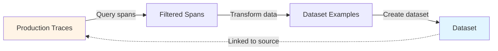

<CardGroup cols={2}>
  <Card title="Python Client Reference" icon="python" href="/docs/phoenix/sdk-api-reference/python/arizeai-phoenix-client">
    Phoenix Client Documentation
  </Card>
  <Card title="Example Code" icon="github" href="https://github.com/Arize-ai/phoenix/blob/main/packages/phoenix-client/examples/datasets/create_dataset_from_spans_example.py">
    View on GitHub
  </Card>
</CardGroup>

## Overview

**Available in arize-phoenix-client 1.28.0+ (Python) and @arizeai/phoenix-client 2.0.0+ (TypeScript)**

Create datasets directly from production traces with bidirectional links between dataset examples and their source spans. Query spans using filters, transform the data, and create datasets that maintain connections to the original traces.

## How It Works

The workflow involves three steps: query spans from traces using filters, transform the span data into dataset format, and create a dataset with span associations using the `span_id_key` parameter (Python) or `spanId` field (TypeScript).

### Querying Spans

Use the Phoenix client to query spans based on attributes, status, or OpenInference metadata like `session.id`, `llm.model_name`, or `llm.token_count.total`.

### Transforming Data

Parse span attributes and extract the fields needed for your dataset examples. Span IDs must be preserved to maintain the link to source traces.

### Linking to Source Spans

**Python**: Use `span_id_key` to specify which column contains span IDs.

**TypeScript**: Use `spanId` field in each example object.

Phoenix validates that span IDs exist and creates bidirectional links visible in the UI.

## Complete Example

See the full example in the phoenix-client repository: [`create_dataset_from_spans_example.py`](https://github.com/Arize-ai/phoenix/blob/main/packages/phoenix-client/examples/datasets/create_dataset_from_spans_example.py)

## Requirements

- Phoenix server running (local or hosted)
- Existing traces with LLM spans
- **Python**: `arize-phoenix-client` 1.28.0 or later
- **TypeScript**: `@arizeai/phoenix-client` 2.0.0 or later

## Feedback

Share feedback or report issues on [GitHub](https://github.com/Arize-ai/phoenix).
