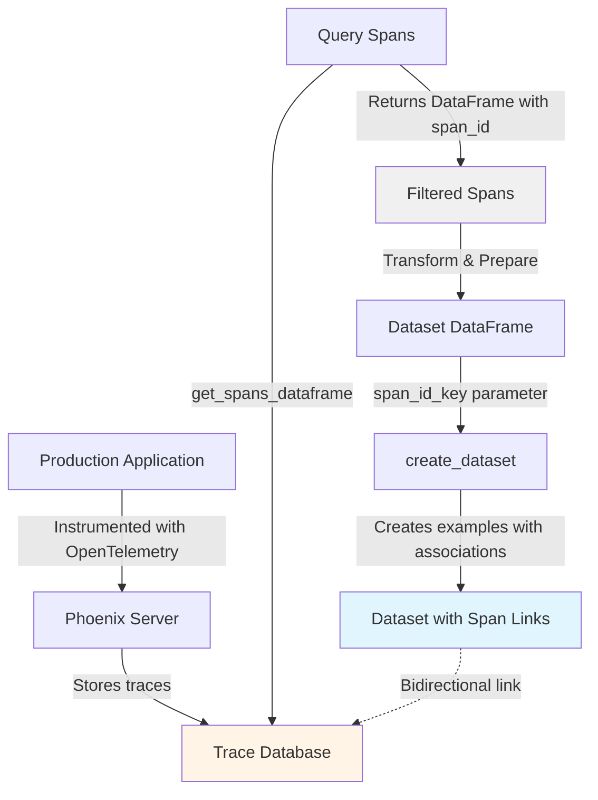

<CardGroup cols={2}>
  <Card title="Python Client Reference" icon="python" href="/docs/phoenix/sdk-api-reference/python/arizeai-phoenix-client">
    Phoenix Client Documentation
  </Card>
  <Card title="Example Code" icon="github" href="https://github.com/Arize-ai/phoenix/blob/main/packages/phoenix-client/examples/datasets/create_dataset_from_spans_example.py">
    View on GitHub
  </Card>
</CardGroup>

## Overview

**Available in arize-phoenix-client 1.28.0+**

Phoenix now supports creating datasets directly from production traces, preserving bidirectional associations between dataset examples and their originating spans. This enables teams to systematically convert real-world agent interactions into curated test cases for evaluation and stress testing.

```python
from phoenix.client import Client

client = Client()

# Query spans from production traces
spans_df = client.spans.get_spans_dataframe(
    project_identifier="production-agent",
    start_time=datetime.now(timezone.utc) - timedelta(days=7),
)

# Create dataset with span associations
dataset = client.datasets.create_dataset(
    name="edge-cases-from-production",
    dataframe=prepared_df,
    input_keys=["question"],
    output_keys=["answer"],
    span_id_key="context.span_id",  # Links examples to source spans
)
```

## How It Works

The workflow connects trace collection, span querying, and dataset creation into a single pipeline:



Each dataset example maintains a reference to its source span, enabling:
- Navigation from dataset examples back to full trace context
- Understanding which production interactions led to specific test cases
- Filtering examples based on trace metadata (timestamps, latency, model versions)

## Use Cases

### Curating Edge Cases and Failure Modes

Production systems encounter scenarios that are difficult to anticipate during development. By querying failed or high-latency traces, teams can systematically build datasets that represent challenging real-world conditions.

```python
# Query traces that failed or took longer than expected
spans_df = client.spans.get_spans_dataframe(
    project_identifier="production-agent",
    filter_condition='status_code = "ERROR" or attributes."llm.token_count.total" > 8000',
    start_time=datetime.now(timezone.utc) - timedelta(days=30),
)

# Create dataset of difficult cases
dataset = client.datasets.create_dataset(
    name="production-edge-cases",
    dataframe=prepare_examples(spans_df),
    input_keys=["question"],
    output_keys=["answer"],
    metadata_keys=["error_type", "latency_ms"],
    span_id_key="context.span_id",
)
```

### Building Golden Datasets from Validated Interactions

Production traces that have been annotated or validated by human reviewers represent high-quality ground truth. These can be converted into golden datasets for regression testing.

```python
# Query annotated spans with positive feedback
spans_df = client.spans.get_spans_dataframe(
    project_identifier="production-agent",
    filter_condition='attributes."annotation.quality" = "excellent"',
    start_time=datetime.now(timezone.utc) - timedelta(days=90),
)

# Create golden dataset
dataset = client.datasets.create_dataset(
    name="validated-golden-set",
    dataframe=prepare_examples(spans_df),
    input_keys=["question"],
    output_keys=["answer"],
    metadata_keys=["validator_id", "quality_score"],
    span_id_key="context.span_id",
)
```

### Stress Testing with Representative Load Patterns

Datasets created from high-volume production periods capture realistic usage patterns, including common queries, edge cases, and concurrent request behaviors.

## Implementation Details

### Span Querying

The `get_spans_dataframe` method returns a pandas DataFrame where:
- `context.span_id` is the primary identifier (may be index or column)
- Span attributes are flattened with prefix `attributes.*`
- Input/output values are JSON-encoded strings requiring parsing

### Dataset Creation with Associations

The `span_id_key` parameter in `create_dataset` specifies which column contains span identifiers:

```python
dataset = client.datasets.create_dataset(
    name="my-dataset",
    dataframe=df,
    input_keys=["question"],
    output_keys=["answer"],
    span_id_key="context.span_id",  # Column name containing span IDs
)
```

Phoenix validates that specified span IDs exist and creates bidirectional links. In the Phoenix UI, dataset examples display links to their source traces, and trace spans indicate when they've been converted to dataset examples.

### Data Preparation

Typical preprocessing steps include:

1. **Resetting index** if `context.span_id` is the DataFrame index
2. **Parsing JSON values** from `attributes.input.value` and `attributes.output.value`
3. **Extracting nested fields** from parsed dictionaries
4. **Filtering by metadata** such as model name, token counts, or timestamps

```python
def prepare_dataset_from_spans_df(spans_df: pd.DataFrame) -> pd.DataFrame:
    df = spans_df.copy()

    # Ensure span_id is a column
    if df.index.name == "context.span_id":
        df = df.reset_index()

    # Parse JSON strings
    inputs = df["attributes.input.value"].apply(json.loads)
    outputs = df["attributes.output.value"].apply(json.loads)

    # Extract fields
    return pd.DataFrame({
        "context.span_id": df["context.span_id"],
        "question": inputs.apply(lambda x: x.get("question")),
        "answer": outputs.apply(lambda x: x.get("answer")),
        "model": df["attributes.llm.model_name"],
    })
```

## Complete Example

A full end-to-end example demonstrating tracing setup, span querying, and dataset creation is available in the phoenix-client repository:

[`create_dataset_from_spans_example.py`](https://github.com/Arize-ai/phoenix/blob/main/packages/phoenix-client/examples/datasets/create_dataset_from_spans_example.py)

The example covers:
- Configuring OpenTelemetry tracing with `phoenix-otel`
- Logging LLM spans with OpenInference semantic conventions
- Querying spans using `get_spans_dataframe`
- Transforming span data into dataset format
- Creating datasets with span associations

## Requirements

- `arize-phoenix-client` 1.28.0 or later
- Phoenix server running (local or hosted)
- Existing traces with LLM spans

```bash
pip install arize-phoenix-client>=1.28.0
```

## Feedback

Share feedback or report issues on [GitHub](https://github.com/Arize-ai/phoenix).
