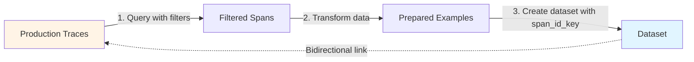

<CardGroup cols={2}>
  <Card title="Python Client Reference" icon="python" href="/docs/phoenix/sdk-api-reference/python/arizeai-phoenix-client">
    Phoenix Client Documentation
  </Card>
  <Card title="Example Code" icon="github" href="https://github.com/Arize-ai/phoenix/blob/main/packages/phoenix-client/examples/datasets/create_dataset_from_spans_example.py">
    View on GitHub
  </Card>
</CardGroup>

## Overview

**Available in arize-phoenix-client 1.28.0+ (Python) and @arizeai/phoenix-client 2.0.0+ (TypeScript)**

The Phoenix client now supports creating datasets directly from production traces, preserving bidirectional associations between dataset examples and their originating spans. This client-side capability enables teams to systematically query spans and convert real-world agent interactions into curated test cases for evaluation and testing.

<CodeGroup>
```python Python
from phoenix.client import Client
from datetime import datetime, timedelta, timezone

client = Client()

# Query spans from production traces
spans_df = client.spans.get_spans_dataframe(
    project_identifier="production-agent",
    start_time=datetime.now(timezone.utc) - timedelta(days=7),
)

# Transform and prepare data
prepared_df = prepare_dataset_from_spans_df(spans_df)

# Create dataset with span associations
dataset = client.datasets.create_dataset(
    name="edge-cases-from-production",
    dataframe=prepared_df,
    input_keys=["question"],
    output_keys=["answer"],
    span_id_key="context.span_id",  # Links examples to source spans
)
```

```typescript TypeScript
import { createClient, getSpans, createDataset } from "@arizeai/phoenix-client";

const client = createClient();

// Query spans from production traces
const { spans } = await getSpans({
  client,
  project: { projectName: "production-agent" },
  startTime: new Date(Date.now() - 7 * 24 * 60 * 60 * 1000),
  limit: 100,
});

// Transform and prepare data
const preparedExamples = prepareExamples(spans);

// Create dataset with span associations
const { datasetId } = await createDataset({
  client,
  name: "edge-cases-from-production",
  description: "Edge cases from production traces",
  examples: preparedExamples.map((ex) => ({
    input: { question: ex.question },
    output: { answer: ex.answer },
    spanId: ex.spanId, // Links examples to source spans
  })),
});
```
</CodeGroup>

## How It Works

Using the Phoenix client, the workflow is straightforward: query production spans with filters, then create a dataset with span associations.



Each dataset example maintains a reference to its source span, enabling:
- Navigation from dataset examples back to full trace context
- Understanding which production interactions led to specific test cases
- Filtering examples based on trace metadata (timestamps, latency, model versions)

## Use Cases

### Curating Edge Cases and Failure Modes

Production systems encounter scenarios that are difficult to anticipate during development. By querying failed or high-latency traces, teams can systematically build datasets that represent challenging real-world conditions.

<CodeGroup>
```python Python
from phoenix.client.types import SpanQuery

# Query traces that failed or took longer than expected
query = SpanQuery().where('status_code = "ERROR" or attributes."llm.token_count.total" > 8000')
spans_df = client.spans.get_spans_dataframe(
    project_identifier="production-agent",
    query=query,
    start_time=datetime.now(timezone.utc) - timedelta(days=30),
)

# Transform and create dataset of difficult cases
prepared_df = prepare_examples(spans_df)
dataset = client.datasets.create_dataset(
    name="production-edge-cases",
    dataframe=prepared_df,
    input_keys=["question"],
    output_keys=["answer"],
    metadata_keys=["error_type", "latency_ms"],
    span_id_key="context.span_id",
)
```

```typescript TypeScript
// Query traces from last 30 days
// Note: TypeScript client does not support filter conditions yet
// Filter spans in your application logic after retrieval
const { spans } = await getSpans({
  client,
  project: { projectName: "production-agent" },
  startTime: new Date(Date.now() - 30 * 24 * 60 * 60 * 1000),
  limit: 1000,
});

// Filter for failed or high-token spans in application logic
const filteredSpans = spans.filter(span =>
  span.status_code === "ERROR" ||
  (span.attributes?.["llm.token_count.total"] ?? 0) > 8000
);

// Transform and create dataset of difficult cases
const preparedExamples = prepareExamples(filteredSpans);
const { datasetId } = await createDataset({
  client,
  name: "production-edge-cases",
  description: "Edge cases from failed or high-token traces",
  examples: preparedExamples.map((ex) => ({
    input: { question: ex.question },
    output: { answer: ex.answer },
    metadata: {
      error_type: ex.errorType,
      latency_ms: ex.latencyMs,
    },
    spanId: ex.spanId,
  })),
});
```
</CodeGroup>

### Building Golden Datasets from Validated Interactions

Production traces that have been annotated or validated by human reviewers represent high-quality ground truth. These can be converted into golden datasets for regression testing.

<CodeGroup>
```python Python
from phoenix.client.types import SpanQuery

# Query annotated spans with positive feedback
query = SpanQuery().where('attributes."annotation.quality" = "excellent"')
spans_df = client.spans.get_spans_dataframe(
    project_identifier="production-agent",
    query=query,
    start_time=datetime.now(timezone.utc) - timedelta(days=90),
)

# Transform and create golden dataset
prepared_df = prepare_examples(spans_df)
dataset = client.datasets.create_dataset(
    name="validated-golden-set",
    dataframe=prepared_df,
    input_keys=["question"],
    output_keys=["answer"],
    metadata_keys=["validator_id", "quality_score"],
    span_id_key="context.span_id",
)
```

```typescript TypeScript
// Query spans from last 90 days
// Note: TypeScript client does not support filter conditions yet
// Filter for annotated spans in your application logic after retrieval
const { spans } = await getSpans({
  client,
  project: { projectName: "production-agent" },
  startTime: new Date(Date.now() - 90 * 24 * 60 * 60 * 1000),
  limit: 1000,
});

// Filter for excellent quality annotations
const filteredSpans = spans.filter(span =>
  span.attributes?.["annotation.quality"] === "excellent"
);

// Transform and create golden dataset
const preparedExamples = prepareExamples(filteredSpans);
const { datasetId } = await createDataset({
  client,
  name: "validated-golden-set",
  description: "Golden dataset from validated high-quality interactions",
  examples: preparedExamples.map((ex) => ({
    input: { question: ex.question },
    output: { answer: ex.answer },
    metadata: {
      validator_id: ex.validatorId,
      quality_score: ex.qualityScore,
    },
    spanId: ex.spanId,
  })),
});
```
</CodeGroup>

### Regression Testing from Critical User Flows

Production traces representing important user journeys can be captured as datasets to prevent regressions when updating prompts, models, or system components.

<CodeGroup>
```python Python
from phoenix.client.types import SpanQuery

# Query spans from key production workflows
query = SpanQuery().where('attributes."workflow.type" = "checkout" or attributes."workflow.type" = "search"')
spans_df = client.spans.get_spans_dataframe(
    project_identifier="production-agent",
    query=query,
    start_time=datetime.now(timezone.utc) - timedelta(days=60),
)

# Transform and create regression test dataset
prepared_df = prepare_examples(spans_df)
dataset = client.datasets.create_dataset(
    name="critical-flows-regression-suite",
    dataframe=prepared_df,
    input_keys=["question"],
    output_keys=["answer"],
    metadata_keys=["workflow_type", "user_segment"],
    span_id_key="context.span_id",
)
```

```typescript TypeScript
// Query spans from key production workflows
const { spans } = await getSpans({
  client,
  project: { projectName: "production-agent" },
  startTime: new Date(Date.now() - 60 * 24 * 60 * 60 * 1000),
  limit: 1000,
});

// Filter for critical workflow types
const filteredSpans = spans.filter(span => {
  const workflowType = span.attributes?.["workflow.type"];
  return workflowType === "checkout" || workflowType === "search";
});

// Transform and create regression test dataset
const preparedExamples = prepareExamples(filteredSpans);
const { datasetId } = await createDataset({
  client,
  name: "critical-flows-regression-suite",
  description: "Regression test suite from critical user flows",
  examples: preparedExamples.map((ex) => ({
    input: { question: ex.question },
    output: { answer: ex.answer },
    metadata: {
      workflow_type: ex.workflowType,
      user_segment: ex.userSegment,
    },
    spanId: ex.spanId,
  })),
});
```
</CodeGroup>

## Implementation Details

### Span Querying

**Python**: The `get_spans_dataframe` method returns a pandas DataFrame where `context.span_id` is the primary identifier (may be index or column), span attributes are flattened with prefix `attributes.*`, and input/output values are JSON-encoded strings requiring parsing.

**TypeScript**: The `getSpans` method returns an array of span objects with `spanId`, `attributes`, and other properties directly accessible.

### Dataset Creation with Associations

**Python**: The `span_id_key` parameter in `create_dataset` specifies which column contains span identifiers.

**TypeScript**: The `spanId` field in each example object links the example to its source span.

<CodeGroup>
```python Python
dataset = client.datasets.create_dataset(
    name="my-dataset",
    dataframe=df,
    input_keys=["question"],
    output_keys=["answer"],
    span_id_key="context.span_id",  # Column name containing span IDs
)
```

```typescript TypeScript
const { datasetId } = await createDataset({
  client,
  name: "my-dataset",
  description: "My dataset description",
  examples: examples.map((ex) => ({
    input: { question: ex.question },
    output: { answer: ex.answer },
    spanId: ex.spanId, // Links example to source span
  })),
});
```
</CodeGroup>

Phoenix validates that specified span IDs exist and creates bidirectional links. In the Phoenix UI, dataset examples display links to their source traces, and trace spans indicate when they've been converted to dataset examples.

### Data Preparation

**Python**: Typical preprocessing steps include resetting the index if `context.span_id` is the DataFrame index, parsing JSON values, extracting nested fields, and filtering by metadata.

**TypeScript**: Spans are returned as objects, so you can directly access and transform the data.

<CodeGroup>
```python Python
def prepare_dataset_from_spans_df(spans_df: pd.DataFrame) -> pd.DataFrame:
    df = spans_df.copy()

    # Ensure span_id is a column
    if df.index.name == "context.span_id":
        df = df.reset_index()

    # Parse JSON strings
    inputs = df["attributes.input.value"].apply(json.loads)
    outputs = df["attributes.output.value"].apply(json.loads)

    # Extract fields
    return pd.DataFrame({
        "context.span_id": df["context.span_id"],
        "question": inputs.apply(lambda x: x.get("question")),
        "answer": outputs.apply(lambda x: x.get("answer")),
        "model": df["attributes.llm.model_name"],
    })
```

```typescript TypeScript
function prepareExamples(spans: Span[]) {
  return spans.map((span) => {
    // Parse input/output if needed
    const input = typeof span.input === "string"
      ? JSON.parse(span.input)
      : span.input;
    const output = typeof span.output === "string"
      ? JSON.parse(span.output)
      : span.output;

    return {
      spanId: span.spanId,
      question: input.question,
      answer: output.answer,
      model: span.attributes?.["llm.model_name"],
    };
  });
}
```
</CodeGroup>

## Complete Example

A full end-to-end example demonstrating tracing setup, span querying, and dataset creation is available in the phoenix-client repository:

[`create_dataset_from_spans_example.py`](https://github.com/Arize-ai/phoenix/blob/main/packages/phoenix-client/examples/datasets/create_dataset_from_spans_example.py)

The example covers:
- Configuring OpenTelemetry tracing with `phoenix-otel`
- Logging LLM spans with OpenInference semantic conventions
- Querying spans using `get_spans_dataframe`
- Transforming span data into dataset format
- Creating datasets with span associations

## Requirements

- Phoenix server running (local or hosted)
- Existing traces with LLM spans
- **Python**: `arize-phoenix-client` 1.28.0 or later
- **TypeScript**: `@arizeai/phoenix-client` 2.0.0 or later

<CodeGroup>
```bash Python
pip install arize-phoenix-client>=1.28.0
```

```bash TypeScript
npm install @arizeai/phoenix-client
# or
pnpm add @arizeai/phoenix-client
```
</CodeGroup>

## Feedback

Share feedback or report issues on [GitHub](https://github.com/Arize-ai/phoenix).
