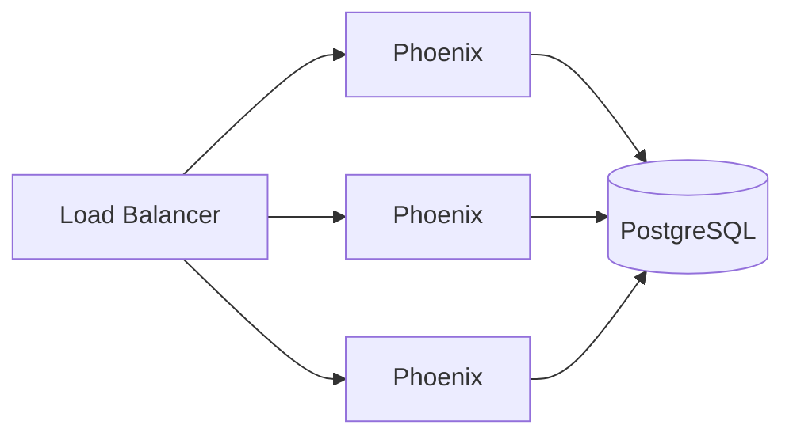
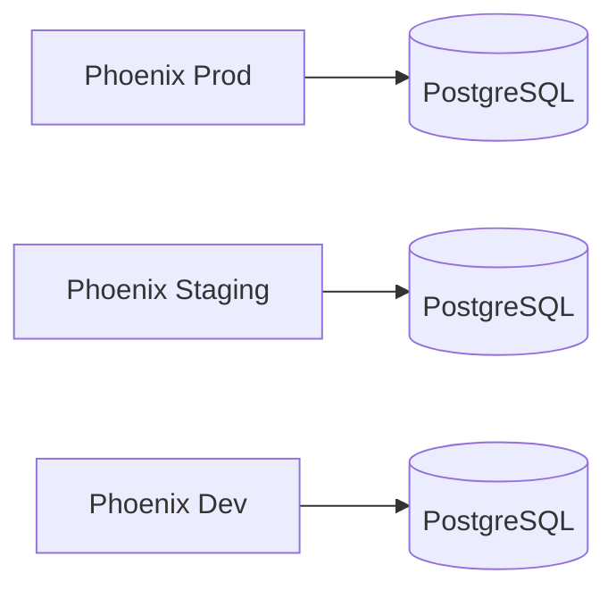
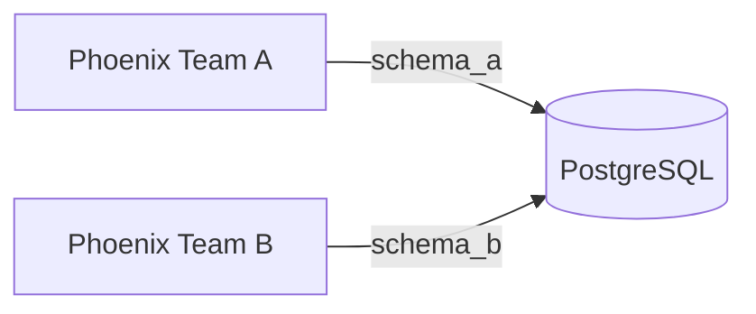

<Frame caption="Phoenix running on your virtual private cloud">
  
</Frame>

Phoenix is a containerized application that collects and analyzes traces from your LLM applications. It consists of a web UI, trace collector, and SQL database backend.

## Storage

Phoenix supports two database backends. Choose based on your deployment needs:

| Backend | Best For | Configuration |
|:--------|:---------|:--------------|
| **SQLite** | Local development, single-user deployments | Default, no setup required |
| **PostgreSQL** | Production, multi-user, high availability | Set [PHOENIX_SQL_DATABASE_URL](/docs/phoenix/self-hosting/configuration#environment-variables) |

### SQLite

The default storage option. Phoenix stores data in `~/.phoenix/` or the directory specified by [PHOENIX_WORKING_DIR](/docs/phoenix/self-hosting/configuration#environment-variables). Simple to get started—just mount a volume for persistence.

### PostgreSQL

Recommended for production. Provides better performance, concurrent access, and standard database tooling for backups and replication.

<Info>
See the [Docker deployment guide](/docs/phoenix/self-hosting/deployment-options/docker#postgresql) for PostgreSQL setup examples.
</Info>

## Tenancy

A single Phoenix instance represents **one tenant**. All data within an instance—projects, traces, datasets, experiments—is accessible to users based on their [role-based access controls](/docs/phoenix/settings/access-control-rbac).

This single-tenant model keeps deployments simple with clear data isolation boundaries. For multi-team scenarios, deploy multiple Phoenix instances.

## Scaling

Phoenix scales horizontally by deploying multiple instances. This enables both **performance scaling** (multiple instances sharing load against one database) and **organizational scaling** (separate instances for different teams or environments).

### Performance Scaling

Deploy multiple Phoenix instances behind a load balancer, all connected to the same database:

### Environment Isolation

Deploy separate instances with independent databases for complete data isolation:

### Schema Isolation

Share a single database while isolating data using PostgreSQL schemas:

Configure with [PHOENIX_SQL_DATABASE_SCHEMA](/docs/phoenix/self-hosting/configuration#environment-variables). See [PostgreSQL schemas](https://www.postgresql.org/docs/current/ddl-schemas.html) for more details.

## Deployment Scenarios

Phoenix's lightweight footprint supports various deployment patterns:

| Scenario | Description | Use Case |
|:---------|:------------|:---------|
| **Environment-based** | Separate instances for prod, staging, dev | Isolate production data from development |
| **Per-developer** | Each developer runs their own local instance | Rapid iteration without affecting shared environments |
| **Application sidecar** | Phoenix deployed alongside your app in the same pod | Simplified networking and lifecycle management |
| **Centralized** | Single instance for an entire team | Unified view across all applications |

## Future: Resource Tags

Resource tags for fine-grained access control within a single tenant are planned for later in 2026. This will enable permissions scoped to specific projects, datasets, or experiments.

<Info>
Follow [GitHub issue #10504](https://github.com/Arize-ai/phoenix/issues/10504) for updates on group-based multi-tenancy.
</Info>
