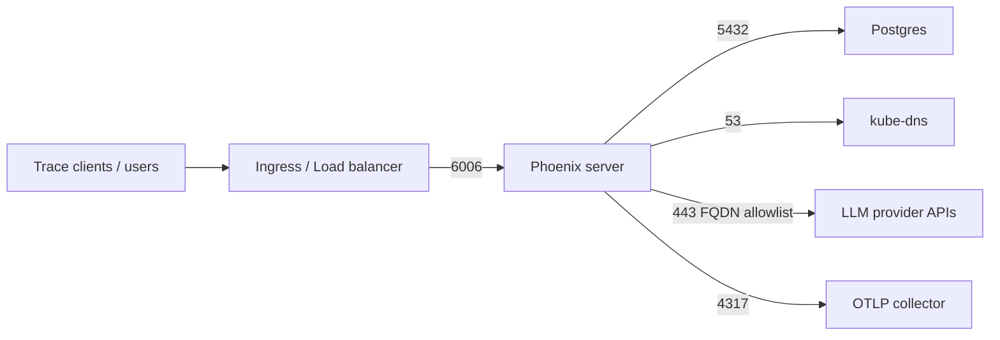

## Overview

Phoenix's Playground and evaluation features make outbound HTTP requests to AI provider APIs (OpenAI, Anthropic, Azure OpenAI, etc.) to run prompts and evaluations. When self-hosting Phoenix, it's important to understand that these requests originate from the Phoenix server and may access resources outside your VPC or deployment environment.

<Warning>
When users configure custom base URLs in the Playground (e.g., for Ollama, DeepSeek, or other OpenAI-compatible providers), Phoenix will make HTTP requests to those URLs. This could potentially be used to access internal services if not properly restricted.
</Warning>

## Security Considerations

### Server-Side Request Forgery (SSRF)

The Playground allows users to configure custom base URLs for AI providers. Without proper network controls, this could allow requests to:

- Internal services within your network
- Cloud provider metadata endpoints (e.g., `169.254.169.254`)
- Private IP ranges (`10.x.x.x`, `172.16.x.x`, `192.168.x.x`)

To mitigate SSRF risks, implement one or more of the following controls.

## Restricting Outbound Access

### Option 1: Network Policies (Recommended)

The most robust approach is to restrict outbound network access at the infrastructure level.

**Kubernetes Network Policies**

```yaml
apiVersion: networking.k8s.io/v1
kind: NetworkPolicy
metadata:
  name: phoenix-egress
  namespace: phoenix
spec:
  podSelector:
    matchLabels:
      app: phoenix
  policyTypes:
    - Egress
  egress:
    # Allow DNS to kube-system namespace
    - to:
        - namespaceSelector:
            matchLabels:
              kubernetes.io/metadata.name: kube-system
      ports:
        - protocol: UDP
          port: 53
    # Allow HTTPS to approved endpoints, block private IPs and metadata
    - to:
        - ipBlock:
            cidr: 0.0.0.0/0
            except:
              # Block private networks
              - 10.0.0.0/8
              - 172.16.0.0/12
              - 192.168.0.0/16
              # Block link-local and metadata endpoints
              - 169.254.0.0/16
      ports:
        - protocol: TCP
          port: 443
```

<Note>
Network policies require a CNI plugin that supports them (e.g., Calico, Cilium, Weave Net). On GKE with Workload Identity enabled, you may also need to block `169.254.169.252/32` in addition to the `169.254.0.0/16` range.
</Note>

<Info>
For a deeper treatment — default-deny patterns, identity-based selectors, FQDN allowlists for LLM providers, and copy-ready Cilium manifests — see [Network Policies (Kubernetes)](#network-policies-kubernetes) below.
</Info>

**AWS Security Groups**

Configure outbound rules to allow only HTTPS traffic to known AI provider IP ranges, or route traffic through a NAT gateway with restricted routing.

**Cloud Provider Firewalls**

Most cloud providers offer firewall rules or network ACLs that can restrict egress traffic. Configure these to allow only the specific endpoints your organization uses.

### Option 2: HTTP Proxy

Phoenix respects standard HTTP proxy environment variables. You can route all outbound HTTP requests through a proxy server that enforces URL allowlists.

```bash
# Set proxy environment variables
export HTTP_PROXY=http://proxy.internal:8080
export HTTPS_PROXY=http://proxy.internal:8080
export NO_PROXY=localhost,127.0.0.1,.internal.domain
```

Configure your proxy server to:
1. Allow requests only to approved AI provider domains
2. Block requests to private IP ranges
3. Log all outbound requests for auditing

**Example: Squid Proxy Allowlist**

```
# /etc/squid/allowed_domains.txt
.openai.com
.anthropic.com
.azure.com
.googleapis.com
.aws.amazon.com
```

### Option 3: Restrict Available Providers

Use the `PHOENIX_ALLOWED_PROVIDERS` environment variable to limit which AI providers appear in the Playground UI. This prevents users from selecting providers your organization hasn't approved.

```bash
# Only allow OpenAI and Anthropic
export PHOENIX_ALLOWED_PROVIDERS=OPENAI,ANTHROPIC

# Disable all providers (evaluation/playground features won't work)
export PHOENIX_ALLOWED_PROVIDERS=NONE
```

Supported values: `OPENAI`, `ANTHROPIC`, `AZURE_OPENAI`, `GOOGLE`, `DEEPSEEK`, `XAI`, `OLLAMA`, `AWS`, `CEREBRAS`, `FIREWORKS`, `GROQ`, `MOONSHOT`, `MINIMAX`, `PERPLEXITY`, `TOGETHER`.

<Info>
`PHOENIX_ALLOWED_PROVIDERS` controls which providers are shown in the UI but does not prevent API-level access. Combine this with network policies for defense in depth.
</Info>

### Option 4: Custom Providers with Fixed Endpoints

Instead of allowing users to enter arbitrary URLs, configure [Custom Providers](/docs/phoenix/settings/custom-ai-providers) with pre-approved endpoints. This centralizes control over which URLs Phoenix can access.

1. Create custom providers with your approved endpoints
2. Store credentials securely in the database
3. Users select from pre-configured providers rather than entering URLs

## CSRF Protection

Phoenix supports Cross-Site Request Forgery (CSRF) protection for deployments accessible over the web.

```bash
# Enable CSRF protection with trusted origins
export PHOENIX_CSRF_TRUSTED_ORIGINS=https://phoenix.example.com,https://app.example.com
```

When `PHOENIX_CSRF_TRUSTED_ORIGINS` is set:
- Requests must include valid `Origin` or `Referer` headers matching the trusted origins
- This prevents malicious websites from making authenticated requests on behalf of users

<Warning>
If `PHOENIX_CSRF_TRUSTED_ORIGINS` is unset or empty, CSRF protection is not enabled. Set this variable when deploying Phoenix behind a public-facing domain, especially when using OAuth2 or password-based authentication.
</Warning>

## Air-Gapped Deployments

For environments with no external network access:

```bash
# Disable external resource loading
export PHOENIX_ALLOW_EXTERNAL_RESOURCES=false

# Disable telemetry
export PHOENIX_TELEMETRY_ENABLED=false

# Disable all AI providers (if not using Playground/evals)
export PHOENIX_ALLOWED_PROVIDERS=NONE
```

In air-gapped environments, you can still use the Playground by:
1. Deploying a local LLM (e.g., Ollama) within your network
2. Configuring a custom provider pointing to the local endpoint
3. Ensuring network policies allow internal traffic to the LLM service

## Network Policies (Kubernetes)

This section is an operator reference for restricting the network footprint of a
self-hosted Phoenix deployment on Kubernetes. It describes the hardening
principles behind a well-scoped policy and provides copy-ready
[Cilium](https://cilium.io/) `CiliumNetworkPolicy` manifests you can adapt to
your own cluster.

Network policy is an infrastructure-level control that complements the
application-level controls — provider allowlists, HTTP proxies, and CSRF
protection — described above.

### Why network policy

Phoenix sits in an exposed spot: it accepts OpenTelemetry traces from arbitrary
clients and it makes outbound HTTPS calls to LLM provider APIs for evals, the
playground, and annotations. A Phoenix pod with no egress controls is a
ready-made pivot point. If the process is compromised — through a dependency, a
malicious payload in a trace, or a server-side request forgery (SSRF) bug — an
attacker can:

- reach the cloud metadata endpoint (`169.254.169.254`) to steal node
  credentials,
- move laterally to other pods and databases in the cluster,
- exfiltrate trace data to an arbitrary host.

Network policy is defense-in-depth. It does not replace authentication or image
hygiene; it contains the blast radius when those fail. Once a policy selects a
pod, Cilium drops every connection the policy does not explicitly allow, so the
pod can only talk to the destinations Phoenix actually needs.

### Reference traffic model

A locked-down deployment runs Phoenix behind a small set of components, each
selected by its own `CiliumNetworkPolicy`. The traffic topology:



The defining property of this setup is that **every pod is selected by a
policy**. In Cilium, a pod with no policy selecting it allows all traffic; a pod
with at least one policy selecting it switches to allow-list mode and drops
everything not named in a rule. Leaving a Phoenix-adjacent pod unselected
quietly defeats the whole model, so the first job when hardening a deployment is
to make sure each pod — Phoenix, its database, any egress proxy — is covered.

### Hardening principles

Each principle below is a rule worth carrying into your own manifests.

#### Default-deny by selecting every pod

Add a `CiliumNetworkPolicy` for the Phoenix pod and one for its database. The
moment a policy's `endpointSelector` matches a pod, that pod is in allow-list
mode. There is no separate "default-deny" object to create — selecting the pod
*is* the default-deny.

#### Select by identity, not IP

Match pods by label (for example `app: phoenix`), never by pod IP. Pod IPs
change on every reschedule and scale event; labels do not. Use
`endpointSelector` / `fromEndpoints` / `toEndpoints` with labels for everything
inside the cluster, and reserve CIDR rules for genuinely external destinations.

#### Scope ingress to Phoenix

Phoenix serves its UI, its REST/GraphQL API, and OTLP-over-HTTP all on the same
port (`6006`); OTLP-over-gRPC, when enabled, is on `4317`. Admit `6006` (and
`4317` if used) traffic **only** from your ingress controller or gateway, and
allow the metrics port **only** from your metrics scraper. Do not allow ingress
from the whole cluster.

#### Scope egress DNS

Allow UDP/TCP `53` only to the cluster resolver (`kube-dns` in `kube-system`),
and nothing wider. DNS egress to arbitrary hosts is a common exfiltration
channel — keep it pinned to the cluster resolver.

#### Allowlist LLM egress with `toFQDNs`

Rather than opening `443` to the internet, enumerate exactly the provider
domains Phoenix is allowed to call and list them under `toFQDNs`. Cilium
resolves these names and permits only the resulting IPs. A complete allowlist
typically covers the providers Phoenix supports — OpenAI, Azure OpenAI,
Anthropic, Bedrock, Groq, Gemini (`generativelanguage.googleapis.com`),
DeepSeek, xAI, Fireworks, OpenRouter, and GitHub Models. Enumerate the providers
*your* deployment actually uses and leave the rest out.

#### Block private ranges and cloud metadata

When a broad egress rule is unavoidable, it must carve out the ranges an
attacker would target. A `0.0.0.0/0` rule on `443` should `except`:

- `10.0.0.0/8`, `172.16.0.0/12`, `192.168.0.0/16` — RFC1918 private space
  (other workloads, internal services),
- `100.64.0.0/10` — carrier-grade NAT space,
- `169.254.0.0/16` — link-local, which contains the cloud metadata endpoint
  `169.254.169.254`.

The metadata exclusion is the important one: reaching `169.254.169.254` lets a
compromised pod read the node's service-account token and cloud credentials.
Any rule that opens egress beyond a named FQDN allowlist needs this `except`
block.

<Note>
On GKE with Workload Identity enabled, also exclude `169.254.169.252/32` in
addition to the `169.254.0.0/16` range.
</Note>

#### Route catch-all HTTPS through an egress proxy

Some deployments cannot enumerate every destination up front — you may front
your own LLM gateway, or use a provider not on the allowlist. Handle this with a
dedicated egress proxy pod: Phoenix is configured with `HTTPS_PROXY` pointing at
it, Phoenix's own policy allows egress only to that proxy, and the proxy's
policy is the single place that opens internet egress (with the `except` block
above). The result is that exactly one pod touches the public internet, and it
is auditable.

#### Isolate the database

The database pod should accept its port (`5432` for Postgres) only from the
specific app pods that use it, and its only egress should be DNS. Nothing else
in the cluster can reach the database. If Phoenix runs Postgres as a pod-local
sidecar, that traffic is loopback inside the pod and needs no policy at all —
but a standalone database pod must be locked to the Phoenix pod.

#### Deny `kube-apiserver` from the Phoenix pod

Phoenix has no reason to talk to the Kubernetes control plane, and reaching it
is a step toward cluster takeover. A self-hosted Phoenix pod should never have a
`toEntities: [kube-apiserver]` egress rule.

### Copy-ready example policies

These are written for a single self-hosted Phoenix — one Phoenix pod, one
Postgres pod, an optional egress proxy. Replace the label selectors with the
labels your manifests actually use.

#### Phoenix server

```yaml
apiVersion: cilium.io/v2
kind: CiliumNetworkPolicy
metadata:
  name: phoenix-server-policy
spec:
  endpointSelector:
    matchLabels:
      app: phoenix
  ingress:
    # UI, API, and OTLP/HTTP — only from the ingress controller.
    - fromEndpoints:
        - matchLabels:
            app: ingress-nginx
      toPorts:
        - ports:
            - port: "6006"
              protocol: TCP
            # Uncomment if you accept OTLP over gRPC:
            # - port: "4317"
            #   protocol: TCP
    # Metrics — only from the Prometheus scraper.
    - fromEndpoints:
        - matchLabels:
            app: prometheus
      toPorts:
        - ports:
            - port: "9090"
              protocol: TCP
  egress:
    # DNS — cluster resolver only.
    - toEndpoints:
        - matchLabels:
            io.kubernetes.pod.namespace: kube-system
            k8s-app: kube-dns
      toPorts:
        - ports:
            - port: "53"
              protocol: UDP
            - port: "53"
              protocol: TCP
          rules:
            dns:
              - matchPattern: "*"
    # Database.
    - toEndpoints:
        - matchLabels:
            app: phoenix-postgres
      toPorts:
        - ports:
            - port: "5432"
              protocol: TCP
    # LLM provider APIs — enumerate only the providers you use.
    - toFQDNs:
        - matchPattern: "*.openai.com"
        - matchPattern: "*.openai.azure.com"
        - matchPattern: "*.anthropic.com"
        - matchPattern: "bedrock-runtime.*.amazonaws.com"
      toPorts:
        - ports:
            - port: "443"
              protocol: TCP
    # OTLP export to a collector, if you forward Phoenix's own telemetry.
    - toEndpoints:
        - matchLabels:
            app: otel-collector
      toPorts:
        - ports:
            - port: "4317"
              protocol: TCP
```

Note there is no `kube-apiserver` rule — Phoenix does not need the control
plane.

#### Phoenix database

Skip this if Postgres runs as a sidecar in the Phoenix pod; loopback traffic is
not subject to network policy.

```yaml
apiVersion: cilium.io/v2
kind: CiliumNetworkPolicy
metadata:
  name: phoenix-postgres-policy
spec:
  endpointSelector:
    matchLabels:
      app: phoenix-postgres
  ingress:
    # Postgres reachable only from the Phoenix pod.
    - fromEndpoints:
        - matchLabels:
            app: phoenix
      toPorts:
        - ports:
            - port: "5432"
              protocol: TCP
  egress:
    - toEndpoints:
        - matchLabels:
            io.kubernetes.pod.namespace: kube-system
            k8s-app: kube-dns
      toPorts:
        - ports:
            - port: "53"
              protocol: UDP
            - port: "53"
              protocol: TCP
          rules:
            dns:
              - matchPattern: "*"
```

#### Optional egress proxy

Use this only if you cannot enumerate every outbound destination as an FQDN.
Point Phoenix at it with `HTTPS_PROXY`, replace the Phoenix `toFQDNs` rule above
with a `toEndpoints` rule allowing egress to `app: egress-proxy` on the proxy
port, and let this policy be the single place internet egress is opened.

```yaml
apiVersion: cilium.io/v2
kind: CiliumNetworkPolicy
metadata:
  name: egress-proxy-policy
spec:
  endpointSelector:
    matchLabels:
      app: egress-proxy
  ingress:
    - fromEndpoints:
        - matchLabels:
            app: phoenix
      toPorts:
        - ports:
            - port: "8080"
              protocol: TCP
  egress:
    # Internet on 443 — everything except private space and cloud metadata.
    - toCIDRSet:
        - cidr: 0.0.0.0/0
          except:
            - 10.0.0.0/8        # RFC1918 Class A
            - 172.16.0.0/12     # RFC1918 Class B
            - 192.168.0.0/16    # RFC1918 Class C
            - 100.64.0.0/10     # carrier-grade NAT
            - 169.254.0.0/16    # link-local — cloud metadata endpoint
      toPorts:
        - ports:
            - port: "443"
              protocol: TCP
    - toEndpoints:
        - matchLabels:
            io.kubernetes.pod.namespace: kube-system
            k8s-app: kube-dns
      toPorts:
        - ports:
            - port: "53"
              protocol: UDP
            - port: "53"
              protocol: TCP
          rules:
            dns:
              - matchPattern: "*"
```

### If you don't run Cilium

`toFQDNs` is a Cilium extension — vanilla Kubernetes `NetworkPolicy` cannot
filter egress by domain name, because it has no view of DNS. Options, in rough
order of preference:

- Run a CNI that supports FQDN egress (Cilium, or another with an equivalent
  feature). This is what gives you the LLM allowlist.
- Keep the egress proxy pattern. The proxy is a normal pod, so a plain
  `NetworkPolicy` with `ipBlock` and the same `except` ranges can constrain it,
  and Phoenix itself only needs egress to the proxy.
- At minimum, write a default-deny `NetworkPolicy` for the Phoenix and Postgres
  pods (`podSelector: {}`-scoped, empty `ingress`/`egress`) and add back only
  DNS, the database, and CIDR allowlists for known destinations.

Without FQDN support you cannot cleanly allow "OpenAI but nothing else" — plan
for the egress proxy.

### Validating the policy

After applying the policies, exec into the Phoenix pod and confirm the intended
allow/deny behavior:

```sh
kubectl exec -it deploy/phoenix -- sh

# DNS should resolve.
nslookup api.openai.com

# An allowed provider should connect.
curl -sS -o /dev/null -w '%{http_code}\n' https://api.openai.com/v1/models

# A destination not on the allowlist should hang and time out.
curl -sS --max-time 5 https://example.com

# The metadata endpoint must be unreachable.
curl -sS --max-time 5 http://169.254.169.254/
```

If [Hubble](https://github.com/cilium/hubble) is enabled, watch for the
corresponding drops:

```sh
hubble observe --pod phoenix --verdict DROPPED
```

### References

- [Cilium Network Policies](https://docs.cilium.io/en/stable/security/policy/) —
  the upstream policy reference.
- [DNS-based (FQDN) policies](https://docs.cilium.io/en/stable/security/policy/language/#dns-based)
  — how `toFQDNs` resolves and enforces domain allowlists.
- [editor.networkpolicy.io](https://editor.networkpolicy.io/) — visual editor
  for network policies (select "Cilium Network Policy").

## Frequently Asked Questions

<AccordionGroup>
  <Accordion title="Can users access internal services through the Playground?">
    Without network controls, yes. The Playground allows configuring custom base URLs, which could be pointed at internal services. Implement network policies or proxy rules to prevent this.
  </Accordion>

  <Accordion title="Does Phoenix validate URLs before making requests?">
    Phoenix does not currently validate or restrict URLs at the application level. URL restrictions should be implemented at the network layer using firewalls, network policies, or proxy servers.
  </Accordion>

  <Accordion title="How do I allow only specific AI providers?">
    Set `PHOENIX_ALLOWED_PROVIDERS` to a comma-separated list of approved providers (e.g., `OPENAI,ANTHROPIC`). This hides other providers from the UI but should be combined with network controls for complete protection.
  </Accordion>

  <Accordion title="What if I'm running Phoenix on a developer laptop?">
    For local development, the security risk is lower since requests originate from the developer's machine. In production or shared environments, implement the network controls described above.
  </Accordion>

  <Accordion title="Do HTTP_PROXY settings apply to all providers?">
    Yes, Phoenix's HTTP clients respect standard proxy environment variables. All outbound requests to AI providers will route through the configured proxy.
  </Accordion>

  <Accordion title="How do I protect against CSRF attacks?">
    Set `PHOENIX_CSRF_TRUSTED_ORIGINS` to a comma-separated list of your Phoenix deployment's origins (e.g., `https://phoenix.example.com`). This enables origin validation for incoming requests.
  </Accordion>

  <Accordion title="What's the difference between PHOENIX_ALLOWED_PROVIDERS and network policies?">
    `PHOENIX_ALLOWED_PROVIDERS` controls the UI—which providers users can select. Network policies control actual network access—which endpoints Phoenix can reach. Use both for defense in depth: restrict the UI to approved providers AND block unauthorized network traffic.
  </Accordion>

  <Accordion title="Can I audit which external URLs Phoenix accesses?">
    Yes, by routing traffic through a proxy server that logs requests. For comprehensive auditing of outbound HTTP requests, use a network proxy or service mesh with logging enabled. This will capture all requests to AI provider APIs and custom URLs configured in the Playground.
  </Accordion>
</AccordionGroup>

## Summary

| Control | Purpose | Implementation |
| :------ | :------ | :------------- |
| Network Policies | Block unauthorized outbound traffic | Kubernetes NetworkPolicy, security groups, firewalls |
| HTTP Proxy | Route and filter outbound requests | `HTTP_PROXY`, `HTTPS_PROXY` environment variables |
| Provider Restrictions | Limit available providers in UI | `PHOENIX_ALLOWED_PROVIDERS` environment variable |
| Custom Providers | Pre-configure approved endpoints | Phoenix Settings → AI Providers |
| CSRF Protection | Prevent cross-site request forgery | `PHOENIX_CSRF_TRUSTED_ORIGINS` environment variable |

For production deployments, we recommend combining multiple controls: restrict providers in the UI, implement network policies at the infrastructure level, and enable CSRF protection for web-facing deployments.
