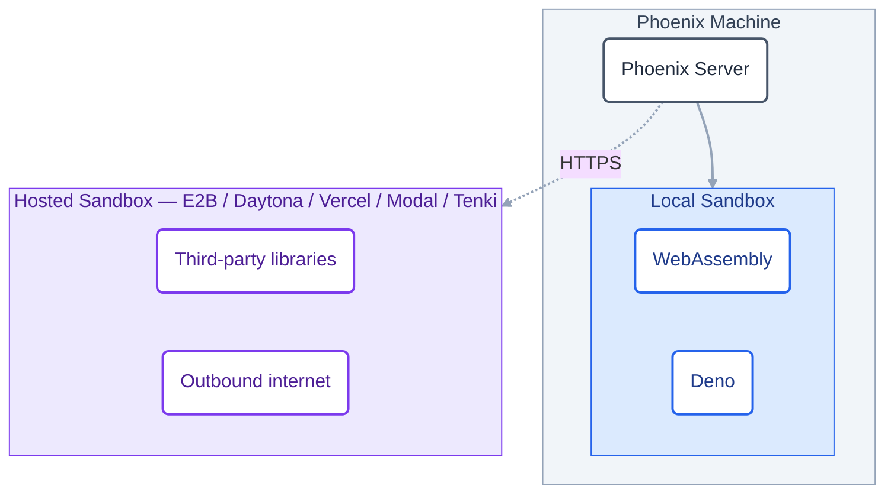

A **sandbox** is an isolated runtime that executes a snippet of code on demand. It's fast enough to run on every evaluation, but locked down enough that the code can't read the host filesystem, exfiltrate secrets, or make arbitrary network calls. Phoenix uses sandboxes to run [code evaluators](/docs/phoenix/evaluation/server-evals/code-evaluators) — short Python or TypeScript functions that you write to score or judge your LLM outputs server-side, without exposing the rest of your deployment.

The **Settings → Sandboxes** page is where administrators pick which sandbox providers are available and bundle them into named, reusable configurations that anyone writing a code evaluator can pick from. The page has two cards:

- **Sandbox Providers** — one row per provider. Each row lets you set the provider's credentials, enable or disable it for your deployment, and see whether it's currently ready to run code.
- **Sandbox Configurations** — named runtime profiles you create once and re-use. Each one bundles a provider with a timeout and, for hosted providers, environment variables, optional internet access, and any dependencies that should be pre-installed.

<Note>
Only users with the **Admin** role can view or edit this page. Non-admin users are routed away from the tab.
</Note>

## Local vs. hosted sandboxes

Phoenix supports two kinds of sandbox, distinguished by where the code actually runs. The badge on each row in **Sandbox Providers** (labeled either **Local** or **Hosted**) tells you which kind it is.

<Warning>
**Environment variables, network access, and third-party dependencies are only supported in hosted sandboxes.** Local sandboxes (Deno and WebAssembly) are for **simple, self-contained code evaluation** — pure-logic checks like regex matches, JSON parsing, and scoring functions. If your evaluator needs to read a secret, call an API, or import a package, you must use a hosted sandbox.
</Warning>

<AccordionGroup>
  <Accordion title="Local sandboxes — simple code evaluation only" icon="server">
    **Local sandboxes** run inside the Phoenix server process itself. They start in milliseconds and require no external credentials, which makes them the fastest and cheapest option for **simple, self-contained evaluators** — regex matches, JSON parsing, scoring functions, and other pure logic.

    They **do not** support environment variables, network access, or third-party dependencies. If your evaluator needs any of those, use a hosted sandbox.

    <CardGroup cols={2}>
      <Card title="WebAssembly" icon="https://storage.googleapis.com/arize-phoenix-assets/assets/svgs/wasm.svg" href="/docs/phoenix/settings/sandboxes/wasm">
        Runs simple Python evaluators in an isolated WebAssembly runtime. No env vars, network, or packages.
      </Card>
      <Card title="Deno" icon="https://storage.googleapis.com/arize-phoenix-assets/assets/svgs/deno.svg" href="/docs/phoenix/settings/sandboxes/deno">
        Runs simple TypeScript evaluators in a locked-down Deno process. No env vars, network, or packages.
      </Card>
    </CardGroup>
  </Accordion>

  <Accordion title="Hosted sandboxes — full capability" icon="cloud">
    **Hosted sandboxes** run on a third-party provider's infrastructure. Each invocation spins up a fresh sandbox there — a VM, micro-VM, or container, depending on the provider. They are the **only** sandboxes that support environment variables, outbound network access, and third-party dependencies, plus kernel-level isolation and longer maximum timeouts. The cost: per-call round-trip latency and the need to configure credentials for the upstream service.

    <CardGroup cols={2}>
      <Card title="E2B" icon="https://storage.googleapis.com/arize-phoenix-assets/assets/svgs/e2b.svg" href="/docs/phoenix/settings/sandboxes/e2b">
        Cloud micro-VMs purpose-built for AI-generated code execution.
      </Card>
      <Card title="Daytona" icon="https://storage.googleapis.com/arize-phoenix-assets/assets/svgs/daytona.svg" href="/docs/phoenix/settings/sandboxes/daytona">
        Managed development sandboxes with fast snapshot-based startup.
      </Card>
      <Card title="Vercel Sandbox" icon="https://storage.googleapis.com/arize-phoenix-assets/assets/svgs/vercel.svg" href="/docs/phoenix/settings/sandboxes/vercel">
        Ephemeral compute on Vercel's infrastructure with team-scoped credentials.
      </Card>
      <Card title="Modal" icon="https://storage.googleapis.com/arize-phoenix-assets/assets/svgs/modal.svg" href="/docs/phoenix/settings/sandboxes/modal">
        Serverless containers with sub-second cold starts and Python-first ergonomics.
      </Card>
      <Card title="Tenki" href="/docs/phoenix/settings/sandboxes/tenki">
        Fast ephemeral microVMs on Tenki Cloud, torn down after each run.
      </Card>
    </CardGroup>
  </Accordion>
</AccordionGroup>

A common pattern is to enable a local sandbox for the everyday case (pure-logic checks, regex, JSON diffs) and one hosted sandbox for the cases that need extra horsepower (dependencies, network calls, longer runtimes). Each provider page above has the setup steps for that provider; if you're self-hosting and need the platform-level details (which providers are bundled in the container, how to install extras, how the allowlist works), see [Sandbox Backends](/docs/phoenix/self-hosting/features/sandbox-runtimes).

## Sandbox Providers

A **provider** is a sandbox runtime that Phoenix can run code on — for example, *Vercel Sandbox* or *Daytona*. Each row in this card shows the provider's name, the languages it supports, its current status, and a gear icon for entering credentials. Once the provider is ready to run code, an **Enabled** switch appears. Turning it off hides every configuration tied to that provider from the people writing evaluators, but doesn't delete anything — flip it back on and the configurations reappear.

### Restricting providers at the server level

The **Enabled** switch above is a per-deployment, admin-facing control. Self-hosted deployments can also restrict providers at the *server* level with the `PHOENIX_ALLOWED_SANDBOX_PROVIDERS` environment variable, which is set before Phoenix starts and cannot be overridden from this page.

- **Leave it unset** to allow every supported provider (the default).
- **Set it to a comma-separated list** — e.g. `PHOENIX_ALLOWED_SANDBOX_PROVIDERS=WASM,DENO` — to allow only those providers. Accepted values are `WASM`, `DENO`, `E2B`, `DAYTONA`, `VERCEL`, and `MODAL` (case-insensitive).
- **Set it to `NONE`** to disable every sandbox provider.

A provider that isn't on the allowlist shows the status **Disabled** with the tooltip "Disabled on the server," and its **Enabled** switch is unavailable. See [Sandbox Backends](/docs/phoenix/self-hosting/features/sandbox-runtimes#restricting-which-providers-are-allowed) for the full details.

### Configuring credentials

Click the gear icon next to a provider to open the credentials dialog. The dialog lists the credential fields the backend declares — for example:

- **E2B** — `E2B_API_KEY`
- **Daytona** — `DAYTONA_API_KEY`
- **Modal** — `MODAL_TOKEN_ID`, `MODAL_TOKEN_SECRET`
- **Vercel Sandbox** — `VERCEL_TOKEN`, `VERCEL_PROJECT_ID`, `VERCEL_TEAM_ID`

Values are stored encrypted at rest using the server's `PHOENIX_SECRET`. The dialog shows each field's environment-variable name and a short description; required fields are marked. Local backends (Deno, WebAssembly) have no credentials, and the gear button is disabled for them.

## Sandbox Configurations

A **sandbox configuration** is a named, reusable runtime profile. For a **local** provider it's just a provider and a timeout. For a **hosted** provider it can also carry environment variables, an internet-access setting, and pre-installed dependencies. Code evaluators don't pick a provider directly; they pick a configuration. This means administrators can set up a small set of vetted profiles — for example, "Python with `requests` and `numpy`" or "Node.js with internet access" — and the people writing evaluators just pick the profile that fits their script.

<Warning>
Environment variables, internet access, and dependencies are **hosted-sandbox-only**. A local-sandbox configuration (Deno or WebAssembly) is just a provider and a timeout — those fields are hidden in the dialog when a local provider is selected.
</Warning>

<Warning>
Environment-variable values — including the values resolved from secret references — are visible to any code that runs in the sandbox (for example, `os.environ` in Python). Treat them as readable by anyone authorized to author or run an evaluator against the config.
</Warning>

### Creating a configuration

Click **New Sandbox** in the Sandbox Configurations card. Only providers that are currently available *and* enabled by an administrator appear in the picker.

The dialog exposes the following fields. The last three are **hosted-sandbox-only** — when a local provider (Deno or WebAssembly) is selected they are hidden entirely.

| Field | Availability | Notes |
|-------|-------------|-------|
| **Provider** | All | Required. The sandbox provider this config targets. Provider credentials and deployment routing are shared across that provider's supported languages. |
| **Language** | All | Required. Auto-filled for single-language providers; selected explicitly for multi-language providers. Configs are language-scoped — a Python config can only be selected by Python evaluators. |
| **Name** | All | Required. Lowercase letters, digits, dashes, and underscores. Must start and end with a letter or digit. Used to identify the config in the evaluator UI. |
| **Description** | All | Optional free-form text shown next to the config name. |
| **Timeout (seconds)** | All | Required. Total time allowed for sandbox setup and execution. Defaults to **300s**. |
| **Environment Variables** | Hosted only | One row per variable. Each row is either a **literal value** typed inline, or a **secret reference** to a key from [Settings → Secrets](/docs/phoenix/settings/secrets). |
| **Allow Internet Access** | Hosted only | Toggle for outbound networking. When off, the sandbox runs with no network egress. |
| **Dependencies** | Hosted only | One package per line — Python packages (e.g. `requests`, `numpy==1.26.0`) or npm packages (e.g. `@types/node`, `lodash`). Phoenix installs these before each execution. |

## Next steps

Once a configuration is in place, point an evaluator at it.

<CardGroup cols={1}>
  <Card title="Code Evaluators" icon="code" href="/docs/phoenix/evaluation/server-evals/code-evaluators">
    Configure a server-side code evaluator that runs against a sandbox configuration.
  </Card>
</CardGroup>
