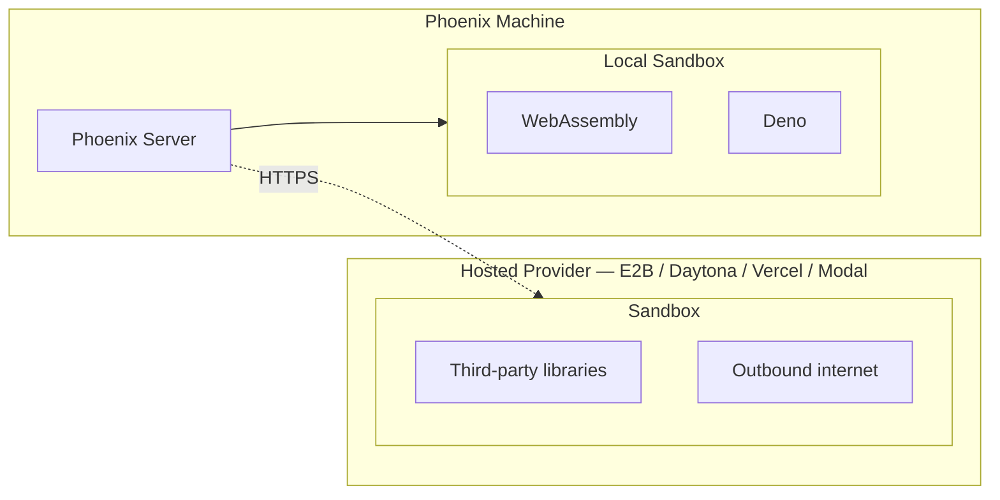

A **sandbox** is an isolated runtime that executes a snippet of code on demand. It's fast enough to run on every evaluation, but locked down enough that the code can't read the host filesystem, exfiltrate secrets, or make arbitrary network calls. Phoenix uses sandboxes to run [code evaluators](/docs/phoenix/evaluation/server-evals/code-evaluators) — short Python or TypeScript functions that you write to score or judge your LLM outputs server-side, without exposing the rest of your deployment.

The **Settings → Sandboxes** page is where administrators pick which sandbox providers are available and bundle them into named, reusable configurations that anyone writing a code evaluator can pick from. The page has two cards:

- **Sandbox Providers** — one row per provider. Each row lets you set the provider's credentials, enable or disable it for your deployment, and see whether it's currently ready to run code.
- **Sandbox Configurations** — named runtime profiles you create once and re-use. Each one bundles a provider with a timeout, environment variables, optional internet access, and any dependencies that should be pre-installed.

<Note>
Only users with the **Admin** role can view or edit this page. Non-admin users are routed away from the tab.
</Note>

## Local vs. hosted sandboxes

Phoenix supports two kinds of sandbox, distinguished by where the code actually runs. The badge on each row in **Sandbox Providers** (labeled either **Local** or **Hosted**) tells you which kind it is.

<Info>
**Local sandboxes** run on the Phoenix machine itself — fully isolated, no credentials needed, but they share the Phoenix process's CPU and memory and can't reach the internet or install packages. **Hosted sandboxes** run on a remote machine operated by a third-party provider, so they support third-party libraries, outbound web access, and isolation from Phoenix's own resources — at the cost of per-call network latency and provider credentials.
</Info>

<AccordionGroup>
  <Accordion title="Local sandboxes" icon="server">
    **Local sandboxes** run inside the Phoenix server process itself. They start in milliseconds and require no external credentials, which makes them the fastest and cheapest option. The trade-off is narrower isolation than a full VM and a smaller capability surface — they can't install arbitrary packages, and they can't reach the public internet.

    <CardGroup cols={2}>
      <Card title="WebAssembly" icon="https://storage.googleapis.com/arize-phoenix-assets/assets/svgs/wasm.svg" href="/docs/phoenix/settings/sandboxes/wasm">
        Runs Python in an isolated WebAssembly runtime with no access to your filesystem or network.
      </Card>
      <Card title="Deno" icon="https://storage.googleapis.com/arize-phoenix-assets/assets/svgs/deno.svg" href="/docs/phoenix/settings/sandboxes/deno">
        Runs TypeScript in a locked-down Deno process — no filesystem, network, or third-party package access.
      </Card>
    </CardGroup>
  </Accordion>

  <Accordion title="Hosted sandboxes" icon="cloud">
    **Hosted sandboxes** run on a third-party provider's infrastructure. Each invocation spins up a fresh sandbox there — a VM, micro-VM, or container, depending on the provider. The upside: kernel-level isolation, longer maximum timeouts, the ability to install Python or npm packages at execution time, and opt-in outbound network access. The cost: per-call round-trip latency and the need to configure credentials for the upstream service.

    <CardGroup cols={2}>
      <Card title="E2B" icon="https://storage.googleapis.com/arize-phoenix-assets/assets/svgs/e2b.svg" href="/docs/phoenix/settings/sandboxes/e2b">
        Cloud micro-VMs purpose-built for AI-generated code execution.
      </Card>
      <Card title="Daytona" icon="https://storage.googleapis.com/arize-phoenix-assets/assets/svgs/daytona.svg" href="/docs/phoenix/settings/sandboxes/daytona">
        Managed development sandboxes with fast snapshot-based startup.
      </Card>
      <Card title="Vercel Sandbox" icon="https://storage.googleapis.com/arize-phoenix-assets/assets/svgs/vercel.svg" href="/docs/phoenix/settings/sandboxes/vercel">
        Ephemeral compute on Vercel's infrastructure with team-scoped credentials.
      </Card>
      <Card title="Modal" icon="https://storage.googleapis.com/arize-phoenix-assets/assets/svgs/modal.svg" href="/docs/phoenix/settings/sandboxes/modal">
        Serverless containers with sub-second cold starts and Python-first ergonomics.
      </Card>
    </CardGroup>
  </Accordion>
</AccordionGroup>

A common pattern is to enable a local sandbox for the everyday case (pure-logic checks, regex, JSON diffs) and one hosted sandbox for the cases that need extra horsepower (dependencies, network calls, longer runtimes). Each provider page above has the setup steps for that provider; if you're self-hosting and need the platform-level details (which providers are bundled in the container, how to install extras, how the allowlist works), see [Sandbox Backends](/docs/phoenix/self-hosting/features/sandbox-runtimes).

## Sandbox Providers

A **provider** is a sandbox runtime that Phoenix can run code on — for example, *Vercel Sandbox* or *Daytona*. Each row in this card shows the provider's name, the languages it supports, its current status, and a gear icon for entering credentials. Once the provider is ready to run code, an **Enabled** switch appears. Turning it off hides every configuration tied to that provider from the people writing evaluators, but doesn't delete anything — flip it back on and the configurations reappear.

### Configuring credentials

Click the gear icon next to a provider to open the credentials dialog. The dialog lists the credential fields the backend declares — for example:

- **E2B** — `E2B_API_KEY`
- **Daytona** — `DAYTONA_API_KEY`
- **Modal** — `MODAL_TOKEN_ID`, `MODAL_TOKEN_SECRET`
- **Vercel Sandbox** — `VERCEL_TOKEN`, `VERCEL_PROJECT_ID`, `VERCEL_TEAM_ID`

Values are stored encrypted at rest using the server's `PHOENIX_SECRET`. The dialog shows each field's environment-variable name and a short description; required fields are marked. Local backends (Deno, WebAssembly) have no credentials, and the gear button is disabled for them.

## Sandbox Configurations

A **sandbox configuration** is a named, reusable runtime profile — a provider plus its timeout, environment variables, internet-access setting, and any pre-installed dependencies. Code evaluators don't pick a provider directly; they pick a configuration. This means administrators can set up a small set of vetted profiles — for example, "Python with `requests` and `numpy`" or "Node.js with internet access" — and the people writing evaluators just pick the profile that fits their script.

<Warning>
Environment-variable values — including the values resolved from secret references — are visible to any code that runs in the sandbox (for example, `os.environ` in Python). Treat them as readable by anyone authorized to author or run an evaluator against the config.
</Warning>

### Creating a configuration

Click **New Sandbox** in the Sandbox Configurations card. Only providers that are currently available *and* enabled by an administrator appear in the picker.

The dialog exposes the following fields. Fields that aren't supported by the selected backend are shown as **Not supported by the selected backend**.

| Field | Notes |
|-------|-------|
| **Provider** | Required. The sandbox provider this config targets. Provider credentials and deployment routing are shared across that provider's supported languages. |
| **Language** | Required. Auto-filled for single-language providers; selected explicitly for multi-language providers. Configs are language-scoped — a Python config can only be selected by Python evaluators. |
| **Name** | Required. Lowercase letters, digits, dashes, and underscores. Must start and end with a letter or digit. Used to identify the config in the evaluator UI. |
| **Description** | Optional free-form text shown next to the config name. |
| **Timeout (seconds)** | Required. Total time allowed for sandbox setup and execution. Defaults to **300s**. |
| **Environment Variables** | One row per variable. Each row is either a **literal value** typed inline, or a **secret reference** to a key from [Settings → Secrets](/docs/phoenix/settings/secrets). Available only for backends that support env vars. |
| **Allow Internet Access** | Toggle for backends that gate outbound networking. When off, the sandbox runs with no network egress. |
| **Dependencies** | One package per line. The dialog shows whether the backend takes Python packages (e.g. `requests`, `numpy==1.26.0`) or npm packages (e.g. `@types/node`, `lodash`). Phoenix installs these before each execution. |

## Next steps

Once a configuration is in place, point an evaluator at it.

<CardGroup cols={1}>
  <Card title="Code Evaluators" icon="code" href="/docs/phoenix/evaluation/server-evals/code-evaluators">
    Configure a server-side code evaluator that runs against a sandbox configuration.
  </Card>
</CardGroup>
