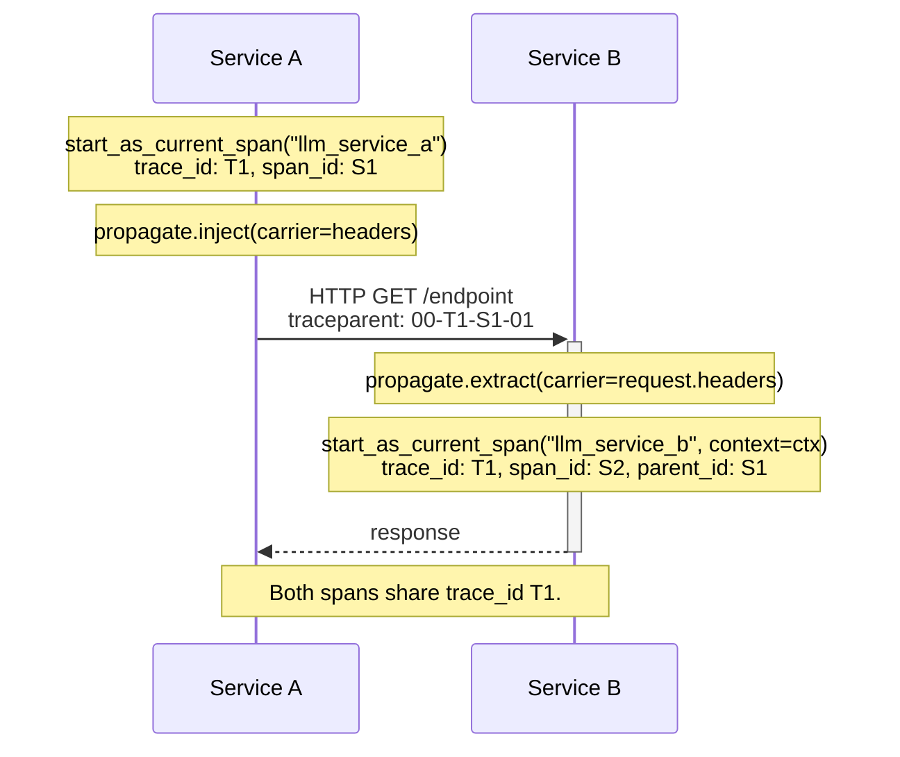

OpenTelemetry tracks the current span via a **context** — an immutable object that holds the active span's ID, trace ID, and a few other pieces of metadata. When you call `tracer.start_as_current_span(...)`, OTel reads the current context, sets the new span as a child, and updates the context.

Within a single thread of execution, this is automatic. Across threads, async boundaries, or service boundaries, the context doesn't follow on its own — you have to propagate it.

# The Context Object

Every span carries an immutable Context object containing:

| Field | Description |
| :--- | :--- |
| **Span ID** | The current span's ID. |
| **Trace ID** | The trace this span belongs to. |
| **Trace flags** | Binary encoding of trace-level info (e.g., the sampled flag). |
| **Trace state** | A list of key-value pairs with vendor-specific trace info. |
| **Baggage** | Arbitrary contextual key-value data that travels alongside the trace. |

**Baggage** is the channel for non-tracing data that should follow the request — feature flags, tenant IDs, request type. Baggage doesn't become span attributes automatically; if you want it on spans, you have to read it and set it explicitly.

# When Propagation Is Needed (and When It Isn't)

| Propagation is **NOT** needed | Propagation **IS** needed |
| :--- | :--- |
| Between function calls in the same module | Crossing process or service boundaries |
| Between modules in the same process | HTTP requests |
| Inside the same request lifecycle | gRPC calls |
| Async code in the same process | Async jobs / background workers (separate process) |
| | Any network boundary |

Most application code falls into the left column — context propagation just works. The right column is where you need the propagators below.

# Automatic Propagation

In Python, OTel uses [`contextvars`](https://docs.python.org/3/library/contextvars.html) under the hood, which propagates context cleanly across:

- Synchronous function calls.
- `asyncio` tasks within the same event loop.
- `await` boundaries.

You don't have to do anything special — `tracer.start_as_current_span(...)` works as you'd expect.

# Manual Context Propagation

When automatic propagation breaks down — across threads, across services, into background workers — these are the tools OTel gives you:

| Tool | Use |
| :--- | :--- |
| `context.get_current()` | Read the current context from outside the current execution path (custom threads, tasks, callbacks). |
| `context.attach(ctx)` / `context.detach(token)` | Activate a previously captured context in a different thread or task. |
| `set_baggage(key, value)` | Set a baggage value in the current context, to read later in the same execution path. |
| `propagate.inject(carrier)` / `propagate.extract(carrier)` | Inject/extract context across service boundaries (HTTP/gRPC) using the globally-installed propagator. |

The OTel Python API exposes `opentelemetry.propagate.inject` and `opentelemetry.propagate.extract`, which delegate to the global text-map propagator. By default that propagator is a `CompositePropagator` combining:

| Propagator | Carries |
| :--- | :--- |
| `TraceContextTextMapPropagator` | Trace context (W3C `traceparent` and `tracestate` headers). |
| `W3CBaggagePropagator` | Baggage. |

You can swap the global propagator with `propagate.set_global_textmap(...)` if you need a different combination — for example, adding B3 for legacy systems. The OTel specification just requires SDKs to default to a composite of the W3C Trace Context and Baggage propagators; JS/Go/Java equivalents construct the same composite under slightly different names. Check the [Propagators spec](https://opentelemetry.io/docs/specs/otel/context/api-propagators/) for your language.

For the Python API reference, see [OpenTelemetry Context API](https://opentelemetry-python.readthedocs.io/en/latest/api/context.html) and [Propagators API](https://opentelemetry-python.readthedocs.io/en/latest/api/propagators.html).

# Async Functions (Same Service)

When you launch async work from sync code, the context doesn't always follow. Capture it explicitly:

```python
import asyncio
from opentelemetry import trace
from opentelemetry.context import attach, detach, get_current

tracer = trace.get_tracer(__name__)

async def async_func(ctx):
    token = attach(ctx)
    try:
        current_span = trace.get_current_span()
        current_span.set_attribute("input.value", "User Input")
        await asyncio.sleep(1)  # Simulate async work
    finally:
        detach(token)

def sync_func():
    with tracer.start_as_current_span("sync_span") as span:
        context = get_current()
        asyncio.run(async_func(context))
```

The pattern:

1. Capture the current context **before** launching async work: `context = get_current()`.
1. Pass the context into the async function.
1. Inside the async function, `attach(ctx)` and store the returned token.
1. In a `finally`, `detach(token)` to restore the previous context.

For more patterns including `ThreadPoolExecutor`, see [Advanced Patterns: Manual Context Propagation](/docs/phoenix/tracing/how-to-tracing/setup-tracing#manual-context-propagation).

# Across Microservices

Crossing a service boundary is where propagators earn their keep. Service A injects the current context into outbound request headers; Service B extracts it on the inbound side and uses it as the parent for its own spans.

**Service A** (caller):

```python
import requests
from opentelemetry import propagate, trace

tracer = trace.get_tracer(__name__)

def service_a():
    with tracer.start_as_current_span("llm_service_a") as span:
        headers = {}                       # Prepare carrier for injected context
        propagate.inject(carrier=headers)  # Inject current context into headers
        response = requests.get("http://service-b:5000/endpoint", headers=headers)
        return response
```

**Service B** (callee):

```python
from opentelemetry import propagate, trace

tracer = trace.get_tracer(__name__)

def service_b(request):
    context = propagate.extract(carrier=dict(request.headers))
    # Create a new span as child of the extracted context
    with tracer.start_as_current_span("llm_service_b", context=context) as span:
        ...
```

After this, Service B's span appears as a child of Service A's span — even though they ran in different processes — and both appear under the same trace ID in the Phoenix UI.



# Common Propagation Failure Modes

A few patterns that produce orphaned or broken traces:

- **Forgetting to inject context on the caller side** — the callee starts a new trace instead of joining the existing one. Symptom: caller and callee appear as separate traces in the Phoenix UI.
- **Using different propagators on each side** — if Service A injects W3C headers and Service B only extracts a different format, the context is silently lost. Stick with the default global propagator on both sides unless you have a specific reason not to.
- **Stripping headers in the network layer** — proxies, API gateways, and service meshes sometimes strip headers they don't recognize. The W3C `traceparent` header is usually safe but verify with your infrastructure team.
- **Async work that escapes the request lifecycle** — fire-and-forget tasks (background workers, queues) need explicit context capture before submission.

---

## Next step

Context propagation is about making sure spans are connected. Sampling is about which spans get recorded at all:

<Card title="Next: Sampling" icon="arrow-right" href="/docs/phoenix/tracing/concepts-tracing/otel-openinference/sampling" />
