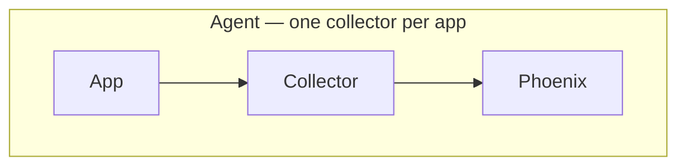
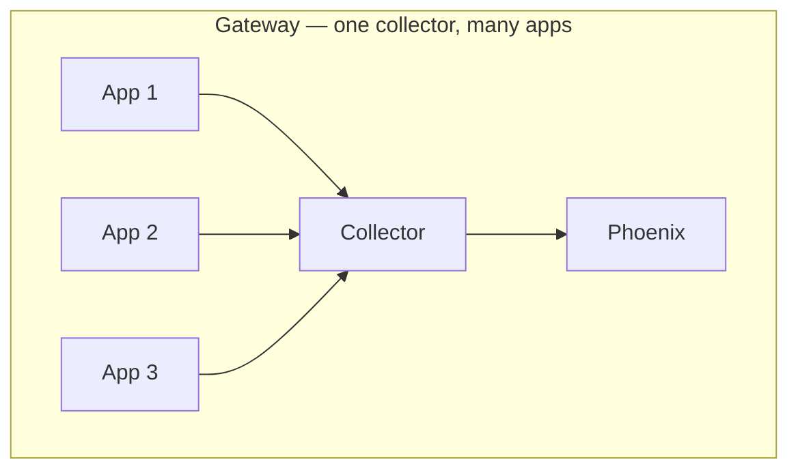
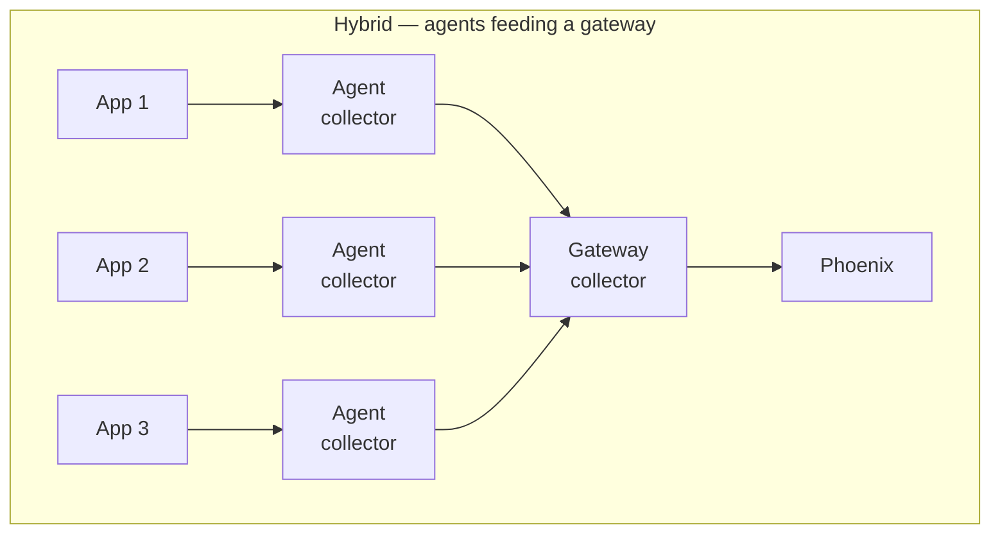

The **[OpenTelemetry Collector](https://opentelemetry.io/docs/collector/)** is a service that receives telemetry, processes it, and exports it to one or more backends. It's optional — most applications send spans directly from the SDK to Phoenix — but it unlocks centralized policy, multi-backend fan-out, dynamic routing, and tail sampling that the SDK can't express.

# Anatomy of a Collector

Collectors are composed of **pipelines**. Each pipeline chains three component types:

| Component | Role |
| :--- | :--- |
| **Receiver** | Listens for incoming telemetry (OTLP over gRPC, OTLP over HTTP, Jaeger, Zipkin, ...). |
| **Processor** | Transforms, filters, enriches, batches, or samples spans as they flow through. |
| **Exporter** | Sends the processed telemetry out — to Phoenix, to another backend, to multiple backends, to disk. |

All components and pipelines are defined in a single `config.yaml`. The Collector's flexibility comes from how those components are composed.

<Frame>
  
</Frame>

For the canonical specification, see [OpenTelemetry Collector documentation](https://opentelemetry.io/docs/collector/).

# Deployment Models

Three common ways to deploy a Collector:

| Model | How it works | Best for |
| :--- | :--- | :--- |
| **Agent** | Collector runs alongside the application — as a sidecar container, a daemonset, or a local process. | Simple setups, clear 1:1 mapping between app and collector. |
| **Gateway** | A central collector receives from many applications. | Centralized policy, credential management, single point of egress. |
| **Hybrid** | Agent collectors forward to a centralized gateway. | Large environments — distributed collection plus centralized processing. |







# Common Use Cases

Reasons to put a Collector between your applications and Phoenix:

| Use case | What the Collector does |
| :--- | :--- |
| **Filtering** | Drop spans by name, attribute, or pattern using a `filter` processor — useful for cutting noise from health checks or known-uninteresting paths. |
| **PII redaction or attribute modification** | Use a `transform` processor to scrub sensitive fields, hash user IDs, or replace values before export. |
| **Fan-out to multiple backends** | Send the same spans to Phoenix and a long-term storage system, or to Phoenix and a metrics backend, without duplicating instrumentation in the app. |
| **Project routing** | Use a `routing` connector to send spans to different Phoenix projects (or different Phoenix instances) based on span attributes — for example, splitting tenant traffic. Phoenix itself doesn't expose multi-project routing in the SDK; the Collector is where that logic belongs. |
| **Tail sampling** | Buffer complete traces and decide which to keep based on outcome (error spans, slow requests, specific attributes). |
| **Credential centralization** | Application code stays free of Phoenix API keys; the Collector handles authentication at a single chokepoint. |
| **Tail-end batching** | Reduce the number of network round-trips from your fleet to Phoenix by batching across applications at the Collector. |

# Common Pitfalls

A few Collector failure modes to know about:

- **Forgetting authentication** — when exporting to a Phoenix instance with authentication enabled, the Collector needs to add `Authorization: Bearer <api-key>` to outbound requests. Use the `headers_setter` extension or set them in the exporter configuration. Local Phoenix doesn't require auth.
- **Modifying shared span objects across pipelines** — when one pipeline mutates a span, every other pipeline that processes the same span sees the modification. Use a `routing` connector to duplicate spans cleanly before fan-out.
- **No batch processor at the end of the pipeline** — for production volumes, the last processor in a pipeline should be a `batch` processor. Without it, the Collector exports one span at a time, which is inefficient.
- **Wrong Collector endpoint** — applications need to point at the Collector's OTLP endpoint (gRPC: `:4317`, HTTP: `:4318`), not at Phoenix directly. Mixing the two is a common source of "why are some spans missing?" debugging.
- **Receiver missing `include_metadata: true`** — when a centralized gateway uses inbound request metadata for routing (e.g., reading the target Phoenix project from a header), the receiver has to be told to make that metadata available. Without it, the routing extension has nothing to read.

# Where the Collector Fits

Both with and without a Collector, your application code looks the same — the [Exporter](/docs/phoenix/tracing/concepts-tracing/otel-openinference/exporter) points at an OTLP endpoint. The difference is just which OTLP endpoint:

```
Without Collector:
  App → Exporter → http://localhost:6006 (or a remote Phoenix)

With Collector:
  App → Exporter → Collector → (processors) → Phoenix (and/or other backends)
```

Start without a Collector. Add one when you need centralized policy, multi-backend fan-out, tail sampling, or routing logic the SDK can't express.

---

## You've completed the OpenTelemetry and OpenInference reference

Every concept in this section — signals, the four OTel components, the Phoenix helpers, OpenInference conventions, span kinds, instrumentation approaches, context, sampling, and the Collector — is now in your toolbox.

Time to instrument:

<Card title="Set up tracing" icon="arrow-right" href="/docs/phoenix/tracing/how-to-tracing" />
