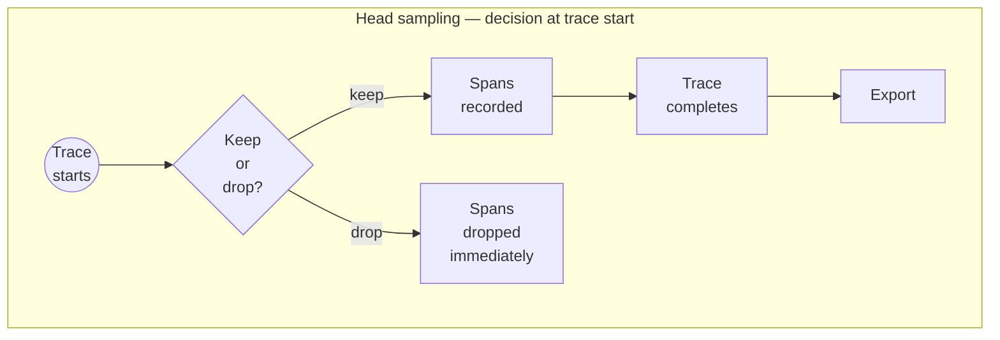
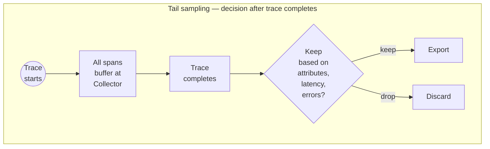

A span is **sampled** when it's processed and exported. Sampling is how you reduce telemetry volume — and the cost that goes with it — without losing the visibility you need to debug production issues.


The principle is **representativeness**: a smaller, well-chosen group can accurately represent a larger one. Sampling 20% of traces doesn't mean you only see 20% of failures — it means you see a statistically representative sample of your application's behavior.

There are two approaches: **head sampling** and **tail sampling**. They differ in *when* the sampling decision is made.

# Head Sampling

The decision to sample is made **at the start of the trace**, before any spans complete.



| Pros | Cons |
| :--- | :--- |
| Efficient — no buffering required. | Can't filter by latency, error status, or any post-hoc attribute. |
| Scales easily across distributed systems. | May drop important traces (the slow ones, the failing ones). |
| Reduces traffic early in the pipeline. | Less precise control. |
| Easy to configure — built into the OTel SDK. | |

Head sampling is the default in the OTel SDK. The most common samplers:

- `ALWAYS_ON` — sample every trace.
- `ALWAYS_OFF` — sample nothing.
- `TraceIdRatioBased(p)` — sample `p` fraction of traces, deterministically based on trace ID.
- `ParentBased(...)` — defer to the parent's sampling decision when there is one; otherwise fall through to the wrapped sampler.

`ParentBased` is what keeps distributed traces consistent — if the root service decides to sample a trace, downstream services see that decision in the trace context and respect it, so the whole trace lives or dies together.

# Tail Sampling

The decision to sample is made **after the trace has completed**, when all spans are available.



| Pros | Cons |
| :--- | :--- |
| Can keep only error traces. | Higher resource usage — every trace must be buffered. |
| Can keep slow traces. | More complex setup — requires the [OTel Collector](/docs/phoenix/tracing/concepts-tracing/otel-openinference/otel-collector). |
| Can filter by any attribute. | Adds latency. |
| Important traces are preserved. | Scalability challenges at very high volumes. |
| Better signal-to-noise ratio. | Increased infrastructure cost. |
| Policy-based control. | |

Tail sampling lives at the Collector layer, not in the SDK — see [OTel Collector](/docs/phoenix/tracing/concepts-tracing/otel-openinference/otel-collector) for the deployment pattern.

# Configuring Sampling via Environment Variables

The OTel SDK reads sampler configuration from environment variables — useful for tuning sampling at deploy time without changing code.

| Variable | Values |
| :--- | :--- |
| `OTEL_TRACES_SAMPLER` | `always_on`, `always_off`, `traceidratio`, `parentbased_traceidratio`, `parentbased_always_on`, `parentbased_always_off` |
| `OTEL_TRACES_SAMPLER_ARG` | A float in `[0.0, 1.0]` — required by ratio-based samplers. |

The static samplers:

- `always_on` — sample every trace.
- `always_off` — sample no traces.

The ratio-based samplers:

- `traceidratio` — sample a fraction of traces. **Each span is sampled independently**, which can break distributed traces (downstream services may drop spans the root service kept).
- `parentbased_traceidratio` — sample a fraction at the root, then respect the parent's decision everywhere else. Keeps or drops the entire trace consistently. **Use this for distributed systems.**

For the API surface, see [OpenTelemetry sampling environment variables](https://opentelemetry.io/docs/specs/otel/configuration/sdk-environment-variables/#general-sdk-configuration).

# Configuring Sampling in the SDK

```python
from opentelemetry import trace
from opentelemetry.sdk.trace import TracerProvider
from opentelemetry.sdk.trace.sampling import ParentBased, TraceIdRatioBased, ALWAYS_ON, ALWAYS_OFF

# Sample 20% of new root traces; respect parent decision for child spans
tracer_provider = TracerProvider(
    sampler=ParentBased(TraceIdRatioBased(0.20))
)

# Or sample everything
tracer_provider = TracerProvider(sampler=ALWAYS_ON)
```

For the API reference, see the [OpenTelemetry sampling reference](https://opentelemetry-python.readthedocs.io/en/latest/sdk/trace.sampling.html).

For custom sampling logic (drop spans for specific users, sample by attribute), see [Custom Sampling](/docs/phoenix/tracing/how-to-tracing/setup-tracing#custom-sampling).

# The Silent `always_off` Gotcha

<Warning>
**If your traces aren't showing up, check `OTEL_TRACES_SAMPLER` first.**

A real-world failure mode: pre-set environment variables in shared environments (Kubernetes pods, base Docker images, CI runners) sometimes contain `OTEL_TRACES_SAMPLER=always_off`. This silently disables tracing — no error, no warning, no spans exported. Application code looks correct. Logs look fine. Nothing reaches Phoenix.

When "no traces are showing up," check the environment variables before anything else.
</Warning>

# Practical Recommendations

Most teams should start with one of these configurations:

| Environment | Recommended setting |
| :--- | :--- |
| Development | `ALWAYS_ON` — see every trace while you're building. |
| Staging | `ALWAYS_ON` — full visibility for validation. |
| Production, low/medium traffic | `ALWAYS_ON` — Phoenix handles the volume; you keep full fidelity. |
| Production, high traffic | `ParentBased(TraceIdRatioBased(0.1))` — head sample 10%, keep distributed traces consistent. Combine with tail sampling at the [Collector](/docs/phoenix/tracing/concepts-tracing/otel-openinference/otel-collector) for must-keep traces (errors, slow requests). |

---

## Next step

The last topic in this section — the OpenTelemetry Collector. Useful for tail sampling, centralized policy, multi-backend routing, and a few other production patterns:

<Card title="Next: OpenTelemetry Collector" icon="arrow-right" href="/docs/phoenix/tracing/concepts-tracing/otel-openinference/otel-collector" />
