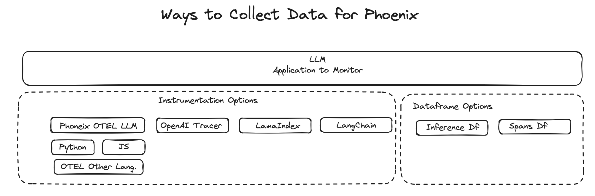
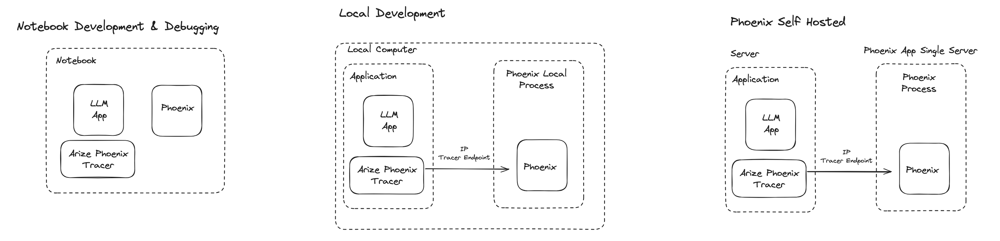

# Deploying Phoenix

Phoenix has a different set of deployment options depending on your needs. There are two components that work together:

* Tracer: The tracers extract trace data for use in Phoenix&#x20;
* Phoenix Application: Phoenix acts as a trace collector and application that visualizes the data for action.

<figure><figcaption></figcaption></figure>

The above instrumentation options determine how the data is collected from the LLM tracers.&#x20;

<figure><figcaption><p>Deployment Options</p></figcaption></figure>

* **Notebook** - Runs locally from a Colab, Jupyter, SageMaker, or Databricks notebook. Data is collected using the tracer and is passed through in memory objects so no need for IP configuration. &#x20;
* **Local Computer** - Runs locally on computer and connects to LLM tracer through IP socket.
* **Self Hosted & Cloud** - The tracer and the Phoenix server run in different locations and connect through IP socket.

_**Tracer:**_

The endpoint can be set through either an environment variable:


```python
import os

#On the Phoenix Tracer Set Collecter Endpoint to App Server of Phoenix
os.envoron["PHOENIX_COLLECTOR_ENDPOINT"] = "https://my-phoenix.io"// 
```


The endpoint can also be set through code:

```python
from phoenix.trace.tracer import Tracer
from phoenix.trace.exporter import HttpExporter
from phoenix.trace.openai.instrumentor import OpenAIInstrumentor


tracer = Tracer(exporter=HttpExporter(endpoint="https://my-phoenix.io"))
OpenAIInstrumentor(tracer).instrument()
```


Phoenix data is currently not persisted. Phoenix will support persisted data in all deployment options "very" shortly.


_**Application Server:**_

The application server is started by (need phoenix in your python path):

```python
python3 -m phoenix.server.main serve
```

```
🌍 To view the Phoenix app in your browser, visit https://<URL>:port
📺 To view the Phoenix app in a notebook, run `px.active_session().view()`
📖 For more information on how to use Phoenix, check out https://docs.arize.com/phoenix
```

Use the "https://\<URL>:port" as the endpoint variable
