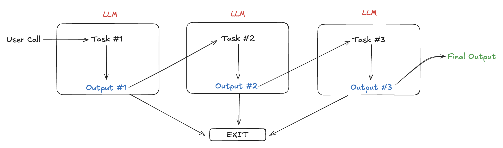
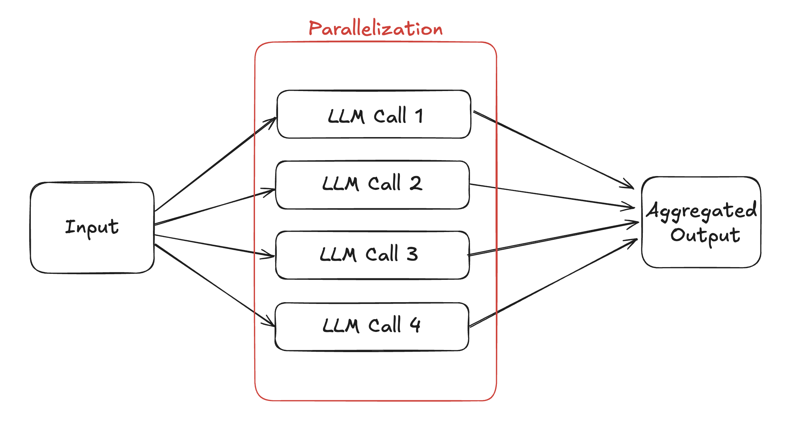
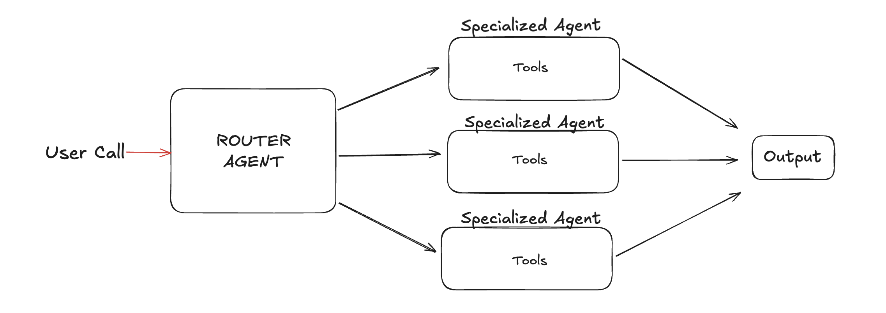
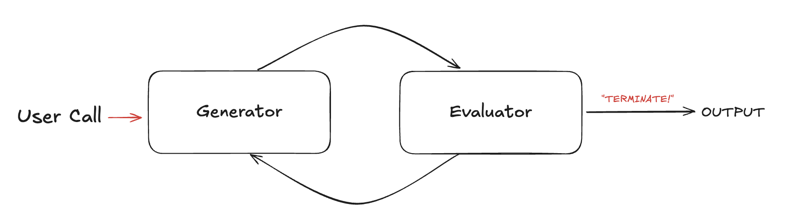

# OpenAI Agents

[**OpenAI-Agents**](https://openai.github.io/openai-agents-python/) is a lightweight Python library for building agentic AI apps. It includes a few abstractions:

* **Agents**, which are LLMs equipped with instructions and tools
* **Handoffs**, which allow agents to delegate to other agents for specific tasks
* **Guardrails**, which enable the inputs to agents to be validated

This guide outlines common agent workflows using this SDK. We will walk through building an investment agent across several use cases.


```python
from agents import Agent, Runner, WebSearchTool

agent = Agent(
    name="Finance Agent",
    instructions="You are a finance agent that can answer questions about stocks. Use web search to retrieve up‑to‑date context. Then, return a brief, concise answer that is one sentence long.",
    tools=[WebSearchTool()],
    model="gpt-4.1-mini",
)
```


## Design Considerations and Limitations

<table><thead><tr><th width="216.8857421875" align="right" valign="top">Design Considerations</th><th>Features &#x26; Limitations</th></tr></thead><tbody><tr><td align="right" valign="top">Model support</td><td>First class support for OpenAI LLMs, and basic support for any LLM using a LiteLLM wrapper. Support for reasoning effort parameter to tradeoff on reducing latency or increasing accuracy.</td></tr><tr><td align="right" valign="top">Structured outputs</td><td>First-class support with OpenAI LLMs. LLMs that do not support <code>json_schema</code> as a parameter are <a href="https://openai.github.io/openai-agents-python/models/#structured-outputs-support">not supported</a>.</td></tr><tr><td align="right" valign="top">Tools</td><td>Very easy, using the <code>@function_call</code> decorator. Support for parallel tool calls to reduce latency. Built-in support for OpenAI SDK for <code>WebSearchTool</code>, <code>ComputerTool</code>, and <code>FileSearchTool</code></td></tr><tr><td align="right" valign="top">Agent handoff</td><td>Very easy using <code>handoffs</code> variable</td></tr><tr><td align="right" valign="top">Multimodal support</td><td>Voice support, no support for images or video</td></tr><tr><td align="right" valign="top">Guardrails</td><td>Enables validation of both inputs and outputs</td></tr><tr><td align="right" valign="top">Retry logic</td><td>⚠️  No retry logic, developers must manually handle failure cases</td></tr><tr><td align="right" valign="top">Memory</td><td>⚠️  No built-in memory management. Developers must manage their own conversation and user memory.</td></tr><tr><td align="right" valign="top">Code execution</td><td>⚠️ No built-in support for executing code</td></tr></tbody></table>


## Simple agent

An LLM agent with access to tools to accomplish a task is the most basic flow. This agent answers questions about stocks and uses OpenAI web search to get real time information.&#x20;




```python
from agents import Agent, Runner, WebSearchTool

agent = Agent(
    name="Finance Agent",
    instructions="You are a finance agent that can answer questions about stocks. Use web search to retrieve up‑to‑date context. Then, return a brief, concise answer that is one sentence long.",
    tools=[WebSearchTool()],
    model="gpt-4.1-mini",
)
```


***

## Prompt chaining

This agent builds a portfolio of stocks and ETFs using multiple agents linked together:

1. **Search Agent:** Searches the web for information on particular stock tickers.
2. **Report Agent:** Creates a portfolio of stocks and ETFs that supports the user's investment strategy.



<figure><figcaption><p>Prompt Chaining Flow</p></figcaption></figure>


```python
portfolio_agent = Agent(
    name="Portfolio Agent",
    instructions="You are a senior financial analyst. You will be provided with a stock research report. Your task is to create a portfolio of stocks and ETFs that could support the user's stated investment strategy. Include facts and data from the research report in the stated reasons for the portfolio allocation.",
    model="o4-mini",
    output_type=Portfolio,
)

research_agent = Agent(
    name="FinancialSearchAgent",
    instructions="You are a research assistant specializing in financial topics. Given an investment strategy, use web search to retrieve up‑to‑date context and produce a short summary of stocks that support the investment strategy at most 50 words. Focus on key numbers, events, or quotes that will be useful to a financial analyst.",
    model="gpt-4.1",
    tools=[WebSearchTool()],
    model_settings=ModelSettings(tool_choice="required", parallel_tool_calls=True),
)
```


***

## Parallelization

This agent researches stocks for you. If we want to research 5 stocks, we can force the agent to run multiple tool calls, instead of sequentially.



<figure><figcaption><p>Parallelization Flow</p></figcaption></figure>


```python
@function_tool
def get_stock_data(ticker_symbol: str) -> dict:
    """
    Get stock data for a given ticker symbol.
    Args:
        ticker_symbol: The ticker symbol of the stock to get data for.
    Returns:
        A dictionary containing stock data such as price, market cap, and more.
    """
    import yfinance as yf
    stock = yf.Ticker(ticker_symbol)
    return stock.info

research_agent = Agent(
    name="FinancialSearchAgent",
    instructions=dedent(
        """You are a research assistant specializing in financial topics. Given a stock ticker, use web search to retrieve up‑to‑date context and produce a short summary of at most 50 words. Focus on key numbers, events, or quotes that will be useful to a financial analyst."""
    ),
    model="gpt-4.1",
    tools=[WebSearchTool(), get_stock_data_tool],
    model_settings=ModelSettings(tool_choice="required", parallel_tool_calls=True),
)
```


***

## Router agent

This agent answers questions about investing using multiple agents. A central router agent chooses which worker to use.

1. **Research Agent:** Searches the web for information about stocks and ETFs.
2. **Question Answering Agent:** Answers questions about investing like Warren Buffett.



<figure><figcaption></figcaption></figure>


```python
qa_agent = Agent(
    name="Investing Q&A Agent",
    instructions="You are Warren Buffett. You are answering questions about investing.",
    model="gpt-4.1",
)

research_agent = Agent(
    name="Financial Search Agent",
    instructions="You are a research assistant specializing in financial topics. Given a stock ticker, use web search to retrieve up‑to‑date context and produce a short summary of at most 50 words. Focus on key numbers, events, or quotes that will be useful to a financial analyst.",
    model="gpt-4.1",
    tools=[WebSearchTool()],
)

orchestrator_agent = Agent(
    name="Routing Agent",
    instructions="You are a senior financial analyst. Your task is to handoff to the appropriate agent or tool.",
    model="gpt-4.1",
    handoffs=[research_agent,qa_agent],
)
```


***

## Evaluator-Optimizer

When creating LLM outputs, often times the first generation is unsatisfactory. You can use an agentic loop to iteratively improve the output by asking an LLM to give feedback, and then use the feedback to improve the output.

This agent pattern creates reports and evaluates itself to improve its output.

1. **Report Agent (Generation):** Creates a report on a particular stock ticker.
2. **Evaluator Agent (Feedback):** Evaluates the report and provides feedback on what to improve.



<figure><figcaption><p>Eval-Optimizer Flow</p></figcaption></figure>


```python
class EvaluationFeedback(BaseModel):
    feedback: str = Field(
        description=f"What is missing from the research report on positive and negative catalysts for a particular stock ticker. Catalysts include changes in {CATALYSTS}.")
    score: Literal["pass", "needs_improvement", "fail"] = Field(
        description="A score on the research report. Pass if the report is complete and contains at least 3 positive and 3 negative catalysts for the right stock ticker, needs_improvement if the report is missing some information, and fail if the report is completely wrong.")


report_agent = Agent(
    name="Catalyst Report Agent",
    instructions=dedent(
        """You are a research assistant specializing in stock research. Given a stock ticker, generate a report of 3 positive and 3 negative catalysts that could move the stock price in the future in 50 words or less."""
    ),
    model="gpt-4.1",
)

evaluation_agent = Agent(
    name="Evaluation Agent",
    instructions=dedent(
        """You are a senior financial analyst. You will be provided with a stock research report with positive and negative catalysts. Your task is to evaluate the report and provide feedback on what to improve."""
    ),
    model="gpt-4.1",
    output_type=EvaluationFeedback,
)
```


***

## Orchestrator worker

This is the most advanced pattern in the examples, using orchestrators and workers together. The orchestrator chooses which worker to use for a specific sub-task. The worker attempts to complete the sub-task and return a result. The orchestrator then uses the result to choose the next worker to use until a final result is returned.

In the following example, we'll build an agent which creates a portfolio of stocks and ETFs based on a user's investment strategy.

1. **Orchestrator:** Chooses which worker to use based on the user's investment strategy.
2. **Research Agent:** Searches the web for information about stocks and ETFs that could support the user's investment strategy.
3. **Evaluation Agent:** Evaluates the research report and provides feedback on what data is missing.
4. **Portfolio Agent:** Creates a portfolio of stocks and ETFs based on the research report.



<figure><figcaption><p>Orchestrator Flow</p></figcaption></figure>


```python
evaluation_agent = Agent(
    name="Evaluation Agent",
    instructions=dedent(
        """You are a senior financial analyst. You will be provided with a stock research report with positive and negative catalysts. Your task is to evaluate the report and provide feedback on what to improve."""
    ),
    model="gpt-4.1",
    output_type=EvaluationFeedback,
)

portfolio_agent = Agent(
    name="Portfolio Agent",
    instructions=dedent(
        """You are a senior financial analyst. You will be provided with a stock research report. Your task is to create a portfolio of stocks and ETFs that could support the user's stated investment strategy. Include facts and data from the research report in the stated reasons for the portfolio allocation."""
    ),
    model="o4-mini",
    output_type=Portfolio,
)

research_agent = Agent(
    name="FinancialSearchAgent",
    instructions=dedent(
        """You are a research assistant specializing in financial topics. Given a stock ticker, use web search to retrieve up‑to‑date context and produce a short summary of at most 50 words. Focus on key numbers, events, or quotes that will be useful to a financial analyst."""
    ),
    model="gpt-4.1",
    tools=[WebSearchTool()],
    model_settings=ModelSettings(tool_choice="required", parallel_tool_calls=True),
)

orchestrator_agent = Agent(
    name="Routing Agent",
    instructions=dedent("""You are a senior financial analyst. You are trying to create a portfolio based on my stated investment strategy. Your task is to handoff to the appropriate agent or tool.

    First, handoff to the research_agent to give you a report on stocks and ETFs that could support the user's stated investment strategy.
    Then, handoff to the evaluation_agent to give you a score on the research report. If the evaluation_agent returns a needs_improvement or fail, continue using the research_agent to gather more information.
    Once the evaluation_agent returns a pass, handoff to the portfolio_agent to create a portfolio."""),
    model="gpt-4.1",
    handoffs=[
        research_agent,
        evaluation_agent,
        portfolio_agent,
    ],
)
```


This uses the following structured outputs.


```python
class PortfolioItem(BaseModel):
    ticker: str = Field(description="The ticker of the stock or ETF.")
    allocation: float = Field(
        description="The percentage allocation of the ticker in the portfolio. The sum of all allocations should be 100."
    )
    reason: str = Field(description="The reason why this ticker is included in the portfolio.")


class Portfolio(BaseModel):
    tickers: list[PortfolioItem] = Field(
        description="A list of tickers that could support the user's stated investment strategy."
    )


class EvaluationFeedback(BaseModel):
    feedback: str = Field(
        description="What data is missing in order to create a portfolio of stocks and ETFs based on the user's investment strategy."
    )
    score: Literal["pass", "needs_improvement", "fail"] = Field(
        description="A score on the research report. Pass if you have at least 5 tickers with data that supports the user's investment strategy to create a portfolio, needs_improvement if you do not have enough supporting data, and fail if you have no tickers."
    )
```

