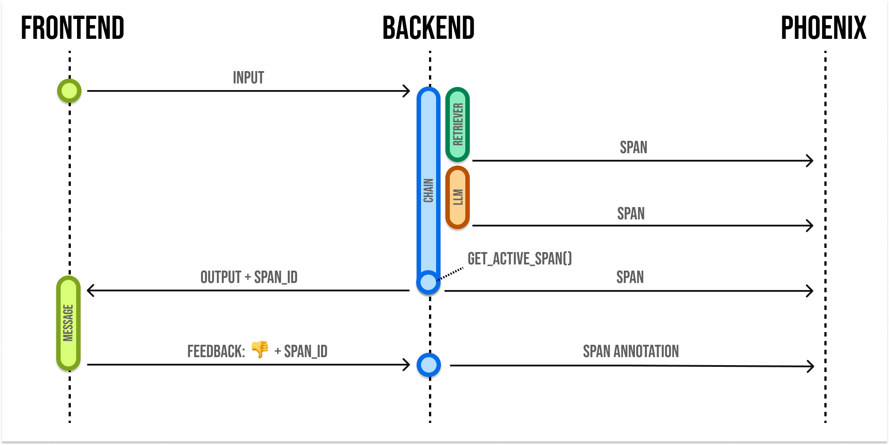

# Annotating via the Client


This assumes annotations as of `arize-phoenix>=9.0.0`.


<figure><figcaption></figcaption></figure>

When building LLM applications, it is important to collect feedback to understand how your app is performing in production. Phoenix lets you attach feedback to spans and traces in the form of annotations.

Annotations come from a few different sources:

* Human Annotators
* End users of your application
* LLMs-as-Judges
* Basic code checks

You can use the Phoenix SDK and API to attach feedback to a span.

Phoenix expects feedback to be in the form of an **annotation.** Annotations consist of these fields:

```json
{
  "span_id": "67f6740bbe1ddc3f",  // the id of the span to annotate
  "name": "correctness",  // the name of your annotation
  "annotator_kind": "HUMAN",  // HUMAN, LLM, or CODE
  "result": {
    "label": "correct",  // A human-readable category for the feedback
    "score": 0.85,  // a numeric score, can be 0 or 1, or a range like 0 to 100
    "explanation": "The response answered the question I asked"
  },
  "metadata": {
    "model": "gpt-4",
    "threshold_ms": 500,
    "confidence": "high"
  },
  "identifier": "user-123"  // optional, identifies the annotation and enables upserts
}
```

Note that you can provide a **label**, **score**, or **explanation**. With Phoenix an annotation has a name (like **correctness**), is associated with an **annotator** (**LLM**, **HUMAN**, or **CODE**), and can be attached to the **spans** you have logged to Phoenix.


Phoenix allows you to log multiple annotations of the same name to the same span. For example, a single span could have 5 different "correctness" annotations. This can be useful when collecting end user feedback.

**Note:** The API will **overwrite** span annotations of the same name, unless they have different "identifier" values.

If you want to track multiple annotations of the same name on the same span, make sure to include different "identifier" values on each.


## Send Annotations to Phoenix

\
Once you construct the annotation, you can send this to Phoenix via it's REST API. You can POST an annotation from your application to `/v1/span_annotations` like so:


If you're self-hosting Phoenix, be sure to change the endpoint in the code below to `<your phoenix endpoint>/v1/span_annotations?sync=false`




**Retrieve the current span\_id**

If you'd like to collect feedback on currently instrumented code, you can get the current span using the `opentelemetry` SDK.

```python
from opentelemetry.trace import format_span_id, get_current_span

span = get_current_span()
span_id = format_span_id(span.get_span_context().span_id)
```

You can use the span\_id to send an annotation associated with that span.

```python
from phoenix.client import Client

client = Client()
annotation = client.annotations.add_span_annotation(
    annotation_name="user feedback",
    annotator_kind="HUMAN",
    span_id=span_id,
    label="thumbs-up",
    score=1,
)
```



**Retrieve the current spanId**

```typescript
import { trace } from "@opentelemetry/api";

async function chat(req, res) {
  // ...
  const spanId = trace.getActiveSpan()?.spanContext().spanId;
}
```

You can use the spanId to send an annotation associated with that span.

```typescript
import { createClient } from '@arizeai/phoenix-client';

const PHOENIX_API_KEY = 'your_api_key';

const px = createClient({
  options: {
    // change to self-hosted base url if applicable
    baseUrl: 'https://app.phoenix.arize.com',
    headers: {
      api_key: PHOENIX_API_KEY,
      Authorization: `Bearer ${PHOENIX_API_KEY}`,
    },
  },
});

export async function postFeedback(
  spanId: string,
  name: string,
  label: string,
  score: number,
  explanation?: string,
  metadata?: Record<string, unknown>
) {
  const response = await px.POST('/v1/span_annotations', {
    params: { query: { sync: true } },
    body: {
      data: [
        {
          span_id: spanId,
          name: name,
          annotator_kind: 'HUMAN',
          result: {
            label: label,
            score: score,
            explanation: explanation || null,
          },
          metadata: metadata || {},
        },
      ],
    },
  });

  if (!response || !response.data) {
    throw new Error('Annotation failed');
  }

  return response.data.data;
}
```



```bash
curl -X 'POST' \
  'https://app.phoenix.arize.com/v1/span_annotations?sync=false' \
  -H 'accept: application/json' \
  -H 'Content-Type: application/json' \
  -H 'api_key: <your phoenix api key> \
  -d '{
  "data": [
    {
      "span_id": "67f6740bbe1ddc3f",
      "name": "correctness",
      "annotator_kind": "HUMAN",
      "result": {
        "label": "correct",
        "score": 0.85,
        "explanation": "The response answered the question I asked"
      },
      "metadata": {
        "model": "gpt-4",
        "threshold_ms": 500,
        "confidence": "high"
      }
    }
  ]
}'
```


