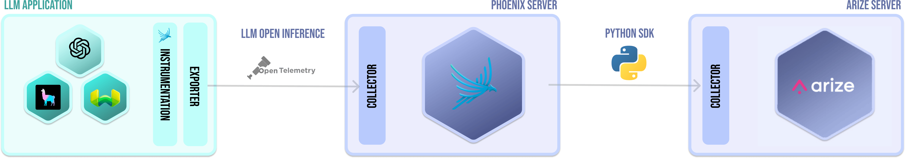
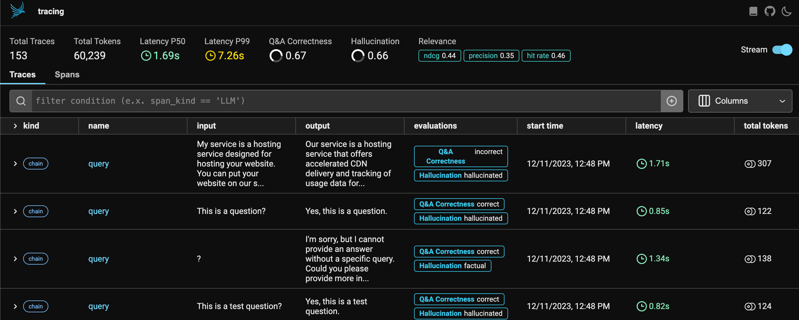
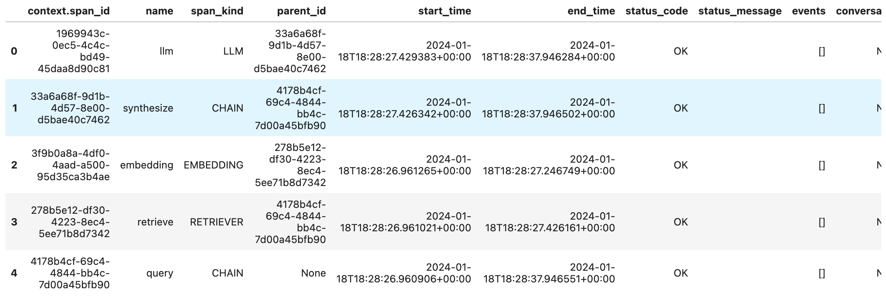

# Send traces to Arize

You can use Phoenix to collect traces, run [evals](https://docs.arize.com/phoenix/evaluation/llm-evals), and perform data modifications in a notebook environment until you're ready to export data to Arize using our Python SDK.

Here's how you do it:

1. [Collect traces in Phoenix](send-traces-to-arize.md#collect-traces-in-phoenix)
2. [Query for specific traces](send-traces-to-arize.md#query-for-specific-traces)
3. [Send data to Arize](send-traces-to-arize.md#send-data-to-arize)

<figure><figcaption></figcaption></figure>

### Collect Traces in Phoenix

Enable Phoenix tracing is very similar to what we showed in the section above since it also leverages the OpenInference instrumentation. For more details, see the [Phoenix Quickstart Guide to Tracing](https://docs.arize.com/phoenix/tracing/llm-traces-1).

Your application traces should stream into the Phoenix UI as shown below

<figure><figcaption><p>Phoenix UI</p></figcaption></figure>

### **Query for specific traces**

When you're ready to send your data to Arize, run the following command to export your traces from Phoenix.

```python
spans_df = px.Client().get_spans_dataframe()
```

This command creates a dataframe object as shown below:

<figure><figcaption><p>An example row of the dataframe</p></figcaption></figure>

If you want to get the evaluations as well attached to the spaces, run the commands below.

```python
trace_dataset = px.Client().get_trace_dataset()
evals_df = tds.get_evals_dataframe()
```

### **Send data to Arize**

The dataframe can be directly sent to Arize using our [Python SDK](broken-reference). Schema mapping is _not_ _required_ for OpenInference traces since Arize will automatically understand the column names from your dataframe.


To send tracing data via the Python SDK, it must be installed with extra dependencies

```
pip install arize[Tracing]
```

_(Cloud import support coming soon)_


The following code example shows how to send a dataframe with traces exported from Phoenix to Arize via the `log_spans` method. Note that we do not need to specify any Schema.

<pre class="language-python"><code class="lang-python">from arize.pandas.logger import Client

SPACE_ID = "SPACE_ID"
API_KEY = "API_KEY"

if SPACE_ID == "SPACE_ID" or API_KEY == "API_KEY":
    raise ValueError("❌ NEED TO CHANGE SPACE AND/OR API_KEY")
else:
    print("✅ Import and Setup Arize Client Done! Now we can start using Arize!")
    
arize_client = Client(space_id=SPACE_ID, api_key=API_KEY)
<strong>model_id = "generative-spans-tutorial-test" # the model name in Arize
</strong>model_version = "1.0" # (optional) the model version

response = arize_client.log_spans(
    dataframe=spans_df,
    evals_dataframe=evals_df, # if you do not have any evals, remove this line
    model_id=model_id,
    model_version=model_version, # optional
)

<strong># If successful, the server will return a status_code of 200
</strong>if response.status_code != 200:
    print(f"❌ logging failed with response code {response.status_code}, {response.text}")
else:
    print(f"✅ You have successfully logged training set to Arize")
</code></pre>

For more in-detail demonstration, check our Colab tutorial:


