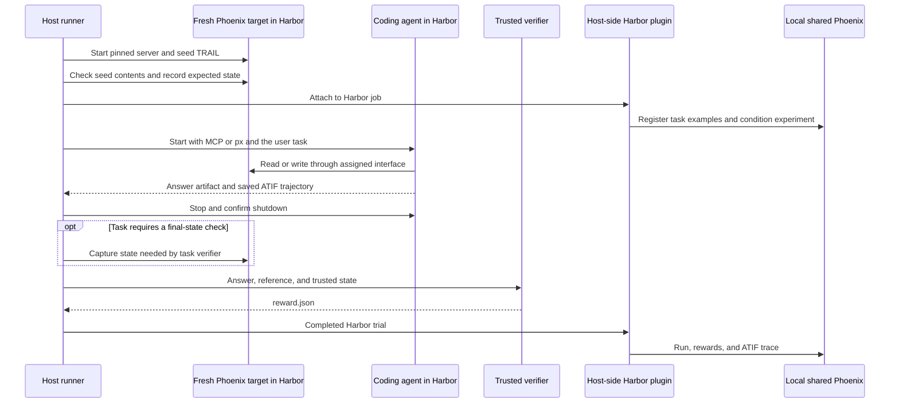

# MCP benchmark design review

Review of stack #16035 through #16043 at `3952c5f6562`, September 10, 2026.
This is the preserved review record. The implementation now follows the agreed
fresh-target design; see README.md for current commands and scoring. References
to prototype files below describe the audited predecessor, not the active runner.
The original stack adds 6,910 lines, including a 1,942-line dependency lockfile.
The second pass incorporates the user's clarified task source and scoring rules.
It replaces the earlier proposal to promote the new smoke tasks into the suite.

## Agreed target

Each task attempt gets a fresh Phoenix service and database inside Harbor, seeded
only with TRAIL. The agent has full read-write access through its assigned
interface. The external Harbor plugin records results in the existing local
shared Phoenix instance. No agent access to that shared database or endpoint.

Use a fresh target per trial, not one mutable target shared across conditions.
Otherwise a write in the first condition changes the task for the next condition.
Keep the target in a separate service container from the agent so the agent
cannot read its SQLite file or tamper with the server process.



The sequence illustrates ownership. Harbor may initialize the plugin and dataset
before provisioning trial services. The essential ordering is seed before agent,
stop agent before any trusted final-state capture and grading, and record final
outcomes. If a task needs final-state inspection, keep the target alive until it
finishes. Seed readiness is a setup check; it does not require whole-database
before/after hashing for every task.

## Task source and porting review

The original plan, recovered from the parent of commit `513963eb72a`, explicitly
names `origin/mora/mcpbench-experiment` at
`39c9be2cf0377aa2b2377c62cc69bfe5f674dd96`. Its task YAML files are under
[scripts/benchmarks/mcp/tasks](https://github.com/Arize-ai/phoenix/tree/39c9be2cf0377aa2b2377c62cc69bfe5f674dd96/scripts/benchmarks/mcp/tasks).
The local `mcp/benchmark-harness` branch has the same task files. These are the
intended Harbor task sources. TRAIL is only seed data, not the task-instruction
dataset. The current smoke tasks do not constitute the requested port.

Use the source prompts as the starting point, keeping the same instructions in
MCP and CLI conditions. Change the target project name to `research-assistant`,
resolve only necessary ambiguities, and version those adaptations. Keep the
upstream task IDs where possible, including `count-traces`; the prototype instead
uses `trace-count`. Record the source revision once for the imported collection.

| Source task | Intent | Verifier work needed for the port |
| --- | --- | --- |
| `count-traces` | Number of traces | Compare the final answer's exact integer with trusted seed truth. Replace the old search for any occurrence of 117. |
| `total-cost` | Total cost of the seeded application traces | Compute a reference from the seeded data and pinned pricing; define display precision. Do not confuse this with the evaluated agent's cost or copy the old dollar regex. |
| `most-failing-tool` | Tool with most recorded failures | Check the winner, with defined span-name/tool-name aliases and tie behavior. |
| `top-error-category` | Most common annotator-labeled error | Check the category from actual stored annotations. Account for annotation upserts rather than blindly counting source rows. |
| `error-rate-by-length` | Span error rates for short and long traces | Check both requested groups and denominators. The old regex checks only the long-trace rate. |
| `max-llm-calls` | Maximum LLM calls in a historical trace | Compute the maximum from seed spans and compare exactly; distinguish this answer from the benchmark agent's own call count. |
| `repeated-tool-calls` | Most repeated tool within one trace, and count | Check both tool identity and count. The old grader checks only the tool name. |
| `spend-concentration` | Cost share of the top 10% of traces | Define rounding, ties, and precision. The old matcher accepts a broad range instead of checking a computed value. |
| `pagedown-root-cause` | Diagnose the recorded tool signature error | Use a focused correctness rubric or deterministic check if reliable. Finding the words “keyword argument” alone does not establish a supported explanation. |

`noop-surface-cost` is an additional calibration control. Keep it out of the
nine-task success denominator and do not require a Phoenix call for it.
The new trace/annotation review prompts are development checks unless separately
selected for task coverage. The synthetic experiment task is out of scope.

Recompute references against the exact seed rather than importing old expected
numbers. Use source-derived oracle values and trusted target validation, not the
candidate MCP's answer as the only authority. Pin application pricing for cost
tasks. Preserve natural wording; require evidence IDs only when the selected task
needs them. Natural queries should reveal whether agents discover code mode/SQL,
without turning every task into an instruction to use SQL.

The project rename must be one seed configuration value, propagated into payloads,
task rendering, solutions, and checks. Today it is hardcoded in preparation,
staging, smoke tasks, the oracle, probes, review-fixture SQL, and tests. Do not make
a partial rename or modify existing shared-database projects. New seeds get the
new name and identity; historical manifests remain intact.

## Per-task rewards and shared measurements

Every task defines a final binary `reward`. Shared code adds `tool_call_count`
as an efficiency measurement. Additional checks are selected per task; there is
no universal conjunction of correctness, completeness, evidence IDs, policy, and
unchanged state.

```text
trusted reference + final answer + selected task evidence
  -> that task's verifier
  -> reward: 0 or 1, with optional task-specific scores

evaluated agent's saved trajectory
  -> shared measurement helper
  -> tool_call_count, optionally agent_turn_count

both -> Harbor named numeric results -> Phoenix plugin
```

For count, the prompt is “How many traces are in the research-assistant project?”
The success condition is an exact numeric match against trusted initial seed
truth. The current requirement for `project`, `trace_count`, and
`evidence_trace_ids`, plus state/policy checks, must be removed from that reward.
Parse only the final answer, accepting a clearly stated exact integer in prose;
reject contradictory or unparseable answers. A bare regex over the full response
or trajectory can reward an intermediate guess, a negation, or a number quoted
for some other purpose. No LLM judge is needed for this count comparison.

Use a small per-task verifier function or Harbor test script, not an extensible
grading configuration language. Reuse extraction, comparison, and trajectory
helpers. If a task needs an LLM judge, file/DB state check, intermediate-answer
match, tool restriction, or efficiency threshold, its verifier explicitly defines
how that contributes to pass/fail. Informational measurements do not silently
change `reward`.

Recommended common measurement definitions:

- `tool_call_count`: top-level tool invocations emitted by the evaluated agent,
  including failed calls and its retries. Exclude oracle, setup, verifier, and
  historical TRAIL calls. Do not add tool-result records as new calls.
- `agent_turn_count`, if useful: assistant decision turns from the trajectory,
  excluding user messages and tool observations. Avoid an ambiguous `step_count`:
  a Harbor task step is also a different concept.
- A code-mode execute or shell call can contain several Phoenix operations.
  Keep nested `phoenix_operation_count` or SQL attempt/success counts separate
  when needed to explain that task. Do not inflate top-level tool counts with
  nested calls or equate fewer calls with better performance irrespective of success.

Normalize available adapter trajectories once. Account for continuations without
double counting copied history. Missing or incomplete evidence is unavailable,
not zero use; it must not turn a valid count answer into a failed task. Preserve
infrastructure status separately if the trial itself could not complete.

Interface use can be measured from successful native MCP dispatch and actual
broker-executed `px` commands. Configured tool availability is not proof of use;
text mentioning `px` or SQL is not proof of execution. These can remain diagnostics
for count. A task may explicitly require or forbid a tool where relevant. Retain
network isolation regardless of whether a task has a tool-use score.

Code mode and SQL are part of the original benchmark's purpose, so keep focused
native execution measurements for selected analytics tasks. Remove broad
shared-database authorization code without removing the evidence of real tool
execution. This comparison changes the whole MCP/CLI interface; it is not by
itself a controlled estimate of SQL's individual effect.

Before a matrix, verify the selected MCP build exposes the intended code-mode
and SQL capabilities and record those settings alongside the CLI version. An
unavailable intended capability is a setup problem; an available capability the
agent does not discover is benchmark behavior. Keep task wording identical
between conditions, and compare MCP versus CLI within each agent/model pair.
Changing both coding agent and model does not isolate an agent-only effect.

## What the code does today

The current target is a second host process on port 6007 reading the same
`~/.phoenix/phoenix.db` as the results server on port 6006. A custom boundary
rewrites SQL and GraphQL and rejects writes to protect unrelated shared data.
No Phoenix target is built or seeded inside Harbor.

```text
Before a sample, separate manual steps:
  runtime.py                 build/install pinned client and evals wheels
  prepare_patronus_trail.py   download/convert TRAIL into private JSON files
  fixture.seed(...)          upload payload into host Phoenix
  smoke_images.py            build agents, gateway, broker, and verifier images
  smoke_target.py            start restricted host endpoint on :6007

smoke_run.main
  check_runtime
  stage_task.stage OR smoke_tasks.stage_review
    write instruction.md, task.toml, environment, and verifier configuration
  check_fixture              inspect host SQLite fixture and freeze baseline
  for each selected condition:
    run_condition
      start gateway          upstream target fixed to host :6007
      matrix.render_job      results endpoint fixed to localhost :6006
      Job.create
      attach_job_plugin      dataset/experiment recording outside containers
      Job.run
        SmokeEnvironment     start agent container; connect gateway; probe isolation
        agent                perform task; write answer.json; save ATIF
        SmokeEnvironment     stop agent and broker; confirm shutdown
        prepare_verifier     host event hook
          inspect fixture state and audit logs
          render_trajectory  ATIF -> judge input text
          evaluate_completeness
        smoke_verify.verify  separate offline container
          grade_count OR grade_review
          add judge score and SQL measurements
          write reward.json
        Harbor plugin        record terminal outcome and ATIF in Phoenix
      require_completed_results
        reward 0: continue
        exception or missing reward: stop matrix

Optional manual follow-ups, never called by smoke_run:
  smoke_check.py             compare saved rewards with Phoenix records
  smoke_verifier_probe.py    rerun verifier on saved evidence in Docker
  report.py                 summarize separately supplied exports
```

This split explains why the apparent smoke code is so large. Most of it is
runtime infrastructure for the shared-database prototype, not test code.

## Proposed simplification

Keep one small runner, standard Harbor task directories, deterministic preparation,
and task-specific verifiers. Reuse the existing `evals/harbor` wheel-staging pattern
and plugin integration rather than building another generic evaluation framework.
The existing headless-agent task uses different networking and an in-process
Phoenix app, so it is a starting point, not a drop-in environment.

A possible layout, not files created by this review:

```text
evals/mcp/
  README.md
  Makefile                  one user-facing benchmark target
  pyproject.toml / uv.lock   benchmark dependencies
  configs/matrix.json       agent/model/interface settings
  run.py                    configure and invoke Harbor jobs
  prepare.py                TRAIL conversion and seeding commands
  environment/              images, trial lifecycle, gateway, CLI transport
  tasks/
    count-traces/           adapted source prompt, task.toml, solution/, tests/
    total-cost/             adapted source prompt, task.toml, tests/
    ...                     remaining inherited queries
  verifiers/                shared extraction/comparison helpers
  measurements.py           evaluated-agent call/turn counts
  tests/
    unit/                   graders, preparation, configuration, transport rules
    integration/            Harbor task mapping and actual MCP dispatch
  dev/
    check_run.py            small manual recording check
    verifier_probe.py       only if repeated use justifies keeping it
  .private/                 ignored data and run artifacts
```

Harbor's `tasks/*/tests/` are agent-task verifiers, not tests of benchmark source
code. They must ship with runnable tasks. `tests/unit` and `tests/integration`
exercise our implementation. A live smoke is simply a small selection of real
tasks through the real runner; it should not have a second execution architecture.

| Existing code | Recommendation |
| --- | --- |
| `smoke_run.py`, `smoke_environment.py`, `smoke_images.py` | Refactor into the core runner and environment; required runtime behavior |
| `smoke_gateway.py`, `smoke_cli.py` | Keep only needed transport isolation; organize under environment; enable normal target writes |
| `smoke_target.py` | Remove the custom shared-database policy when the fresh service replaces it; do not port SQL/GraphQL rewriting |
| `smoke_state.py` | Keep task-relevant before/after checks against the fresh target; drop assumptions about host database paths |
| `smoke_tasks.py` | Replace the smoke task catalog with the adapted source queries and task-local graders; keep only helpers the new tasks need |
| `smoke_review_fixture.py` and synthetic `experiment-review` | Remove from this benchmark; they violate the clarified TRAIL-only seed scope |
| `smoke_check.py` | Reduce to a small opt-in check under `dev/`; remove dependence on the still-existing host fixture and old sample layouts |
| `smoke_verifier_probe.py` | Development-only; retain only if replaying verifier failures is a recurring need |
| `report.py`, `configs/filters/` | Defer; no runner integration or current reporting requirement justifies them |
| `judge.py`, trajectory rendering | Make opt-in for tasks needing semantic assessment; omit from the basic count path |
| SQL usage measurements | Keep focused native execution diagnostics for analytics tasks; separate them from trajectory rendering, top-level tool counts, and correctness |
| `snapshot_answer`, `runner_environment`, `await_ready` | No runtime callers in this tree; remove or connect to a real need, not tests alone |

A broker is useful if we require the CLI condition to use the CLI binary rather
than calling Phoenix HTTP APIs directly. Simply installing `px` in a container
with access to all REST routes does not enforce that condition. The proposed
broker can keep this distinction without restricting which Phoenix records may
be read or written. Likewise, MCP transport access is not proof that the client
used a particular native tool; avoid claiming more isolation than we test.

## Metadata and task authoring

There are 24 required/defaulted top-level fields in `TaskMetadata`, plus nested
scale fields. That is more than the intended initial suite needs. Difficulty,
challenge taxonomies, split/family rules, capability lists, evaluator catalogs,
and rubric versions add maintenance without a current use for those fields.

The current attachment path is:

```text
stage_task.count_metadata(manifest)
  -> stage_task.stage writes [metadata] into generated task.toml
  -> Harbor loads the task configuration
  -> Phoenix TaskRecord.to_example()
  -> example["metadata"]["task_config"]["metadata"]
```

`smoke_tasks.stage_review` copies the count template and overrides fields for the
review tasks. Those fields are metadata on a dataset example, not a separate
join and not run results. A new fixture hash changes task content identity, which
lets the plugin version the dataset. Model, interface, and observed SQL use
belong to configuration/results, not authored task properties.

Prefer native task identity, the existing source task class, and centrally
attached fixture provenance. Use the same small schema for every task:

```toml
# Proposed task-local config, not the current schema.
[task]
name = "arize/count-traces"
version = "1"

[metadata]
task_class = "trivial"

[metadata.fixture]
corpus = "PatronusAI/TRAIL"
revision = "b424ce63d5973d5dcd7169b1bc3c07ccdee276d1"
# Staging adds sha256 from the actual private seed manifest.
```

Keep `task_class` beside the instruction, using the inherited small set of values
consistently. Store the seed revision/hash once in a manifest and attach it through
one staging function for all tasks. Keep optional verifier logic in task files,
not in a mandatory metadata catalog. Staging adds fixture identity and runtime
wiring. Use stable names and trace/span IDs in task instructions;
do not make an otherwise identical task a new dataset example because a fresh
service assigned a different incidental database row ID.

## Responses to the diff comments

**1. What does the workflow run?** Local benchmark tests, type checking, Ruff,
and the local boundary suite. It first builds the pinned wheels and installs
dependencies. It never launches the paid agent matrix. Despite its job label,
`make install-python` selects Python 3.10 for server tests; benchmark checks use
Python 3.13. It does not run the separate `mcp-plugin-test` target.

**2. What are `live_tests`?** Misnamed unit/integration tests, not live agent runs.
`test_measurements.py` registers small fake tool implementations in a real FastMCP
server and calls them through its in-process client. It checks our middleware
receives actual dispatch events and distinguishes successful SQL, error envelopes,
validation-only SQL, and schema inspection. It does not execute native Phoenix
SQL against a running target.

**3. Is the instruction original, and can it be conversational?** The verbose
instruction was introduced in this stack at `14318a09be6`, but the count query
already exists in the intended source benchmark as `count-traces`. The first
review missed that provenance. Adapt its natural prompt:

> How many traces are in the research-assistant project?

Put common interface rules in agent configuration and enforce network boundaries
in the environment. Update the final-answer extractor and grader together with
the prompt; the existing JSON/evidence-ID contract would otherwise reject valid
answers. Version the adapted task and test the new grader with correct, incorrect,
ambiguous, and missing answers. Neither TRAIL's original prompts nor the new smoke
review prompts define the intended suite.

**4. Where is example metadata?** `count_metadata` in `stage_task.py`, then generated
`task.toml`, then the nested Phoenix example metadata shown above. Its absence
from the authored task directory is a real discoverability problem.

**5. What does the oracle do, and where are rewards assigned?** `solve.py` walks
project pages, finds `mcp-trail-gaia`, fetches its `traceCount` and one supporting
trace ID, and writes the required JSON. It raises if GraphQL fails or pagination
ends without a match. It is a reference solution, not a verifier or an LLM call.
`verify.grade_count` assigns the five deterministic scores and their all-pass
`reward`. That is prototype behavior to replace: the count task's new reward is
the exact answer match alone. The wrapper should add effort measurements without
changing that pass criterion, then write the file Harbor reads.
Harbor documents this distinction in its [task format](https://www.harborframework.com/docs/tasks).

**6. Can checking be unified?** Yes, unify the entry point and conventions while
keeping a separate interpreter where needed. The repo uses Python 3.10; Harbor
needs a newer Python. The mypy exclusion avoids checking the same subtree with
the wrong dependencies, but the separate config also weakens checking relative to
root strict mode through `ignore_missing_imports` and `follow_imports = "skip"`.
Keep justified dependency separation; share Ruff settings/version and tighten types
for the retained core. One check target should run both groups. Don't require
installing the benchmark environment for unrelated frontend work.

**7. Does preparation replace the existing loader?** No. It imports and reuses
`scripts/load_patronus_trail.py`, adding deterministic IDs, preserved timestamps,
source validation, and private truth/manifest outputs. Move the benchmark wrapper
under `evals/mcp`; keep the reusable loader. If broader conversion reuse develops,
extract a small common converter instead of continuing to import private helpers.

**8. Is trajectory.py producing oracle ATIF?** No. Harbor's installed-agent adapter
already saved the evaluated coding agent's ATIF. This file turns that into text
for the completeness judge, retaining calls, results, and the final answer.
Its second, unrelated function summarizes SQL audit events. Phoenix's plugin has
its own ATIF-to-span conversion, so dropping this judge renderer does not remove
Phoenix traces. Omit the judge from count; exact answer comparison covers success.
Add a small shared call-count extractor from agent trajectories independently of
the optional renderer. Tasks needing semantic judges can reuse the renderer.

**9. Do we need all the Make commands?** No. There are 20 `mcp-*` targets, on top of
existing Harbor targets. Keep Make as the repo convention, with a small command
interface such as `make mcp ARGS='check'`, `... 'prepare'`, and `... 'run --config ...'`.
Those are proposed commands, not implemented ones. Compose checks underneath one
entry point and put rare diagnostics in `dev/` rather than advertising each as a
normal workflow step. Reuse existing wheel staging where it fits.

**10. What is the scoped endpoint?** A host Phoenix server wrapped in custom access
rules. SQL table references are rewritten into queries limited to fixture IDs;
GraphQL fields and resource IDs are checked too. It protects the shared database
but changes what agents can do. A fresh TRAIL-only target removes the reason for
this layer and is a more realistic comparison of Phoenix interfaces.

**11. Why the network and CLI broker machinery?** An internal Docker network prevents
ordinary internet access. A gateway forwards only target and inference traffic,
so an agent cannot read our GitHub repo or ask a provider-hosted browsing tool to
do it remotely. CLI agents call a local `px` wrapper; a separate broker runs the
pinned actual binary and shares output files with the agent. This prevents direct
REST access from substituting for CLI use. Keep a small set of environment checks;
move the development explanation out of the main run instructions. Add explicit
Phoenix-docs and raw-GitHub checks; current probes do not name them.

**12. Should we commit smoke checks?** Keep reusable graders and a small repeatable
acceptance check for the environment. Keep general dataset/reward/ATIF recording
tests with the existing Harbor plugin tests. The repo already has
`tests/integration/harbor/run_plugin_e2e.py` for recording, resume, and ATIF checks.
Do not preserve one-off sample recovery logic, hardcoded personal paths, or broad
readback checks as required benchmark runtime. Private paid-run artifacts remain
outside git. The implementation should work without a historical sample directory.

**13. What does report.py do?** Manually reads dataset-example exports and a list of
planned trials, filters by task metadata, and calculates scored/planned success
rates, missing rewards, and known agent cost across attempts. Only `make mcp-report`
and tests call it. The smoke runner's `planned.json` is a different shape, so it
cannot be fed directly to this utility. There is no export adapter in this stack.
Defer it; inspect experiments in Phoenix until a concrete reporting need appears.

## Test audit

Both suites passed during the first review pass: 40 benchmark cases and 41 boundary cases.
The benchmark tests used the existing Python 3.13 environment from the matching
`852d` worktree against this checkout's source. The boundary suite used this
checkout's server environment. No agent trials, Docker probes, downloads, live
seeding, or model calls were run.

| Test file | Cases | Assessment |
| --- | ---: | --- |
| `tests/test_count_task.py` | 7 | Replace policy/evidence/JSON-shape reward expectations with exact final-answer cases, including contradictory answers and booleans. Keep one plugin identity test. The test named `oracle_pass` does not execute the oracle; rename it. |
| `tests/test_evaluation.py` | 7 | Keep focused SQL outcome tests for selected analytics diagnostics. Keep renderer/judge tests with task-selected judging. Remove the two report tests when report.py is deferred. Move stray SQL assertions out of the renderer test. |
| `tests/test_fixture.py` | 3 | Keep deterministic conversion, malformed-source checks, and seed behavior. Remove the standalone readiness-helper assertions if the unused helper goes away. |
| `tests/test_isolation.py` | 4 | Keep actual artifact-reader and stopped-container checks. Two tests focus on unused `snapshot_answer`; remove those with the helper, retaining the undeclared-file assertion in the reader test. |
| `tests/test_matrix.py` | 4 | Keep matched conditions and real adapter argument validation. Remove unused `runner_environment` coverage; test credential separation at the actual environment boundary. Replace the same-host/port rule with a test of the new trial network. |
| `tests/test_metadata.py` | 2 | Replace broad taxonomy validation with small task/fixture validation. Development/holdout family checks are unnecessary without those splits. |
| `tests/test_review_fixture.py` | 5 | Three lost-response cases support persistent synthetic fixture creation; remove that feature and those tests. Preserve task identity coverage for TRAIL references and adapt state checks to the fresh target. |
| `tests/test_runtime.py` | 4 | Keep import/adapter compatibility where it catches pin drift. The wheel-URL equality test is weak; if provenance code remains, test the actual preflight's missing/mismatched installation behavior. |
| `tests/test_smoke_verification.py` | 4 | Keep reward-zero continuation and one wrapper test showing measurements do not alter task reward. Replace the implicit count/review file-existence dispatch with explicit task selection. Collapse duplicate invalid-answer cases. |
| `live_tests/test_gateway.py` | 5 | Keep while the gateway remains. Provider-hosted fetches can bypass container egress restrictions; these test distinct payload forms. |
| `live_tests/test_measurements.py` | 1 | Keep with native SQL measurements. Real FastMCP dispatch complements pure event counting; it is not redundant. |
| `live_tests/test_review.py` | 8 | Keep CLI argument and review-grader coverage. Remove shared-database join and CTE restriction cases with the old policy. |
| `live_tests/test_scope.py` | 27 | Remove SQL/GraphQL fixture-scoping tests when that layer is removed. Keep the hosted-tool classification case with gateway tests. |

Do not delete boundary tests while their old policy is still the running code.
Their volume is primarily a consequence of that policy. The right reduction is
to remove the obsolete behavior and its tests together.

Additional focused tests are needed for the new behavior: count-final-answer
extraction that rejects a number merely mentioned or contradicted; tool counts
that exclude observations and nested operations; consistent metadata across all
ported tasks; source-prompt adaptation with the configured project name; and
per-task grader dispatch that does not require a shared collection of scores.
Reuse the source tasks' accept/reject examples, but repair examples tied to weak
matchers or historical answers. Do not add a large combinatorial test matrix.

For the replacement, the most valuable manual acceptance run proves: a fresh
TRAIL-only target exists for each trial; writes succeed through each assigned
interface; a following trial starts clean; docs/repo/results access is blocked;
the oracle passes deterministic grading; and the host plugin records the terminal
reward and linked trace. Use a synthetic fixture for routine automated tests and
the private TRAIL seed for opt-in acceptance. A paid four-condition sample is an
occasional compatibility check, not a required CI test.

## Suggested implementation order after review

1. Pin the inherited task collection. Port count first with its natural prompt,
   exact final-answer reward, and shared call-count measurement. Then port the
   remaining eight queries with only the checks each requires.
2. Replace the shared target with a fresh service per trial, seed only TRAIL into
   `research-assistant`, enable writes, and configure results separately. Retire
   the synthetic fixture and shared-database restrictions with their tests.
3. Consolidate the runtime and task-local files. Use one small metadata schema
   and seed manifest. Wire project naming centrally; keep old records intact.
4. Consolidate Make/check configuration, defer generic reporting, and select
   judges/state/tool checks per task. Preserve relevant SQL diagnostics and the
   native Phoenix plugin; do not make extra metrics universal reward gates.
5. Validate graders, source-derived oracles, and the fresh environment first,
   then run a small new paid matrix through the same runner as the full suite.
   Existing smoke scores describe the old environment and prompts only.

No existing shared database, historical scores, or private artifacts need to be
modified for this redesign.

## Implementation validation, September 10, 2026

The redesign replaces the prototype runtime and its policy tests. The source
queries now have task-local verifiers, small metadata, and source-derived
references. The README documents the active commands and runtime.

- `make mcp ARGS=check`: 42 benchmark tests, six server integration tests,
  Ruff checks, and mypy over 13 runner/shared modules passed.
- All nine source-query CLI oracles passed through the real Harbor runner.
  Each attempt independently seeded 117 traces, 3,579 spans, 581 stored span
  annotations, and 585 trace annotations. The stored total cost matched the
  pinned source calculation, $16.0022467.
- Every oracle attempt passed native MCP creation, real CLI deletion, code-mode
  SQL capability, and same-container isolation checks. Setup removed the temporary
  write-probe project before starting the oracle.
- Readback from the existing results service confirmed nine rewards of 1,
  nine `infra_ok=1` scores, and nine experiment runs linked to saved ATIF traces.
- Content-derived image tags retain earlier builds. Results credentials stay on
  the host; provider credentials are removed with each gateway after use.

These are unpaid oracle and implementation checks. No new coding-agent sweep or
model-provider validation was run. Historical smoke records remain unchanged.
