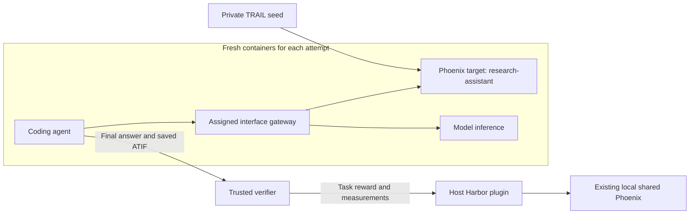

# Phoenix MCP and CLI benchmark

Compare Claude Code and Codex on the same Phoenix queries, using either Phoenix
MCP or the installed `px` CLI. MCP versus CLI is a paired comparison within each
agent/model. Comparing agents configured with different models does not isolate
an agent effect.

The nine questions come from
[mora/mcpbench-experiment at 39c9be2](https://github.com/Arize-ai/phoenix/tree/39c9be2cf0377aa2b2377c62cc69bfe5f674dd96/scripts/benchmarks/mcp/tasks).
[PatronusAI/TRAIL](https://huggingface.co/datasets/PatronusAI/TRAIL) supplies the
application traces and annotations those questions query. It does not supply the
benchmark instructions. The no-op task is a separate calibration control.

## Two Phoenix roles



Each Harbor attempt starts a separate Phoenix service with a new database in its
container. Setup seeds only TRAIL and checks trace/span IDs, annotation content,
and application costs before the agent starts. Every condition and repetition
gets the same initial data. The target exposes normal Phoenix read-write API
semantics through the assigned interface, including each interface's own normal
limitations. There is no benchmark SQL rewriting or read-only policy.

The host-side `arize-phoenix` Harbor plugin records benchmark examples,
experiments, rewards, and ATIF traces in the existing results service, normally
`http://localhost:6006`. Results credentials never enter the agent, gateway, or
target containers. The runner never opens the host's Phoenix database file.

The target has its own internal network. Only its gateway joins the agent's
isolated network. The gateway forwards MCP requests or requests from the separate
`px` broker, plus the selected provider's inference routes. The broker runs the
real installed CLI and shares only `/workspace` and `/tmp` with the agent.
Direct Phoenix HTTP access cannot substitute for CLI use.

Agents cannot reach public docs, GitHub/raw GitHub, registries, host services,
the results service, the target database, or verifier files. The inference gateway
rejects hosted web tools and remote input fetches. Images contain installed tools
and local help, without inherited personal settings or source checkouts.
Same-container probes check representative network and filesystem boundaries
before each agent starts. These checks concern environment setup, not reward.

The target stays alive through verification. The agent and broker stop before
trusted evidence is collected. Stopped target/agent containers and private artifacts are
retained for inspection. The gateway is removed to discard provider credentials; the runner does not delete historical trial data.

## Setup and seed

Use Docker and the repository Make entry point. Harbor uses a dedicated Python
3.13 environment; the server integration checks use the repository `.venv`.

```sh
make install-python
make mcp-setup
make mcp ARGS=check
make mcp ARGS=images
```

Image builds install the agent/CLI versions in [matrix.json](configs/matrix.json)
and build the Phoenix server wheel from this checkout. The saved image manifest
records content IDs and the target wheel hash. Content-derived tags retain
earlier images when rebuilding. Keep those IDs fixed within a
comparison. The host plugin wheel has its own reviewed source/hash pins in
[runtime.json](configs/runtime.json) and [wheels.json](configs/wheels.json).

Prepare a private GAIA seed at the pinned TRAIL revision. Downloading requires
`HF_TOKEN` in the preparation process. An existing private JSON list of source
rows can instead be supplied with `--input`.

```sh
make mcp ARGS='prepare --output evals/mcp/.private/research-assistant'
```

[prepare.py](prepare.py) reuses the general
[TRAIL converter](../../scripts/load_patronus_trail.py), preserving timestamps and
creating deterministic IDs. `PROJECT` defines `research-assistant` once; staging
renders that name into every instruction and oracle configuration. Preparation
writes `payload.json`, `manifest.json`, and `truth.json`. It refuses to overwrite a
different prior seed. Do not rename old shared projects or historical manifests.
Keep seeds, populated containers, and raw trajectories private.

[pinned pricing](configs/pricing.json) defines application token rates for this
GAIA corpus. Setup independently computes costs from seed attributes and checks
them against Phoenix's stored costs. An unknown model or disagreement fails setup.
These costs describe the historical application, not the evaluated coding agent.

## Run

First exercise the unpaid CLI oracle through the same runner and plugin:

```sh
make mcp ARGS='run --oracle --seed evals/mcp/.private/research-assistant --task count-traces'
```

Omit `--task` to run all nine questions. Use `--task noop-surface-cost` to select
the calibration control explicitly. The oracle queries the target through `px`,
reads server costs and stored annotations, and never receives reference answers.
Oracle setup also creates a temporary project through native MCP and deletes it
through the real CLI before the task starts. Its acceptance experiments are
separate from evaluated-agent experiments. The broker enables the CLI's standard
`PHOENIX_CLI_DANGEROUSLY_ENABLE_DELETES` option for the disposable target.

For evaluated agents, supply the selected provider keys in the launch environment.
The runner does not retrieve keys from files or Keychain. Real provider keys go
only to the inference gateway; adapters receive placeholders.

```sh
make mcp ARGS='run --seed evals/mcp/.private/research-assistant --condition codex-mcp --condition codex-cli --repetitions 3'
```

Omitting `--condition` selects all four conditions. Model names, versions, and
reasoning effort are in [matrix.json](configs/matrix.json). `--results URL`
selects the host plugin destination; `PHOENIX_API_KEY` supplies its credentials
when needed. Trials run serially with no automatic retries. A behavioral zero is
a completed result; infrastructure failures stop the runner after the job reports
its errors. Running agents incurs provider charges. No paid sweep is part of CI
or `check`.

Every run saves its plan, image identities, Harbor configuration, seed validation,
verifier inputs, results, and trajectory artifacts under a new private directory.
Do not use results from the old shared-target smoke prototype for this benchmark.

## Tasks and scoring

| Task | Binary reward |
| --- | --- |
| `count-traces` | Exact integer count in the final answer |
| `total-cost` | Total application cost, rounded to the nearest cent |
| `most-failing-tool` | Tool with the most ERROR tool spans; all tied winners |
| `top-error-category` | Most common stored `trail_error` label; all tied winners |
| `error-rate-by-length` | Both span error percentages for traces with fewer than 15 and at least 40 spans, to one decimal |
| `max-llm-calls` | Exact maximum LLM-span count within one historical trace |
| `repeated-tool-calls` | A winning tool and its exact count within one trace |
| `spend-concentration` | Cost share of `ceil(0.10 × trace count)` traces sorted by descending cost then trace ID, to one decimal |
| `pagedown-root-cause` | Unsupported keyword passed to `forward()`, with an offending argument present in the recorded errors |
| `noop-surface-cost` | Exactly `ok`; excluded from the nine-task success denominator |

Each task keeps its instruction, native name/version, inherited `task_class`, and
verifier together in [tasks](tasks/). One staging function attaches the seed
corpus, revision, and hash. Model/interface settings and observed measurements
belong to experiments and runs, not authored task metadata.

The verifier reads the terminal ATIF response, falling back to the declared
`answer.txt` artifact when unavailable. Count accepts an unambiguous integer in
prose. It rejects contradictory numbers and numbers merely mentioned. It requires
no evidence IDs, LLM judge, unchanged-database check, or policy multiplier.
Missing trusted reference data is an infrastructure failure.

Common `tool_call_count` counts evaluated-agent top-level invocations, including
failures and retries. It excludes copied context, observations, oracle/setup calls,
and historical TRAIL spans. `agent_turn_count` counts agent decision steps with
nonzero LLM calls. Missing or malformed trajectories omit counts and emit
`tool_measurement_complete=0`; they do not change task reward.

Selected analytics tasks also record SQL attempts, successful execution, and
schema inspection from native dispatch events. Validation-only SQL does not count
as execution. These are informational and distinct from top-level calls. The
server records native operations without inspecting generated code for keywords.

The native Harbor plugin writes `reward`, measurements, and `infra_ok`, and links
saved ATIF traces to experiment runs. It owns trace conversion and upload.

## Development

`make mcp ARGS=check` runs formatting/lint checks, focused benchmark tests, type
checking of the runner and strict checking of shared grading/staging/measurement
code, and local server integration
tests. None require a model provider. `make mcp ARGS=format` applies formatting.
The server tests exercise real FastMCP dispatch; they are not live agent trials.
The existing [Harbor plugin integration tests](../../tests/integration/harbor/run_plugin_e2e.py)
cover the recording contract beyond this benchmark.

[DESIGN_REVIEW.md](DESIGN_REVIEW.md) preserves the redesign rationale and audit.
