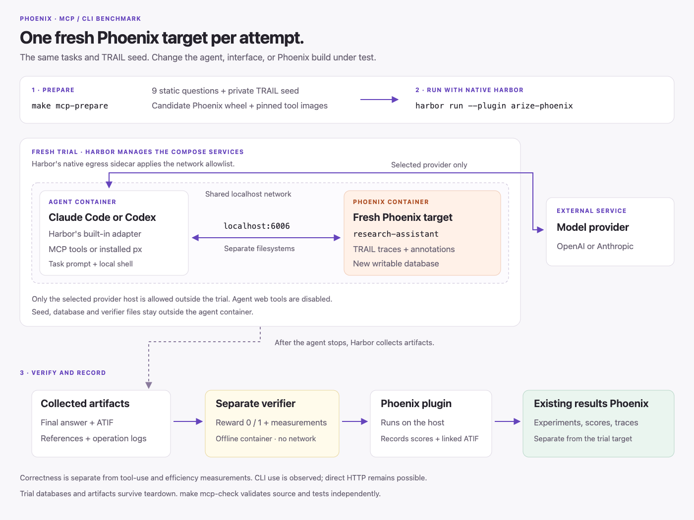

# Phoenix MCP and CLI benchmark

Run the same Phoenix questions with Claude Code or Codex, using either MCP or
`px`. Compare success, tool use, tokens, cost, and time in Phoenix experiments.

The nine questions come from
[mora/mcpbench-experiment at 39c9be2](https://github.com/Arize-ai/phoenix/tree/39c9be2cf0377aa2b2377c62cc69bfe5f674dd96/scripts/benchmarks/mcp/tasks).
Their wording is unchanged except for the project name, `research-assistant`.
[PatronusAI/TRAIL](https://huggingface.co/datasets/PatronusAI/TRAIL) supplies the
historical traces and annotations loaded into that project.

## Code layout

```text
benchmark.toml       Models, agent versions, reasoning effort, px version
scripts/             Prepare TRAIL, build images, stage jobs, invoke Harbor
  experiment.py      Entry point for the three Make commands
  stage.py           Task wiring and native Harbor job configuration
environment/         Dockerfile, Compose services, startup and access checks
scoring/             Answer comparisons, references, ATIF and tool metrics
tasks/<task>/        Static instruction.md, metadata, tests/verify.py
```

Implementation tests live in root `tests/evals/mcp/`. Task-local `tests/` contain
Harbor verifiers. Local tasks use directory names and metadata version `0`.

## Three commands

Docker must use a Linux kernel with `CONFIG_NFT_FIB_INET` for Harbor's native
network allowlist. Some Docker Desktop VMs lack this feature; use a compatible
runtime such as OrbStack or a Linux Docker host. Harbor rejects unsupported
runtimes. See its [Docker compatibility guide](https://www.harborframework.com/docs/tasks/network-policy#local-docker-runtime-compatibility).

`make install-python` is the repository's existing Python setup command, needed
for the FastMCP integration test. Harbor uses a separate Python 3.13 environment
managed by `uv`; each command ensures it is installed.

```sh
make mcp-prepare
make mcp-check
make mcp-run ARGS='--prepared <directory printed by prepare> --oracle --task count-traces'
```

`mcp-prepare` creates a private TRAIL seed if needed, builds the images, and writes
four native Harbor job configs into a new private directory. The first download
requires `HF_TOKEN`; use `ARGS='--input /path/to/private-rows.json'` for saved rows.
An existing seed is reused after its contents are checked.

`mcp-check` runs source tests, Ruff, and mypy without model calls or Docker trials.
CI runs the same command. Tests remain in the root test tree, but the dedicated CI
job uses Python 3.13 so Harbor does not change Phoenix's Python 3.10 dependencies.

`mcp-run --oracle` runs the reference solution through the real CLI and Harbor
verifier. Omit `--task` to check all nine questions. The separate
`noop-surface-cost` control is selected explicitly with `--task noop-surface-cost`.

To run the coding agents, supply provider keys through `OPENAI_API_KEY` and/or
`ANTHROPIC_API_KEY`, then select the conditions and repetitions:

```sh
make mcp-run ARGS='--prepared <directory> --condition codex-mcp --condition codex-cli --repetitions 3'
```

Omit `--condition` to run all four combinations. Edit [benchmark.toml](benchmark.toml)
before preparation to change models or installed tool versions. Model IDs are
sent literally. The configured model requests still need live provider validation.

## Harbor runs the experiment

The launcher prints and executes the native command for each selected condition:

```sh
evals/mcp/.venv/bin/harbor run \
  --config <prepared-directory>/codex-mcp.json \
  --plugin arize-phoenix --plugin-kwarg trace_mode=atif --yes
```

The generated JSON contains ordinary Harbor agent, dataset, Docker, repetition,
and retry settings. Harbor's built-in Claude Code and Codex adapters run the
agents. There is no custom agent or environment subclass. `mcp-run` clears
inherited personal agent configuration before invoking this command.

Set `PHOENIX_COLLECTOR_ENDPOINT` to choose where the plugin records results,
defaulting to `http://localhost:6006`. Use `PHOENIX_API_KEY` if that results server
requires authentication. This destination is separate from the trial's Phoenix.
Inspect experiments, scores, and linked ATIF traces in Phoenix.

## Inside each attempt

[](assets/architecture.svg)

[Compose](environment/docker-compose.yaml) defines the agent and Phoenix services.
Every attempt gets a new writable Phoenix database, seeded and checked before the
agent starts. The containers have separate filesystems, so the agent cannot read
the target's database, seed files, or reference answers.

Harbor's native egress sidecar gives these containers a shared localhost network.
The agent reaches MCP or the installed `px` CLI's target at `http://127.0.0.1:6006`.
Only the selected provider host is on the external network allowlist. Claude
Code's `WebSearch` and `WebFetch` tools and Codex web search are disabled.

Harbor's built-in agent receives the selected provider key. Results credentials
stay on the host. The CLI image contains the real `px` binary; direct Phoenix
HTTP calls are also possible, so recorded `px` commands are a usage diagnostic.

Harbor stops the agent, collects artifacts, and runs the verifier in a separate
container with no network. This follows its
[Compose artifact pattern](https://harborframework.com/docs/tasks). Harbor removes
trial containers and networks after collection. Each trial's Phoenix database
remains in its private `target-data` directory alongside logs and artifacts.

## Test an unreleased MCP

The MCP is part of the Phoenix server wheel built from this checkout, including
uncommitted changes. It is not fetched from a deployed endpoint. To compare a
specific commit or another checkout:

```sh
make mcp-prepare ARGS='--target-ref <commit-or-branch>'
make mcp-prepare ARGS='--target-source /path/to/phoenix-checkout'
```

Each preparation records the source revision, wheel hash, and immutable image IDs.
Run the resulting jobs against the same seed, tasks, models, and repetition count.
The runner rejects a prepared experiment when its benchmark code has changed.

The host's `arize-phoenix-client[harbor]` dependency supplies the Phoenix plugin.
Its git revision is pinned in [pyproject.toml](pyproject.toml) because this version
contains the ATIF support. That pin is independent of the server under test.

## Scoring and measurements

Each task's named verifier returns `reward: 1` for a correct final answer and `0`
otherwise. [scoring/verify.py](scoring/verify.py) selects that verifier;
[scoring/references.py](scoring/references.py) calculates expected answers from
the private seed before the agent runs.

The nine tasks check trace count, total cost, most failing tool, top error category,
error rates by trace length, maximum LLM calls, repeated tool calls, spend
concentration, and the PageDown tool's root cause. Read each task's verifier
for its comparison and precision. The no-op control requires exactly `ok`.

A trace groups spans from one execution. This seed has 117 traces and 3,579 spans.
The count verifier accepts `117 traces` or a bare `117`, but rejects `117 spans`.
The shared ATIF helper extracts the final answer and counts tool calls and turns,
excluding copied context and historical TRAIL activity.

Measurements describe how the agent worked and do not change correctness.
Native logs record MCP, code-mode and SQL use. The ATIF helper identifies
recorded `px` commands for CLI trials. Missing evidence produces an unknown
measurement. Harbor and Phoenix retain timing, tokens, cost, infrastructure errors and linked
ATIF traces. Inspect results in Phoenix; there is no separate report pipeline.

[environment/pricing.json](environment/pricing.json) pins per-token rates for
`o3-mini`, which produced the historical TRAIL traces. It stabilizes cost-task
references and does not price the coding agents' calls.
