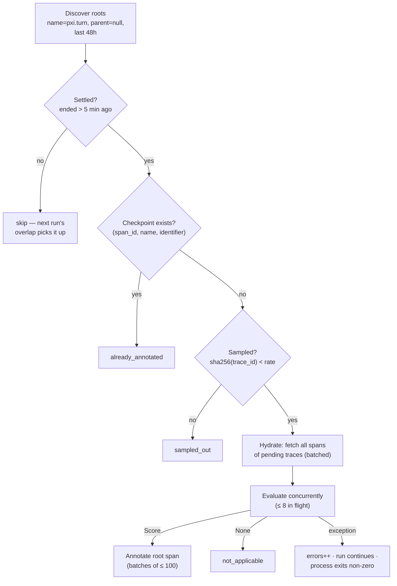
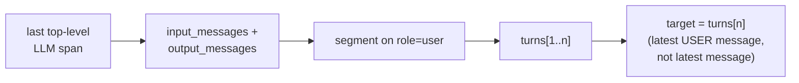

# PXI Online Evals — How It Works

A scheduled batch job that pulls recently ingested `pxi.turn` traces from
Phoenix, runs quality evaluators over them, and writes results back as
**idempotent span annotations** on each turn's root span. It runs as a plain
Phoenix API client — nothing executes in the server process or the ingestion
path.

## The pipeline



Every box feeds a counter in the run summary, so a scheduled run's log tells
you exactly where each discovered turn went:

```
tool_count_per_turn: discovered=11 already_annotated=0 sampled_out=0 not_applicable=0 evaluated=11 errors=0 written=11
user_friction:       discovered=11 already_annotated=0 sampled_out=0 not_applicable=6 evaluated=5  errors=0 written=5
```

## Anatomy of a turn trace

One trace = one conversational turn. All spans are children of the
`pxi.turn` root (topology from a real sanitized trace,
`tests/.../fixtures/pxi_turn_trace.json`):

```
pxi.turn (AGENT, root)        input.value = "can you save this trace to a dataset?"
├── model (LLM)  ──┐
├── list_datasets (TOOL)      the agent loop alternates model calls and
├── model (LLM)               tool executions — 9 LLM + 8 TOOL spans here.
├── ask_user (TOOL)           Each LLM span's input contains ALL messages
├── model (LLM)               so far; the LAST one holds the full history.
├── create_dataset (TOOL)
├── add_spans_to_dataset (TOOL, ERROR)
├── bash (TOOL)
├── add_spans_to_dataset (TOOL)   ← retry
└── ... (last LLM span carries the complete transcript)
```

**`tool_count_per_turn`** counts TOOL spans whose ancestor chain reaches the
root without crossing another TOOL span (→ 8 here). A `call_subagent` counts
as one tool; everything nested beneath it does not.

## How `user_friction` finds its target

The judge labels whether the turn's **user message** expresses friction with
the assistant's *preceding* behavior. It needs the conversation history — and
a single trace already contains it:



The last LLM span's input is the exact history the agent itself saw: all
prior turns of the session plus this turn's user message and tool traffic.
Earlier top-level LLM calls are cumulative snapshots of that same conversation,
so they are not merged separately. LLM calls nested under `call_subagent` are
the subagent's private conversation and are deliberately excluded; the
top-level `call_subagent` tool invocation remains visible in the main transcript.
Segmentation splits **only on `role == "user"`** — assistant/tool messages
that follow the final user message (the agent "talking to itself" between
tool calls) fold into that same turn. So the target is always the *latest
user message*, never merely the last message in the chain.

The history is rendered in two tiers — compact for older turns, detailed for
the turn being reacted to — byte-identical to the rendering the
`user-friction-alignment-v0.5` gold labels were built on:

```
### User                        ─┐
what happened in this trace?     │ compact tier (older turns)
> Tools (2): bash ✓, search ✓    │
### Assistant                   ─┘
The trace completed cleanly...
> Tool: list_datasets           ─┐ detailed tier (reacted-to turn):
> Tool: add_spans_to_dataset     │ tool-by-tool, errors kept,
> Error: dataset not found...    │ ask_user questions in full
[agent asked: "Continue?" ...]  ─┘
```

## Checkpointing: the annotation *is* the state

There is no database or state file. Before evaluating, the runner asks
Phoenix which roots already carry the evaluator's annotation and skips them:

| Evaluator | Checkpoint identifier |
|---|---|
| `tool_count_per_turn` | `pxi-online-evals:tool-count-per-turn:v1` |
| `user_friction` | `pxi-online-evals:user-friction:v1:openai:gpt-5.5` |

- The 48h lookback **overlaps** the 12h schedule ~4×, so missed or crashed
  runs self-heal without double-evaluating.
- Bumping `vN` (rubric/scoring change) or changing the judge model starts a
  **new series** and backfills the window — the old series is never
  overwritten.
- Only the runner's **own** annotation names are consulted: human feedback
  (thumbs, notes) can never suppress a run, and a newly added evaluator
  backfills automatically on its next run.

## Sampling: consistent across evaluators

`sha256(trace_id)` → one number per trace, shared by every evaluator. Equal
rates select **identical** traces; a lower rate selects a **strict subset**
of a higher rate. Sampled traces therefore carry every applicable
annotation — never a random partial set.

```
rate 1.00  ████████████████████  all traces
rate 0.50  ██████████            same first half for every evaluator
rate 0.25  █████                 subset of the 0.50 selection
```

## Safeguards

| Considered failure | Safeguard | On trigger |
|---|---|---|
| Judging a still-running turn | 5-min settle delay on root **end** time | wait for next run |
| Misattributed judgment: transcript's final turn isn't this trace's own message | target must be the final user-role message, be human-authored, **and equal the root's `input.value`** (independently recorded at ingestion) | skip + warning — never checkpoint a judgment on the wrong root (idempotency would make it permanent) |
| Non-human "user" messages (legacy UI-context blocks, agent-loop continuations, tool-error payloads) | `is_human_message` classifier — same one used to build the gold labels | skip as not-applicable; **no fallback** to an earlier human turn |
| Subagent's internal LLM span hijacking the transcript (it can start *after* the main agent's final call) | prefer LLM spans that are direct children of the root | main transcript wins |
| Runaway judge input | 50k-char cap on rendered input | skip + warning |
| Silent truncation when hydrating many traces | batch split-and-retry at the span limit; a single over-limit trace is an error | correctness over convenience |
| Unbounded discovery | hard cap (5,000 roots) fails the run loudly | operator shrinks the window |
| One bad turn poisoning the run | per-turn exception isolation | logged + counted; run continues; process exits non-zero so schedules go red |
| Bad judge config | provider/API-key validated at startup | fail fast, before any trace work |
| Malformed topology (orphan tool span, missing ancestor, cycle) | **deliberately loud** — counts as an error | post-settle traces should be complete; an anomaly means dropped spans or a tracing regression. Downgrade to skip-with-warning if noisy in practice. |

## Assumptions

1. **One trace = one turn**, rooted at a `pxi.turn` AGENT span, with the
   turn's user message on the root's `input.value`. (Holds for the
   post-July-2026 trace format; verified on recent production traces.)
2. **The last top-level LLM span carries the full session history** — no
   session-level fetching or merging of intermediate LLM snapshots is needed
   to reconstruct the conversation. Nested subagent LLM histories are not part
   of the user-facing transcript.
3. **UI context never arrives as a user message** in current traces (it
   flows through agent instructions). The `<phoenix_ui_context>` check in
   the classifier is a legacy-format guard kept for gold-label parity and
   deep backfills.
4. Trace shape validated empirically: on 47 recent production traces, every
   final turn resolved to the human message with zero `input.value`
   cross-check mismatches.

## Operations

- **Schedule**: GitHub Actions, 00:17 / 12:17 UTC; manual dispatch defaults
  to `--dry-run`; local CLI: `uv run python -m evals.pxi.online_evals.run --dry-run`.
- **Judge config** (shared by all LLM evaluators):
  `PHOENIX_AGENTS_EVALS_PROVIDER` / `PHOENIX_AGENTS_EVALS_MODEL`
  (default `openai` / `gpt-5.5`, validated on the gold dev split).
- Credentials are exposed only to the evaluation step; logs contain
  aggregate counts, never trace content.
