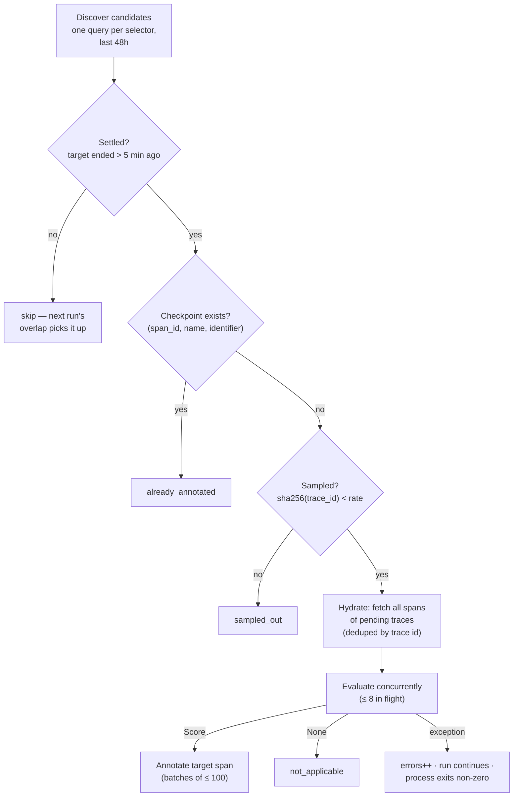
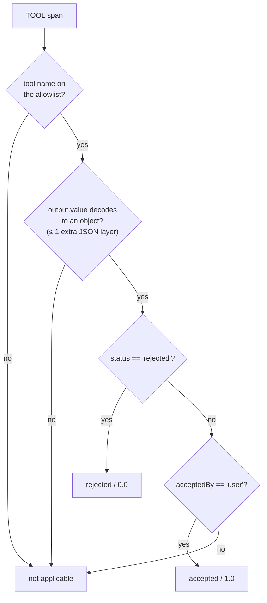
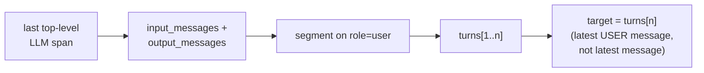

# PXI Online Evals — How It Works

A scheduled batch job that pulls recently ingested PXI spans from Phoenix,
runs quality evaluators over them, and writes results back as **idempotent
span annotations** on each evaluator's target span. It runs as a plain
Phoenix API client — nothing executes in the server process or the ingestion
path.

## Target discovery: roots and TOOL spans

Each evaluator declares a `SpanSelector`. The runner groups evaluators by
identical selector and issues **one discovery query per group**:

| Selector | `names` | `span_kinds` | `parent_id` | Evaluators |
|---|---|---|---|---|
| Turn root | `pxi.turn` | `AGENT` | `"null"` | `tool_count_per_turn`, `user_friction` |
| Approval tool | the allowlist | `TOOL` | *(unset)* | `suggestion_accepted` |

Root evaluators score a whole turn. `suggestion_accepted` scores an individual
action, because **one turn can contain several suggestions the user decided
differently** — a rejected annotation-config change and its accepted revision
routinely appear in the same turn. Annotating the root would collapse both into
one label, so the annotation goes on the TOOL span itself.

Everything downstream is target-agnostic: the settle delay applies to each
target's own `end_time`, the checkpoint key is `(span_id, name, identifier)` on
the target, and sampling stays keyed on `trace_id` so all targets in one turn
are sampled together.

## The pipeline


```mermaid
flowchart TD
    A["Discover candidates<br/>one query per selector,<br/>last 48h"] --> B{"Settled?<br/>target ended &gt; 5 min ago"}
    B -- no --> B2["skip — next run's<br/>overlap picks it up"]
    B -- yes --> C{"Checkpoint exists?<br/>(span_id, name, identifier)"}
    C -- yes --> C2["already_annotated"]
    C -- no --> D{"Sampled?<br/>sha256(trace_id) &lt; rate"}
    D -- no --> D2["sampled_out"]
    D -- yes --> E["Hydrate: fetch all spans<br/>of pending traces<br/>(deduped by trace id)"]
    E --> F["Evaluate concurrently<br/>(≤ 8 in flight)"]
    F -- "Score" --> G["Annotate target span<br/>(batches of ≤ 100)"]
    F -- "None" --> F2["not_applicable"]
    F -- "exception" --> F3["errors++ · run continues ·<br/>process exits non-zero"]
```

Every box feeds a counter in the run summary, so a scheduled run's log tells
you exactly where each discovered target went (`discovered` counts matching
**target spans**, so the tool evaluator's number is per-suggestion, not
per-turn):

```
tool_count_per_turn: discovered=11 already_annotated=0 sampled_out=0 not_applicable=0 evaluated=11 errors=0 written=11
user_friction:       discovered=11 already_annotated=0 sampled_out=0 not_applicable=6 evaluated=5  errors=0 written=5
suggestion_accepted: discovered=34 already_annotated=0 sampled_out=0 not_applicable=8 evaluated=26 errors=0 written=26
```

## Anatomy of a turn trace

One trace = one conversational turn. All spans are children of the
`pxi.turn` root (topology from a real sanitized trace,
`tests/.../fixtures/pxi_turn_trace.json`):

```
pxi.turn (AGENT, root)        input.value = "can you save this trace to a dataset?"
├── model (LLM)  ──┐
├── list_datasets (TOOL)      the agent loop alternates model calls and
├── model (LLM)               tool executions — 9 LLM + 8 TOOL spans here.
├── ask_user (TOOL)           Each LLM span's input contains ALL messages
├── model (LLM)               so far; the LAST one holds the full history.
├── create_dataset (TOOL)
├── add_spans_to_dataset (TOOL, ERROR)
├── bash (TOOL)
├── add_spans_to_dataset (TOOL)   ← retry
├── call_subagent (TOOL)
│   └── ServerAgent.iter (AGENT)
│       ├── model (LLM)
│       ├── query_phoenix (TOOL)
│       └── read_skill_resource (TOOL)
└── ... (last LLM span carries the complete transcript)
```

**`tool_count_per_turn`** counts every TOOL span in the trace, including tools
nested beneath another tool such as `call_subagent`. Metadata partitions the
chronological total into top-level and nested tool names.

## How `suggestion_accepted` reads a decision

Approval-gated tools stage a change, the UI renders an accept/reject card, and
the user's click lands in that TOOL span's `output.value`. The evaluator reads
that structured field — it never scans message text for the words "accepted"
or "rejected".


```mermaid
flowchart TD
    A["TOOL span"] --> B{"tool.name on<br/>the allowlist?"}
    B -- no --> N["not applicable"]
    B -- yes --> C{"output.value decodes<br/>to an object?<br/>(≤ 1 extra JSON layer)"}
    C -- no --> N
    C -- yes --> D{"status == 'rejected'?"}
    D -- yes --> R["rejected / 0.0"]
    D -- no --> E{"acceptedBy == 'user'?"}
    E -- yes --> S["accepted / 1.0"]
    E -- no --> N
```

Two ordering choices carry the semantics:

- **Rejection first.** The reject path writes `status: "rejected"` and never
  sets `acceptedBy`, so a payload carrying both is contradictory; the explicit
  terminal rejection is the safer reading.
- **`acceptedBy`, not `status`, proves acceptance.** The success vocabulary is
  tool-specific — `accepted`, `saved`, `loaded`, `applied`, `removed` — while
  `acceptedBy` is the one field distinguishing a human click (`"user"`) from an
  automatic bypass (`"auto"`).

Everything else is left unannotated rather than guessed:

| Case | Recorded as | Why not annotated |
|---|---|---|
| Automatic accept | `acceptedBy: "auto"` | bypass permission, not a user decision |
| Pending approval | `status: "awaiting_user"` | the user hasn't decided yet |
| Cancelled by navigation | `state: "output-error"` | the card was dismissed, not decided |
| Tool error | `state: "output-error"` | nothing was proposed to decide on |
| Missing/malformed/non-object output | — | no decision is recorded |
| Unknown status | e.g. `no_change` | not a terminal user decision |
| Non-allowlisted tool | — | no approval gate exists |

Annotations carry only `{"tool_name": ...}` — never prompt text, tool
arguments, raw output, user content, instance ids, or proposal diffs.

The allowlist is a **cross-language maintenance contract** with
`app/src/agent/tools/*/pending*.ts` (and the shared
`app/src/agent/shared/pendingApproval/bindPendingApproval.ts`). A new
approval-gated frontend tool must be added on both sides or its decisions go
unmeasured. `submit_{code,llm}_evaluator_draft` are excluded: they record only
`awaiting_user`, and the dialog's real decision never reaches the tool span.

## How `user_friction` finds its target

The judge labels whether the turn's **user message** expresses friction with
the assistant's *preceding* behavior. It needs the conversation history — and
a single trace already contains it:


```mermaid
flowchart LR
    A["last top-level<br/>LLM span"] --> B["input_messages +<br/>output_messages"]
    B --> C["segment on role=user"]
    C --> D["turns[1..n]"]
    D --> E["target = turns[n]<br/>(latest USER message,<br/>not latest message)"]
```

The last LLM span's input is the exact history the agent itself saw: all
prior turns of the session plus this turn's user message and tool traffic.
Earlier top-level LLM calls are cumulative snapshots of that same conversation,
so they are not merged separately. LLM calls nested under `call_subagent` are
the subagent's private conversation and are deliberately excluded; the
top-level `call_subagent` tool invocation remains visible in the main transcript.
Segmentation splits **only on `role == "user"`** — assistant/tool messages
that follow the final user message (the agent "talking to itself" between
tool calls) fold into that same turn. So the target is always the *latest
user message*, never merely the last message in the chain.

The history is rendered in two tiers — compact for older turns, detailed for
the turn being reacted to — byte-identical to the rendering the
`user-friction-alignment-v0.5` gold labels were built on:

```
### User                        ─┐
what happened in this trace?     │ compact tier (older turns)
> Tools (2): bash ✓, search ✓    │
### Assistant                   ─┘
The trace completed cleanly...
> Tool: list_datasets           ─┐ detailed tier (reacted-to turn):
> Tool: add_spans_to_dataset     │ tool-by-tool, errors kept,
> Error: dataset not found...    │ ask_user questions in full
[agent asked: "Continue?" ...]  ─┘
```

## Checkpointing: the annotation *is* the state

There is no database or state file. Before evaluating, the runner asks
Phoenix which **target spans** already carry the evaluator's annotation and
skips them:

| Evaluator | Target | Checkpoint identifier |
|---|---|---|
| `tool_count_per_turn` | `pxi.turn` root | `pxi-online-evals:tool-count-per-turn:v2` |
| `user_friction` | `pxi.turn` root | `pxi-online-evals:user-friction:v1:openai:gpt-5.5` |
| `suggestion_accepted` | approval TOOL span | `pxi-online-evals:suggestion-accepted:v1` |

The key is per target, so a checkpoint on one suggestion never suppresses
another suggestion in the same turn, and the next overlapping run checkpoints
prior terminal decisions instead of duplicating them.

- The 48h lookback **overlaps** the 12h schedule ~4×, so missed or crashed
  runs self-heal without double-evaluating.
- Bumping `vN` (rubric/scoring change) or changing the judge model starts a
  **new series** and backfills the window — the old series is never
  overwritten.
- Only the runner's **own** annotation names are consulted: human feedback
  (thumbs, notes) can never suppress a run, and a newly added evaluator
  backfills automatically on its next run.

## Sampling: consistent across evaluators

`sha256(trace_id)` → one number per trace, shared by every evaluator. Equal
rates select **identical** traces; a lower rate selects a **strict subset**
of a higher rate. Sampled traces therefore carry every applicable
annotation — never a random partial set.

```
rate 1.00  ████████████████████  all traces
rate 0.50  ██████████            same first half for every evaluator
rate 0.25  █████                 subset of the 0.50 selection
```

## Safeguards

| Considered failure | Safeguard | On trigger |
|---|---|---|
| Judging a still-running turn or in-flight action | 5-min settle delay on the **target's own end** time | wait for next run |
| Guessing an outcome that was never a user decision (auto-accept, pending, cancelled, errored, malformed) | structured-field decision rules with an explicit not-applicable branch | no annotation written |
| Frontend adds an approval tool without an eval | explicit allowlist, documented as a cross-language contract | new tool goes unmeasured until added — deliberately visible, never silently mislabeled |
| Misattributed judgment: transcript's final turn isn't this trace's own message | target must be the final user-role message, be human-authored, **and equal the root's `input.value`** (independently recorded at ingestion) | skip + warning — never checkpoint a judgment on the wrong root (idempotency would make it permanent) |
| Non-human "user" messages (legacy UI-context blocks, agent-loop continuations, tool-error payloads) | `is_human_message` classifier — same one used to build the gold labels | skip as not-applicable; **no fallback** to an earlier human turn |
| Subagent's internal LLM span hijacking the transcript (it can start *after* the main agent's final call) | prefer LLM spans that are direct children of the root | main transcript wins |
| Runaway judge input | 50k-char cap on rendered input | skip + warning |
| Silent truncation when hydrating many traces | batch split-and-retry at the span limit; a single over-limit trace is an error | correctness over convenience |
| Unbounded discovery | hard cap (5,000 spans) per selector query fails the run loudly, naming the selector | operator shrinks the window |
| One bad turn poisoning the run | per-turn exception isolation | logged + counted; run continues; process exits non-zero so schedules go red |
| Bad judge config | provider/API-key validated at startup | fail fast, before any trace work |
| Malformed topology (orphan tool span, missing ancestor, cycle) | **deliberately loud** — counts as an error | post-settle traces should be complete; an anomaly means dropped spans or a tracing regression. Downgrade to skip-with-warning if noisy in practice. |

## Assumptions

1. **One trace = one turn**, rooted at a `pxi.turn` AGENT span, with the
   turn's user message on the root's `input.value`. (Holds for the
   post-July-2026 trace format; verified on recent production traces.)
2. **The last top-level LLM span carries the full session history** — no
   session-level fetching or merging of intermediate LLM snapshots is needed
   to reconstruct the conversation. Nested subagent LLM histories are not part
   of the user-facing transcript.
3. **UI context never arrives as a user message** in current traces (it
   flows through agent instructions). The `<phoenix_ui_context>` check in
   the classifier is a legacy-format guard kept for gold-label parity and
   deep backfills.
4. Trace shape validated empirically: on 47 recent production traces, every
   final turn resolved to the human message with zero `input.value`
   cross-check mismatches.

## Operations

- **Schedule**: GitHub Actions, 00:17 / 12:17 UTC; manual dispatch defaults
  to `--dry-run`; local CLI requires `--project` unless `PHOENIX_PROJECT` or
  `PHOENIX_PROJECT_NAME` is set. Writes remain the default unless `--dry-run`
  is passed.
- **Judge config** (shared by all LLM evaluators):
  `PHOENIX_AGENTS_EVALS_PROVIDER` / `PHOENIX_AGENTS_EVALS_MODEL`
  (default `openai` / `gpt-5.5`, validated on the gold dev split).
- Credentials are exposed only to the evaluation step; logs contain
  aggregate counts, never trace content.
