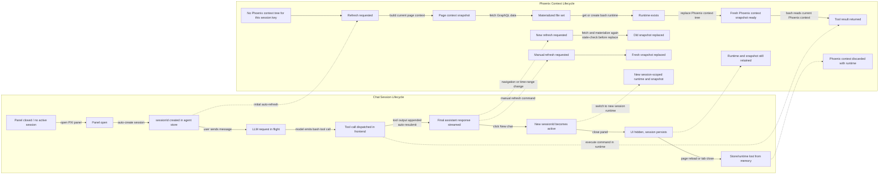

# Chat Session and Context Lifecycle

This note explains the dual lifecycle between a PXI chat session and the generated `/phoenix` context snapshot that the browser-side `bash` tool reads.

## Dual Lifecycle Diagram

```text
CHAT SESSION LIFECYCLE                           CONTEXT (/phoenix) LIFECYCLE
-------------------------------------------      --------------------------------------------
[Panel closed / no active session]               [/phoenix absent for this session key]
            |                                                   |
            | open PXI panel                                    |
            v                                                   |
[Panel open]                                                    |
            |                                                   |
            | auto-create session                               |
            v                                                   |
[sessionId created in agent store] ---------------------------> [refresh requested]
            |                                                   |
            |                                                   | build current page context
            |                                                   | from route + time range
            |                                                   v
            |                                         [page context snapshot]
            |                                                   |
            |                                                   | fetch GraphQL data
            |                                                   | (project/trace/generic)
            |                                                   v
            |                                         [materialized file set]
            |                                                   |
            |                                                   | get or create bash runtime
            |                                                   | for this sessionId
            |                                                   v
            |                                         [runtime exists]
            |                                                   |
            |                                                   | replace `/phoenix`
            |                                                   | rm old tree -> write new tree
            |                                                   v
            |<----------------------------------------------- [fresh `/phoenix` snapshot ready]
            |
            | user sends message
            v
[LLM request in flight]
            |
            | model emits tool call: bash(...)
            v
[tool call dispatched in frontend] ---------------------------> [bash runtime executes command]
            |                                                   |
            |                                                   | reads current `/phoenix`
            |                                                   | writes only to workspace
            |                                                   v
            |<----------------------------------------------- [tool result returned]
            |
            | tool output appended to chat
            | auto-resubmit to model
            v
[final assistant response streamed]
            |
            | navigation / time-range change
            +-----------------------------------------------> [new refresh requested]
            |                                                   |
            |                                                   | fetch + materialize again
            |                                                   | stale-check before replace
            |                                                   v
            |<----------------------------------------------- [old snapshot replaced]
            |
            | user types `/refresh`
            +-----------------------------------------------> [manual refresh requested]
            |                                                   |
            |                                                   v
            |<----------------------------------------------- [fresh snapshot replaced]
            |
            | click "New chat"
            v
[new sessionId becomes active] ------------------------------> [new session-scoped runtime/snapshot]
            |
            | old session no longer active                     [old session's `/phoenix` remains
            |                                                   attached to old runtime]
            |
            | close panel
            v
[UI hidden, session persists]                                 [runtime/snapshot still retained]
            |
            | page reload / tab close
            v
[store/runtime lost from memory] ----------------------------> [`/phoenix` discarded with runtime]
```

## Mermaid Version



## Key Interplay

- The chat `sessionId` chooses which browser-side bash runtime is used.
- Each runtime owns its own `/phoenix` tree and `/home/user/workspace` scratch area.
- Context refresh happens before tool execution and is decoupled from the model's `bash` call.
- Tool calls do not fetch Phoenix data directly; they read the latest `/phoenix` snapshot already written for that session.
- `New chat` effectively switches to a new runtime namespace, while the old session's runtime remains in memory until reload or explicit cleanup.

## Current Behavior Notes

- Opening the docked panel auto-creates a session and auto-refreshes context.
- Navigation and time-range changes trigger refresh for the active docked-session runtime.
- The `/agents` page currently supports manual refresh but does not auto-refresh on navigation.
- Refresh fully replaces `/phoenix` in place but preserves `/home/user/workspace`.
- Runtime cleanup exists as a helper in code but is not yet wired into production session deletion, so old runtime state can accumulate until page reload.

## Mental Model

```text
chat session chooses WHICH runtime
page context refresh chooses WHAT `/phoenix` contains
tool calls read WHATEVER `/phoenix` last won the refresh race
```
