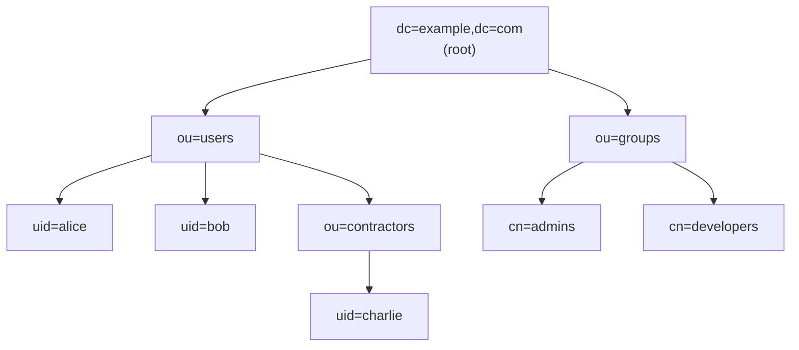
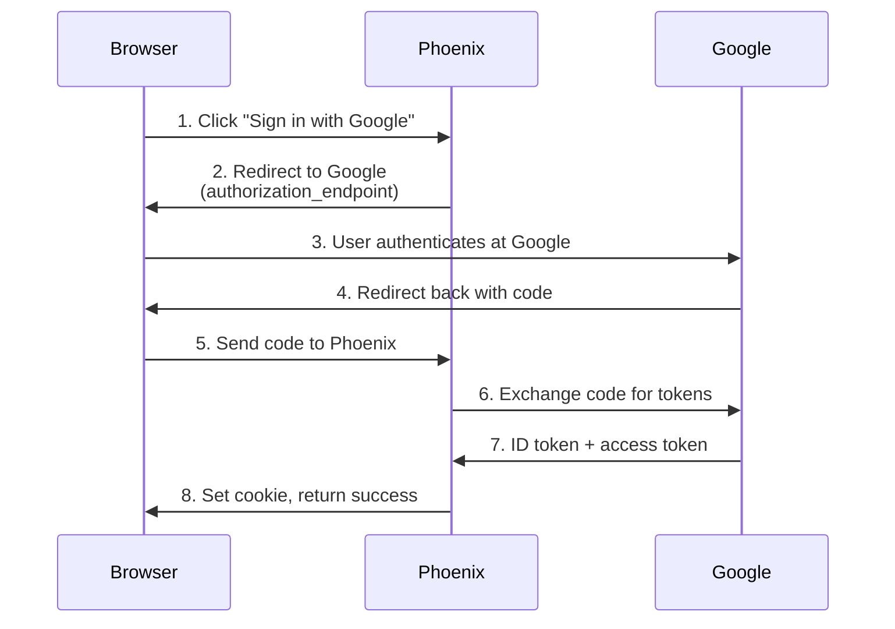
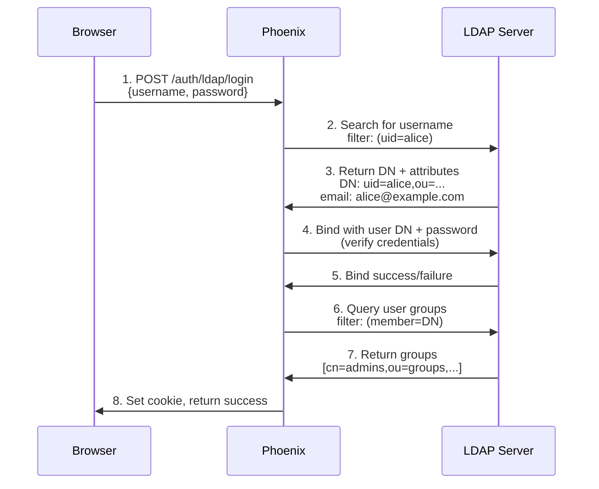
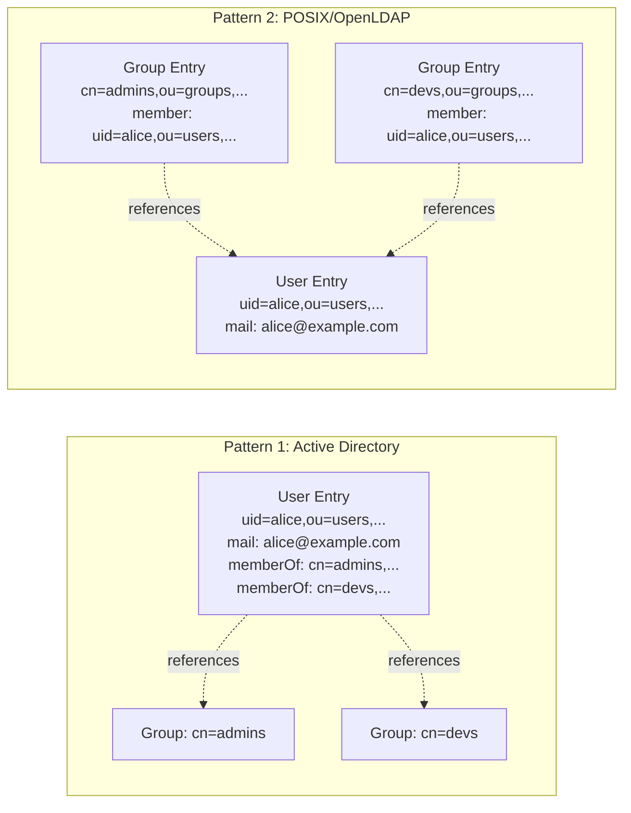
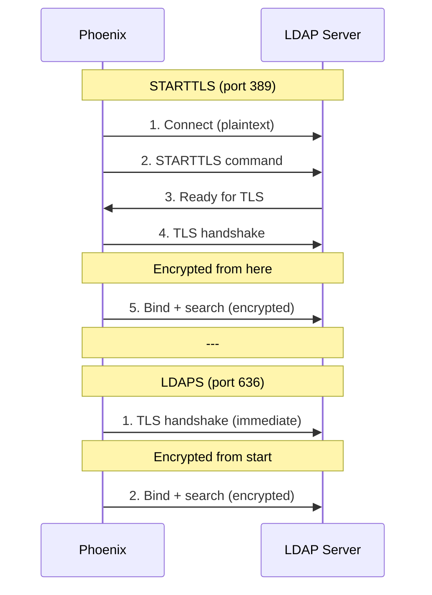
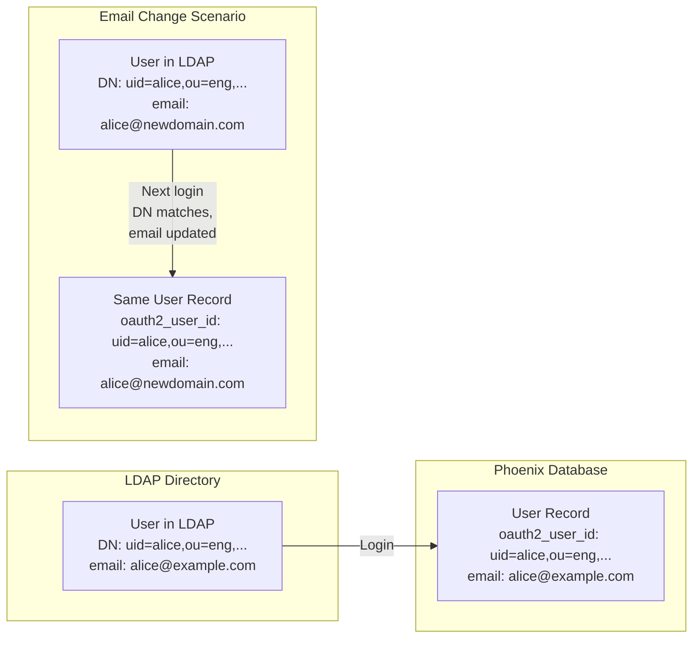

# LDAP Primer for OIDC Engineers

**Target Audience**: Engineers familiar with OAuth2/OIDC who need to understand LDAP authentication.

---

## TL;DR: LDAP vs OIDC

| Aspect | OIDC | LDAP |
|--------|------|------|
| **Protocol Type** | Modern REST/JSON API | Binary protocol (ASN.1/BER encoding) |
| **Primary Use** | Delegated authentication (3rd party) | Direct authentication (same organization) |
| **User Identifier** | Email or UUID (provider-specific) | Distinguished Name (DN) - hierarchical path |
| **Authentication Flow** | Browser redirect → authorization code → token exchange | Direct username/password bind to directory |
| **Trust Model** | Trust external IdP (Google, Okta, etc.) | Trust internal directory server (Active Directory, OpenLDAP) |
| **Deployment** | SaaS or on-prem | Almost always on-prem or private cloud |
| **Age** | Modern (2014+) | Legacy (1993+, based on X.500 from 1988) |

**When to Use**:
- **OIDC**: External users, consumer apps, "Sign in with Google"
- **LDAP**: Enterprise internal apps, corporate network integration, existing AD infrastructure

---

## What Is LDAP?

**LDAP (Lightweight Directory Access Protocol)** is a protocol for accessing and managing directory services over TCP/IP.

Think of it as:
- **Database**: Stores user accounts, groups, organizational structure
- **Authentication Protocol**: Verifies credentials directly
- **Query Language**: Searches directory tree with filters

### Core Concept: The Directory Tree

Unlike OIDC (which is stateless HTTP), LDAP organizes data in a **hierarchical tree structure**:



**Full Distinguished Names (DN)**:
- Alice: `uid=alice,ou=users,dc=example,dc=com`
- Bob: `uid=bob,ou=users,dc=example,dc=com`
- Charlie: `uid=charlie,ou=contractors,ou=users,dc=example,dc=com`
- Admins group: `cn=admins,ou=groups,dc=example,dc=com`

**OIDC Equivalent**: There is no tree structure - users are flat, identified by email or opaque ID (`sub` claim).

---

## Distinguished Names (DN)

**DN = Full path to a user in the directory tree**

Example DN:
```
uid=alice,ou=engineering,dc=example,dc=com
```

**Breaking it down**:
- `uid=alice` - User identifier (username)
- `ou=engineering` - Organizational Unit (department/team)
- `dc=example,dc=com` - Domain Components (company domain)

**OIDC Equivalent**: Closest analog is the `sub` (subject) claim:
```json
{
  "sub": "auth0|5f8e9a1234567890abcdef12",  // OIDC
  "email": "alice@example.com"
}
```

But OIDC's `sub` is:
- ✅ **Stable** (like DN)
- ✅ **Unique per provider** (like DN per directory)
- ❌ **Not hierarchical** (DN encodes organizational structure)
- ❌ **Not human-readable** (DN shows department, location, etc.)

---

## Authentication Flow Comparison

### OIDC Flow (What You Know)



**Key**: Phoenix **never sees the password**. Google handles authentication.

---

### LDAP Flow (New)



**Key Differences**:
- ✅ Phoenix **receives the password** directly (no redirect)
- ✅ Phoenix **queries LDAP server** (not a REST API)
- ✅ **Two LDAP operations**: Search (find user) + Bind (verify password)
- ✅ **Binary protocol**, not HTTP/JSON

---

## Key LDAP Concepts

### 1. Bind Operation (Authentication)

**"Binding"** = Authenticating to the LDAP server.

Two types:

**Service Account Bind** (search-and-bind pattern):
```python
# Phoenix binds with read-only service account
connection = Connection(
    server,
    user="cn=readonly,dc=example,dc=com",
    password="service_password",
    auto_bind=True
)

# Then searches for user by username
connection.search(
    search_base="ou=users,dc=example,dc=com",
    search_filter="(uid=alice)",
)
# Returns: uid=alice,ou=engineering,dc=example,dc=com
```

**User Bind** (verify credentials):
```python
# Bind as the actual user (proves they know password)
user_connection = Connection(
    server,
    user="uid=alice,ou=engineering,dc=example,dc=com",
    password=user_provided_password,
    auto_bind=True
)

if user_connection.bound:
    print("✓ Password correct")
```

**OIDC Equivalent**: There is no equivalent - OIDC providers handle this internally.

---

### 2. LDAP Filters (Query Language)

Filters search the directory tree (like SQL WHERE clauses, but with LISP-style prefix syntax):

| Filter | Meaning | OIDC Analogy |
|--------|---------|--------------|
| `(uid=alice)` | Find user where uid=alice | Search by email |
| `(objectClass=user)` | Find all user objects | Filter by type |
| `(&(uid=alice)(objectClass=user))` | AND logic | Multiple conditions |
| `(\|(uid=alice)(uid=bob))` | OR logic | Match any |
| `(uid=a*)` | Wildcard | Prefix search |
| `(memberOf=cn=admins,ou=groups,...)` | Group membership | Roles/claims |

**Example: Active Directory user search**:
```ldap
(&(objectClass=user)(sAMAccountName=alice))
```

**Phoenix escapes user input** to prevent LDAP injection (like SQL injection):
```python
from ldap3.utils.conv import escape_filter_chars

# User input: alice
escaped = escape_filter_chars("alice")
filter_str = f"(&(objectClass=user)(uid={escaped}))"
```

---

### 3. Attributes (User Fields)

LDAP users have **attributes** (like JSON fields, but schema-defined):

Common attributes:

| Attribute | Purpose | OIDC Claim Equivalent |
|-----------|---------|----------------------|
| `uid` | Username | `preferred_username` |
| `mail` | Email address | `email` |
| `displayName` | Full name | `name` |
| `memberOf` | Group memberships (AD) | `groups` or `roles` |
| `cn` | Common Name | `name` |
| `sn` | Surname | `family_name` |
| `givenName` | First name | `given_name` |
| `userPassword` | Password hash (not readable) | N/A (handled by IdP) |

**Phoenix queries attributes**:
```python
# After finding user, read their attributes
email = user_entry.mail.value
display_name = user_entry.displayName.value
groups = user_entry.memberOf.values  # List of DNs
```

---

### 4. Groups & Role Mapping

Two group membership patterns:



**Pattern 1 (Active Directory)**:
- User entry has `memberOf` attribute listing group DNs
- Phoenix reads `memberOf` directly (efficient, 1 query)

**Pattern 2 (POSIX/OpenLDAP)**:
- Group entries have `member` attribute listing user DNs
- Phoenix must search groups where `(member=<user_dn>)` (slower, N queries)

**Phoenix Configuration**:
```bash
# Map LDAP groups → Phoenix roles
PHOENIX_LDAP_GROUP_ROLE_MAPPINGS='[
  {"group_dn": "cn=admins,ou=groups,dc=example,dc=com", "role": "ADMIN"},
  {"group_dn": "cn=developers,ou=groups,dc=example,dc=com", "role": "MEMBER"}
]'
```

**OIDC Equivalent**:
```json
{
  "groups": ["admins", "developers"],  // Flat list in ID token
  "roles": ["admin"]                    // Or roles claim
}
```

**Key Difference**: OIDC groups are **in the token** (client-side). LDAP groups are **queried on every login** (server-side, always fresh).

---

## Common LDAP Implementations

### 1. Active Directory (Microsoft)

**What**: Microsoft's LDAP implementation (most common in enterprises)

**Unique Features**:
- `sAMAccountName` instead of `uid` for username
- `memberOf` attribute for group membership (efficient)
- `userPrincipalName` as email alternative
- Global Catalog for multi-domain searches

**Phoenix Config for AD**:
```bash
PHOENIX_LDAP_HOST="ad.corp.example.com"
PHOENIX_LDAP_PORT=389
PHOENIX_LDAP_USER_SEARCH_FILTER="(&(objectClass=user)(sAMAccountName=%s))"
PHOENIX_LDAP_ATTR_EMAIL="mail"
PHOENIX_LDAP_ATTR_DISPLAY_NAME="displayName"
PHOENIX_LDAP_ATTR_MEMBER_OF="memberOf"
```

---

### 2. OpenLDAP

**What**: Open-source LDAP server (common in Linux environments)

**Unique Features**:
- `uid` for username
- POSIX groups (requires separate group search)
- More RFC-compliant than AD

**Phoenix Config for OpenLDAP**:
```bash
PHOENIX_LDAP_HOST="ldap.example.com"
PHOENIX_LDAP_PORT=389
PHOENIX_LDAP_USER_SEARCH_FILTER="(&(objectClass=inetOrgPerson)(uid=%s))"
PHOENIX_LDAP_GROUP_SEARCH_BASE="ou=groups,dc=example,dc=com"
PHOENIX_LDAP_GROUP_SEARCH_FILTER="(memberUid=%s)"
```

---

### 3. 389 Directory Server

**What**: Red Hat's LDAP server (OpenLDAP successor)

**Unique Features**:
- Similar to OpenLDAP
- Better performance and replication
- Multi-master support

---

## Security Considerations

### TLS/SSL (Encryption)

**Two modes** (like HTTPS vs HTTP):



**STARTTLS (port 389)**:
- Connect in plaintext, then upgrade to TLS
- **Phoenix default** (matches HTTP→HTTPS upgrade pattern)

**LDAPS (port 636)**:
- TLS from connection start (like HTTPS)

**OIDC Equivalent**: Always HTTPS (TLS from start).

**Phoenix Config**:
```bash
# Default: STARTTLS on port 389
PHOENIX_LDAP_USE_TLS="true"
PHOENIX_LDAP_TLS_MODE="starttls"

# Or: LDAPS on port 636
PHOENIX_LDAP_TLS_MODE="ldaps"
PHOENIX_LDAP_PORT=636
```

---

### LDAP Injection (Like SQL Injection)

**Attack**: Inject special characters into username to manipulate search filters.

Example:
```python
# Vulnerable code (DON'T DO THIS)
username = request.username  # "admin)(uid=*"
filter_str = f"(uid={username})"
# Result: (uid=admin)(uid=*)  ← Matches all users!
```

**Phoenix Mitigation**:
```python
from ldap3.utils.conv import escape_filter_chars

username = escape_filter_chars(request.username)  # Escapes special chars
filter_str = f"(uid={username})"
```

**OIDC Equivalent**: Not applicable - OIDC uses HTTP/JSON, not custom query language.

---

## Phoenix LDAP Implementation Highlights

### DN-Based Identification (Stable Primary Key)

Phoenix stores **DN** (not email) as primary identifier:



**Why DN?**
- ✅ Stable across email changes
- ✅ Unique per LDAP directory
- ✅ Matches Grafana's approach

**OIDC Equivalent**: Store `sub` claim (stable), sync email on each login.

---

### RFC 4514 Canonicalization (Prevent Duplicates)

DNs are **case-insensitive** and allow whitespace variations:

```
Same user, different representations:
- "UID=Alice,OU=Users,DC=Example,DC=Com"
- "uid=alice, ou=users, dc=example, dc=com"
- "uid=alice,ou=users,dc=example,dc=com"
```

Phoenix **canonicalizes** before storing:
```python
from phoenix.server.ldap import canonicalize_dn

dn_raw = "UID=Alice,  OU=Users, DC=Example, DC=Com"
dn_canonical = canonicalize_dn(dn_raw)
# Result: "uid=alice,ou=users,dc=example,dc=com"
```

**OIDC Equivalent**: Not needed - `sub` is always normalized by IdP.

---

### Email Fallback for Admin-Provisioned Users

Phoenix supports **pre-provisioning** users before first LDAP login:

```python
# Admin creates user at startup (DN unknown)
user = models.User(
    email="alice@example.com",
    oauth2_client_id=LDAP_CLIENT_ID_MARKER,
    oauth2_user_id=None,  # DN unknown yet
)

# First LDAP login:
# 1. DN lookup fails (oauth2_user_id=NULL)
# 2. Email fallback finds user
# 3. Phoenix upgrades: oauth2_user_id = canonical_dn
# 4. Future logins use DN
```

**OIDC Equivalent**: Similar pattern - provision user by email, link on first login via `sub` claim.

---

## When to Choose LDAP vs OIDC

### Choose LDAP When:

✅ **Enterprise internal apps**
- Existing Active Directory infrastructure
- All users in same organization
- Corporate network (VPN required)

✅ **Legacy integration requirements**
- Must integrate with existing LDAP-based systems
- No budget for IdP migration

✅ **Fine-grained group management**
- Complex organizational structure in directory
- Groups managed by IT (not developers)

### Choose OIDC When:

✅ **Modern architecture**
- Cloud-native apps
- Microservices
- External users (customers, partners)

✅ **SaaS convenience**
- Managed IdP (Okta, Auth0, Keycloak)
- Multi-tenant apps
- "Sign in with Google/GitHub" patterns

✅ **Stateless authentication**
- JWT tokens (no session server)
- API-first design

### Use Both (Phoenix's Approach):

Phoenix supports **both LDAP and OIDC simultaneously**:
- Internal users → LDAP (corporate directory)
- External users → OIDC (Google, GitHub, etc.)
- Admins → Local (password)

```bash
# Enable all three
PHOENIX_ENABLE_AUTH="true"
PHOENIX_DISABLE_BASIC_AUTH="false"  # Local password
PHOENIX_OAUTH2_CLIENT_ID="..."      # OIDC
PHOENIX_LDAP_HOST="ldap.corp.com"   # LDAP
```

---

## Further Reading

**RFCs (Standards)**:
- [RFC 4511](https://www.rfc-editor.org/rfc/rfc4511.html) - LDAP Protocol
- [RFC 4514](https://www.rfc-editor.org/rfc/rfc4514.html) - Distinguished Names (DN)
- [RFC 4515](https://www.rfc-editor.org/rfc/rfc4515.html) - Search Filters
- [RFC 4516](https://www.rfc-editor.org/rfc/rfc4516.html) - LDAP URLs

**OIDC for Comparison**:
- [OpenID Connect Core](https://openid.net/specs/openid-connect-core-1_0.html)
- [OAuth 2.0 RFC 6749](https://www.rfc-editor.org/rfc/rfc6749.html)

**Phoenix LDAP Docs**:
- [Main Specification](../ldap-authentication.md)
- [Configuration Reference](./configuration.md)
- [Security Deep-Dive](./security.md)
- [Grafana Comparison](./grafana-comparison.md)

---

