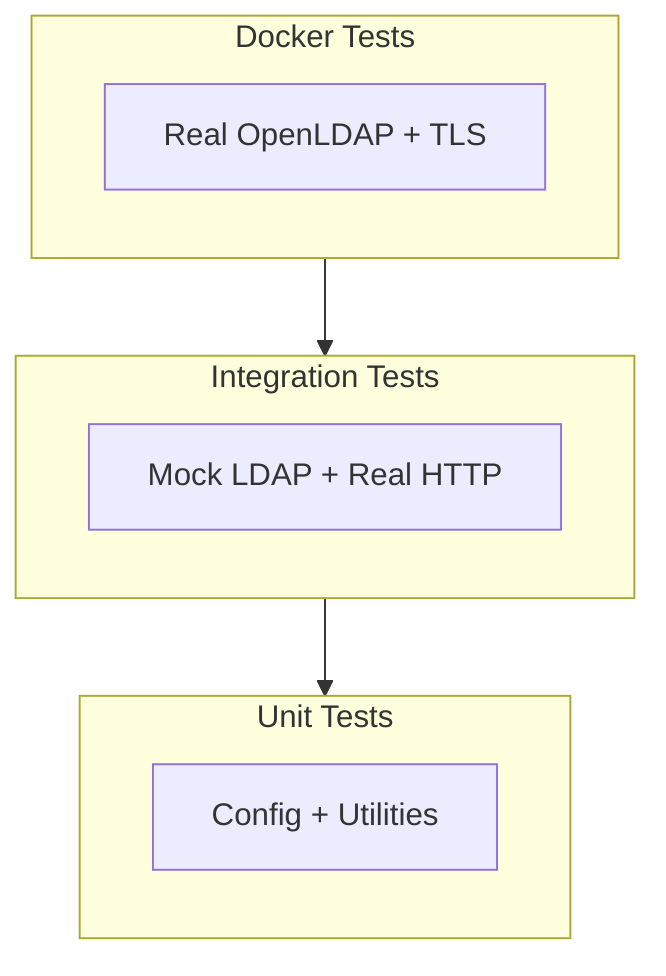

# LDAP Testing Procedures

Quick reference for running LDAP authentication tests.

---

## Test Layers



## Running Tests

### Unit Tests

```bash
# LDAP config tests
tox -e unit -- -k ldap
```

### Integration Tests

```bash
# All LDAP tests
tox -e integration -- -k ldap

# Specific test class
tox -e integration -- -k TestLDAPAuthentication
```

### Docker Tests

```bash
cd scripts/docker/devops

# Start environment
docker compose -f compose.yml -f overrides/ldap-test.yml up -d

# View test results
docker logs -f devops-ldap-test
```

---

## Key Files

| File | Purpose |
|------|---------|
| `tests/unit/test_config.py` | Unit tests (config parsing) |
| `tests/integration/auth/test_ldap.py` | Integration tests |
| `tests/integration/auth/conftest.py` | Test fixtures |
| `tests/integration/_mock_ldap_server.py` | Mock LDAP protocol |
| `scripts/docker/devops/scripts/test_ldap_integration.py` | Docker tests |
| `scripts/docker/devops/scripts/test_ldap_tls.py` | TLS/STARTTLS tests |
| `scripts/docker/devops/overrides/ldap-test.yml` | Docker environment |
| `scripts/docker/devops/LDAP-TLS-TESTING.md` | TLS testing guide |
