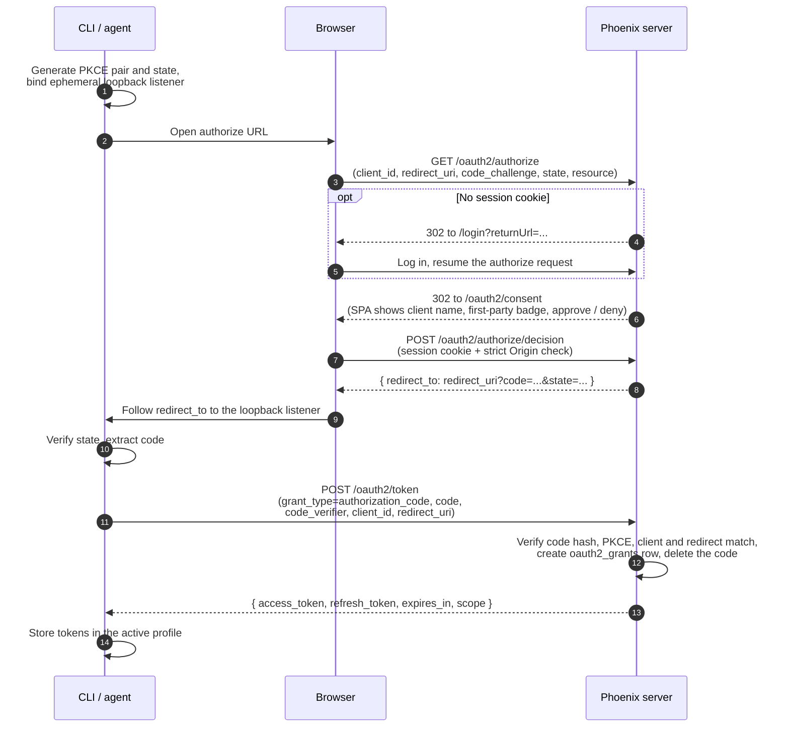
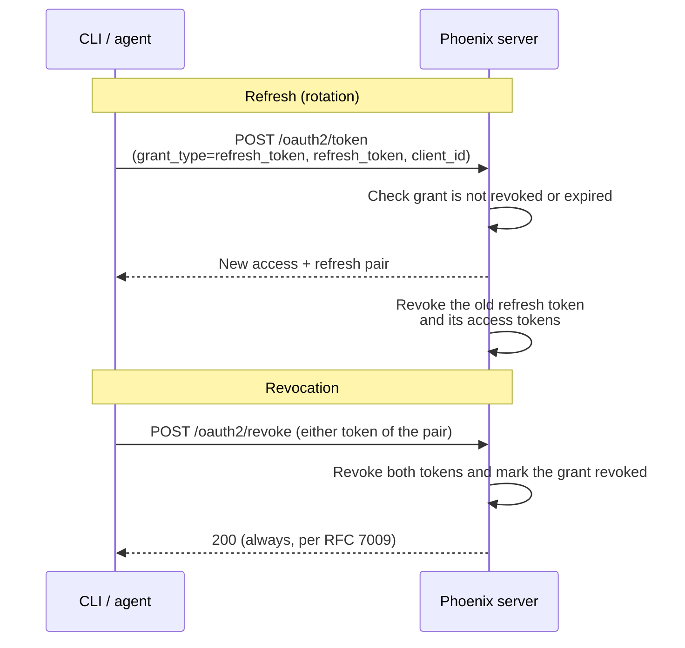

# OAuth2 Authorization Server and CLI Login

## Table of Contents

| # | Section | Focus |
|---|---------|-------|
| 1 | [Executive Summary](#executive-summary) | What we built |
| 2 | [Architecture](#architecture) | Components and the authorization-code flow |
| 3 | [Data Model](#data-model) | New tables and token-table columns |
| 4 | [Endpoints](#endpoints) | The authorization-server HTTP surface |
| 5 | [Redirect URI Model](#redirect-uri-model) | Three delivery classes and why |
| 6 | [Dynamic Client Registration](#dynamic-client-registration) | Policy dial and registration hygiene |
| 7 | [CLI Login](#cli-login) | `px auth login` end to end |
| 8 | [Design Decisions](#design-decisions) | Major choices and rationale |
| 9 | [Testing](#testing) | Layered unit and integration strategy |
| — | [Appendix: Environment Variables](#appendix-environment-variables) | Configuration surface |
| — | [Appendix: Standards Compliance](#appendix-standards-compliance) | RFC-by-RFC summary |
| — | [Appendix: Lessons Learned](#appendix-lessons-learned) | Root-path and SPA navigation pitfalls |

---

## Executive Summary

### What We Built

Phoenix is now an OAuth2 **authorization server**: third-party applications can
obtain Phoenix bearer tokens through the standard authorization-code flow with
PKCE, with the user approving access on a consent page. Before this work,
Phoenix was only an OAuth2/OIDC **client** (signing users in via external
identity providers); it had no way to issue its own tokens to another
application short of a human copying an API key.

- **Authorization-code + PKCE (S256) flow** — browser consent, one-time hashed
  codes, token exchange for Phoenix's existing access/refresh token pair
- **`px auth login`** — the Phoenix CLI performs the full flow with an
  ephemeral loopback callback server, stores tokens per profile, and
  auto-refreshes them
- **Dynamic Client Registration (RFC 7591)** — agent platforms (Claude Code,
  Cursor, VS Code, Codex CLI, and other MCP hosts) can self-register without
  an admin pre-provisioning a client, governed by a three-position policy dial
- **Discovery** — RFC 8414 authorization-server metadata and RFC 9728
  protected-resource metadata, so standards-aware clients configure themselves
  from two well-known URLs
- **Revocation (RFC 7009)** and **refresh-token rotation** with grant-level
  lifecycle (a durable `oauth2_grants` record per approval, revocable as a unit)
- **Zero new dependencies** — stdlib crypto plus the `joserfc`/`pydantic`
  already in the tree

Authorization *semantics* (what a granted token is permitted to do) are
governed by a separate scope/permission workstream and are deliberately out of
scope for this document; everything here is the protocol machinery.

### Key Files

| File | Purpose |
|------|---------|
| `src/phoenix/server/api/routers/oauth2_authorization_server.py` | Endpoint implementations (authorize, token, revoke, register, metadata) |
| `src/phoenix/server/oauth2_authorization_server.py` | Pure validation logic: PKCE, redirect URIs, state, resource identifiers |
| `src/phoenix/db/migrations/versions/132d988c5bef_*.py` | The one migration: three new tables + token-table columns |
| `src/phoenix/db/facilitator.py` | First-party `phoenix-cli` client seeding, expired-code sweep |
| `app/src/pages/auth/OAuth2ConsentPage.tsx` | SPA consent page |
| `js/packages/phoenix-cli/src/oauth.ts` | CLI-side PKCE, loopback callback server, token exchange/refresh/revoke |
| `js/packages/phoenix-cli/src/commands/auth.ts` | `px auth login` / `status` / `logout` |
| `src/phoenix/server/api/routers/auth_md.py` | RFC 9728 protected-resource metadata |

---

## Architecture

### Components

```
┌──────────────────────────────────────────────────────────────────────────┐
│                                                                          │
│   Authorization-server routers (FastAPI)                                 │
│   ══════════════════════════════════════                                 │
│   • /.well-known/oauth-authorization-server   (RFC 8414 metadata)        │
│   • /oauth2/authorize            (validates request, hands off to SPA)   │
│   • /oauth2/authorize/decision   (consent API: session cookie + Origin)  │
│   • /oauth2/token                (code exchange, refresh rotation)       │
│   • /oauth2/revoke               (RFC 7009)                              │
│   • /oauth2/register             (RFC 7591 DCR, policy-gated)            │
│                                                                          │
├──────────────────────────────────────────────────────────────────────────┤
│                                                                          │
│   Validation module (src/phoenix/server/oauth2_authorization_server.py)  │
│   ════════════════════════════════════════════════════════════════════   │
│   • PKCE verifier grammar + S256 challenge (constant-time compare)       │
│   • Redirect URI classifier (loopback / private-use scheme / https)      │
│   • Resource-identifier canonicalization (RFC 8707)                      │
│   • Public origin resolution (PHOENIX_ROOT_URL, root-path aware)         │
│   • Pure functions — unit-testable without a server                      │
│                                                                          │
├──────────────────────────────────────────────────────────────────────────┤
│                                                                          │
│   Existing token infrastructure (reused, not replaced)                   │
│   ════════════════════════════════════════════════════                   │
│   • Same access/refresh token pair as web sessions                       │
│   • Opaque jti-only JWTs; all claims live server-side in JwtStore        │
│   • Revocation = row delete + cache evict (no new revocation machinery)  │
│                                                                          │
└──────────────────────────────────────────────────────────────────────────┘
```

Phoenix's pre-existing OAuth2 **relying-party** routes (sign-in via external
IdPs) live under `/oauth2/{idp_name}/login` and `/oauth2/{idp_name}/tokens`.
The authorization-server endpoints share the `/oauth2` prefix with fixed path
segments, so at startup the server rejects any configured IdP whose name would
collide: `authorize`, `token`, `revoke`, `register`, and `consent` are
reserved (`app.py`, `_RESERVED_OAUTH2_IDP_NAMES`).

### The Flow



After the grant exists, the token pair cycles independently of the browser:



The consent handoff is deliberately split in two: `GET /oauth2/authorize`
performs all protocol validation server-side and then redirects to the SPA
consent route with only display parameters appended, and the SPA posts the
user's decision to a JSON endpoint that requires both a valid session cookie
and a same-origin `Origin` header (CSRF defense; dial-off via
`PHOENIX_OAUTH2_CONSENT_ORIGIN_CHECK=off` for unusual proxy setups). The
authorization code is minted only after an authenticated, origin-verified
approval.

---

## Data Model

One migration (`132d988c5bef`) adds three tables and extends the two existing
token tables. All JSON columns are JSONB on PostgreSQL.

### `oauth2_clients`

| Column | Type | Purpose |
|--------|------|---------|
| `client_id` | string, unique index | Public client identifier (`phoenix-cli`, or `px_dcr_` + 22 base62 chars for DCR) |
| `name` | string | Display name shown on the consent page |
| `logo_uri` | string, nullable | Optional client-supplied logo |
| `redirect_uris` | JSON | Registered **https** URIs only; loopback and private-use URIs are validated dynamically per request |
| `grant_types` | JSON | Subset of `authorization_code`, `refresh_token` |
| `token_endpoint_auth_method` | string | `none` — public clients only in this iteration |
| `is_first_party` | bool | Seeded Phoenix clients get verified consent copy; DCR clients get a caution notice |
| `metadata_` | JSON, nullable | Unrecognized RFC 7591 fields, plus the registering IP for DCR hygiene |

The `phoenix-cli` first-party client is seeded idempotently at startup
(`facilitator.py`) with an **empty** `redirect_uris` list: a CLI binds a random
loopback port per login, so its redirects can only be validated structurally,
not by string registration.

### `oauth2_grants`

The durable record of "user U approved client C" — created at code
*redemption*, not at consent, so an abandoned browser approval leaves no
grant behind (the unredeemed code expires and is swept).

| Column | Type | Purpose |
|--------|------|---------|
| `user_id`, `oauth2_client_id` | FK, CASCADE | Grant identity |
| `scopes`, `audience` | JSON, nullable | Snapshot copied onto every token minted under the grant |
| `expires_at` | timestamp, nullable | Grant ceiling (default 90 days); refresh-token lifetimes are clamped to it |
| `last_used_at` | timestamp | Touched on every refresh — feeds DCR client-cleanup and future session UI |
| `revoked_at` | timestamp, nullable | Soft revocation; refresh redemption checks it |

### `oauth2_authorization_codes`

| Column | Type | Purpose |
|--------|------|---------|
| `code_hash` | string, unique index | SHA-256 of the code — a DB leak does not yield redeemable codes |
| `redirect_uri` | string | Must be echoed exactly at the token endpoint (RFC 6749 §4.1.3) |
| `code_challenge`, `code_challenge_method` | string | PKCE (S256 only) |
| `scopes`, `resource`, `audience` | JSON/string, nullable | Request snapshot carried into the grant |
| `expires_at` | timestamp | 5-minute TTL; single-use — deleted on redemption, rejected-and-deleted if presented after expiry, and swept at server startup |

### Token-table extensions

`refresh_tokens` gains `oauth2_grant_id` (FK, CASCADE, indexed), `scopes`, and
`audience`; `access_tokens` gains `scopes` and `audience`. The claims cache
hydrates exclusively from these rows, so a grant-minted token carries its
snapshot through cache rebuilds and server restarts — there is no mint-time
state that exists only in memory. Web-session logins leave all of these NULL,
which is how the two token populations are distinguished.

---

## Endpoints

| Endpoint | Method | Auth | Rate limit | Notes |
|----------|--------|------|-----------|-------|
| `/.well-known/oauth-authorization-server` | GET | none | — | RFC 8414; advertises `registration_endpoint` unless DCR is disabled |
| `/.well-known/oauth-protected-resource` | GET | none | — | RFC 9728; lists this deployment as its own authorization server when auth is enabled |
| `/oauth2/authorize` | GET | session cookie (redirects to login) | — | Validates client, redirect URI, state (≥22 chars), `response_type=code`, PKCE S256, optional `resource`; errors that can be delivered safely go to the redirect URI per RFC 6749 §4.1.2.1, pre-validation failures render an HTML error |
| `/oauth2/consent` | GET (SPA route) | session | — | Display only; owns no protocol state |
| `/oauth2/authorize/decision` | POST | session cookie + strict Origin | — | JSON body; approval mints the hashed one-time code |
| `/oauth2/token` | POST (form) | none (public clients, PKCE is the proof) | 0.2 req/s per IP | `authorization_code` and `refresh_token` grants |
| `/oauth2/revoke` | POST (form) | none | 0.2 req/s per IP | RFC 7009: always 200, even for unknown tokens |
| `/oauth2/register` | POST (JSON) | none | 10/hour per IP (default) | RFC 7591, policy-gated |

Error responses from the token endpoint are deliberately non-oracular: an
unknown code, an expired code, a client mismatch, a redirect mismatch, and a
failed PKCE check all return the same `invalid_grant`. The one distinct error
is `invalid_target` (RFC 8707) for a `resource` value that does not match this
deployment — that is a request-shape error the client needs to correct, and
it reveals nothing about any stored code.

---

## Redirect URI Model

The single most interop-sensitive design surface. Agent platforms redirect in
three structurally different ways, and each class gets its own validation rule
(RFC 8252 is the guiding document for the first two):

| Class | Validation | Who needs it |
|-------|-----------|--------------|
| **Loopback** (`http://127.0.0.1`, `::1`, `localhost`) | Any port, any path; no query/fragment; no userinfo | CLIs and desktop agents that bind an ephemeral port per login. Observed paths differ per platform — `/callback` (Claude Code, `px`), `/callback/<id>` (Codex CLI), fixed ports with nested paths (OpenCode), even a bare `/` (VS Code) — so pinning ports or paths breaks real clients. RFC 8252 §7.3 explicitly requires accepting arbitrary ports. |
| **Private-use scheme** (`cursor://…`, `vscode://…`) | Scheme must be a valid URI scheme *not* in a deny-set (`http`, `https`, `javascript`, `data`, `vbscript`, `file`, `blob`, `about`, `ws`, `wss`); no query/fragment | Desktop IDE agents whose OS routes the scheme to the installed app (Cursor's documented desktop callback is `cursor://anysphere.cursor-mcp/oauth/callback`). The deny-set is a security boundary: without it, `javascript:` or `data:` "schemes" would turn the redirect into an XSS vector. |
| **HTTPS registered** | Exact string match against the client's registered list, plus an optional host allowlist | Hosted agent surfaces (web-based agents with a cloud callback URL). Highest-risk class — a redirect to an attacker-controlled https URL exfiltrates codes — so it is off except at the most permissive dial position. |

Classification and validation live in one pure function
(`validate_redirect_uri`) used identically at authorization time, decision
time, and DCR time, so the three checkpoints cannot drift apart.

---

## Dynamic Client Registration

### The Policy Dial

`PHOENIX_OAUTH2_DYNAMIC_CLIENT_REGISTRATION` = `disabled` | **`local_only`
(default)** | `enabled`. The dial governs both registration and which redirect
classes validate:

- **`disabled`** — no `/oauth2/register`, metadata omits
  `registration_endpoint`, and only admin-seeded clients work.
- **`local_only`** — anyone may register, but only loopback and private-use
  redirects validate. Whatever a registrant claims, the authorization code is
  ultimately delivered to a process on the approving user's own machine or an
  app their OS resolves. This is the shape MCP-style agent platforms expect:
  they attempt DCR automatically on connecting to a new server, and a server
  without it forces every user through manual client configuration.
- **`enabled`** — additionally allows exact-registered https redirects,
  optionally constrained by `PHOENIX_OAUTH2_ALLOWED_REDIRECT_HOSTS`.

The rationale for shipping DCR on by default at `local_only`: the registration
step itself grants nothing — a registered client still cannot obtain a token
without a logged-in Phoenix user clicking approve on the consent page, and the
local-delivery restriction means the code lands with the person who clicked.
The residual risk (a look-alike client name on the consent page) is addressed
with the first-party badge and unverified-client caution copy.

### Registration Hygiene

Unauthenticated registration invites junk rows, and several agent platforms
re-register a fresh client on every re-authentication, so hygiene is
structural rather than optional:

- **Rate limit**: 10 registrations/hour per IP (default)
- **Unconsumed cap**: at most 50 clients per IP per day that have never been
  used in a completed grant (registering IP recorded in `metadata_`)
- **Zero-grant TTL**: DCR clients that never complete a grant are deleted
  after 7 days
- **Dead-grant TTL**: DCR clients whose grants are all revoked/expired are
  deleted 30 days after the last grant went inactive
- Cleanup runs opportunistically at registration time, at most once per day
- Only `client_name` (≤200 printable chars), `logo_uri` (≤2048), redirect
  URIs, and the supported grant/response types are honored; everything else is
  retained opaquely in `metadata_`. Only https URIs are *stored* — the local
  classes are re-validated per request

DCR clients are always public (`token_endpoint_auth_method: none`) and
restricted to `authorization_code` + `refresh_token`.

---

## CLI Login

`px auth login` (`js/packages/phoenix-cli`) is the first-party consumer and
the reference client implementation:

1. Generates a 64-byte PKCE verifier and 32-byte state (base64url), starts an
   HTTP listener on `127.0.0.1:<ephemeral>/callback`.
2. Builds the authorize URL for `client_id=phoenix-cli` **relative to the
   configured endpoint** (root-path-safe — see Lessons Learned) and opens the
   browser; `--no-browser` prints the URL and accepts a pasted redirect URL
   instead, so the flow works over SSH.
3. Validates `state` on the callback, exchanges the code (with `verifier`) at
   `/oauth2/token`, and persists tokens into the active profile in the CLI
   settings file. A lock file serializes concurrent settings writes.
4. Subsequent commands transparently refresh when a token is within 60 s of
   expiry; rotation-aware — the settings lock is held across
   read-latest → refresh → persist so concurrent CLI processes don't race a
   rotated refresh token.
5. `px auth logout` revokes the refresh token via `/oauth2/revoke` (which ends
   the whole grant) before clearing local state; `px auth status` reports the
   authenticated user.

The overall UX target: a coding agent (or a human) runs one command, approves
once in the browser, and every subsequent CLI invocation authenticates
silently until the grant expires or is revoked.

---

## Design Decisions

### Reuse the existing token pair; add no new token format

Grant-minted tokens are ordinary Phoenix access/refresh tokens: opaque JWTs
whose payload is a token id, with all claims hydrated server-side from the
database. This bought revocation, expiry, cache behavior, and every existing
auth middleware for free, and means one hardening effort covers both web
sessions and OAuth2 grants. The alternative — self-contained JWTs with
embedded claims — was rejected because Phoenix's claim cache rebuilds from
rows, so any claim not derivable from a row silently vanishes on rebuild, and
because self-contained tokens cannot be revoked without reintroducing exactly
the server-side state they were meant to avoid.

### Grant at redemption, not at consent

Consent mints only a short-lived hashed code. The `oauth2_grants` row is
created inside the token exchange, in the same transaction that deletes the
code. Abandoned approvals therefore leave nothing to clean up but an expired
code row, and every grant row corresponds to a client that actually holds
tokens.

### Hashed, single-use, short-lived codes

Codes are 32 bytes of `secrets` entropy, stored as SHA-256 (lookup by hash —
inherently timing-safe on the hot path), expire in 5 minutes, and are deleted
on first redemption. PKCE comparison uses `hmac.compare_digest`. S256 is the
only accepted challenge method; `plain` is not implemented.

### Refresh rotation with family revocation

Redeeming a refresh token mints a new pair and then revokes the old refresh
token *and every access token minted under it*. A replayed old refresh token
fails with `invalid_grant`. Refresh lifetimes are clamped to the grant's
`expires_at`, so a grant ceiling is a hard ceiling. (Automatic reuse-*detection*
— revoking the whole grant when a rotated-out token is replayed — is noted as
future hardening; rotation itself ships now.)

### Revocation ends the session as a unit

`/oauth2/revoke` accepts either token of a pair; revoking one revokes both and
marks the grant revoked. Per RFC 7009 the endpoint returns 200 regardless, so
it cannot be used to probe token validity.

### Required `state`, minimum entropy

RFC 6749 only RECOMMENDS `state`, but every targeted client sends it, and it
is the CSRF binding for the callback. Phoenix requires it and enforces ≥22
characters (~128 bits base64url) so a compliant-but-lazy client cannot ship
`state=1`. This is a deliberate strictness-beyond-spec choice; the failure
mode is a clear `invalid_request` at first integration, not a latent
vulnerability.

### Resource indicators, strictly one resource

`resource` (RFC 8707) is accepted at both the authorize and token endpoints
and must canonicalize to this deployment's own origin (scheme/host lowercased,
default ports elided, root path applied); anything else is `invalid_target`.
Phoenix is currently the only resource its tokens are good for — the
parameter, and the `resource`/`audience` columns, exist so multi-audience
support later is additive rather than migratory.

### Issuer identity from configuration, not from Host headers

The metadata `issuer`, the PRM `resource`, and resource-indicator matching all
derive from `PHOENIX_ROOT_URL` when set (falling back to the request base
URL). Deployments behind proxies and sub-path mounts get a stable, spoof-proof
identity; discovery documents never reflect a client-controlled Host header
when the operator has configured the canonical URL.

### Public clients only, PKCE as the proof

Every current consumer is a native/CLI app that cannot keep a secret, so
`token_endpoint_auth_method` is `none` across the board and PKCE is mandatory.
Confidential-client support (client secrets, `client_credentials`) is
deliberately absent rather than half-built.

### Zero new dependencies

Evaluated pulling in an OAuth server framework; the mature Python option is
sync-only and does not integrate with the async FastAPI stack. Everything
needed — SHA-256, HMAC comparison, base64url, `secrets` — is stdlib, plus the
`joserfc` and `pydantic` already shipped. The protocol surface implemented
here is small enough that a framework would mostly be indirection.

---

## Testing

Two layers, matching how the code is split:

**Unit** (`tests/unit/server/test_oauth2_authorization_server.py` and
friends): the pure validation module — PKCE grammar and verification, all
three redirect classes against all three dial positions, the private-use-scheme
deny-set, state length, resource canonicalization (ports, case, root paths,
IPv6), plus grant-claims hydration. These run with auth disabled and no
server, because the functions under test take strings and return
classifications.

**Integration** (`tests/integration/auth/test_oauth2.py`): a real server
process with auth enabled, real HTTP, no mocks. A small `_OAuthPublicClient`
helper drives the flow the way an external client would — build the authorize
URL, follow the consent decision, capture the redirect, exchange the code.
Coverage is organized by concern, one class each:

| Class | Covers |
|-------|--------|
| `TestDiscovery` | Both well-known documents, registration-endpoint advertisement per dial |
| `TestAuthorizationCodeFlow` | Happy path, denial, state/PKCE failures, code single-use |
| `TestTokenLifecycle` | Refresh rotation, replay of rotated tokens, revocation semantics |
| `TestDynamicClientRegistration` | Registration across all three dial positions, redirect-class rejection, hygiene caps |
| `TestReadOnlyClamp` | Enforcement behavior of granted tokens (documented in the authorization workstream) |

Separate app fixtures run the suite against `local_only` (rate-limited),
`enabled`, and `disabled` configurations, since the dial changes both
registration and redirect validation behavior.

---

## Appendix: Environment Variables

| Variable | Default | Purpose |
|----------|---------|---------|
| `PHOENIX_OAUTH2_DYNAMIC_CLIENT_REGISTRATION` | `local_only` | The policy dial: `disabled` \| `local_only` \| `enabled` |
| `PHOENIX_OAUTH2_ALLOWED_REDIRECT_HOSTS` | unset (any) | Host allowlist for https redirects when `enabled` |
| `PHOENIX_OAUTH2_GRANT_EXPIRY_DAYS` | 90 | Grant ceiling; refresh lifetimes are clamped to it |
| `PHOENIX_OAUTH2_CONSENT_ORIGIN_CHECK` | `strict` | Origin-header enforcement on the consent decision endpoint |
| `PHOENIX_OAUTH2_DCR_RATE_LIMIT_PER_HOUR` | 10 | Per-IP registration rate |
| `PHOENIX_OAUTH2_DCR_MAX_UNCONSUMED_PER_IP_PER_DAY` | 50 | Per-IP cap on never-used DCR clients |
| `PHOENIX_OAUTH2_DCR_ZERO_GRANT_TTL_DAYS` | 7 | Delete DCR clients that never completed a grant |
| `PHOENIX_OAUTH2_DCR_DEAD_GRANT_TTL_DAYS` | 30 | Delete DCR clients whose grants are all inactive |
| `PHOENIX_ROOT_URL` | unset | Canonical public URL: issuer, PRM resource, resource-indicator matching |

Access- and refresh-token lifetimes reuse the existing
`PHOENIX_ACCESS_TOKEN_EXPIRY_MINUTES` / `PHOENIX_REFRESH_TOKEN_EXPIRY_MINUTES`
configuration — grant tokens are the same tokens.

## Appendix: Standards Compliance

| Standard | Status |
|----------|--------|
| RFC 6749 (OAuth 2.0) | Authorization-code grant only; no implicit, password, or client-credentials grants |
| RFC 7636 (PKCE) | Required for all clients; S256 only |
| RFC 7009 (Revocation) | Implemented; always-200; `token_type_hint` accepted and ignored (both types are resolved) |
| RFC 7591 (DCR) | Implemented behind the policy dial; unrecognized metadata preserved |
| RFC 8414 (AS Metadata) | Implemented at the well-known path under the deployment root |
| RFC 8252 (OAuth for Native Apps) | Loopback (§7.3, arbitrary ports) and private-use schemes (§7.2) per the redirect model above |
| RFC 9728 (Protected Resource Metadata) | Implemented; PRM points at this deployment as its own AS |
| RFC 8707 (Resource Indicators) | Accepted and strictly validated against the single deployment resource; `invalid_target` on mismatch |
| OAuth 2.1 (draft) | Aligned by construction: code+PKCE only, no implicit grant, exact/structural redirect matching, rotation on refresh |
| Client ID Metadata Documents (draft) | Not implemented; noted as the likely successor to DCR for agent platforms as the draft and client support mature |

## Appendix: Lessons Learned

Two root-path bugs surfaced during manual testing against a deployment mounted
at a sub-path, both worth remembering because every URL-producing feature will
meet them again:

1. **`new URL("/path", base)` discards the base path.** The CLI originally
   built `new URL("/oauth2/token", endpoint)`, which maps
   `https://host/phoenix` → `https://host/oauth2/token`. All CLI OAuth URLs
   are now resolved as *relative* references against a trailing-slash
   endpoint. If a URL is meant to live under the configured endpoint, never
   construct it with a leading slash.

2. **`returnUrl` values must be mount-relative, and only the SPA can decide
   how to navigate to them.** The login redirect initially embedded the full
   request path (including the ASGI root path) in `returnUrl`; both consumers
   — the SPA router's basename and the IdP callback's redirect — re-apply the
   prefix, producing `/phoenix/phoenix/…`. The server now strips the root path
   (`strip_root_path`, the inverse of `prepend_root_path`). Separately, a
   `returnUrl` pointing at a *backend* route (like `/oauth2/authorize`) cannot
   be reached with a client-side router transition at all — the SPA now
   performs a full document load for server-owned paths
   (`isServerOwnedPath` in `routingUtils.ts`). The failure mode is deceptive:
   the address bar shows the correct URL while the router renders a no-match
   page, and a manual refresh "fixes" it.

## Appendix: Related Documents

- `internal_docs/specs/oauth2-email-attribute-path.md` — Phoenix as an OAuth2
  *client* (relying party) for IdP sign-in; shares the `/oauth2` prefix
- `internal_docs/specs/ldap-authentication.md` — the other non-password login
  path whose form participates in the `returnUrl` contract
