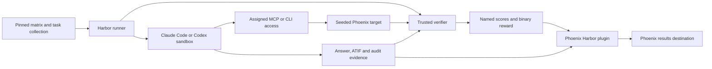

# Phoenix MCP benchmark with Harbor

Planning draft, September 9, 2026. No benchmark runs or infrastructure changes have been made as part of this plan.

Implementation handoff authorization: the user requests a fresh implementation task on a new branch from updated `origin/main`, progressing as far as possible and creating stacked PRs for each reviewable step. Use `gh-stack` and `ehutt/` branch names. Create the stack before implementing its layers, publish draft PRs with validation and handoff notes, and continue to dependent layers without waiting for routine human review at every stage. The review gates below define reviewable evidence and technical acceptance criteria, not mandatory pauses after every PR. Stop only at a genuine blocker requiring human input, approval, credentials, or an external change, after completing useful independent work. Do not merge PRs or publish the blog as part of this authorization. Explicit unresolved permissions and isolation requirements still apply.

Build one repeatable evaluation pipeline, then use it to investigate a concrete tooling change. The first release should compare the current public Phoenix MCP with `px`, using Claude Code and Codex. The strongest blog will follow a failure through its trajectory, change the tool interface, and rerun the same tasks. A leaderboard alone will not explain why developers should adopt the plugin.

The target for the week is 16 tasks, four primary configurations, and three repetitions per configuration, or 192 final trials. Start with three tasks and 12 trials. These are scope targets, subject to measured pilot cost and runtime. Do not add historical MCP versions, more models, or multiple database backends to the launch requirements.

## Implementation readiness

Ready to begin the first implementation session. The full matrix remains gated on a working, isolated end-to-end trial. Further broad research is not needed before starting; the first session should resolve the concrete runtime contracts below. Supplemental corpus research stays deferred until after the smoke pipeline.

Read-only checks on September 9 established:

- Docker Desktop is available, with client/server 29.5.2 and a LinuxKit 6.12.76 kernel. Actual egress-policy enforcement has not been tested.
- The `harbor` executable on PATH is version 0.1.45. Do not use it for this benchmark or upgrade it globally as a side effect. Start with Harbor 0.22.0 in a dedicated pinned environment and verify compatibility with the built Phoenix client wheel. [Harbor 0.22.0 release](https://github.com/harbor-framework/harbor/releases/tag/v0.22.0)
- Locally available `origin/main` at `c1288c9c35e951a6e22c7d39a4a649ea58fa33ec` contains default ATIF tracing and accepts `null` to disable it. This confirms the user's update; the earlier inspected feature checkout is stale for plugin implementation. Pin the chosen main commit in the build manifest.
- The configured Hugging Face token passed an authenticated metadata and gated-data HEAD check for TRAIL revision `b424ce63d5973d5dcd7169b1bc3c07ccdee276d1`. No dataset was downloaded. `HF_TOKEN` exists in the main Phoenix `.env`, but is not exported in this process.
- `ANTHROPIC_API_KEY` and `OPENAI_API_KEY` are absent from this process and from the main Phoenix `.env`. The user must supply them in the launch environment before live agent runs. No Keychain fallback is permitted. A saved `.env` entry does not automatically become a runner environment variable.

The first implementation handoff should produce a pinned runtime, one task and oracle, explicit agent/network configuration, separate verification, and a testable path from terminal result to Phoenix trace. Resolve these contracts before expanding:

1. Prove Harbor's selected Docker backend enforces the required network policy on this daemon, including blocked web access and allowed inference/target calls. Harbor 0.22.0 uses a kernel capability probe; custom Compose network declarations can override automatic egress wiring. Inspect the effective network and retain policy failures rather than relaxing the restriction. [Pinned Docker implementation](https://github.com/harbor-framework/harbor/blob/v0.22.0/src/harbor/environments/docker/docker.py)
2. Keep the per-trial Phoenix target under trusted runner management, outside the agent environment's lifecycle. Harbor stops that environment before separate verification, so a target in the same Compose lifecycle would be unavailable for live state checks. The target stays on a restricted network with distinct agent and verifier access. [Pinned single-step lifecycle](https://github.com/harbor-framework/harbor/blob/v0.22.0/src/harbor/trial/single_step.py)
3. Prove the agent process tree has stopped, capture trusted outputs/audit evidence, and transfer ATIF to the separate verifier before grading. Some stop/collection failures only warn. Harbor also mounts the verifier log directory in the agent, then clears it before separate grading. Test that fake rewards cannot survive; do not assume the path is absent. Missing evidence or a failed stop must invalidate the trial. [Pinned trial implementation](https://github.com/harbor-framework/harbor/blob/v0.22.0/src/harbor/trial/trial.py)
4. Validate the exact requested model identifiers, API-key auth, native web-tool disabling, effective tool registration, and token/cost coverage for both installed agent adapters. Harbor 0.22.0 exposes Claude tool exclusions and Codex `web_search=disabled`. Test saved configs/logs for secret leakage with dummy canaries before using real keys. Do not silently substitute models or accept inferred SQL success from generated source alone. [Claude adapter](https://github.com/harbor-framework/harbor/blob/v0.22.0/src/harbor/agents/installed/claude_code.py), [Codex adapter](https://github.com/harbor-framework/harbor/blob/v0.22.0/src/harbor/agents/installed/codex.py)
5. Run the existing Phoenix plugin contract/E2E checks applicable to the pinned Harbor version, then a real minimal run with a linked trace. Keep ATIF conversion, verifier rewards, and terminal hook ordering under test.

Two user decisions remain before provisioning and paid execution: authorization for dedicated disposable benchmark targets, including their cleanup policy, and a monetary cap for the initial live smoke runs. The final sweep budget can follow the pilot. Default the results destination to the existing local Phoenix instance with additive benchmark records; keep its data and lifecycle separate from disposable targets.

The final corpus, expanded task counts, legacy MCP baseline, additional models, and blog charts are not prerequisites for this first session. A one-week schedule depends on resolving isolation quickly; reduce the later sweep scope if this takes longer rather than weakening the isolation requirements.

## Evidence and dependencies

The inspected checkout is `bfbe9bdfc4ab2ef7ae6d43b10631ea48754dcb74`. Locally available remote refs are evidence of existing work, not proof of their current upstream or release status.

User update, September 9: ATIF tracing has merged to main but is not yet in a released client. Build and pin the client wheel from a main commit containing that merge. This is dependency pinning and verification work, not missing plugin implementation. Switch the public installation instructions to a released client version when available, retaining the original wheel/commit provenance for collected results.

| Existing work | Reuse and limitation |
| --- | --- |
| `origin/mora/mcpbench-experiment` at `39c9be2cf0377aa2b2377c62cc69bfe5f674dd96` | Nine analytics/diagnosis tasks and one no-op control; prompt design, transcript analysis lessons, budget and retry policies. Replace its custom execution and Phoenix export with Harbor and the plugin. |
| `scripts/load_patronus_trail.py`, introduced by commit `cc73a9bb17c` for PR #13461 | Span conversion, token normalization, annotations, model-name normalization. Defaults randomize IDs and shift timestamps; the current script requires Python 3.14. Do not copy its defaults into a reproducible fixture build. |
| `evals/harbor/` | Make targets, environment staging, oracle patterns, verifiers, and plugin integration tests. Its current agent is the Phoenix headless agent; the external MCP benchmark needs Claude Code and Codex instead. |
| `packages/phoenix-client/src/phoenix/client/harbor/` | Dataset and experiment recording, score mapping, repetitions, and resume semantics. This checkout accepts only `trace_mode="none"`, despite its docs describing ATIF. |
| `origin/ehutt/harbor-plugin-atif-tracing` at `657b14738a12e0a14be6f7a4699857fe41add38e` | Historical local ref for ATIF work, now merged to main per the user. Build from pinned main and verify its accepted trace-mode values rather than using this stale branch or building a second exporter. |
| `src/phoenix/server/mcp_code_mode.py` | Existing callback logging can help inspect nested operations. Plain logs and submitted Python do not prove a nested SQL call succeeded; confirm result status. |
| `js/packages/phoenix-cli/src/commands/` | CLI includes annotation writes and `px api graphql` queries. This checkout's prompt commands are list/get/delete, not create. Build the common task set from the pinned versions' actual capabilities. |

Use TRAIL as the primary seed corpus and reuse the existing loader and benchmark tasks. The dataset's stated purpose includes evaluation and benchmarking. My reading of its access terms is that an authorized download into a private Docker/Phoenix environment for this benchmark is compatible with that use; loading data locally does not redistribute it. Each person reproducing the benchmark obtains Hugging Face access and downloads the pinned revision during setup. Publish the loader, tasks, verifiers, configuration, and aggregate benchmark measurements rather than distributing the source dataset. Do not publish populated database snapshots, Docker layers containing TRAIL, or unredacted traces/tool outputs that reshare source content. A tiny original synthetic fixture is optional for ungated smoke tests and public screenshots, not a prerequisite to the main benchmark. [TRAIL dataset and access terms](https://huggingface.co/datasets/PatronusAI/TRAIL)

## What the comparison means

| Configuration | Agent | Requested model | Phoenix access |
| --- | --- | --- | --- |
| `claude-mcp` | Claude Code | `opus-5`, resolved during preflight | Current public `/mcp`, code mode as shipped, no `px` |
| `claude-cli` | Claude Code | Same resolved model and effort | Pinned `px`, no Phoenix MCP registration |
| `codex-mcp` | Codex | `gpt-5.6`, resolved during preflight | Same MCP build and settings |
| `codex-cli` | Codex | Same resolved model and effort | Same CLI build |

The model strings are requested configuration values, not claims that those exact provider identifiers are available. Fail preflight with a clear error if unavailable. Never silently substitute a model. Record agent executable version, provider, resolved model, effort, context limits, and authentication mode.

Primary comparisons are MCP versus CLI within each agent/model pair. Claude Code plus Opus versus Codex plus GPT changes both the agent and model, so it cannot establish a pure agent effect. MCP versus CLI compares the complete developer interfaces, including help, discovery, transport, output shaping, and local processing. It does not isolate SQL or code mode.

Keep the task instruction identical across configurations. Give only a short, equivalent access instruction: use the configured Phoenix MCP, or use `px`. Both agents may use ordinary local files, Python, and shell processing. Phoenix data must enter through the assigned interface. `px api graphql` is allowed because it is a shipped CLI capability. Direct SDK, HTTP, database access, installing the competing interface, and inherited MCP connections are outside the comparison.

Use clean agent configuration directories without personal skills, memories, plugins, or unrelated servers. Pin the documentation available to each agent. MCP discovery and CLI help are part of the product being evaluated. Additional onboarding skills form a separately named condition if tested later. Do not disable shell tools for only one arm, as the old harness did for MCP.

For SQL discovery, start with natural task wording. Record `sql_attempted`, `sql_succeeded`, and `schema_inspected`; do not require SQL for a task whose answer can legitimately be obtained another way. A small, separately reported prompted condition can test whether an explicit SQL hint improves routing. A tool-description patch is a better product experiment because users then benefit without changing their requests.

## Runtime design



The Phoenix target contains the application data the agent investigates. The results destination records the benchmark's own datasets, experiments, scores, and traces. Give these explicit, separate configuration names, even if an initial read-only smoke test uses different projects on one server. The plugin's claim that ATIF needs no sandbox access to the collector applies to the results destination. This benchmark's agent still needs access to the Phoenix target.

For the full benchmark, prefer a dedicated target service per trial outside the agent sandbox, created from a fixed fixture. It prevents cross-trial writes and avoids accidentally exposing results, reference answers, or the target database file to agents. Use the same backend, resources, and initial state across conditions. Start serially. Parallelism can otherwise measure SQL and Monty queue limits instead of the interface.

Provisioning these isolated target services is a decision to approve before implementation. The repository's user instructions explicitly require permission for isolated Phoenix databases. Until that decision, leave `PHOENIX_WORKING_DIR` unset and use the shared instance only for authorized additive or read-only work. Never reset, migrate backward, or delete `~/.phoenix/phoenix.db`. Never use it as a disposable benchmark fixture. No isolation or deletion is authorized merely by saving this plan. Once authorized, define which new benchmark resources are disposable and which failed-run artifacts must be retained.

Keep the agent away from target DB files, DB ports, Docker sockets, host mounts, verifier secrets, and results-destination credentials. The target exposes only the required application interface. The verifier uses independent trusted API access to inspect state after execution. Tests, oracle code, expected values, and fixture-generation scripts must not be baked into the agent-visible image. Keep grading assets in a separate verifier environment throughout execution.

### Prevent repository, web, and grading access

User requirement: evaluated agents must not inspect the Phoenix repository, search the web, or read Harbor solutions/verifiers. Enforce these boundaries through filesystem and network isolation, not just prompt instructions or a post-run cheating detector. This applies equally to Claude Code and Codex, in both MCP and CLI conditions.

- Build a minimal agent image from explicitly selected runtime artifacts. Never mount or copy the Phoenix checkout, `.git`, benchmark task collection, tests, oracle solutions, reference answers, fixture source, package caches containing repository snapshots, or previous trial outputs. Do not use `COPY . .` from the repository root. Keep the Phoenix server and data in the separate target service. Give the agent only its instruction, writable workspace, approved tools, and narrowly scoped access configuration. CLI installation should use its pinned distribution, not a development checkout; inspect its packaged files for accidentally bundled tests or benchmark content.
- Deny outbound network access by default with enforcement outside agent control. Allow only the assigned Phoenix target and the exact model inference/authentication services the agent needs. Deny GitHub/raw source, search engines, documentation sites, Hugging Face, package registries, alternate proxies, and arbitrary HTTP/DNS/IP egress during execution. Build dependencies and fetch seed data in a trusted preparation phase. The target service must not become an unrestricted web-fetch proxy.
- Disable native web search, web fetch, browser tools, remote browsing connectors, and unrelated MCP servers in both agents. Model-provider access must not enable provider-hosted search as a side channel; verify the effective tool configuration and, where needed, constrain inference requests through a trusted gateway. A hostname allowlist alone does not prevent a provider-hosted search tool. Permit normal model inference, not arbitrary network tunneling.
- Allow only pinned local usage documentation and the interface's own help/schema/discovery output. These must contain no benchmark answers. Online documentation commands must fail under the network policy. Repository browsing is outside the task even if the repository is public.
- Run verification in a separate environment. Transfer only declared answer artifacts and runner-collected evidence through the trusted runner. Snapshot evidence and stop the agent process tree before grading; prevent surviving background processes from writing outputs or the target during verification. Do not execute agent-supplied scripts, import its modules, or use its working directory/PATH to run the grader. Parse answer files as untrusted data with bounded sizes and safe paths. Preserve any task-specific output artifact needed for state checks without mounting the whole agent filesystem into the verifier.
- Oracle runs use fresh environments distinct from evaluated trials. Only the verifier can create the authoritative reward file. Never accept an agent-written `/logs/verifier/reward.json`. Keep reward logs, checker code, credentials, audit logs, and other trials' artifacts inaccessible to the agent. Collect audit evidence outside the agent's writable filesystem.

Harbor currently documents separate verifier environments and network allowlists, but network enforcement varies by environment provider. Pin and test the chosen backend instead of assuming a config field provides isolation. Use a separate verifier network baseline rather than granting the agent environment broader access for grading. [Harbor environment and verifier configuration](https://www.harborframework.com/docs/tasks)

Make isolation a smoke-test acceptance gate. Run deliberate probes from the same UID, container, tools, and network context as each evaluated configuration: search for repository/test/oracle files and known canaries; fetch GitHub raw content, a search endpoint, and an arbitrary IP; invoke native web tools; inspect host/DB sockets; plant a fake reward file; and leave a background process attempting to observe verification. All forbidden reads/connections must fail, fake rewards must be ignored, and the verifier must remain inaccessible. Positive controls must still allow inference, assigned MCP/CLI operations, and declared answer output. Missing enforcement or successful leakage stops the sweep and invalidates affected trials.

Record observed forbidden attempts as policy failures even when blocked, with supporting evidence. Keep this separate from an isolation failure in the benchmark infrastructure. These controls prevent runtime access; they cannot establish that a model has never seen public source or tasks during training. Retain held-out task instances for that separate contamination concern.

Use Harbor's installed Claude Code and Codex adapters where possible. Write a small configuration extension only if needed for endpoint wiring, clean settings, or audit evidence. Do not create another agent loop. Preserve Harbor logs and ATIF.

The user explicitly authorizes personal API-key billing for Claude Code and Codex in this Harbor benchmark. This overrides the general subscription-only Claude Code instruction for these benchmark runs. The runner must read `ANTHROPIC_API_KEY` and `OPENAI_API_KEY` from its existing process environment; it must not call `keyget`, macOS Keychain, or another credential-store fallback. Pass only the relevant provider key to each agent through the pinned adapter's supported runtime mechanism, and verify that API-key auth is effective rather than silently using an inherited subscription login. Do not inherit the runner's entire environment. Fail preflight with the missing variable name if a selected condition lacks its key, without printing secret values. Keep literal keys out of job manifests, command arguments, images, logs, traces, and published artifacts; config examples should reference environment variable names only. Record authentication mode, not credentials. Existing sweep budget controls still apply.

## Task and fixture contract

The recommended location is `evals/mcp/`, organized around the interface under evaluation. Include `README.md`, locked dependencies, `configs/`, `fixtures/`, `tasks/`, shared verifier code, and report code. Keep the general-purpose TRAIL loader under `scripts/`. Add Make targets for fixture validation, preflight, oracle, smoke, pilot, full run, and report. These are proposed targets, not existing commands. Reuse existing staging helpers without changing the current headless-agent benchmark's behavior.

Each single-step task contains `task.toml`, `instruction.md`, an environment definition, `tests/test.sh`, and an oracle at `solution/solve.sh`. Harbor does not require an oracle, but this benchmark does. Write named numeric scores to `/logs/verifier/reward.json`. Put shared grading logic in one package; avoid copying a full verifier into each task. Pin Harbor first and validate against that version's task schema. [Harbor task format](https://www.harborframework.com/docs/tasks)

Each task also needs a reviewed manifest:

- Stable task ID, family, intent, difficulty, fixture revision/hash, and development or holdout assignment.
- Required capabilities and eligible configurations. Unsupported tasks are declared before any runs.
- User instruction, expected output fields, exact resource scope, time window, rounding/tie rules, and tolerances.
- Allowed mutations, forbidden mutations, expected before/after state, and sentinel resources to protect.
- Applicable score names and required pass conditions. Missing and not-applicable checks are distinct.
- References and derivation, oracle, positive and negative grading examples, and timeout/resource limits.

### Metadata for filtering tasks and results

Every Harbor task and its corresponding Phoenix dataset example must carry structured, versioned metadata so reviewers can filter and compare meaningful subsets. Metadata is part of the benchmark contract, not an optional reporting annotation. Define a typed schema and controlled vocabularies; validate them before execution. Use one canonical task manifest to produce Harbor metadata, Phoenix example metadata, and report columns instead of maintaining separate hand-written copies.

| Field | Purpose and example values |
| --- | --- |
| `metadata_schema_version` | Version the metadata contract independently of the task content. |
| `task_id`, `task_version`, `task_family_id` | Stable identity and grouping of related variants, such as `error-rate-by-length`. Keep closely related variants in the same development/holdout split. |
| `task_type` | Primary user intent: `lookup`, `aggregation`, `comparison`, `diagnosis`, `creation`, `update`, or `batch_mutation`. |
| `primary_surface` | One primary Phoenix area for non-overlapping summaries: `tracing`, `annotations`, `datasets`, `experiments`, `prompts`, or `sessions`. |
| `product_surfaces` | All areas touched, as an array; a regression diagnosis might include `experiments`, `datasets`, and `tracing`. |
| `operation_types` | Array such as `list`, `filter`, `aggregate`, `join`, `drilldown`, `create`, or `update`. Distinguish operations from product areas. |
| `mutability` | `read_only` or `writes`; explicit permitted mutation scope lives in the protected task contract. |
| `split` | `development` or `holdout`, fixed before tuning. |
| `suites` | Array such as `smoke`, `core`, `extended`, or `calibration`; a smoke task can also belong to core without duplicating its identity. |
| `difficulty`, `difficulty_rationale` | Authored difficulty and a short reason, not labels inferred from which agent failed. |
| `challenge_tags` | Array such as `pagination`, `cross_resource`, `multi_requirement`, `empty_result`, `version_selection`, `error_recovery`, or `precise_mutation_scope`. |
| `data_scale` | Defined fixture-size category and relevant counts, rather than assuming all aggregation tasks are large. |
| `fixture_corpus`, `fixture_revision`, `fixture_hash` | Source provenance and reproducibility; distinguish TRAIL from original or other public supplements. |
| `required_capabilities`, `eligible_interfaces` | Predeclared applicability, including common MCP/CLI tasks versus capability-only extensions. |
| `verification_types`, `evaluator_ids`, `rubric_version` | Identify deterministic, end-state, policy, and LLM checks and their versions. |
| `sql_opportunity` | Curated diagnostic tag such as `aggregation`, `join`, or `none`; this is an analysis facet, not a requirement to use SQL or a hint given to the agent. |

Example analysis: select core, read-only aggregation tasks touching tracing, group by agent/model and interface, then compare success, cost, and SQL adoption. Another slice selects annotation writes with `precise_mutation_scope` and compares task completeness against exact state verification. Support compound filters and array membership without rewriting analysis code. Display task/trial counts and missing-score coverage for every slice. Use `primary_surface` for mutually exclusive totals; multi-surface views overlap and must not be summed as independent groups.

Keep authored task metadata separate from observed run metadata. Agent/model/effort, MCP or CLI version, interface condition, repetition, job/trial IDs, actual SQL/code use, latency, tokens, cost, and failures belong to the experiment/run or associated measurement records. Do not label a task `uses_sql` based on one agent's trajectory or create different task IDs for each model. Keep secrets, reference answers, and privileged grader details out of public metadata. Analysis-only hints stay with the trusted runner/verifier and are not inserted into agent instructions.

Verify propagation end to end. The previously inspected plugin stores task configuration under Phoenix example metadata, so custom task facets may initially appear under `task_config.metadata`. Check the pinned implementation and document the actual paths. Prefer native supported propagation; if the user-facing filters require a small plugin improvement, make that an explicit stack layer rather than an ad hoc post-run uploader. Do not assume data nested inside an opaque config is conveniently filterable. Provide a tested Phoenix/API/report path for the proposed compound filters and keep the canonical task ID join intact across exports.

Acceptance checks: every task has valid required facets; metadata survives task loading, Phoenix dataset synchronization, experiment association, export, and resume; metadata revisions are reflected in dataset versioning without rewriting historical experiments; and a reviewer can reproduce at least the two compound slices above. Store selected filters and schema version in generated reports so comparisons can be repeated. Start the schema with the first smoke task, then enrich it during curation.

Ask agents to write a small `answer.json` with task-specific values and evidence IDs, plus a normal readable answer. Grade the declared artifact, not a regex over the entire conversation. Include format compliance as an explicit requirement and explain it in the prompt. For diagnosis tasks, require relevant trace/span evidence and concrete findings. Use the new Phoenix Evals agent-completeness evaluator on main as the primary semantic evaluator, alongside deterministic checks. Assess its correctness coverage on readable trajectories before adding a separate LLM correctness judge. Pin evaluator versions, judge model and rubric, calibrate against human labels, and report judge cost separately. The following evaluation contract makes semantic evaluation part of the planned benchmark rather than an optional fallback.

Build the primary fixture by downloading a pinned TRAIL revision through the user's authorized Hugging Face access and adapting the existing loader. Add original synthetic artifacts only where needed for missing coverage, such as prompt versions, experiment comparisons, mutation sentinels, fractional latency, or empty matches. Record each artifact's provenance and identify supplemented tasks in reporting. Use enough rows to force at least one pagination boundary. A tiny fixture where every operation fits in one response cannot test SQL's practical value. Freeze IDs or a deterministic ID mapping, timestamps, timezone, token counts, model pricing, annotations, and database backend. Use fixed absolute windows, not "today". Readiness means expected spans, annotations, and computed costs have finished ingesting, not merely that HTTP health returns 200.

TRAIL alone is sufficient for the first analytics smoke test, but not for broad MCP coverage. The current loader creates projects, spans, and span/trace annotations; it does not create Phoenix datasets, experiments, or prompts. The Hugging Face dataset is the source corpus, not a Phoenix dataset object. The following supplemental fixture scope is provisional; the datasets/experiments corpus remains an open research decision:

| Seed content | Initial scope | What it tests |
| --- | --- | --- |
| TRAIL traces and annotations | Fixed GAIA subset first, full chosen corpus for the sweep | Trace discovery, aggregate SQL, costs, tool failures, diagnosis |
| Phoenix datasets | One primary dataset of roughly 30 examples, plus a small unrelated dataset | Listing, filtering, example inspection, correct resource scope |
| Experiments and evaluations | Baseline and candidate on the same dataset version; correctness scores, outputs, metadata slices, and linked traces | Paired regressions, aggregate-to-example drilldown, evidence-backed diagnosis |
| Prompts | Two named prompts; two versions of one, with production pointing to the older version | Exact retrieval and version/tag selection rather than assuming latest |
| Mutation targets and sentinels | Known annotation targets plus unrelated resources to preserve | Create/update/batch correctness, duplicates, and off-task writes |

Research public, realistic candidates for the datasets/experiments corpus after the end-to-end smoke pipeline works, before committing to the expanded task set. Investigate public availability and reuse/publication terms, realistic application inputs and outputs, available experiment results/evaluations/linked traces, reproducible version pinning, and effort or model cost needed to fill missing artifacts. Produce a short cited shortlist and recommendation for human review. Determine whether we can import existing public experiment artifacts or need to run and freeze experiments on a selected public dataset. This investigation is deferred, not work to perform before the smoke pipeline. The synthetic fixture below is a development aid, not the selected final corpus.

Prefer a corpus with meaningful differences between experiments, including subset regressions that support diagnosis. Keep both compared experiments on the same dataset version so data drift does not explain the result. Add a newer dataset version, missing evaluation, or session fixture only when a reviewed task needs that distinction; these are not prerequisites for the first run. Resource coverage and pagination stress are separate needs: increasing the trace corpus will not add missing Phoenix object types.

The content design in `evals/harbor/tasks/regression-triage/environment/generate_fixture_data.py` is available for development and verifier testing. It already defines two datasets, three experiments, per-example correctness, linked candidate traces, and a known language-specific regression. Extract or adapt the recipe rather than running it against an existing database: its current implementation creates a database and inserts ORM rows with fixed IDs. Prefer a benchmark seeder using supported APIs where available, and keep any fixture-only DB construction outside agent access and limited to authorized new target instances. Loading frozen experiment artifacts should be deterministic and need no paid model calls; producing realistic artifacts, if necessary, is a separate decision following the corpus research. Keep these target experiments separate from the Harbor benchmark experiments recorded in the results destination.

Stage the fixture work: TRAIL and annotation sentinels for the smoke pipeline, then datasets/experiments/prompts while curating their corresponding tasks. Do not construct a broad synthetic application before the first end-to-end run works. Original supplemental artifacts can also supply publishable trace examples without exposing TRAIL content.

Compute reference values independently from the immutable source fixture. Check that the seeded server exposes the same state through a trusted API. Do not use the candidate MCP or candidate SQL implementation as the sole source of truth. Pin the Phoenix cost configuration because historical trace costs can otherwise change between runs. Distinguish cost of the seeded application traces from cost of the benchmark agent.

Port the old tasks' intentions, not their numeric answers. For example, its trace-count matcher expects 117, while the loader documentation describes approximately 118 GAIA traces. Its repeated-tool task checks the name but not the requested count; its error-rate task checks only one of two requested groups. Tighten both. Define top-decile rounding explicitly instead of accepting a broad range.

The proposed 16-task target is:

| Tasks | Count | Main checks |
| --- | ---: | --- |
| Trace count, total seeded cost, most failing tool, most common annotation category | 4 | Exact values, scope, tool aliases, denominators where relevant |
| Error rate by length bucket, maximum LLM calls per trace, repeated tool/count/trace, top-decile spend share | 4 | Both buckets, filters, grouping, counts, tie and rounding rules |
| Diagnose a tool signature error, drill into a known failing trace | 2 | Correct finding and supporting evidence, no invented events |
| Compare two seeded experiments, retrieve the specified prompt version, report a zero-match query | 3 | Complete comparison, correct version/content, honest empty result |
| Create one span annotation, update one specified trace annotation, annotate an exact filtered subset | 3 | Correct targets/content, exact state delta, no duplicates or unrelated writes |

The first nine task shapes come from the existing benchmark, including the signature-error diagnosis. The other seven extend coverage. Confirm all 16 are supported through both pinned interfaces. Prompt creation and creating experiment/evaluation records can be separate MCP capability tasks when the CLI lacks equivalent operations. Do not count known unsupported CLI tasks as agent failures in the common-capability headline score. A separate product coverage table can show the gap.

Maintain six development tasks and ten frozen holdout tasks or independently generated task instances. Avoid close paraphrases across the split. Authors may validate holdout oracles without exposing model trajectories to the people tuning descriptions. Report holdout results separately from the complete suite. Public release reduces future secrecy, so continuing iteration will need new fixture instances and new held-out cases. Keep no-op and no-data-access controls outside the 16-task headline denominator.

## Rewards, diagnostics, and measurement

### Phoenix Evals and trajectory judges

Use `arize-phoenix-evals` as the evaluator library. Reuse built-in evaluators when their input schema and rubric match the task; keep task-specific extensions in Phoenix Evals rather than creating a separate judge framework. User clarification: the agent-task completeness evaluator is new on main and is likely a better fit than the older generic correctness evaluator. Prioritize this new evaluator. Refresh main during implementation, inspect its actual schema and rubric, and pin the package version or commit containing it. The earlier local inspection predates this addition and must not be treated as evidence that the evaluator is unavailable. Do not default to `CorrectnessEvaluator` or build a replacement completeness rubric.

Use deterministic checks and the new completeness evaluator, with an additional trajectory-correctness judge only for demonstrated gaps:

| Evaluation | Role | Inputs and authority |
| --- | --- | --- |
| Deterministic answer/state/policy checks | Exact values, required fields, artifact existence/content, permitted scope, access violations | Fixture-derived truth, trusted target state, protected audit evidence. An LLM cannot override a failed hard check. |
| Agent task completeness, primary semantic evaluator | Whether the agent satisfied every requested part, including actions as well as the response; confirm correctness coverage from the new rubric | Task requirements, readable trajectory, final answer, and verified state evidence, adapted to the new evaluator's actual schema. Retain its native score and explanation under a clearly mapped name. |
| Additional trajectory-aware correctness judge, if needed | Address factual/evidence-grounding gaps not already covered by completeness and deterministic checks | User task, chronological readable trajectory, final answer, trusted reference facts and before/after state where applicable. Require a verdict and concise rationale identifying supporting or contradicting step IDs. |

First evaluate the new completeness rubric against the benchmark's required judgments and calibration cases. If it already captures accurate, evidence-supported task completion, avoid a redundant correctness judge. If gaps remain, add a focused Phoenix Evals judge for those gaps. The older generic `CorrectnessEvaluator` accepts only `input` and `output`; it is not the default for this benchmark. Preserve the distinction between evaluating the final response and evaluating task execution. Do not pass unsupported fields and assume they affected the judge. [Older correctness implementation](../../packages/phoenix-evals/src/phoenix/evals/metrics/correctness.py)

The correctness rubric should check accurate conclusions, valid resource/time scope, evidence-supported explanations, and whether claimed mutations actually occurred. A recovered intermediate tool error is not automatically a failed task. SQL use, call count, and efficiency remain separate diagnostics unless the task explicitly requires a method or bound. Distinguish a fully supported but incomplete response from a complete-looking response with false claims. Optional built-ins such as tool-response handling can diagnose errors on selected tasks; do not run every evaluator on every trial without a stated purpose.

Render a deterministic, versioned `trajectory.md` from runner-collected ATIF and protected tool evidence. The judge should receive readable sections for the task, ordered assistant actions/messages, tool names and arguments, tool results/errors, final answer, and a separately labeled trusted reference/state section. Use stable step and call IDs, readable tables or formatted values, and preserve tool-call/result relationships. Include actual nested operation evidence when available; never infer successful SQL from a submitted script. Avoid dumping raw ATIF or trace/span metadata into the judge prompt.

Preserve the complete underlying artifacts. Make reductions deterministic and task-aware, and record every omitted or truncated section. Do not add another LLM summarization pass that may erase a failure. If the judge lacks necessary evidence because of context limits or missing logs, mark the evaluation unavailable instead of returning a confident pass. Do not silently truncate to fit. Test the renderer on retries, errors, parallel calls, nested code-mode operations, long results, missing observations, and final answers that contradict tool results.

Run judges inside the separate trusted verifier with their own environment-based model credentials and narrowly allowed inference access. Trajectory text, including tool output, is untrusted evidence, not instructions for the evaluator; test attempts to persuade the judge to change its rubric or reveal reference data. Keep judge model/settings constant across benchmark conditions and remove unnecessary agent/model/condition labels from its input. Judge references and rationales never go back to the evaluated agent.

Emit task-appropriate numeric Harbor scores such as `task_completeness` and `trajectory_correctness`, and save the complete Phoenix Evals Score records, explanations, evaluator identity/version, rendered-input hash, model configuration, and coverage flags in verifier artifacts. The Harbor plugin forwards numeric rewards; its current CODE labeling of forwarded verifier scores does not imply the underlying evaluators were deterministic. Preserve the underlying LLM provenance explicitly in the accompanying records, and do not assume the plugin automatically imports judge explanations or traces.

Calibrate the judges on human-labeled examples covering correct, incomplete, plausible-but-wrong, unsupported mutation claims, and successfully recovered errors. Review disagreements and report false passes and false failures. Collect scores during the pilot; before the final sweep, freeze which validated semantic checks contribute to each task's binary reward. Qualitative diagnosis tasks should include the applicable validated completeness/correctness checks. Exact-value and mutation tasks retain deterministic hard requirements. Do not average overlapping correctness and completeness judgments into a weighted quality score.

A required judge error or missing evidence makes the task unscored and visible as evaluation infrastructure failure, never a silent pass. Keep agent reward zero distinct from judge execution failure. Account for judge tokens, latency, and cost separately from agent metrics and include them in the overall run budget. The initial end-to-end task can still use deterministic verification; evaluator integration is its own reviewed session before the pilot and final benchmark.

Use a literal numeric `reward` key for each behaviorally completed task. Do not average tokens, dollars, latency, correctness, and SQL usage into one score.

```text
reward = 1 when every applicable required task check passes
         and no observed forbidden action occurred;
         0 otherwise.
```

Examples of required checks are `answer_correct`, `answer_complete`, `evidence_valid`, `state_correct`, `scope_preserved`, and `access_policy_ok`. Not every task emits every key. A missing required verification result invalidates scoring; it must not silently count as pass. Keep partially useful results as named scores even when the final reward is zero.

| Measurement | Evidence and interpretation |
| --- | --- |
| Input/output/cache-read/cache-write/reasoning tokens | Native usage fields or verified ATIF fields. Retain field provenance. Missing is unknown, never zero. Do not add parent totals to child LLM totals. |
| Agent cost | Runs use the user's authorized API keys. Prefer reported cost when available; otherwise estimate using a frozen dated price table with cache handling. Label estimates and distinguish them from settled provider billing. Track verifier and infrastructure cost separately. |
| Steps and calls | Count LLM decisions, outer agent tool calls, actual `px` invocations, underlying MCP operations, and SQL queries separately. One `execute` can perform many nested calls; one shell command can invoke `px` repeatedly. |
| Latency | Agent start-to-finish as the primary task clock. Also retain setup, verification, total trial, and retry time. Use observed timers; ambiguous ATIF span durations are not usable latency measurements. |
| MCP/CLI/code/SQL routes | Distinguish attempted from successful operations. Record schema discovery, SQL error envelopes, paging, retry loops, and code-mode execution. An `executeSql` string in generated code is not proof of execution. |
| Direct DB or alternate-interface attempts | Combine trajectory/command evidence with protected process/network audit logs and target-side logs. Record blocked attempts as attempts. Absence of a string is not proof no attempt occurred. |
| End state and forbidden writes | Trusted API before/after comparison, allowlisted object IDs/fields, sentinel checks, exact created/updated counts, and target audit history. Final state alone misses a write that was later undone. |
| Evidence coverage | Record trajectory, usage, nested-operation, and audit completeness. Unknown coverage cannot support a claim of zero violations or complete SQL measurement. |

Harbor's current source synchronizes agent output and makes its trajectory available before the single-step final verifier. Validate this with both pinned adapters. This benchmark requires a separate verifier environment, so explicitly transfer the runner-collected ATIF and protected audit evidence before verification. Do not fall back to sharing the agent environment merely to access `/logs/agent/trajectory.json`. The `AGENT_END` hook occurs before trajectory population and is not sufficient by itself. [Harbor single-step lifecycle](https://github.com/harbor-framework/harbor/blob/main/src/harbor/trial/single_step.py), [trial output synchronization](https://github.com/harbor-framework/harbor/blob/main/src/harbor/trial/trial.py)

Produce route and outcome scores in the verifier so the Phoenix plugin receives them at terminal trial recording. Put measured numeric diagnostics in named scores where that evidence is available before verification; keep units and provenance in the run's accompanying evidence manifest. Retain full trial duration and other later-only measurements in an exported report joined by stable trial ID. Do not invent unsupported plugin metadata knobs or rely on post-hoc regrading to populate the initial result.

Use an evidence collector outside agent control for successful nested operations where ATIF only exposes the outer code-mode call. First test whether existing target logs are sufficient. If they are not, add minimal structured audit instrumentation with the same settings in every condition, recording trial ID, operation, outcome, and duration. Treat this as benchmark measurement infrastructure, not a capability advantage for the candidate. Transport success is insufficient when SQL returns an error envelope.

Keep the plugin's reserved `infra_ok` separate. It reports Harbor exceptions and is not a complete root-cause classification: a timeout may be agent inefficiency or infrastructure. Add explicit failure categories in reporting. Preserve all planned trials in the accounting, including missing reward, budget cutoff, timeout, and verifier error. Report conditional behavioral success among scored runs and unconditional successful tasks per planned trial. Retry only a predeclared set of infrastructure errors, never wrong answers or slow but functioning agents to improve results. Include all paid retry attempts in cost reporting even though the plugin records the terminal attempt.

For the first pass, require deterministic oracles to pass and deliberately bad outputs/actions to fail. Test wrong values, missing requested fields, plausible unsupported claims, wrong resource, duplicate annotation, forbidden write, fake SQL mentions, and SQL error envelopes. Ensure policy tests cannot touch the user's real database. A scripted adversarial attempt against the isolated test setup should demonstrate a denied DB connection and a recorded violation.

## Ordered implementation sessions

Each row is a reviewable PR or equivalent reviewed change. End each session with commands, artifacts, evidence, and unresolved issues in a handoff note. A later coding session should not need the original conversation.

| Stage | Work for one coding session | Human review gate |
| --- | --- | --- |
| 0. Resolve the execution contract | Pin Harbor, Phoenix server, CLI, both agent CLIs, and requested model mappings. Load personal provider keys from runner environment variables only; verify API-key authentication without Keychain access. Build the ATIF-enabled client wheel from a pinned main commit. Run configuration/schema checks and minimal adapter probes. Agree on isolated target provision and sweep budget. | Both agents authenticate and produce usable trajectories; missing keys fail clearly without fallback or secret disclosure; plugin accepts the selected trace mode. No silent model/version substitutions. |
| 1. Build a deterministic fixture | Adapt the existing TRAIL loader for an authenticated, pinned download, deterministic seeding, manifest, independent truth builder, readiness checks, target lifecycle, and protected verifier access. Add one annotation mutation and unrelated sentinels. | Two fresh authorized targets have equivalent semantic state. No source data in published images and no use of the shared DB as disposable state. |
| 1a. Enforce and test isolation | Build the minimal agent image, enforce outbound allowlists and disabled web tools, configure a separate verifier and trusted evidence transfer, and implement the repository/web/grader access probes above. | Forbidden probes fail and positive controls succeed in the actual backend. No Phoenix checkout, solutions, verifier, DB, or authoritative reward files are accessible from the agent. |
| 2. One task end to end | Port trace count using one agent and MCP, native Harbor task/oracle, typed task metadata, named scores, and plugin. Use Make entry point and retain all artifacts. | A real run appears as a dataset example with filterable metadata, experiment run, correct reward, and linked readable trace. A wrong-answer fixture fails. No second exporter. |
| 3. Four configurations and three tasks | Add CLI configuration and second agent; include count, diagnosis, and one annotation write. Implement and verify trajectory checks, nested-operation evidence, state checks, and core measurements. Run isolation probes for all four configurations. | 3 tasks × 4 configurations × 1 repeat = 12 trials. All trials accounted for; complete applicable evidence and verified intended access configuration. Isolation gates pass. Success rate need not be 100%. |
| 3a. Investigate the supplemental corpus | After the end-to-end smoke gate, research public, realistic datasets and experiment artifacts. Produce a cited shortlist covering reuse terms, realism, available scores/traces, reproducibility, and preparation cost. | Human reviews the recommended corpus and any experiment-generation work before expanded fixture implementation. This does not block stages 0 through 3. |
| 3b. Integrate Phoenix Evals judges | Refresh and pin Phoenix Evals with the new agent-completeness evaluator; use it as the primary semantic judge; implement the readable trajectory renderer; add a focused correctness judge only for demonstrated gaps; wire scores and full judge artifacts into the separate verifier. | Human review of the new rubric, rendered inputs, and labeled calibration cases. Correct, incomplete, wrong, and missing-evidence cases behave as specified; judge usage is separate from agent usage. |
| 4. Curate the launch dataset | Use the reviewed corpus choice to add dataset/experiment tasks. Port the remaining old task shapes, repair weak grading, target 16 tasks, complete typed metadata and negative cases, split development/holdout by task family, and document coverage. | Oracles pass every task; bad answers/actions fail; both interfaces support the common suite; metadata supports compound product/task/split filters in Phoenix/API and reports. Reviewer approves prompts and truth before model results. |
| 5. Pilot and harden | Run 6 development tasks × 4 configurations × 2 repeats = 48 trials. Review every failure, judge disagreement, and measurement gap. Fix benchmark defects; inspect SQL avoidance and paging. Validate resume without duplicate runs, record failure categories, estimate agent and judge budget/time. | Scoring and trace coverage are reliable. Fixture, prompts, verifier, evaluator versions, judge model/rubrics, reward participation, and analysis rules freeze. Invalidated pilot results are labeled and excluded. |
| 6. One targeted MCP change | If pilot shows an actionable issue, make one narrowly scoped discovery/description change in a separate PR. Test on development tasks. Keep current MCP baseline immutable. | Human review confirms a product change without task answers or holdout-specific hints. Skip this stage if the evidence does not justify a change. |
| 7. Frozen evaluation | Execute 16 × 4 × 3 = 192 trials. If Stage 6 lands, add candidate MCP on the 10 holdout tasks × 2 agent/model pairs × 3 repeats = 60 trials. Keep order randomized in task/repetition blocks and settings fixed. | All planned cells and retries accounted for. No selective reruns or test edits. Confidence, costs, and missing-data coverage reported. |
| 8. Publish a reproducible example | Build result tables, one trajectory case study, charts, fixture/task release, exact commands, limits, and blog draft. Have another person run the public smoke example from a clean checkout. | Published artifact reproduces the example; every quantitative claim has a source result; no credentials or restricted source data appear. |

Plan for stages 0, 1, and 1a on day 1, stages 2 and 3 on day 2, the bounded corpus investigation, evaluator integration, and stage 4 on day 3, stages 5 and 6 on day 4, stage 7 on day 5, analysis and writing on day 6, and review/buffer on day 7. Day 3 is a scope risk with corpus research and judge calibration; reduce the initial task count if necessary. If isolation or corpus preparation needs more time, revisit the expanded task scope; do not waive the isolation gate. The schedule assumes quick human review at each gate. Do not begin the expensive sweep before review of the frozen task set and pilot report.

Once shared contracts exist, task-authoring sessions can be independent, but merge through one verifier and fixture contract. Keep infrastructure, task curation, and the MCP product patch separately reviewable.

## Running, comparing, and continuing

A matrix launcher should render ordinary Harbor jobs, ideally one condition per job and one local task collection per job. Use a shared Phoenix dataset name for an identical collection and explicit experiment names identifying condition, model, server/CLI build, and run. Preserve the same task collection across conditions; condition wiring belongs in configuration rather than rewriting task prompts. Store the full immutable matrix manifest alongside results. Do not rely on display names as experiment identity.

Current upstream Harbor config ignores the deprecated YAML `plugins` key, so invoke the plugin through `--plugin arize-phoenix`. Current agent config supports run-level MCP servers, whereas task-level servers are merged into every applicable run. Keep MCP declarations out of canonical task definitions so the CLI condition does not inherit them. Validate these behaviors against the pinned release; the config layout has changed since earlier examples. [Job configuration](https://github.com/harbor-framework/harbor/blob/main/src/harbor/models/job/config.py), [agent configuration](https://github.com/harbor-framework/harbor/blob/main/src/harbor/models/trial/config.py)

Pin all of the following: task/verifier hashes, fixture hash, backend, target image digest, MCP configuration and descriptions, CLI package version, plugin wheel, Harbor version, agent version, resolved model, effort, tools, documentation, resource limits, concurrency, pricing source, and randomized schedule. Confirm that task/fixture changes affect recorded dataset identity as intended. A changed external fixture must never appear to be the same dataset version simply because its task prompt stayed the same.

Use pilot measurements to estimate total agent time, token cost, and retry allowance for the remaining matrix. Configure per-trial timeout and a total monetary ceiling before paid execution. Track committed in-flight spend; a scheduling cutoff alone is not a guaranteed hard provider billing cap. Do not carry the old harness's $1.50 trial cap onto a different model without checking censoring. Run inexpensive oracle and verifier tests in ordinary CI. Paid agent jobs should be manual or deliberately scheduled, with a small fixed regression set and explicit budget.

The final report should include:

- Pass rate and paired pass/fail changes for each agent, interface, and task family, with holdout results shown separately.
- Cost and latency next to correctness. Show all-run spending and cost per successful task as well as distributions on tasks both conditions solve. Do not make failed runs look efficient by excluding their cost.
- SQL attempt/success rates, paging, nested operations, errors, forbidden attempts, and coverage denominators. These explain outcomes but are not substitutes for correctness.
- Per-task distributions and uncertainty. With three repeats and 16 tasks, conclusions are preliminary. Use paired task-level summaries or bootstrap intervals clustered by task; do not treat repetitions as unrelated tasks or claim significance from an isolated large ratio.
- A trace-backed account of one failure and recovery. If a candidate improves routing but hurts a simple lookup, show both.

Avoid promising a winner. If MCP loses, the benchmark still demonstrates how to find a fix. If SQL is already discovered reliably, investigate the actual failure rather than manufacturing a SQL story.

For ongoing version comparisons, retain the same matrix and task suite and change only the MCP build/configuration. If whole Phoenix versions differ, record that the server change may include non-MCP behavior. A description-only patch on the same base gives a cleaner causal comparison. Add the deprecated MCP later as a pinned container/package with an explicit capability matrix and compatible backend. Do not delay the release to revive it.

If the week tightens, cut in this order: deprecated MCP, additional models, the optional synthetic smoke fixture, the optional prompted comparison, optional candidate sweep, extra tasks beyond the smoke/development set. Preserve trustworthy verifiers, four primary configurations, repeat runs, reproducibility, and at least one complete trace-backed example. A smaller, clearly scoped study is preferable to a larger suite with unverified scores.

## The publication story

Frame the article around a question tool builders recognize: "We added a faster way to query our data. Would agents discover it, use it correctly, and finish the user's task?"

Show the task and correct outcome first. Then show the baseline trajectory, its paging or error pattern, and measured cost. Explain the specific interface change. Show the repeated comparison, including regressions and uncertainty. Finish with a copyable Harbor task, verifier, and plugin configuration that readers can adapt to their own MCP or CLI. The public quickstart should document TRAIL access and download during setup. Use original synthetic data or content-redacted views for public trace examples; an optional ungated smoke fixture can shorten onboarding.

Harbor already runs sandboxed agents, invokes verifiers, saves trajectories and results, and offers a viewer with comparisons. Do not claim Phoenix makes evaluation or trajectory inspection possible for the first time. Phoenix adds its experiment workflow, versioned datasets, named score analysis, and, once the pinned release passes verification, ATIF conversion into linked OpenInference traces. [Harbor job and viewer documentation](https://github.com/harbor-framework/harbor/blob/main/docs/content/docs/run-jobs/run-evals.mdx)

LangSmith already offers a Harbor plugin with dataset/experiment export and reward feedback. Its documentation describes full traces when agents trace to LangSmith. A defensible Phoenix distinction is importing supported saved ATIF trajectories without instrumenting the agent to send live traces to the results destination. Verify that behavior with both selected agents and the release artifact. Do not claim unique experiment tracking or superior performance without a separate measured comparison. A competitor benchmark is outside this week's scope. [LangSmith Harbor integration](https://docs.langchain.com/langsmith/harbor-integrations)

Deliver the code, authenticated fixture download/seed recipe, generators for any original supplements, task manifests and verifiers, pinned run configuration, allowed sanitized trajectories, score and measurement tables, analysis script, and a short data card covering provenance, scope, exclusions, and limitations. Prepare one readable failure-to-fix visual for the blog and social post. The useful result is a workflow another tool builder can reproduce, regardless of which interface wins.


## Original project request, verbatim

The following is the original user message retrieved from this task's history. Later user decisions are incorporated into the plan above.

```text
We are starting to create a plan for adding a benchmarking pipeline for evaluating our Phoenix MCP server using the phoenix harbor plugin. This benchmark has two purposes:&#x20;


1. To create a reusable pipeline for us to evaluate our MCP server. It should enable us to compare versions of the MCP as we iterate to make it better, and also allow us to test it against a baseline of just using the phoenix cli (px), vs. the older version of our MCP. We expect to continue iterating on the MCP, and this benchmark should help us compare different versions so we know when our changes are improving or regressing the performance.&#x20;
2. To demonstrate the value of the Phoenix Harbor plugin, which we are releasing now. It should show how the plugin works and why it is useful (compared to other plugins e.g. langsmith, but also compared to using Harbor alone without an observability platform). It should be open source, so we can publish the code and data if developers want to follow along or copy the approach. It should tell a story that will resonate with developers. Not just people using coding agents, but people actually building their own agent systems, harnesses, applications, and MCP/CLI tooling. Hopefully it gets their attention on X and goes somewhat viral. At the least, it should act as effective documentation of how the plugin works and why you might use it.&#x20;

We have already done some minimal benchmarking of our MCP server, and we may reuse/extend the work that has already been done on this front. The work mostly exists in a the directory scripts/benchmarks/mcp on branch mora/mcpbench-experiment


Namely, we can reuse the set of tasks which were tested (example queries + some evals for each), though we will need to modify them to fit the Harbor format, add verifiers, and probably extend/augment them with additional tasks for more coverage. We can also reuse the process by which the benchmark seeds a phoenix instance with sample data for the agent + MCP to run on (see PR #13461 which added a script to scripts/ which loads a public hugging face dataset into a phoenix instance for the experiment to run on. This is a "seed" dataset to populate a phoenix isntance for the mcp/agent to interact with.)


One issue that was flagged during the benchmark: the agent did not reliably use the SQL capabilities of the MCP without specific prompting. It would find inefficient workarounds, likely due to limited visibility of the SQL mode. This is exactly the type of issue we would like the harbor benchmark to surface, in addition to measuring the efficiency (cost + speed + number of steps) of different approaches.&#x20;


Each task will likely need a different, or non-overlapping set of verifiers. Off the top of my head, I know we want to measure:&#x20;


1. Number of tokens + cost
2. Number of steps / tool calls
3. Latency
4. Whether the agent actually used the MCP / SQL / Code mode&#x20;
5. Whether the agent tried to directly access or modify the phoenix DB (not allowed, but agents sometimes do this as a workaround).&#x20;
6. Completeness / correctness - whether the agent correctly and completely satisfied each user task. &#x20;
7. End state, if applicable. For tasks that require modification of the DB, like adding annotations or evals or prompts, we can directly check if those artifacts were produced.&#x20;
8. Forbidden actions, if applicable. Similarly, we can check if any forbidden or off-task artifacts were produced.&#x20;


This is a non-comprehensive list of potential verifiers we can add to the benchmark. We should produce a final pass/fail reward for each task (which may be an aggregation of the individual named rewards, or could be something else), in addition to capturing these individual rewards.&#x20;


To start, I would like to test using two agents - claude code and codex - with configurable models (opus-5 and gpt-5.6, respectively, but it should be configurable).&#x20;


I would like to test the following:&#x20;

- current version of the phoenix MCP, no cli &#x20;
- the phoenix cli only, without the MCP

We can potentially add the previous version of the MCP, but idk how easy that is to do since it is deprecated now.&#x20;


I want us to fully plan out this work end to end, and break it into manageable chunks of work that can be implemented by a coding agent in a single session and reviewed by a human after each stage. We should start small, making sure things work end to end, before running a full sweep on a large dataset of tasks and models for the final benchmark. There is also some time pressure for this task, we need to get it done in a week (with agents), so we can publish a blog about the results and announcing the Harbor plugin.&#x20;


What are the specific steps we should take to tackle this project, in order? How should we tackle implementation of the harbor job, curation of the dataset of tasks, etc.

```
