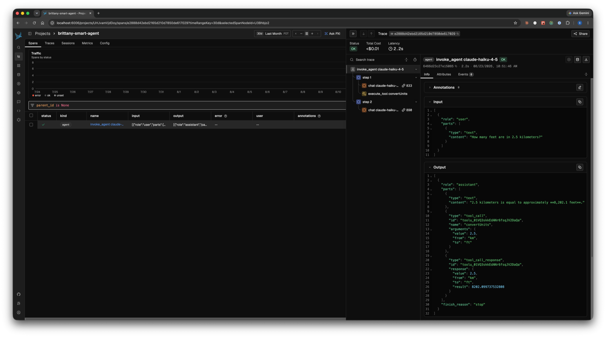

# brittany-smart-agent

A minimal [Vercel AI SDK](https://ai-sdk.dev/) `ToolLoopAgent` with one
deterministic local tool, traced into Phoenix with `@arizeai/phoenix-otel`.

Importing [`instrumentation.ts`](./instrumentation.ts) registers Phoenix
telemetry; [`agent.ts`](./agent.ts) then runs the agent. The agent span, each
LLM step, and the tool call arrive in Phoenix as one trace.

The tool, `convertUnits`, converts between units of length and mass using a
fixed factor table. It is pure arithmetic with no network calls, so the same
question always produces the same answer and the trace is reproducible.

## Prerequisites

- Node.js >= 22.12
- A running Phoenix instance (defaults to `http://localhost:6006`)
- An Anthropic API key

## Run

```bash
npm install

cp .env.example .env
# edit .env and set ANTHROPIC_API_KEY

npm start
```

`.env` is gitignored. `npm start` sources it before running the agent.

## Where the trace appears

Open [http://localhost:6006](http://localhost:6006) and go to the
**`brittany-smart-agent`** project. One run produces one trace containing:

- an agent span for the whole `ToolLoopAgent` run
- an LLM span per step
- a tool span for the `convertUnits` call

The agent prints a direct link to the project when it finishes.



The screenshot above is one real run: the `invoke_agent` root span, a `chat` span per step,
the `execute_tool convertUnits` span, and the tool's `8202.099737532808` result flowing back
into the model's answer.

## Configuration

| Environment variable         | Description                          | Default                 |
| ---------------------------- | ------------------------------------ | ----------------------- |
| `ANTHROPIC_API_KEY`          | Anthropic API key                    | required                |
| `PHOENIX_COLLECTOR_ENDPOINT` | Phoenix OTLP endpoint                | `http://localhost:6006` |
| `PHOENIX_API_KEY`            | Phoenix API key (if auth is enabled) | none                    |
