# LDAP TLS Security Testing

## Overview

Comprehensive automated testing suite that validates LDAP TLS implementations using an **adversarial MITM proxy**. The proxy actively attempts to steal credentials from LDAP traffic. Success = vulnerability, failure = secure.

## Architecture


## Files

```
scripts/docker/devops/
├── scripts/
│   ├── ldap_mitm_proxy.py      # Adversarial MITM proxy (credential extraction)
│   └── test_ldap_tls.py         # Test orchestration (all tests here)
├── overrides/
│   └── ldap-test.yml             # Docker Compose config (all services)
├── ldap-seed.ldif               # Test data (11 users with edge cases)
└── ldap-grafana.toml            # Grafana LDAP config (for comparison)
```

## Quick Start

```bash
# Start all services and run tests
cd scripts/docker/devops
COMPOSE_PROFILES=ldap-test docker compose \
    -f docker-compose.yml \
    -f overrides/ldap-test.yml \
    up -d --build

# View test results
docker logs devops-ldap-test

# View MITM proxy analysis
docker logs devops-ldap-mitm-proxy

# Parse structured logs
docker logs devops-ldap-mitm-proxy 2>&1 | grep "^{" | jq

# Stop everything
COMPOSE_PROFILES=ldap-test docker compose \
    -f docker-compose.yml \
    -f overrides/ldap-test.yml \
    down
```

## Services

| Service | Purpose | Port |
|---------|---------|------|
| `ldap` | OpenLDAP server with TLS | 389, 636 |
| `ldap-mitm-proxy` | Adversarial credential extractor + HTTP API | 3389 (proxy), 8080 (API) |
| `phoenix-starttls` | Phoenix with STARTTLS mode | 6007 |
| `phoenix` | Phoenix with LDAPS mode | 6006 |
| `grafana-ldap` | Grafana for comparison | 3000 |
| `ldap-test` | Test runner (executes test_ldap_tls.py) | - |

## Test Execution Flow


## Test Phases


### Phase 1: Baseline LDAP Connectivity
Verify LDAP server works with different TLS modes:
- **Plaintext** (port 389, no TLS) - Baseline
- **STARTTLS** (port 389 with upgrade) - Correct implementation
- **LDAPS** (port 636, TLS from start) - Direct TLS

### Phase 2: Application Security Tests
Test Phoenix and Grafana via MITM proxy:
- **Phoenix STARTTLS** → Routes through proxy → Should be SECURE
- **Phoenix LDAPS** → Direct connection → Should be SECURE  
- **Grafana STARTTLS** → Routes through proxy → Currently VULNERABLE

### Phase 3: Adversarial Analysis
- Parse MITM proxy logs for extracted credentials
- Verify extracted credentials actually work
- Determine security verdict

## Security Validation Model


## Security Decision Flow

```mermaid
flowchart TD
    Start([LDAP Bind Request]) --> MITM{MITM Proxy<br/>Intercepts}
    MITM --> Parse[Parse LDAP Protocol<br/>ASN.1/BER Structure]
    Parse --> Extract{Can Extract<br/>Credentials?}
    
    Extract -->|Yes| Stolen[Credentials Extracted]
    Extract -->|No| Encrypted[Only Encrypted Data]
    
    Stolen --> Verify{Verify Against<br/>LDAP Server}
    Verify -->|Works| Vuln[🚨 VULNERABLE<br/>TLS Failed]
    Verify -->|Fails| FalsePos[False Positive<br/>Parse Error]
    
    Encrypted --> Secure[✅ SECURE<br/>TLS Working]
    
    Vuln --> Report[Log Security Event<br/>credentials_stolen]
    FalsePos --> Report
    Secure --> Report
    
    Report --> End([Exit: 0=Pass, 1=Fail])
```



## Expected Results

### Phoenix (SECURE)
```
Application: phoenix-starttls
StartTLS requested: True
TLS handshake detected: True
Credentials extracted: 0
Verdict: SECURE ✅
```

### Grafana (VULNERABLE)
```
Application: grafana-ldap
StartTLS requested: False
TLS handshake detected: False
Credentials extracted: 2
  • cn=readonly,dc=example,dc=com → readonly_password
  • uid=alice,ou=users,dc=example,dc=com → password123
Verdict: VULNERABLE 🚨
```

## Structured Logging

All security events are logged as JSON for programmatic analysis:

```json
{
  "timestamp": 1764371725.425,
  "event": "credentials_stolen",
  "connection_id": 3,
  "application": "grafana-ldap",
  "client_ip": "172.18.0.13",
  "bind_dn": "cn=readonly,dc=example,dc=com",
  "password": "readonly_password",
  "password_length": 17,
  "direction": "client→server"
}
```

### MITM HTTP API

The proxy now exposes a lightweight read-only API that streams the same structured events without requiring Docker access:

```bash
# Fetch all recorded events (Phoenix STARTTLS, Grafana, etc.)
curl -s http://localhost:8080/events | jq

# Fetch only events newer than a UNIX timestamp
curl -s "http://localhost:8080/events?since=$(date +%s)" | jq
```

- Endpoint: `GET /events` → `{ "events": [...] }`
- Optional `since` query string filters by `timestamp`.
- Health check: `GET /healthz` → `{ "status": "ok" }`

`test_ldap_tls.py` consumes this API (via `MITM_API_URL`, default `http://ldap-mitm-proxy:8080`) during Phase 3 so the runner can analyze adversarial results from inside its container.

### Event Types


Event descriptions:
- `connection_established` - New client connection
- `starttls_requested` - Client requested StartTLS upgrade
- `tls_handshake_detected` - TLS negotiation started
- `credentials_stolen` - Plaintext credentials extracted (vulnerability)
- `connection_closed` - Connection finished with verdict

## Exit Codes

- **0** - All tests passed, no vulnerabilities detected
- **1** - Test failures or security vulnerabilities found

## Test Data

`ldap-seed.ldif` contains 11 test users covering edge cases.

## Troubleshooting

### Tests fail with connection errors
```bash
# Check if services are running
docker ps | grep devops

# Restart services
COMPOSE_PROFILES=ldap-test docker compose \
    -f docker-compose.yml \
    -f overrides/ldap-test.yml \
    restart
```

### MITM proxy shows no connections
```bash
# Check if apps are configured to use proxy
docker exec devops-phoenix-starttls env | grep LDAP_HOST
# Should show: PHOENIX_LDAP_HOST=ldap-mitm-proxy
```

### Want to test manually
```bash
# Test Phoenix STARTTLS
curl -X POST http://localhost:6007/auth/ldap/login \
  -H "Content-Type: application/json" \
  -d '{"username":"admin","password":"password123"}'

# Check MITM logs
docker logs devops-ldap-mitm-proxy 2>&1 | tail -30
```

## Reproducibility Checklist

- ✅ Single entry point: `test_ldap_tls.py`
- ✅ No manual steps required
- ✅ All dependencies in Docker
- ✅ Deterministic test data
- ✅ Idempotent execution
- ✅ Clear exit codes (0 = pass, 1 = fail)
- ✅ Structured logs for automation
- ✅ Self-documented via logging output

## Future Testing

To add new tests:


1. Add test method to `LDAPTLSSecurityTester` class
2. Add to appropriate test phase in `run_all_tests()`
3. Document expected behavior in this README
4. Test fails first, then fix implementation
5. Verify MITM proxy detects the issue
6. Update this README with new test documentation

Example:
```python
def test_new_feature(self) -> TestResult:
    """Test description here."""
    return self._test_http_login(
        name="New Feature Test",
        url=f"{self.config.phoenix_url}/auth/new",
        payload={"user": "test"},
        expected_status=200,
        description="New feature works",
    )
```
