# Phoenix OIDC Debug Server

A **fully spec-compliant OpenID Connect 1.0** server implementation for testing and debugging authentication flows. This server is designed for development environments and provides comprehensive logging to help understand the OIDC protocol.

> ⚠️ **For Development Only**: This is a debug server with extensive logging. Not suitable for production use.

## 📚 Table of Contents

- [Overview](#overview)
- [Features](#features)
- [Quick Start](#quick-start)
- [OIDC Flows](#oidc-flows)
  - [Authorization Code Flow](#authorization-code-flow)
  - [PKCE Flow](#pkce-flow)
- [API Endpoints](#api-endpoints)
- [Configuration](#configuration)
- [Architecture](#architecture)
- [Spec Compliance](#spec-compliance)
- [Educational Resources](#educational-resources)

---

## Overview

This OIDC server implements the **OpenID Connect Core 1.0** specification with full support for:

- **Authorization Code Flow** (Section 3.1)
- **PKCE** (RFC 7636) for public and confidential clients
- **Discovery Document** (OpenID Connect Discovery 1.0)
- **UserInfo Endpoint** (Section 5.3)
- **JWT-based ID Tokens and Access Tokens** (RS256)

### What is OpenID Connect?

OpenID Connect (OIDC) is an identity layer built on top of OAuth 2.0. It allows clients to:
1. **Verify the identity** of end-users
2. **Obtain basic profile information** about users
3. Do so in an **interoperable and REST-like** manner

```
┌─────────────┐
│   OAuth 2.0 │  ← Authorization framework
└──────┬──────┘
       │
       │ adds identity layer
       ▼
┌─────────────┐
│ OpenID      │  ← Authentication protocol
│ Connect     │    (verifies who you are)
└─────────────┘
```

---

## Features

### ✅ Spec Compliance

- **OpenID Connect Core 1.0** - Fully compliant implementation
- **RFC 7636 (PKCE)** - Proof Key for Code Exchange
- **OAuth 2.0 (RFC 6749)** - Authorization framework
- Every function is annotated with spec section references

### 🔍 Debug Features

- **Structured JSON Logging** - Every operation logged with timestamps
- **Request/Response Tracking** - Complete audit trail
- **Multi-user Support** - Database-driven user management
- **User Selection UI** - Test with multiple users

### 🔐 Security Features

- **RS256 JWT Signing** - Asymmetric key cryptography
- **Persistent Key Pairs** - Keys survive container restarts
- **Single-use Authorization Codes** - Prevents replay attacks
- **PKCE Support** - Enhanced security for public clients
- **Client Authentication** - HTTP Basic Auth and POST body methods

### 🎯 Client Support

- **Standard OAuth/OIDC** - Confidential clients with secrets
- **PKCE Public Clients** - Mobile apps, SPAs
- **PKCE Confidential Clients** - Server-side apps with PKCE
- **Configurable Modes** - Support one or all flows

---

## Quick Start

### Prerequisites

- Node.js 18+
- PostgreSQL database (for user management)

### Installation

```bash
# Install dependencies
pnpm install

# Build the server
pnpm build

# Start the server
pnpm start
```

### Environment Variables

```bash
# Server Configuration
OIDC_PORT=9000
OIDC_ISSUER=http://localhost:9000
OIDC_PUBLIC_BASE_URL=http://localhost:9000

# Client Configuration
OIDC_CLIENT_ID=phoenix-oidc-client-id
OIDC_CLIENT_SECRET=phoenix-oidc-client-secret-abc-123

# Authentication Method: "oidc" | "pkce-public" | "pkce-confidential" | "all"
OIDC_CLIENT_AUTH_METHOD=all

# Database Configuration
DB_HOST=db
DB_PORT=5432
DB_NAME=postgres
DB_USER=postgres
DB_PASSWORD=postgres
```

### Test the Server

```bash
# Check discovery document
curl http://localhost:9000/.well-known/openid-configuration | jq

# View JWKS (public keys)
curl http://localhost:9000/.well-known/jwks.json | jq

# Health check
curl http://localhost:9000/health
```

---

## OIDC Flows

### Authorization Code Flow

The **Authorization Code Flow** is the most secure OAuth 2.0 flow, recommended for server-side web applications.

#### Flow Diagram


#### Key Steps

1. **Authorization Request** (Section 3.1.2.1)
   - Client redirects user to `/auth` endpoint
   - Includes: `client_id`, `redirect_uri`, `response_type=code`, `scope`, `state`

2. **User Authentication** (Section 3.1.2.3)
   - Server authenticates the user
   - For debug: queries PostgreSQL for OAuth2 users
   - Auto-login if single user, otherwise show selector

3. **Authorization Response** (Section 3.1.2.5)
   - Server generates short-lived authorization code (10 min)
   - Redirects back to client with code and state

4. **Token Request** (Section 3.1.3.1)
   - Client exchanges code for tokens
   - Includes: `grant_type=authorization_code`, `code`, `redirect_uri`, `client_secret`

5. **Token Response** (Section 3.1.3.3)
   - Server returns `access_token` and `id_token`
   - ID Token contains user identity claims
   - Access Token used for API access

6. **UserInfo Request** (Section 5.3.1)
   - Client requests user details with access token
   - Server returns user profile, groups, and roles

---

### PKCE Flow

**PKCE** (Proof Key for Code Exchange, RFC 7636) adds an extra security layer for public clients (mobile apps, SPAs) that cannot securely store client secrets.

#### How PKCE Works

```
┌─────────────────────────────────────────────────────────┐
│ Client Generates Random Code Verifier                   │
│ code_verifier                                           |
|   = "dBjftJeZ4CVP-mB92K27uhbUJU1p1r_wW1gFWFOEjXk"       │
└────────────────────┬────────────────────────────────────┘
                     │
                     ▼
┌─────────────────────────────────────────────────────────┐
│ Client Creates Code Challenge                           │
│ code_challenge                                          |
|   = BASE64URL(SHA256(code_verifier))                    │
│   = "E9Melhoa2OwvFrEMTJguCHaoeK1t8URWbuGJSstw-cM"       │
└────────────────────┬────────────────────────────────────┘
                     │
                     ▼
┌─────────────────────────────────────────────────────────┐
│ Send code_challenge to Server (Authorization Request)   │
└────────────────────┬────────────────────────────────────┘
                     │
                     ▼
┌─────────────────────────────────────────────────────────┐
│ Server Stores code_challenge                            │
└────────────────────┬────────────────────────────────────┘
                     │
                     ▼
┌─────────────────────────────────────────────────────────┐
│ Send code_verifier to Server (Token Request)            │
└────────────────────┬────────────────────────────────────┘
                     │
                     ▼
┌─────────────────────────────────────────────────────────┐
│ Server Verifies:                                        │
│ BASE64URL(SHA256(code_verifier)) == code_challenge?     │
└─────────────────────────────────────────────────────────┘
```

#### PKCE Flow Diagram

```mermaid
sequenceDiagram
    participant User as End User
    participant Client as Client App<br/>(Public/Confidential)
    participant Browser as Browser
    participant Auth as OIDC Server<br/>/auth
    participant Token as OIDC Server<br/>/token
    participant DB as PostgreSQL

    Note over Client: 1. Generate PKCE Parameters
    Client->>Client: Generate random code_verifier<br/>(43-128 chars, base64url)
    Client->>Client: Calculate code_challenge<br/>= BASE64URL(SHA256(code_verifier))

    Note over Client,Auth: 2. Authorization Request with PKCE
    User->>Client: Click "Login"
    Client->>Browser: Redirect to /auth
    Browser->>Auth: GET /auth?response_type=code<br/>&client_id=xxx<br/>&redirect_uri=xxx<br/>&scope=openid<br/>&state=random<br/>&code_challenge=xxx<br/>&code_challenge_method=S256
    
    Auth->>Auth: Validate PKCE params:<br/>- code_challenge present<br/>- method is S256 or plain<br/>- format is valid (43-128 chars)
    
    Note over Auth,DB: 3. Authenticate User
    Auth->>DB: Query users
    DB-->>Auth: Return users
    Auth->>Auth: Auto-login or show selector
    
    Note over Auth: 4. Store Challenge with Auth Code
    Auth->>Auth: Generate auth code
    Auth->>Auth: Store code with:<br/>- userId<br/>- clientId<br/>- redirectUri<br/>- code_challenge ← PKCE<br/>- code_challenge_method ← PKCE<br/>- nonce, scope
    
    Auth->>Browser: Redirect to redirect_uri
    Browser->>Client: GET callback?code=xxx&state=xxx
    
    Note over Client,Token: 5. Token Request with Verifier
    Client->>Token: POST /token<br/>grant_type=authorization_code<br/>code=xxx<br/>redirect_uri=xxx<br/>client_id=xxx<br/>code_verifier=xxx ← PKCE<br/>[client_secret=xxx] ← If confidential
    
    Token->>Token: Retrieve stored code_challenge
    
    Note over Token: 6. PKCE Verification
    Token->>Token: Compute:<br/>computed_challenge = <br/>  BASE64URL(SHA256(code_verifier))
    Token->>Token: Verify:<br/>computed_challenge == stored_challenge?
    
    alt PKCE Verification Failed
        Token-->>Client: 400 Bad Request<br/>{error: "invalid_grant"}
    else PKCE Verification Success
        Token->>Token: Additional validation:<br/>- redirect_uri matches<br/>- code not expired<br/>- code not used before
        
        alt Confidential Client
            Token->>Token: Verify client_secret
        end
        
        Token->>Token: Generate tokens
        Token->>Token: Delete auth code
        Token-->>Client: 200 OK<br/>{<br/>  access_token: "eyJ..."<br/>  id_token: "eyJ..."<br/>  token_type: "Bearer"<br/>  expires_in: 3600<br/>}
    end
    
    Client->>User: Login successful!
```



#### PKCE Security Benefits

| Attack Scenario | Without PKCE | With PKCE |
|----------------|--------------|-----------|
| **Authorization Code Interception** | Attacker can exchange stolen code for tokens | Attacker cannot exchange code without `code_verifier` |
| **Malicious App on Device** | Can steal code from legitimate app | Cannot use code without original `code_verifier` |
| **Network Interception** | Code alone is sufficient | Code + verifier both needed (verifier never sent to auth endpoint) |

#### PKCE Methods

1. **S256** (RECOMMENDED)
   ```
   code_challenge = BASE64URL(SHA256(ASCII(code_verifier)))
   ```

2. **plain** (Not Recommended)
   ```
   code_challenge = code_verifier
   ```

---

## API Endpoints

### Discovery Endpoint

**GET** `/.well-known/openid-configuration`

Returns the OpenID Provider configuration.

**Response:**
```json
{
  "issuer": "http://localhost:9000",
  "authorization_endpoint": "http://localhost:9000/auth",
  "token_endpoint": "http://localhost:9000/token",
  "userinfo_endpoint": "http://localhost:9000/userinfo",
  "jwks_uri": "http://localhost:9000/.well-known/jwks.json",
  "response_types_supported": ["code"],
  "grant_types_supported": ["authorization_code"],
  "subject_types_supported": ["public"],
  "id_token_signing_alg_values_supported": ["RS256"],
  "token_endpoint_auth_methods_supported": [
    "client_secret_basic",
    "client_secret_post",
    "none"
  ],
  "scopes_supported": ["openid", "email", "profile", "groups", "roles"],
  "claims_supported": ["sub", "email", "name", "groups", "role"],
  "code_challenge_methods_supported": ["S256", "plain"]
}
```

---

### JWKS Endpoint

**GET** `/.well-known/jwks.json`

Returns the JSON Web Key Set with public keys for token verification.

**Response:**
```json
{
  "keys": [
    {
      "kty": "RSA",
      "n": "w7Zdfmece8ia...",
      "e": "AQAB",
      "kid": "phoenix-dev-key-1",
      "alg": "RS256",
      "use": "sig"
    }
  ]
}
```

---

### Authorization Endpoint

**GET** `/auth`

Initiates the authentication flow.

**Query Parameters:**

| Parameter | Required | Description |
|-----------|----------|-------------|
| `response_type` | Yes | Must be `code` |
| `client_id` | Yes | Client identifier |
| `redirect_uri` | Yes | Callback URL |
| `scope` | Yes | Space-separated scopes (must include `openid`) |
| `state` | Recommended | CSRF protection token |
| `nonce` | Optional | Replay protection (returned in ID token) |
| `code_challenge` | PKCE | Base64URL-encoded challenge |
| `code_challenge_method` | PKCE | `S256` or `plain` |

**Success Response:**
```
HTTP/1.1 302 Found
Location: {redirect_uri}?code={authorization_code}&state={state}
```

**Error Response:**
```
HTTP/1.1 302 Found
Location: {redirect_uri}?error=invalid_request&error_description=...&state={state}
```

---

### Token Endpoint

**POST** `/token`

Exchanges authorization code for tokens.

**Request Headers:**
```
Content-Type: application/x-www-form-urlencoded
Authorization: Basic {BASE64(client_id:client_secret)}  [Optional]
```

**Request Body:**

| Parameter | Required | Description |
|-----------|----------|-------------|
| `grant_type` | Yes | Must be `authorization_code` |
| `code` | Yes | Authorization code from `/auth` |
| `redirect_uri` | Yes | Must match authorization request |
| `client_id` | Yes | Client identifier |
| `client_secret` | Confidential | Client secret (body or Basic Auth) |
| `code_verifier` | PKCE | Code verifier for PKCE flow |

**Success Response:**
```json
{
  "access_token": "eyJhbGciOiJSUzI1NiIsImtpZCI6InBob2VuaXgtZGV2LWtleS0xIn0...",
  "id_token": "eyJhbGciOiJSUzI1NiIsImtpZCI6InBob2VuaXgtZGV2LWtleS0xIn0...",
  "token_type": "Bearer",
  "expires_in": 3600,
  "scope": "openid email profile"
}
```

**Error Response:**
```json
{
  "error": "invalid_grant",
  "error_description": "Authorization code is invalid or expired"
}
```

#### ID Token Claims

```json
{
  "sub": "user-123",
  "email": "user@example.com",
  "name": "John Doe",
  "iss": "http://localhost:9000",
  "aud": "phoenix-oidc-client-id",
  "exp": 1234567890,
  "iat": 1234564290,
  "at_hash": "E9Melhoa2OwvFrEM...",
  "nonce": "n-0S6_WzA2Mj"
}
```

---

### UserInfo Endpoint

**GET** `/userinfo`

Returns claims about the authenticated user.

**Request Headers:**
```
Authorization: Bearer {access_token}
```

**Success Response:**
```json
{
  "sub": "user-123",
  "email": "user@example.com",
  "name": "John Doe",
  "role": "admin",
  "groups": ["phoenix-admins", "full-access"]
}
```

---

### Health Check

**GET** `/health`

Returns server health status.

**Response:**
```json
{
  "status": "ok",
  "service": "phoenix-oidc-dev",
  "timestamp": "2025-10-03T10:30:00.000Z",
  "users": 3
}
```

---

## Configuration

### Authentication Methods

The server supports four modes via `OIDC_CLIENT_AUTH_METHOD`:

#### 1. Standard OIDC (`"oidc"`)
- Confidential clients only
- Requires `client_secret`
- No PKCE support

#### 2. PKCE Public (`"pkce-public"`)
- Public clients only
- No `client_secret` required
- PKCE required

#### 3. PKCE Confidential (`"pkce-confidential"`)
- Confidential clients with PKCE
- Requires `client_secret` AND `code_verifier`
- Maximum security

#### 4. All Methods (`"all"`)
- Supports all above methods
- Auto-detects based on request parameters

### Supported Clients

The server recognizes these client IDs:

```typescript
const clients = {
  "phoenix-oidc-client-id": {
    secret: "phoenix-oidc-client-secret-abc-123",
    type: "confidential"
  },
  "grafana-oidc-client-id": {
    secret: "grafana-oidc-client-secret-abc-123",
    type: "confidential"
  }
};
```

---

## Architecture

### Component Diagram


### Key Components

#### 1. **OIDCServer** (`src/oidc/server.ts`)
- Core OIDC protocol implementation
- Handles authorization and token endpoints
- Manages authorization codes
- Generates JWT tokens
- ~2000 lines with extensive spec annotations

#### 2. **TokenFactory** (`src/utils/token-factory.ts`)
- Generates Access Tokens and ID Tokens
- Calculates `at_hash` claim
- RS256 JWT signing
- Comprehensive logging

#### 3. **PKCEUtils** (`src/oidc/pkce.ts`)
- PKCE challenge validation
- Code verifier verification
- Supports S256 and plain methods

#### 4. **DatabaseClient** (`src/database/client.ts`)
- PostgreSQL connection
- User management
- Polls for user changes every 5 seconds
- Falls back to default user if DB unavailable

#### 5. **Logger** (`src/utils/logger.ts`)
- Structured JSON logging
- Every operation logged with timestamps
- Request/response tracking

---

## Spec Compliance

This implementation is **fully compliant** with:

### OpenID Connect Core 1.0
- ✅ Section 2 - ID Token
- ✅ Section 3.1.2 - Authorization Endpoint
- ✅ Section 3.1.3 - Token Endpoint
- ✅ Section 5.3 - UserInfo Endpoint
- ✅ Section 9 - Client Authentication
- ✅ Section 16 - Security Considerations

### RFC 7636 (PKCE)
- ✅ Section 4.1 - Code Verifier Creation
- ✅ Section 4.2 - Code Challenge Creation
- ✅ Section 4.4 - Authorization Request
- ✅ Section 4.5 - Token Request
- ✅ Section 4.6 - Server Verification

### Code Annotations

Every function in the codebase includes JSDoc comments with:
- Spec section references
- Direct links to specification
- Explanation of requirements
- REQUIRED/RECOMMENDED/OPTIONAL markers

**Example:**
```typescript
/**
 * Token Endpoint - Authorization Code Flow
 * Spec: OIDC Core Section 3.1.3 - Token Endpoint
 * https://openid.net/specs/openid-connect-core-1_0.html#TokenEndpoint
 * 
 * Exchanges authorization codes for access tokens and ID tokens.
 * 
 * Section 3.1.3.1 - Token Request
 * Section 3.1.3.2 - Token Request Validation
 * Section 3.1.3.3 - Successful Token Response
 */
async handleToken(body: any, headers: any) {
  // Implementation with inline spec citations
}
```

---

## Educational Resources

### Understanding the Flow

#### 1. Why Two Endpoints?

```
Authorization Endpoint (/auth)
↓
Purpose: Get user consent
Frontend-focused: Browser redirects
Returns: Short-lived code (10 min)

Token Endpoint (/token)
↓
Purpose: Exchange code for tokens
Backend-focused: Direct HTTP call
Returns: Long-lived tokens (1 hour)
```

**Security Benefit:** Authorization code is useless without client authentication at token endpoint.

#### 2. Why Authorization Code Flow?

| Flow | Security | Use Case |
|------|----------|----------|
| **Implicit** | ❌ Tokens in URL | Deprecated |
| **Password** | ❌ Credentials to client | Deprecated |
| **Authorization Code** | ✅ Most secure | **Recommended** |
| **Authorization Code + PKCE** | ✅✅ Enhanced | **Best Practice** |

#### 3. Understanding Tokens

```
┌─────────────────┐
│  Access Token   │
├─────────────────┤
│ Purpose:        │
│ - API access    │
│ - Short-lived   │
│ - Opaque to     │
│   client        │
└─────────────────┘

┌─────────────────┐
│   ID Token      │
├─────────────────┤
│ Purpose:        │
│ - User identity │
│ - Client reads  │
│ - Contains      │
│   claims        │
│ - Has at_hash   │
└─────────────────┘
```

#### 4. JWT Structure

```
Header.Payload.Signature

Header (Base64URL encoded):
{
  "alg": "RS256",
  "kid": "phoenix-dev-key-1"
}

Payload (Base64URL encoded):
{
  "sub": "user-123",
  "iss": "http://localhost:9000",
  "aud": "client-id",
  "exp": 1234567890,
  "iat": 1234564290,
  "email": "user@example.com",
  "name": "John Doe"
}

Signature (RS256):
RSASHA256(
  base64UrlEncode(header) + "." +
  base64UrlEncode(payload),
  privateKey
)
```

### Common Pitfalls

#### ❌ Wrong: Sending client_secret in authorization request
```javascript
// NEVER DO THIS
window.location = `/auth?client_id=x&client_secret=SECRET`;
```
**Why:** Authorization endpoint is in the browser (URL visible to user).

#### ✅ Correct: Send client_secret only in token request
```javascript
// Backend only
fetch('/token', {
  method: 'POST',
  body: new URLSearchParams({
    client_secret: 'SECRET',  // Safe: server-to-server
    // ...
  })
});
```

#### ❌ Wrong: Storing access token without expiration check
```javascript
// WRONG
localStorage.setItem('token', accessToken);
```

#### ✅ Correct: Store token with expiration
```javascript
// CORRECT
const expiresAt = Date.now() + (expiresIn * 1000);
localStorage.setItem('token', JSON.stringify({
  accessToken,
  expiresAt
}));
```

#### ❌ Wrong: Using authorization code twice
```javascript
// This will fail - codes are single-use
await fetch('/token', { code: 'abc123' });
await fetch('/token', { code: 'abc123' }); // ERROR: invalid_grant
```

### Testing Examples

#### Test Authorization Code Flow

```bash
# 1. Get authorization code
curl -v "http://localhost:9000/auth?response_type=code&client_id=phoenix-oidc-client-id&redirect_uri=http://localhost:3000/callback&scope=openid%20email&state=random123"

# 2. Extract code from redirect Location header
CODE="..."

# 3. Exchange code for tokens
curl -X POST http://localhost:9000/token \
  -H "Content-Type: application/x-www-form-urlencoded" \
  -d "grant_type=authorization_code" \
  -d "code=$CODE" \
  -d "redirect_uri=http://localhost:3000/callback" \
  -d "client_id=phoenix-oidc-client-id" \
  -d "client_secret=phoenix-oidc-client-secret-abc-123"

# 4. Get user info
ACCESS_TOKEN="..."
curl http://localhost:9000/userinfo \
  -H "Authorization: Bearer $ACCESS_TOKEN"
```

#### Test PKCE Flow

```bash
# 1. Generate code verifier and challenge
CODE_VERIFIER=$(openssl rand -base64 32 | tr -d '=' | tr '+/' '-_')
CODE_CHALLENGE=$(echo -n "$CODE_VERIFIER" | openssl dgst -sha256 -binary | base64 | tr -d '=' | tr '+/' '-_')

echo "Verifier: $CODE_VERIFIER"
echo "Challenge: $CODE_CHALLENGE"

# 2. Authorization request with challenge
curl -v "http://localhost:9000/auth?response_type=code&client_id=phoenix-oidc-client-id&redirect_uri=http://localhost:3000/callback&scope=openid&state=random123&code_challenge=$CODE_CHALLENGE&code_challenge_method=S256"

# 3. Exchange code with verifier
CODE="..."
curl -X POST http://localhost:9000/token \
  -H "Content-Type: application/x-www-form-urlencoded" \
  -d "grant_type=authorization_code" \
  -d "code=$CODE" \
  -d "redirect_uri=http://localhost:3000/callback" \
  -d "client_id=phoenix-oidc-client-id" \
  -d "code_verifier=$CODE_VERIFIER"
```

---

## Troubleshooting

### Common Issues

#### 1. "No users available"

**Cause:** Database not connected or no OAuth2 users exist.

**Solution:**
```sql
-- Create a test user
INSERT INTO users (email, username, auth_method, user_role_id)
VALUES ('test@example.com', 'Test User', 'OAUTH2', 1);
```

#### 2. "Invalid redirect_uri"

**Cause:** Redirect URI in token request doesn't match authorization request.

**Solution:** Ensure exact match, including trailing slashes.

#### 3. "Invalid client_secret"

**Cause:** Wrong secret or sent in wrong format.

**Solution:** Check client configuration and use either:
- HTTP Basic Auth: `Authorization: Basic BASE64(client_id:client_secret)`
- POST body: `client_secret=...`

#### 4. "PKCE verification failed"

**Cause:** Code verifier doesn't match code challenge.

**Solution:**
- Ensure same `code_verifier` used in both requests
- Check `code_challenge_method` is consistent
- Verify base64url encoding (no `=`, use `-_` instead of `+/`)

### Debug Logging

All logs are structured JSON. Filter by event type:

```bash
# Watch token exchanges
docker logs oidc-server | grep token_exchange

# Watch PKCE verification
docker logs oidc-server | grep pkce_verification

# Watch user authentication
docker logs oidc-server | grep user_found
```

---

## Development

### Project Structure

```
oidc-server/
├── src/
│   ├── server.ts              # Fastify server setup
│   ├── oidc/
│   │   ├── server.ts          # OIDC protocol implementation
│   │   └── pkce.ts            # PKCE utilities
│   ├── utils/
│   │   ├── token-factory.ts   # JWT token generation
│   │   ├── logger.ts          # Structured logging
│   │   └── validators.ts      # Input validation
│   ├── database/
│   │   └── client.ts          # PostgreSQL client
│   └── types/
│       └── index.ts           # TypeScript types
├── frontend/                   # User selector UI
├── runtime/
│   └── keypair.json           # Persistent RSA keys
├── package.json
└── tsconfig.json
```

### Build & Run

```bash
# Development with watch mode
pnpm dev

# Build
pnpm build

# Production
pnpm start

# Type check
pnpm type-check

# Lint
pnpm lint
```

---

## References

### Specifications

- [OpenID Connect Core 1.0](https://openid.net/specs/openid-connect-core-1_0.html)
- [OpenID Connect Discovery 1.0](https://openid.net/specs/openid-connect-discovery-1_0.html)
- [RFC 7636 - PKCE](https://tools.ietf.org/html/rfc7636)
- [RFC 6749 - OAuth 2.0](https://tools.ietf.org/html/rfc6749)
- [RFC 7519 - JWT](https://tools.ietf.org/html/rfc7519)
- [RFC 7517 - JWK](https://tools.ietf.org/html/rfc7517)

### Tools

- **JWT Debugger**: https://jwt.io
- **Base64URL Encoder**: https://base64.guru/standards/base64url
- **OIDC Playground**: https://openidconnect.net/

---

## License

This OIDC server is part of the Phoenix project.

---

## Contributing

This is a debug/development server. For production use cases, consider:
- [ORY Hydra](https://www.ory.sh/hydra/)
- [Keycloak](https://www.keycloak.org/)
- [Auth0](https://auth0.com/)
- [Okta](https://www.okta.com/)

---

**Built with ❤️ for debugging Phoenix authentication flows**

