# Database

This module is responsible for the database connection and the migrations.


## Migrations

All migrations are managed by Alembic. Migrations are applied to the database automatically when the application starts.


### Manually Applying Migrations

Sometimes, it's necessary to manually apply migrations, e.g., to recover from a failed migration. To manually apply migrations, you must first clone the Phoenix repository.

```bash
git clone https://github.com/Arize-ai/phoenix.git
```

Then navigate to the current directory.

```bash
cd phoenix/src/phoenix/db
```

If you are using a non-default SQL database URL (e.g., for running PostgreSQL), ensure your `PHOENIX_SQL_DATABASE_URL` is set. This is not needed if you are running Phoenix with the default SQLite URL.

```bash
export PHOENIX_SQL_DATABASE_URL=<sql-database-url>
```


To manually run up-migrations, run the following command:

```bash
alembic upgrade head
```

If the above command fails, it may be necessary to undo partially applied changes from a failed migration by first running down-migrations. This can be accomplished by identifying the ID of the migration revision you wish to return to. Revisions are defined [here](./migrations/versions/).

⚠️ Running down-migrations can result in lost data. Only run down-migrations if you know what you are doing and consider backing up your database first. If you have any questions or doubts, contact the Phoenix team in the `#phoenix-support` channel of the [Arize AI Slack community](https://arize-ai.slack.com/join/shared_invite/zt-2w57bhem8-hq24MB6u7yE_ZF_ilOYSBw#/shared-invite/email) or via GitHub.

```bash
alembic downgrade <revision-id>
```

### Creating a Migration

All migrations are stored in the `migrations` folder. To create a new migration, run the following command:

```bash
alembic revision -m "your_revision_name"
```

Then fill the migration file with the necessary changes.

## Entity Relationship Diagram

Below is a Mermaid diagram showing the current relationships between the main entities in the database:

```mermaid
erDiagram
    Project ||--o{ Trace : has
    Project {
        int id PK
        string name
        string description
        string gradient_start_color
        string gradient_end_color
        datetime created_at
        datetime updated_at
    }

    ProjectSession ||--o{ Trace : has
    ProjectSession {
        int id PK
        string session_id
        int project_id FK
        datetime start_time
        datetime end_time
    }

    Trace ||--o{ Span : contains
    Trace ||--o{ ExperimentRun : has
    Trace ||--o{ TraceAnnotation : has
    Trace ||--o{ ExperimentRunAnnotation : has
    Trace {
        int id PK
        int project_rowid FK
        string trace_id
        int project_session_rowid FK
        datetime start_time
        datetime end_time
    }

    Span ||--o{ DocumentAnnotation : has
    Span ||--o{ DatasetExample : has
    Span ||--o{ SpanAnnotation : has
    Span {
        int id PK
        int trace_rowid FK
        string span_id
        string parent_id
        string name
        string span_kind
        datetime start_time
        datetime end_time
        json attributes
        json events
        string status_code
        string status_message
        int cumulative_error_count
        int cumulative_llm_token_count_prompt
        int cumulative_llm_token_count_completion
        int llm_token_count_prompt
        int llm_token_count_completion
    }

    DocumentAnnotation {
        int id PK
        int span_rowid FK
        int document_position
        string name
        string label
        float score
        string explanation
        json metadata
        string annotator_kind
        datetime created_at
        datetime updated_at
    }

    SpanAnnotation {
        int id PK
        int span_rowid FK
        string name
        string label
        float score
        string explanation
        json metadata
        string annotator_kind
        datetime created_at
        datetime updated_at
    }

    TraceAnnotation {
        int id PK
        int trace_rowid FK
        string name
        string label
        float score
        string explanation
        json metadata
        string annotator_kind
        datetime created_at
        datetime updated_at
    }

    Dataset ||--o{ DatasetVersion : has
    Dataset ||--o{ DatasetExample : contains
    Dataset {
        int id PK
        string name
        string description
        json metadata
        datetime created_at
        datetime updated_at
    }

    DatasetVersion ||--o{ DatasetExampleRevision : has
    DatasetVersion {
        int id PK
        int dataset_id FK
        string description
        json metadata
        datetime created_at
    }

    DatasetExample ||--o{ DatasetExampleRevision : has
    DatasetExample {
        int id PK
        int dataset_id FK
        int span_rowid FK
        datetime created_at
    }

    DatasetExampleRevision {
        int id PK
        int dataset_example_id FK
        int dataset_version_id FK
        json input
        json output
        json metadata
        string revision_kind
        datetime created_at
    }

    Experiment ||--o{ ExperimentRun : has
    Experiment {
        int id PK
        int dataset_id FK
        int dataset_version_id FK
        string name
        string description
        int repetitions
        json metadata
        string project_name
        datetime created_at
        datetime updated_at
    }

    ExperimentRun ||--o{ ExperimentRunAnnotation : has
    ExperimentRun {
        int id PK
        int experiment_id FK
        int dataset_example_id FK
        int repetition_number
        string trace_id
        json output
        datetime start_time
        datetime end_time
        int prompt_token_count
        int completion_token_count
        string error
    }

    ExperimentRunAnnotation {
        int id PK
        int experiment_run_id FK
        string name
        string annotator_kind
        string label
        float score
        string explanation
        string trace_id
        string error
        json metadata
        datetime start_time
        datetime end_time
    }

    User ||--o{ ApiKey : has
    User ||--o{ AccessToken : has
    User ||--o{ RefreshToken : has
    User ||--o{ PasswordResetToken : has
    User ||--o{ PromptVersion : has
    User ||--o{ PromptVersionTag : has
    User {
        int id PK
        int user_role_id FK
        string username
        string email
        string profile_picture_url
        bytes password_hash
        bytes password_salt
        boolean reset_password
        string oauth2_client_id
        string oauth2_user_id
        datetime created_at
        datetime updated_at
    }

    UserRole ||--o{ User : has
    UserRole {
        int id PK
        string name
    }

    ApiKey {
        int id PK
        int user_id FK
        string name
        string description
        datetime created_at
        datetime expires_at
    }

    AccessToken {
        int id PK
        int user_id FK
        datetime created_at
        datetime expires_at
        int refresh_token_id FK
    }

    RefreshToken {
        int id PK
        int user_id FK
        datetime created_at
        datetime expires_at
    }

    PasswordResetToken {
        int id PK
        int user_id FK
        datetime created_at
        datetime expires_at
    }

    Prompt ||--o{ PromptVersion : has
    Prompt ||--o{ PromptPromptLabel : has
    Prompt ||--o{ PromptVersionTag : has
    Prompt ||--o{ Prompt : has
    Prompt {
        int id PK
        int source_prompt_id FK
        string name
        string description
        json metadata
        datetime created_at
        datetime updated_at
    }

    PromptVersion ||--o{ PromptVersionTag : has
    PromptVersion {
        int id PK
        int prompt_id FK
        string description
        int user_id FK
        string template_type
        string template_format
        json template
        json invocation_parameters
        json tools
        json response_format
        string model_provider
        string model_name
        json metadata
        datetime created_at
    }

    PromptLabel ||--o{ PromptPromptLabel : has
    PromptLabel {
        int id PK
        string name
        string description
        string color
    }

    PromptPromptLabel {
        int id PK
        int prompt_label_id FK
        int prompt_id FK
    }

    PromptVersionTag {
        int id PK
        string name
        string description
        int prompt_id FK
        int prompt_version_id FK
        int user_id FK
    }
```


