# Database

This module is responsible for the database connection and the migrations.


## Migrations

All migrations are managed by Alembic. Migrations are applied to the database automatically when the application starts.


### Manually Applying Migrations

Sometimes, it's necessary to manually apply migrations, e.g., to recover from a failed migration. To manually apply migrations, you must first clone the Phoenix repository.

```bash
git clone https://github.com/Arize-ai/phoenix.git
```

Then navigate to the current directory.

```bash
cd phoenix/src/phoenix/db
```

If you are using a non-default SQL database URL (e.g., for running PostgreSQL), ensure your `PHOENIX_SQL_DATABASE_URL` is set. This is not needed if you are running Phoenix with the default SQLite URL.

```bash
export PHOENIX_SQL_DATABASE_URL=<sql-database-url>
```


To manually run up-migrations, run the following command:

```bash
alembic upgrade head
```

If the above command fails, it may be necessary to undo partially applied changes from a failed migration by first running down-migrations. This can be accomplished by identifying the ID of the migration revision you wish to return to. Revisions are defined [here](./migrations/versions/).

⚠️ Running down-migrations can result in lost data. Only run down-migrations if you know what you are doing and consider backing up your database first. If you have any questions or doubts, contact the Phoenix team in the `#phoenix-support` channel of the [Arize AI Slack community](https://arize-ai.slack.com/join/shared_invite/zt-2w57bhem8-hq24MB6u7yE_ZF_ilOYSBw#/shared-invite/email) or via GitHub.

```bash
alembic downgrade <revision-id>
```

### Creating a Migration

All migrations are stored in the `migrations` folder. To create a new migration, run the following command:

```bash
alembic revision -m "your_revision_name"
```

Then fill the migration file with the necessary changes.

## Entity Relationship Diagram (ERD)

Below is a Mermaid diagram showing the current relationships between the main entities in the database:


---

## Focused Relationship Views

> **Note**: The following subsection diagrams show simplified table structures focusing only on foreign keys to highlight relationships. These tables contain additional columns (including primary keys and other fields) not shown here - refer to the comprehensive ERD above for complete table definitions.

### Core Tracing & Projects

This subgroup represents the core functionality of Phoenix - projects organize traces into sessions, traces contain spans, and retention policies manage data lifecycle:


### Datasets & Data Management

This subgroup shows how datasets are created from spans, organized with versions and splits, and labeled for better organization:


### Experiments & Evaluation

This subgroup shows how experiments use datasets to run evaluations, track results, and organize findings with tags and annotations:


### User Management & Authentication

This subgroup shows how users are managed with roles and different authentication methods:


### Annotations

This subgroup shows how annotations are attached to spans, documents, traces, and project sessions, including their configuration:


### Prompts

This subgroup shows how users create and manage prompt templates, versions, labels, and tags:


### Cost & Pricing

This subgroup shows how LLM costs are calculated and tracked for spans and traces:


### User-Created Content

This subgroup shows all entities that track user ownership through user_id foreign keys, representing content created or managed by users across datasets, experiments, prompts, and annotations:

```mermaid
erDiagram
    User ||--o{ Dataset : creates
    User ||--o{ DatasetVersion : creates
    User ||--o{ DatasetSplit : creates
    User ||--o{ DatasetLabel : creates
    User ||--o{ Experiment : creates
    User ||--o{ ExperimentTag : creates
    User ||--o{ PromptVersion : creates
    User ||--o{ PromptVersionTag : creates
    User ||--o{ SpanAnnotation : creates
    User ||--o{ DocumentAnnotation : creates
    User ||--o{ TraceAnnotation : creates
    User ||--o{ ProjectSessionAnnotation : creates
    User {
    }

    Dataset {
        bigint user_id FK
    }

    DatasetVersion {
        bigint user_id FK
    }

    DatasetSplit {
        bigint user_id FK
    }

    DatasetLabel {
        bigint user_id FK
    }

    Experiment {
        bigint user_id FK
    }

    ExperimentTag {
        bigint user_id FK
    }

    PromptVersion {
        int user_id FK
    }

    PromptVersionTag {
        int user_id FK
    }

    SpanAnnotation {
        int user_id FK
    }

    DocumentAnnotation {
        int user_id FK
    }

    TraceAnnotation {
        int user_id FK
    }

    ProjectSessionAnnotation {
        bigint user_id FK
    }
```



